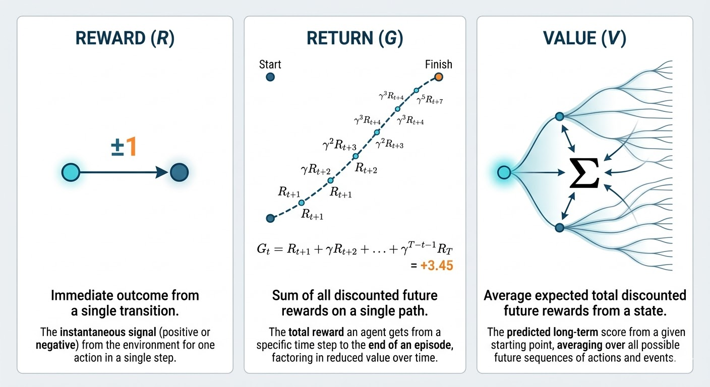
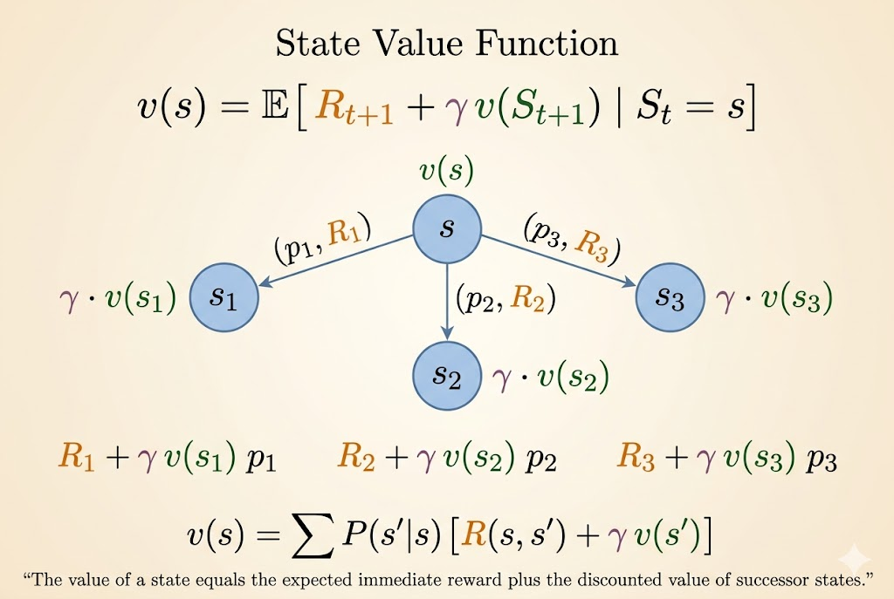
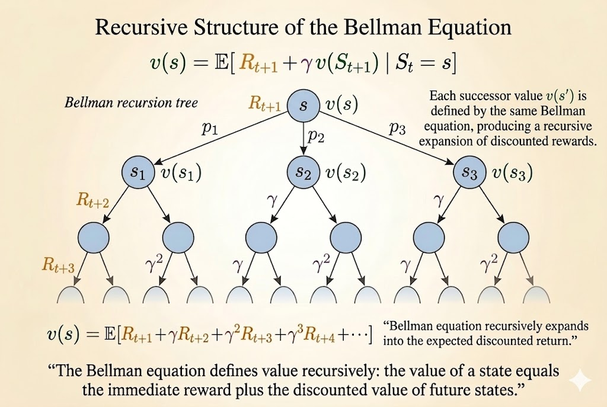

<iframe width="100%" height="500" src="https://www.youtube.com/embed/lfHX2hHRMVQ" title="David Silver Reinforcement Learning Lecture 2" frameborder="0" allow="accelerometer; autoplay; clipboard-write; encrypted-media; gyroscope; picture-in-picture; web-share" allowfullscreen></iframe>

[Slides (PDF)](https://davidstarsilver.wordpress.com/wp-content/uploads/2025/04/lecture-2-mdp.pdf)

This lecture moves from the general RL setup of Lecture 1 to the mathematical objects that make RL analyzable: Markov processes, Markov reward processes, and Markov decision processes. The Bellman equation is the central idea connecting them.

## Markov Process

### Markov Property

The Markov property says: the future is independent of the past given the present.

A state $S_t$ is Markov if and only if

$$
\mathbb{P}[S_{t+1} \mid S_t] = \mathbb{P}[S_{t+1} \mid S_1, \dots, S_t].
$$

Two key consequences:

- the state captures all relevant information from history
- once the state is known, the rest of the history can be discarded

### State Transition Matrix

For a Markov state $s$ and successor state $s'$, define the transition probability

$$
\mathcal{P}_{ss'} = \mathbb{P}[S_{t+1} = s' \mid S_t = s].
$$

If there are $n$ states, then the transition matrix is an $n \times n$ matrix:

$$
\mathcal{P} =
\begin{bmatrix}
\mathcal{P}_{11} & \dots & \mathcal{P}_{1n} \\
\vdots & \ddots & \vdots \\
\mathcal{P}_{n1} & \dots & \mathcal{P}_{nn}
\end{bmatrix}.
$$

Each row sums to $1$:

$$
\sum_{s'} \mathcal{P}_{ss'} = 1.
$$

A Markov process, or Markov chain, is a memoryless stochastic process defined by:

- $S$: a finite set of states
- $\mathcal{P}$: the state transition matrix

### Example: Student Markov Chain

````{mermaid}
graph LR
    FB((Facebook))
    C1((Class 1))
    C2((Class 2))
    C3((Class 3))
    Pub((Pub))
    Pass((Pass))
    Sleep[Sleep]

    C1 -->|0.5| FB
    FB -->|0.1| C1
    FB -->|0.9| FB

    C1 -->|0.5| C2
    C2 -->|0.8| C3
    C2 -->|0.2| Sleep

    C3 -->|0.6| Pass
    C3 -->|0.4| Pub

    Pass -->|1.0| Sleep

    Pub -->|0.2| C1
    Pub -->|0.4| C2
    Pub -->|0.4| C3
````

This is a pure Markov process: there are states and transition probabilities, but no actions and no rewards yet.

Example episodes starting from Class 1:

- C1 C2 C3 Pass Sleep
- C1 FB FB C1 C2 Sleep
- C1 C2 C3 Pub C2 C3 Pass Sleep
- C1 FB FB C1 C2 C3 Pub C1 FB FB FB C1 C2 C3 Pub C2 Sleep

#### Transition Matrix

Using the state order

$$
[\text{C1}, \text{C2}, \text{C3}, \text{Pass}, \text{Pub}, \text{FB}, \text{Sleep}],
$$

the transition matrix is

$$
\mathcal{P} =
\begin{bmatrix}
0 & 0.5 & 0 & 0 & 0 & 0.5 & 0 \\
0 & 0 & 0.8 & 0 & 0 & 0 & 0.2 \\
0 & 0 & 0 & 0.6 & 0.4 & 0 & 0 \\
0 & 0 & 0 & 0 & 0 & 0 & 1.0 \\
0.2 & 0.4 & 0.4 & 0 & 0 & 0 & 0 \\
0.1 & 0 & 0 & 0 & 0 & 0.9 & 0 \\
0 & 0 & 0 & 0 & 0 & 0 & 1.0
\end{bmatrix}.
$$

## Markov Reward Process

A Markov reward process (MRP) adds rewards and discounting to a Markov process:

- $S$: states
- $\mathcal{P}$: transition matrix
- $\mathcal{R}$: reward function, where
  $$
  \mathcal{R}_s = \mathbb{E}[R_{t+1} \mid S_t = s]
  $$
- $\gamma$: discount factor

The student example becomes an MRP if we assign each state an immediate reward.

````{mermaid}
graph LR
    FB(("Facebook<br/>R = -1"))
    C1(("Class 1<br/>R = -2"))
    C2(("Class 2<br/>R = -2"))
    C3(("Class 3<br/>R = -2"))
    Pub(("Pub<br/>R = +1"))
    Pass(("Pass<br/>R = +10"))
    Sleep["Sleep<br/>R = 0"]

    C1 -->|0.5| FB
    FB -->|0.1| C1
    FB -->|0.9| FB

    C1 -->|0.5| C2
    C2 -->|0.8| C3
    C2 -->|0.2| Sleep

    C3 -->|0.6| Pass
    C3 -->|0.4| Pub

    Pass -->|1.0| Sleep

    Pub -->|0.2| C1
    Pub -->|0.4| C2
    Pub -->|0.4| C3
````

### Return

The return from time $t$ is the discounted sum of future rewards:

$$
G_t = R_{t+1} + \gamma R_{t+2} + \gamma^2 R_{t+3} + \cdots
= \sum_{k=0}^{\infty} \gamma^k R_{t+k+1}.
$$

where $\gamma \in [0,1]$.

Interpretation:

- $\gamma$ close to $0$ gives myopic evaluation
- $\gamma$ close to $1$ gives far-sighted evaluation
- a reward received $k$ steps later is weighted by $\gamma^k$

### Why Discount?

Discounting is useful for several reasons:

- it is mathematically convenient
- it keeps returns finite in cyclic continuing processes
- it models uncertainty about the future
- in finance, immediate rewards can earn more interest
- human and animal behavior often prefers immediate reward

If all episodes terminate, it is sometimes valid to use $\gamma = 1$.



### Value Function

The value function of a state is its long-term expected return:

$$
v(s) = \mathbb{E}[G_t \mid S_t = s].
$$

For the student MRP, different discount factors produce different state values.

#### Example Values When $\gamma = 0.9$

````{mermaid}
graph LR
    FB(("Facebook<br/>v = -7.6"))
    C1(("Class 1<br/>v = -5.0"))
    C2(("Class 2<br/>v = 0.9"))
    C3(("Class 3<br/>v = 4.1"))
    Pub(("Pub<br/>v = 1.9"))
    Pass(("Pass<br/>v = 10"))
    Sleep["Sleep<br/>v = 0"]

    FB -->|0.9| FB
    FB -->|0.1| C1

    C1 -->|0.5| FB
    C1 -->|0.5| C2

    C2 -->|0.2| Sleep
    C2 -->|0.8| C3

    C3 -->|0.4| Pub
    C3 -->|0.6| Pass

    Pass -->|1.0| Sleep

    Pub -->|0.2| C1
    Pub -->|0.4| C2
    Pub -->|0.4| C3

    style Sleep fill:#f9f,stroke:#333,stroke-width:2px
````

#### Example Values When $\gamma = 1.0$

````{mermaid}
graph LR
    FB(("Facebook<br/>v = -23"))
    C1(("Class 1<br/>v = -13"))
    C2(("Class 2<br/>v = 1.5"))
    C3(("Class 3<br/>v = 4.3"))
    Pub(("Pub<br/>v = 0.8"))
    Pass(("Pass<br/>v = 10"))
    Sleep["Sleep<br/>v = 0"]

    FB -->|0.9| FB
    FB -->|0.1| C1

    C1 -->|0.5| FB
    C1 -->|0.5| C2

    C2 -->|0.2| Sleep
    C2 -->|0.8| C3

    C3 -->|0.4| Pub
    C3 -->|0.6| Pass

    Pass -->|1.0| Sleep

    Pub -->|0.2| C1
    Pub -->|0.4| C2
    Pub -->|0.4| C3

    style Sleep fill:#f9f,stroke:#333,stroke-width:2px
````

### Bellman Equation

The Bellman equation decomposes the value of a state into:

- immediate reward
- discounted value of the next state

Its core form is

$$
v(s) = \mathbb{E}[R_{t+1} + \gamma v(S_{t+1}) \mid S_t = s].
$$



#### Step-by-Step Derivation

Start from the definition of value:

$$
v(s) = \mathbb{E}[G_t \mid S_t = s].
$$

Unroll the return:

$$
v(s) = \mathbb{E}[R_{t+1} + \gamma R_{t+2} + \gamma^2 R_{t+3} + \cdots \mid S_t = s].
$$

Factor out the first step:

$$
v(s) = \mathbb{E}[R_{t+1} + \gamma(R_{t+2} + \gamma R_{t+3} + \cdots) \mid S_t = s].
$$

Recognize the future return:

$$
v(s) = \mathbb{E}[R_{t+1} + \gamma G_{t+1} \mid S_t = s].
$$

Then use conditional expectation:

$$
v(s) = \mathbb{E}[R_{t+1} + \gamma v(S_{t+1}) \mid S_t = s].
$$



#### Matrix Form

For an MRP, the Bellman equation can be written compactly as

$$
v = \mathcal{R} + \gamma \mathcal{P}v.
$$

So the direct solution is

$$
v = (I - \gamma \mathcal{P})^{-1} \mathcal{R}.
$$

This is elegant, but it scales poorly. Matrix inversion is feasible only for small MRPs, not for large real-world state spaces. That is why RL relies on iterative methods such as dynamic programming, Monte Carlo evaluation, and temporal-difference learning.

## Markov Decision Process

An MDP adds actions to an MRP. It is usually defined by

$$
\langle \mathcal{S}, \mathcal{A}, \mathcal{P}, \mathcal{R}, \gamma \rangle.
$$

Now transitions and rewards depend on actions, not just on states.

### Policy

A policy is a distribution over actions conditioned on the current state:

$$
\pi(a \mid s) = \mathbb{P}[A_t = a \mid S_t = s].
$$

In an MDP, the policy depends on the current state, not the full history.

### Value Functions in an MDP

#### State-Value Function

The state-value function under policy $\pi$ is

$$
v_\pi(s) = \mathbb{E}_\pi[G_t \mid S_t = s].
$$

#### Action-Value Function

The action-value function under policy $\pi$ is

$$
q_\pi(s,a) = \mathbb{E}_\pi[G_t \mid S_t = s, A_t = a].
$$

### Optimal Value Functions

The optimal state-value function is

$$
v_*(s) = \max_\pi v_\pi(s),
$$

and the optimal action-value function is

$$
q_*(s,a) = \max_\pi q_\pi(s,a).
$$

These define the best achievable long-term performance in the MDP.

### Optimal Policy

Define a partial order on policies:

$$
\pi \ge \pi' \quad \text{if } v_\pi(s) \ge v_{\pi'}(s) \text{ for all } s.
$$

For any finite MDP, there exists an optimal policy $\pi_*$ such that

$$
v_{\pi_*}(s) = v_*(s), \qquad q_{\pi_*}(s,a) = q_*(s,a).
$$

An optimal policy can be obtained greedily from $q_*$:

$$
\pi_*(a \mid s) =
\begin{cases}
1, & a \in \arg\max_{a' \in \mathcal{A}} q_*(s,a') \\
0, & \text{otherwise}.
\end{cases}
$$

So there is always a deterministic optimal policy for a finite MDP.

### Why Optimal Control Is Harder

For MRPs, the Bellman equation is linear:

$$
v = \mathcal{R} + \gamma \mathcal{P}v.
$$

For optimal control, the Bellman optimality equation introduces a $\max$:

$$
v_*(s) = \max_a \mathbb{E}[R_{t+1} + \gamma v_*(S_{t+1}) \mid S_t = s, A_t = a].
$$

That $\max$ makes the problem nonlinear, so the neat direct matrix-inverse solution disappears. This is why MDP control usually requires iterative algorithms such as value iteration, policy iteration, Q-learning, and SARSA.

## Extensions to MDPs

### Infinite MDPs

Standard MDPs assume finitely many states and actions, but many real systems require larger spaces:

- countably infinite state/action spaces
- continuous state/action spaces

For countably infinite spaces, Bellman equations still use summation because states can still be enumerated one by one. For continuous spaces, summations are replaced by integrals. For example, a continuous-action value expression takes the form

$$
v_\pi(s) = \int_a \pi(a \mid s) q_\pi(s,a)\, da.
$$

Linear quadratic regulator (LQR) is a famous continuous-control special case with an exact closed-form solution.

### POMDPs

In a partially observable MDP (POMDP), the agent does not directly observe the true state $s_t$. Instead, it receives an observation $o_t$ that provides only partial information about the state.

A POMDP is often written as

$$
\langle \mathcal{S}, \mathcal{A}, \mathcal{O}, \mathcal{P}, \mathcal{R}, \mathcal{Z}, \gamma \rangle,
$$

where $\mathcal{O}$ is the observation space and $\mathcal{Z}$ is the observation model:

$$
\mathcal{Z}_{s'o}^a = \mathbb{P}[O_{t+1} = o \mid S_{t+1} = s', A_t = a].
$$

The key difficulty is that the observation itself is not Markov. To act optimally, the agent maintains a belief state: a probability distribution over hidden states conditioned on the full history:

$$
b(s) = \mathbb{P}[S_t = s \mid A_1, O_1, \dots, A_{t-1}, O_t].
$$

That belief state is Markov. So a POMDP can be reduced to an MDP over a continuous belief space, often called a belief MDP.

### Ergodic and Average-Reward MDPs

For continuing tasks without discounting, we often use average reward instead of discounted return.

An ergodic Markov process has two important properties:

- **aperiodic**: it does not get trapped in a fixed cycle
- **irreducible / recurrent**: every state can eventually be reached from every other state

In that case, under a policy $\pi$, there exists a stationary distribution $d^\pi(s)$ giving the long-run fraction of time spent in each state.

The average reward is then

$$
\rho^\pi = \lim_{T \to \infty} \frac{1}{T}\,\mathbb{E}\left[\sum_{t=1}^T R_t\right]
= \sum_s d^\pi(s)\sum_a \pi(a \mid s)\mathcal{R}_s^a.
$$

Because the undiscounted total return is infinite in continuing tasks, we instead define the relative value function as excess reward above the average:

$$
\tilde{v}_\pi(s) = \mathbb{E}_\pi\left[\sum_{k=1}^{\infty}(R_{t+k} - \rho^\pi)\mid S_t = s\right].
$$

Its Bellman equation becomes

$$
\tilde{v}_\pi(s) + \rho^\pi
= \mathcal{R}_s^\pi + \sum_{s' \in \mathcal{S}} \mathcal{P}_{ss'}^\pi \tilde{v}_\pi(s').
$$

## Takeaways

- The Markov property says the present contains all information needed for the future.
- An MRP adds rewards and discounting to a Markov chain.
- The Bellman equation decomposes value into immediate reward plus discounted next-state value.
- An MDP adds actions and policies, which turns prediction into control.
- Control is harder than prediction because the Bellman optimality equation is nonlinear.

*Source: David Silver's Reinforcement Learning Course, Lecture 2: Markov Decision Process.*
