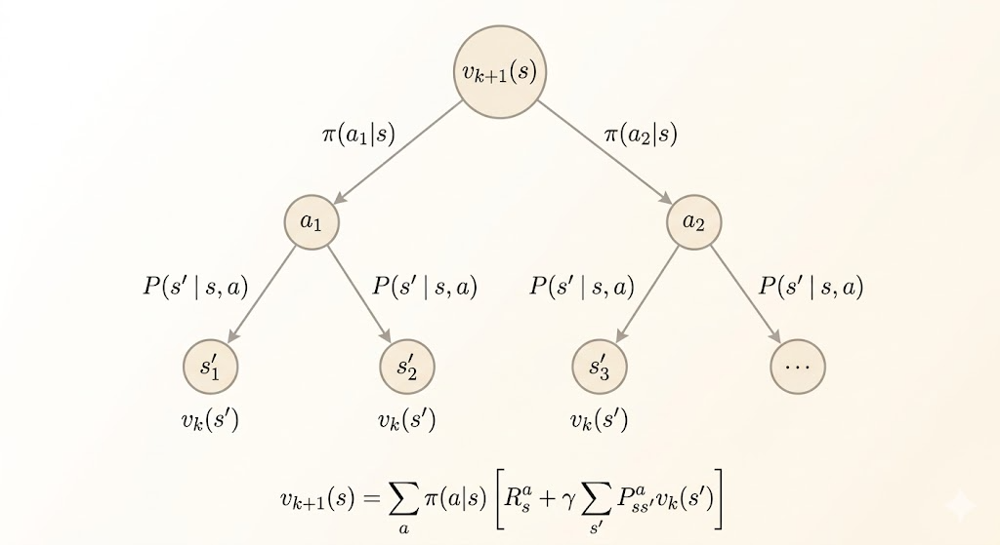
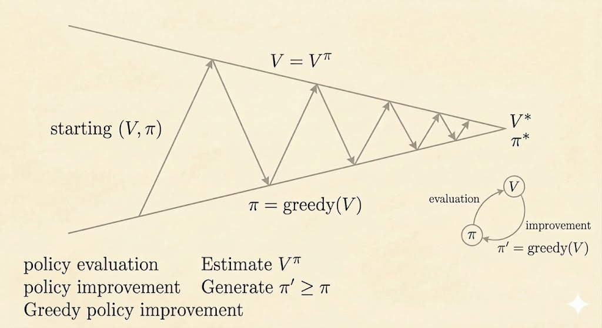

<iframe width="100%" height="500" src="https://www.youtube.com/embed/Nd1-UUMVfz4" title="David Silver Reinforcement Learning Lecture 3" frameborder="0" allow="accelerometer; autoplay; clipboard-write; encrypted-media; gyroscope; picture-in-picture; web-share" allowfullscreen></iframe>

[Slides (PDF)](https://davidstarsilver.wordpress.com/wp-content/uploads/2025/04/lecture-3-planning-by-dynamic-programming-.pdf)

This lecture introduces dynamic programming as the classical planning toolkit for Markov decision processes. The key assumption is that the environment model is known, so planning can be done directly from the Bellman equations.

## Dynamic Programming

Dynamic programming applies when two properties hold:

### Optimal Substructure

An optimal solution can be built from optimal solutions to subproblems.

In RL, that means the best value of a state can be written in terms of the best values of successor states.

### Overlapping Subproblems

The same subproblems appear repeatedly.

In MDPs, different trajectories revisit the same states, so value estimates can be reused instead of recomputed from scratch.

An MDP satisfies both properties, which is why dynamic programming applies.

## Policy Evaluation

The first planning problem is prediction: evaluate a fixed policy $\pi$.

The Bellman expectation equation is

$$
v_\pi(s) = \sum_a \pi(a \mid s) \sum_{s',r} p(s', r \mid s,a)\,[r + \gamma v_\pi(s')].
$$

Dynamic programming turns this fixed-point equation into an iterative update:

$$
v_{k+1}(s) \leftarrow \sum_a \pi(a \mid s) \sum_{s',r} p(s', r \mid s,a)\,[r + \gamma v_k(s')].
$$

This is called a synchronous backup because every $v_{k+1}(s)$ is computed from the previous table $v_k$.

### Example: Small Gridworld

Consider the $4 \times 4$ gridworld with terminal states in the top-left and bottom-right corners:

- reward $0$ in terminal states
- reward $-1$ for each move elsewhere
- the episode terminates when a terminal state is reached

Start from $v_0(s)=0$ for every state. Under the uniform random policy, iterative policy evaluation produces:

$$
v_1 =
\begin{bmatrix}
0 & -1 & -1 & -1 \\
-1 & -1 & -1 & -1 \\
-1 & -1 & -1 & -1 \\
-1 & -1 & -1 & 0
\end{bmatrix}
$$

$$
v_2 =
\begin{bmatrix}
0 & -1.75 & -2.00 & -2.00 \\
-1.75 & -2.00 & -2.00 & -2.00 \\
-2.00 & -2.00 & -2.00 & -1.75 \\
-2.00 & -2.00 & -1.75 & 0
\end{bmatrix}
$$

and eventually converges to

$$
v_\pi =
\begin{bmatrix}
0 & -14 & -20 & -22 \\
-14 & -18 & -20 & -20 \\
-20 & -20 & -18 & -14 \\
-22 & -20 & -14 & 0
\end{bmatrix}.
$$

Each iteration improves the estimate of long-term return for that specific policy.

## Policy Iteration

Policy iteration solves the control problem by alternating two steps:

1. Policy evaluation: compute $v_\pi$
2. Policy improvement: act greedily with respect to $v_\pi$

The greedy improvement step is

$$
\pi'(s) = \arg\max_a q_\pi(s,a),
$$

where

$$
q_\pi(s,a) = \sum_{s',r} p(s',r \mid s,a)\,[r + \gamma v_\pi(s')].
$$

So policy iteration repeats:

$$
\pi \xrightarrow{\text{evaluate}} v_\pi \xrightarrow{\text{improve}} \pi'.
$$

### Why Improvement Works

The greedy policy satisfies

$$
q_\pi(s, \pi'(s)) = \max_a q_\pi(s,a) \ge q_\pi(s, \pi(s)) = v_\pi(s).
$$

So one-step greedy improvement never makes the value worse. Repeating this argument shows

$$
v_{\pi'}(s) \ge v_\pi(s) \quad \text{for all } s.
$$

If the policy stops changing, then it is already greedy with respect to its own value function, which means it satisfies the Bellman optimality equation and is therefore optimal.

### Example: Jack's Car Rental

A classical policy-iteration example is Jack's Car Rental:

- the state is the number of cars at two locations
- the action is how many cars to move overnight between the two locations
- reward is rental income minus movement cost
- rental requests and returns are random, modeled with Poisson distributions

This example is small enough to solve by dynamic programming but rich enough to show why full planning can still be computationally expensive.

## Deterministic Policy Iteration

For deterministic policies, the improvement rule is just

$$
\pi'(s) = \arg\max_{a \in \mathcal{A}} q_\pi(s,a).
$$

A practical implementation often uses an early stopping rule:

- stop when the value improvement is below some tolerance $\varepsilon$
- or stop after a fixed number of evaluation sweeps

This gives approximate policy iteration rather than exact policy iteration.

## Value Iteration

Value iteration combines evaluation and improvement into a single update.

Instead of fully evaluating the current policy, it directly applies the Bellman optimality backup:

$$
v_{k+1}(s) \leftarrow \max_{a \in \mathcal{A}} \sum_{s',r} p(s',r \mid s,a)\,[r + \gamma v_k(s')].
$$

This is a one-step look-ahead using the current value table. Intuitively:

- policy evaluation propagates values under a fixed policy
- value iteration propagates optimal values directly

### Example: Shortest Path Gridworld

Suppose the goal state is the top-left corner of a $4 \times 4$ grid, and every step costs $-1$.

Start from all zeros:

$$
V_1 =
\begin{bmatrix}
0 & 0 & 0 & 0 \\
0 & 0 & 0 & 0 \\
0 & 0 & 0 & 0 \\
0 & 0 & 0 & 0
\end{bmatrix}
$$

After one backup,

$$
V_2 =
\begin{bmatrix}
0 & -1 & -1 & -1 \\
-1 & -1 & -1 & -1 \\
-1 & -1 & -1 & -1 \\
-1 & -1 & -1 & -1
\end{bmatrix}
$$

and after convergence,

$$
V_* =
\begin{bmatrix}
0 & -1 & -2 & -3 \\
-1 & -2 & -3 & -4 \\
-2 & -3 & -4 & -5 \\
-3 & -4 & -5 & -6
\end{bmatrix}.
$$

The values become the negative shortest-path distances to the goal. The optimal policy is simply to move toward states with larger value.

## Policy Iteration vs Value Iteration

Both methods solve the control problem in a known MDP, but they organize the Bellman updates differently.

| Aspect | Policy Iteration | Value Iteration |
|---|---|---|
| Main object during iteration | An explicit policy $\\pi$ plus its value function | A value table that is pushed toward $v_*$ |
| Update pattern | Alternate policy evaluation and policy improvement | Apply the Bellman optimality backup every sweep |
| Cost per sweep | Higher, because policy evaluation may require many inner updates | Lower, because each sweep is just one optimality backup |
| Number of sweeps | Often fewer outer iterations | Often more sweeps before values settle |
| Intuition | \"Evaluate the current rule, then improve it\" | \"Keep taking the best one-step look-ahead\" |

In practice, policy iteration usually spends more work per iteration but may converge in fewer outer loops. Value iteration is simpler and cheaper per sweep, but the optimal values propagate more gradually.

## Summary

| Problem | Bellman Equation | Algorithm |
|---|---|---|
| Prediction | Bellman expectation equation | Iterative policy evaluation |
| Control | Evaluate + greedy improve | Policy iteration |
| Control | Bellman optimality equation | Value iteration |

## Takeaways

- dynamic programming works because MDPs have optimal substructure and overlapping subproblems
- iterative policy evaluation solves prediction for a fixed policy
- policy iteration alternates evaluation and greedy improvement
- value iteration skips full evaluation and backs up optimal values directly
- all of these methods assume the model is known, which is why they are planning methods rather than model-free learning methods
