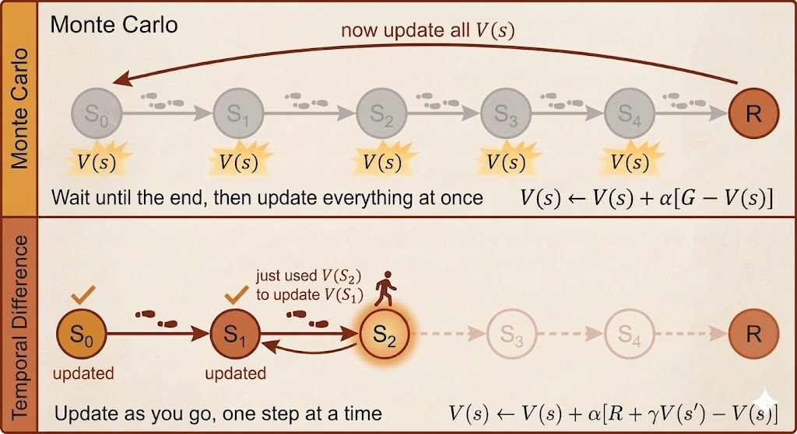

<iframe width="100%" height="500" src="https://www.youtube.com/embed/PnHCvfgC_ZA" title="David Silver Reinforcement Learning Lecture 4" frameborder="0" allow="accelerometer; autoplay; clipboard-write; encrypted-media; gyroscope; picture-in-picture; web-share" allowfullscreen></iframe>

[Slides (PDF)](https://davidstarsilver.wordpress.com/wp-content/uploads/2025/04/lecture-4-model-free-prediction-.pdf)

This lecture moves from planning with a known MDP to prediction from raw experience alone. The task is still policy evaluation, but now the environment model is unknown, so value estimates must be learned directly from sampled trajectories.

## Prediction Without a Model

Prediction means evaluating a fixed policy $\pi$:

$$
v_\pi(s) = \mathbb{E}_\pi[G_t \mid S_t = s].
$$

The difference from dynamic programming is that we do not assume access to the transition kernel $p(s',r \mid s,a)$. Instead, we observe episodes or transitions generated by following the policy.

That is what model-free prediction means:

- no explicit MDP model
- learn from sampled experience
- estimate values directly from returns

## Monte Carlo Learning

Monte Carlo (MC) learning estimates the value of a state by averaging complete returns observed after visiting that state.

For an episode

$$
S_1, A_1, R_2, \dots, S_T,
$$

the return from time $t$ is

$$
G_t = R_{t+1} + \gamma R_{t+2} + \cdots + \gamma^{T-t-1} R_T.
$$

Since

$$
v_\pi(s) = \mathbb{E}_\pi[G_t \mid S_t = s],
$$

the simplest estimator is the sample mean of all observed returns following visits to $s$.

### First-Visit Monte Carlo

In first-visit MC, only the first occurrence of a state within an episode is used.

For each state $s$, maintain:

- $N(s)$: number of first visits
- $S(s)$: sum of returns observed from those first visits
- $V(s)$: current estimate

Update:

$$
N(s) \leftarrow N(s) + 1,
\qquad
S(s) \leftarrow S(s) + G_t,
\qquad
V(s) \leftarrow \frac{S(s)}{N(s)}.
$$

With enough episodes,

$$
V(s) \to v_\pi(s).
$$

### Every-Visit Monte Carlo

In every-visit MC, we update on every occurrence of a state in the episode, not just the first one.

The update equations are the same:

$$
N(s) \leftarrow N(s) + 1,
\qquad
S(s) \leftarrow S(s) + G_t,
\qquad
V(s) \leftarrow \frac{S(s)}{N(s)}.
$$

The difference is only which visits are counted.

In practice:

- first-visit MC avoids repeated within-episode correlations for the same state
- every-visit MC typically uses more data per episode

Both are consistent estimators of $v_\pi$.

## Incremental Mean

It is unnecessary to store every return. The sample mean can be updated incrementally.

If

$$
\mu_k = \frac{1}{k}\sum_{j=1}^k x_j,
$$

then

$$
\mu_k
= \mu_{k-1} + \frac{1}{k}(x_k - \mu_{k-1}).
$$

Applying this to Monte Carlo prediction gives:

$$
N(S_t) \leftarrow N(S_t) + 1,
$$

$$
V(S_t) \leftarrow V(S_t) + \frac{1}{N(S_t)}\left(G_t - V(S_t)\right).
$$

This form is much more practical because it avoids storing all past returns.

### Constant Step Size

In non-stationary settings, an equal-weight average can react too slowly. A common replacement is a constant step size:

$$
V(S_t) \leftarrow V(S_t) + \alpha \left(G_t - V(S_t)\right).
$$

This exponentially discounts old data and tracks changing values more quickly.

## Temporal-Difference Learning

Monte Carlo must wait until the end of the episode to know the full return. Temporal-difference (TD) learning updates earlier by replacing the unknown tail of the return with the current value estimate of the next state.

For TD(0), the one-step target is

$$
R_{t+1} + \gamma V(S_{t+1}).
$$

The update is

$$
V(S_t) \leftarrow V(S_t) + \alpha \Bigl(R_{t+1} + \gamma V(S_{t+1}) - V(S_t)\Bigr).
$$

The quantity

$$
\delta_t = R_{t+1} + \gamma V(S_{t+1}) - V(S_t)
$$

is the TD error.

This is the key conceptual step:

- MC learns from the actual return
- TD learns from a one-step sampled reward plus a bootstrapped guess of the future

TD can therefore learn online, before the episode terminates.

## Monte Carlo vs Temporal Difference

The main tradeoff is bias versus variance.

### Monte Carlo

- no bootstrapping
- unbiased target, because it uses the true sampled return
- high variance, because full returns can fluctuate a lot
- only updates after episode completion

### Temporal Difference

- bootstraps from current estimates
- lower variance, because it does not wait for the full future
- introduces bias, because the target depends on an imperfect estimate
- updates online after each step

In a genuine Markov process, TD often learns more efficiently because it exploits the recursive structure of the value function. MC can be more robust when the Markov assumption is weak or when full returns are easier to observe than reliable bootstrapped targets.

Both methods converge to $v_\pi$ under the standard assumptions.

## Bootstrapping and Sampling

The lecture compares three major value-learning families:

| Algorithm | Bootstrapping | Sampling | Model-Free |
|---|---|---|---|
| Monte Carlo | No | Yes | Yes |
| Temporal Difference | Yes | Yes | Yes |
| Dynamic Programming | Yes | No | No |

This table is worth remembering because it classifies RL methods by their source of targets:

- MC: sampled full returns
- TD: sampled rewards plus bootstrapped values
- DP: exact expectations from the known model

## TD(lambda)

TD(0) looks one step ahead. Monte Carlo looks all the way to the end. TD($\lambda$) interpolates between these extremes by mixing multi-step returns.

Define the $n$-step return:

$$
G_t^{(n)}
= R_{t+1} + \gamma R_{t+2} + \cdots + \gamma^{n-1}R_{t+n} + \gamma^n V(S_{t+n}).
$$

Then the $\lambda$-return is the weighted average

$$
G_t^\lambda
= (1-\lambda)\sum_{n=1}^{\infty}\lambda^{n-1} G_t^{(n)}.
$$

The update becomes

$$
V(S_t) \leftarrow V(S_t) + \alpha \left(G_t^\lambda - V(S_t)\right).
$$

Interpretation:

- $\lambda = 0$ gives TD(0)
- $\lambda \to 1$ approaches Monte Carlo
- intermediate values trade bias against variance

This is one of the central ideas in RL: instead of choosing between pure bootstrapping and pure returns, we smoothly combine them.

## Summary

- model-free prediction evaluates a policy without knowing the transition model
- Monte Carlo estimates values from complete sampled returns
- first-visit and every-visit MC differ only in which state occurrences are counted
- TD(0) updates from a one-step bootstrapped target and can learn online
- MC has higher variance and lower bias; TD has lower variance and some bias
- TD($\lambda$) unifies the two through weighted multi-step targets
