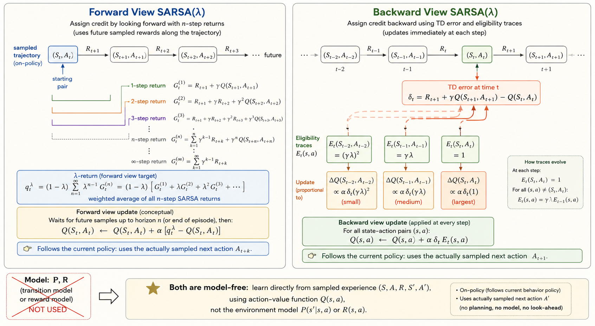
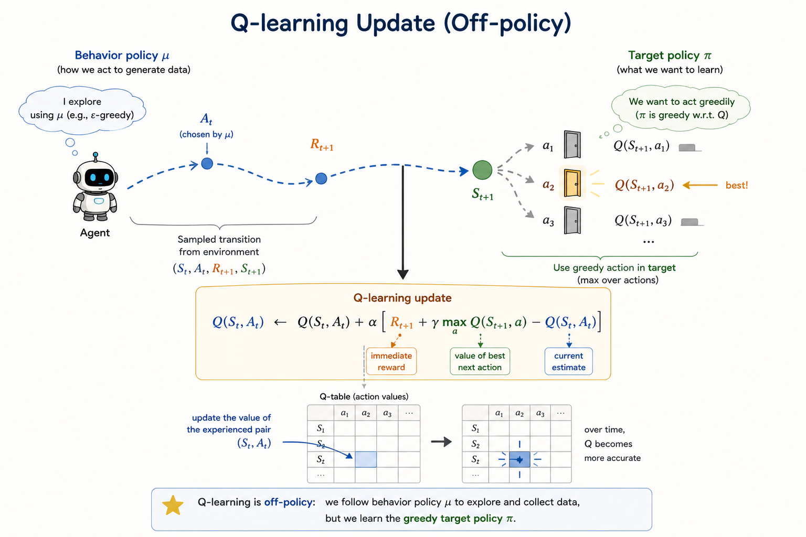

<iframe width="100%" height="500" src="https://www.youtube.com/embed/0g4j2k_Ggc4?list=PLqYmG7hTraZDM-OYHWgPebj2MfCFzFObQ&amp;index=5" title="David Silver Reinforcement Learning Lecture 5" frameborder="0" allow="accelerometer; autoplay; clipboard-write; encrypted-media; gyroscope; picture-in-picture; web-share" allowfullscreen></iframe>

This lecture moves from model-free prediction to model-free control. The goal is no longer just to evaluate a fixed policy. The goal is to improve behavior and eventually learn an optimal policy directly from experience, without knowing the MDP model.

## On-Policy Learning

On-policy control means:

- learn about the policy currently being followed
- improve that same policy using the learned value estimates

The usual loop is:

1. evaluate the current policy
2. improve it
3. repeat

In dynamic programming, greedy improvement can be written in terms of the state-value function:

$$
\pi'(s) = \arg\max_a \sum_{s',r} p(s',r \mid s,a)\bigl[r + \gamma v_\pi(s')\bigr].
$$

But this requires the transition model. In model-free control, the useful object is the action-value function:

$$
\pi'(s) = \arg\max_{a \in \mathcal{A}} q_\pi(s,a).
$$

So once we estimate $Q(s,a)$ directly from experience, we can improve the policy without an explicit model.

### Greedy and Epsilon-Greedy Improvement

A purely greedy policy chooses the action with the largest estimated action-value:

$$
\pi(s) = \arg\max_a Q(s,a).
$$

The problem is exploration. If we always exploit the current estimate, we may stop visiting actions that actually have better long-run value.

The standard fix is an $\epsilon$-greedy policy:

- with probability $1-\epsilon$, choose a greedy action
- with probability $\epsilon$, choose uniformly at random

If there are $m$ actions and $a^*$ is a greedy action, then:

$$
\pi(a \mid s) =
\begin{cases}
1-\epsilon+\epsilon/m, & a=a^*, \\
\epsilon/m, & a \neq a^*.
\end{cases}
$$

This ensures every action keeps a nonzero probability of being tried.

Policy improvement still holds in the $\epsilon$-greedy setting: the new $\epsilon$-greedy policy with respect to $q_\pi$ is at least as good as the old one.

### GLIE

The lecture emphasizes **Greedy in the Limit with Infinite Exploration (GLIE)**.

The idea is:

- every state-action pair is explored infinitely often
- the policy becomes greedy in the limit

Formally:

$$
\lim_{k\to\infty} N_k(s,a) = \infty
$$

for all $(s,a)$, while the exploration rate decays so that the policy becomes nearly greedy. A typical schedule is:

$$
\epsilon_k = \frac{1}{k}.
$$

This is the balance control needs:

- enough exploration early
- near-greedy behavior later

### Monte Carlo Control

Monte Carlo control uses complete sampled returns to estimate action-values:

$$
q_\pi(s,a) = \mathbb{E}_\pi[G_t \mid S_t=s, A_t=a].
$$

The GLIE Monte Carlo control loop is:

1. generate an episode using the current $\epsilon$-greedy policy
2. for each visited state-action pair, update the action-value estimate from the observed return
3. improve the policy to be $\epsilon$-greedy with respect to the new $Q$
4. gradually reduce $\epsilon$

Using incremental averaging, the update is

$$
N(S_t,A_t) \leftarrow N(S_t,A_t)+1,
$$

$$
Q(S_t,A_t) \leftarrow Q(S_t,A_t) + \frac{1}{N(S_t,A_t)}\bigl(G_t - Q(S_t,A_t)\bigr).
$$

This works, but it has the same limitation as Monte Carlo prediction:

- high variance
- must wait for full returns

That leads to TD control.

### Sarsa

Sarsa is the on-policy TD control algorithm. Its name comes from the update tuple:

$$
(S_t, A_t, R_{t+1}, S_{t+1}, A_{t+1}).
$$

The one-step update is:

$$
Q(S_t,A_t) \leftarrow Q(S_t,A_t) + \alpha\Bigl(R_{t+1} + \gamma Q(S_{t+1},A_{t+1}) - Q(S_t,A_t)\Bigr).
$$

This is on-policy because the next action $A_{t+1}$ is chosen using the same current $\epsilon$-greedy policy that the agent is actually following.

So Sarsa evaluates and improves the current behavior policy at the same time.

Under standard conditions:

- GLIE exploration
- Robbins-Monro step sizes

Sarsa converges to the optimal action-value function.

### N-Step Sarsa

One-step Sarsa uses only one reward before bootstrapping. Monte Carlo waits until the end. N-step Sarsa sits between them.

Examples:

$$
G_t^{(1)} = R_{t+1} + \gamma Q(S_{t+1},A_{t+1}),
$$

$$
G_t^{(2)} = R_{t+1} + \gamma R_{t+2} + \gamma^2 Q(S_{t+2},A_{t+2}),
$$

and in general

$$
G_t^{(n)}
=
R_{t+1} + \gamma R_{t+2} + \cdots + \gamma^{n-1}R_{t+n}
+ \gamma^n Q(S_{t+n},A_{t+n}).
$$

The update becomes

$$
Q(S_t,A_t) \leftarrow Q(S_t,A_t) + \alpha\bigl(G_t^{(n)} - Q(S_t,A_t)\bigr).
$$

This is another bias-variance tradeoff:

- small $n$: more bootstrapping, lower variance
- large $n$: less bootstrapping, higher variance

### Sarsa(lambda)

Sarsa($\lambda$) combines all n-step returns into one weighted target:

$$
G_t^\lambda = (1-\lambda)\sum_{n=1}^{\infty}\lambda^{n-1} G_t^{(n)}.
$$

Then the forward-view update is

$$
Q(S_t,A_t) \leftarrow Q(S_t,A_t) + \alpha\bigl(G_t^\lambda - Q(S_t,A_t)\bigr).
$$

The backward view implements the same idea with **eligibility traces**.

Initialize

$$
E_0(s,a)=0.
$$

Then update traces by

$$
E_t(s,a)=\gamma\lambda E_{t-1}(s,a) + \mathbf{1}\{S_t=s,\ A_t=a\}.
$$

Define the TD error

$$
\delta_t = R_{t+1} + \gamma Q(S_{t+1},A_{t+1}) - Q(S_t,A_t),
$$

and update

$$
Q(s,a) \leftarrow Q(s,a) + \alpha\,\delta_t E_t(s,a).
$$

Intuition:

- the most recent actions get the biggest credit or blame
- earlier actions still get updated, but with decayed weight

That is why eligibility traces propagate reward information backward efficiently.

## Off-Policy Learning

Off-policy learning separates:

- the **behavior policy** $\mu$, which generates data
- the **target policy** $\pi$, which we want to evaluate or improve

This matters because it lets us:

- reuse old experience
- learn from exploratory behavior
- learn an optimal greedy policy while still behaving more randomly

### Importance Sampling

If samples come from $\mu$ but we care about expectations under $\pi$, we correct the mismatch with importance sampling.

Basic identity:

$$
\mathbb{E}_{X\sim P}[f(X)]
=
\mathbb{E}_{X\sim Q}\left[\frac{P(X)}{Q(X)}f(X)\right].
$$

For off-policy Monte Carlo, we weight returns by the trajectory probability ratio:

$$
\rho_{t:T-1}
=
\prod_{k=t}^{T-1}\frac{\pi(A_k\mid S_k)}{\mu(A_k\mid S_k)}.
$$

Then one ordinary importance-sampling style update is

$$
V(S_t) \leftarrow V(S_t) + \alpha\bigl(\rho_{t:T-1}G_t - V(S_t)\bigr).
$$

For one-step TD prediction, only the current-step correction appears:

$$
V(S_t) \leftarrow V(S_t) + \alpha\,\rho_t\Bigl(R_{t+1} + \gamma V(S_{t+1}) - V(S_t)\Bigr),
$$

where

$$
\rho_t = \frac{\pi(A_t\mid S_t)}{\mu(A_t\mid S_t)}.
$$

Compared with Monte Carlo importance sampling, one-step TD usually has much lower variance.

### Q-Learning

Q-learning is the key off-policy control method in the lecture.

The update is:

$$
Q(S_t,A_t)
\leftarrow
Q(S_t,A_t)
+
\alpha\Bigl(R_{t+1} + \gamma \max_{a'}Q(S_{t+1},a') - Q(S_t,A_t)\Bigr).
$$

This is the crucial difference from Sarsa:

- **Sarsa** bootstraps from the action actually taken next
- **Q-learning** bootstraps from the best next action according to the current estimate

So Q-learning learns the greedy target policy even while behavior remains exploratory.

That is why no multi-step importance-sampling correction is needed in the control update itself: the target is defined directly by the max operator.

### Full Backup vs Sample Backup

This lecture also fits the main RL methods into a useful table:

| Objective | Full Backup (DP) | Sample Backup (TD) |
|---|---|---|
| Bellman expectation for $v_\pi$ | Iterative policy evaluation | TD learning |
| Bellman expectation for $q_\pi$ | Policy iteration with action-values | Sarsa |
| Bellman optimality for $q_*$ | Q-value iteration | Q-learning |

This is a good summary of where model-free control sits:

- dynamic programming uses full expectations from a known model
- TD control uses sampled transitions from experience

### Q-Learning Demo

Colab demo:

[Q-learning demo Colab](https://colab.research.google.com/drive/1RF4ykBWW_Kfu9WkMseuGnrZnh5H60_pl#scrollTo=f6781cff)

### Summary

- model-free control improves behavior directly from sampled experience
- $\epsilon$-greedy policies add exploration to greedy improvement
- GLIE balances infinite exploration with greedy behavior in the limit
- Monte Carlo control learns from complete returns
- Sarsa is the standard on-policy TD control method
- n-step Sarsa and Sarsa($\lambda$) interpolate between one-step bootstrapping and long returns
- off-policy learning separates behavior policy from target policy
- importance sampling corrects policy mismatch
- Q-learning learns the greedy optimal action-value function while behaving exploratorily
