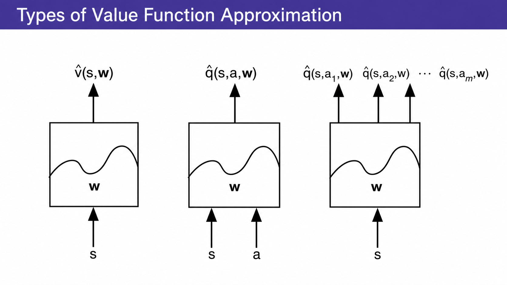
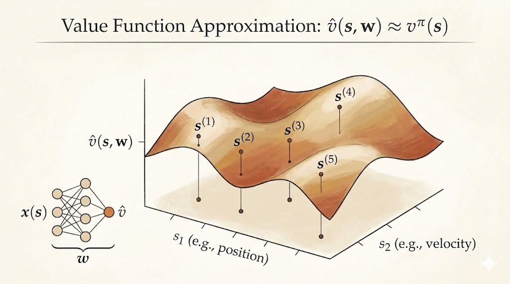

<iframe width="100%" height="500" src="https://www.youtube.com/embed/UoPei5o4fps?list=PLqYmG7hTraZDM-OYHWgPebj2MfCFzFObQ&amp;index=7" title="David Silver Reinforcement Learning Lecture 6" frameborder="0" allow="accelerometer; autoplay; clipboard-write; encrypted-media; gyroscope; picture-in-picture; web-share" allowfullscreen></iframe>

This lecture is where reinforcement learning moves beyond small tables.

In earlier lectures, value functions were often represented as one number per state, or one number per state-action pair. That works for toy gridworlds and small Markov decision processes. It does not work when the state space is large, continuous, or only partly explored.

The central idea is value function approximation:

$$
\hat v(s,w) \approx v_\pi(s),
\qquad
\hat q(s,a,w) \approx q_\pi(s,a).
$$

Instead of learning an independent value for every state, we learn parameters $w$ of a function that maps states, or state-action pairs, to value estimates.

That gives RL a way to generalize:

- from seen states to unseen states
- from individual table entries to shared features
- from small MDPs to realistic problems with huge state spaces

## Why Approximate Values?

Large MDPs have two related problems:

- too many states or actions to store explicitly
- too little data to learn every state value independently

Function approximation addresses both by sharing statistical strength across related states.

For example, if two robot states have similar distances to the same landmarks, their values may also be similar. If two board positions share the same strategic pattern, their values may be close even if the exact board configuration has never appeared before.

The approximator can be many different kinds of model:

- linear combination of features
- neural network
- decision tree
- nearest-neighbor method
- Fourier or wavelet basis

For gradient-based RL, the most important cases are differentiable approximators, especially linear models and neural networks.

## Gradient Descent for Value Approximation

Suppose we want to approximate the true value function $v_\pi$ with $\hat v(s,w)$.

A natural objective is mean squared error:

$$
J(w) = \mathbb{E}_\pi\left[\left(v_\pi(S)-\hat v(S,w)\right)^2\right].
$$

Gradient descent updates $w$ in the direction that reduces this loss:

$$
w \leftarrow w - \frac{1}{2}\alpha \nabla_w J(w).
$$

For one sampled state $S$, this becomes:

$$
\Delta w
=
\alpha\left(v_\pi(S)-\hat v(S,w)\right)\nabla_w \hat v(S,w).
$$

This looks exactly like supervised regression. The target is the true value $v_\pi(S)$, and the model prediction is $\hat v(S,w)$.

The difficulty in RL is that the true value is not directly given by a supervisor. We need to replace it with sampled targets.

## Linear Value Function Approximation

A common starting point is to describe each state by a feature vector:

$$
x(S) =
\begin{bmatrix}
x_1(S) \\
x_2(S) \\
\vdots \\
x_n(S)
\end{bmatrix}.
$$

The value estimate is a weighted combination of these features:

$$
\hat v(S,w) = x(S)^T w = \sum_{j=1}^n x_j(S)w_j.
$$

For a linear approximator,

$$
\nabla_w \hat v(S,w) = x(S),
$$

so the update becomes:

$$
\Delta w
=
\alpha\left(v_\pi(S)-\hat v(S,w)\right)x(S).
$$

Linear approximation is important because its mean squared error objective is quadratic. That gives a single global minimum, so gradient descent has a much cleaner optimization problem than with nonlinear function approximators.

Table lookup is a special case of linear approximation. If each state has a one-hot feature vector, then each parameter corresponds to one table entry.

## Replacing the Unknown Target

The supervised-looking update uses $v_\pi(S)$, but in RL we do not know it.

So different RL methods plug in different targets.

### Monte Carlo Target

Monte Carlo uses the sampled return:

$$
G_t = R_{t+1} + \gamma R_{t+2} + \gamma^2 R_{t+3} + \cdots.
$$

The update is:

$$
\Delta w
=
\alpha\left(G_t-\hat v(S_t,w)\right)
\nabla_w \hat v(S_t,w).
$$

This target is unbiased, but can have high variance.

### TD(0) Target

Temporal-difference learning uses a one-step bootstrapped target:

$$
R_{t+1} + \gamma \hat v(S_{t+1},w).
$$

The update is:

$$
\Delta w
=
\alpha\left(R_{t+1}+\gamma\hat v(S_{t+1},w)-\hat v(S_t,w)\right)
\nabla_w \hat v(S_t,w).
$$

The term in parentheses is the TD error.

TD is usually lower variance than Monte Carlo, but it is not a pure gradient descent update on the mean squared value error. That distinction matters for convergence.

### TD(lambda) Target

TD($\lambda$) replaces the target with the $\lambda$-return:

$$
\Delta w
=
\alpha\left(G_t^\lambda-\hat v(S_t,w)\right)
\nabla_w \hat v(S_t,w).
$$

Conceptually, this interpolates between TD(0) and Monte Carlo:

- $\lambda=0$: one-step TD target
- $\lambda=1$: Monte Carlo-style full return
- intermediate $\lambda$: mixture of multi-step returns

## Action-Value Function Approximation

For control, we usually approximate action-values:

$$
\hat q(S,A,w) \approx q_\pi(S,A).
$$

The mean squared objective is:

$$
J(w)
=
\mathbb{E}_\pi\left[\left(q_\pi(S,A)-\hat q(S,A,w)\right)^2\right].
$$

The generic gradient update is:

$$
\Delta w
=
\alpha\left(q_\pi(S,A)-\hat q(S,A,w)\right)
\nabla_w \hat q(S,A,w).
$$

Again, the true target is unknown, so RL algorithms replace it with sampled targets.

For a linear action-value approximator:

$$
\hat q(S,A,w)=x(S,A)^T w,
$$

and the update becomes:

$$
\Delta w
=
\alpha\left(q_\pi(S,A)-\hat q(S,A,w)\right)x(S,A).
$$

The Sarsa-style TD target is:

$$
R_{t+1}+\gamma \hat q(S_{t+1},A_{t+1},w).
$$

So the TD error is:

$$
\delta_t
=
R_{t+1}
+ \gamma \hat q(S_{t+1},A_{t+1},w)
- \hat q(S_t,A_t,w).
$$

With eligibility traces:

$$
E_t = \gamma\lambda E_{t-1} + \nabla_w \hat q(S_t,A_t,w),
$$

and the update is:

$$
\Delta w = \alpha \delta_t E_t.
$$

This is the function approximation version of the backward view from Lecture 5.

## Convergence Gets Harder

The lecture's warning is important: once we combine bootstrapping, off-policy learning, and function approximation, convergence is no longer automatic.

For prediction:

| Method | Table Lookup | Linear | Nonlinear |
|---|---:|---:|---:|
| On-policy MC | Yes | Yes | Yes |
| On-policy TD(0) | Yes | Yes | No |
| On-policy TD($\lambda$) | Yes | Yes | No |
| Off-policy MC | Yes | Yes | Yes |
| Off-policy TD(0) | Yes | No | No |
| Off-policy TD($\lambda$) | Yes | No | No |

For control:

| Method | Table Lookup | Linear | Nonlinear |
|---|---:|---:|---:|
| MC control | Yes | Near global optimum | No |
| Sarsa | Yes | Near global optimum | No |
| Q-learning | Yes | No | No |
| Gradient Q-learning | Yes | Yes | No |

This is one of the key conceptual points of the lecture. TD methods are powerful because they bootstrap. But bootstrapping also means the target depends on the current approximation. With off-policy data or nonlinear approximators, the update can chase a moving target in unstable ways.

The practical lesson is not that function approximation is bad. The lesson is that approximation changes the mathematical problem. We need algorithms and engineering tricks that control instability.

## Batch Least Squares

Instead of updating from one transition at a time, we can collect a dataset:

$$
D =
\{\langle s_1, v_1^\pi\rangle,\ldots,\langle s_T, v_T^\pi\rangle\}.
$$

Then fit the approximator by minimizing:

$$
LS(w)
=
\sum_{t=1}^T
\left(v_t^\pi - \hat v(s_t,w)\right)^2.
$$

For linear value approximation, the least-squares solution has the normal-equation form:

$$
w
=
\left(\sum_t x(s_t)x(s_t)^T\right)^{-1}
\sum_t x(s_t)v_t^\pi.
$$

This direct solution can be expensive, but it is data efficient because it reuses all collected samples. Incremental versions such as recursive least squares reduce the cost of updating the solution over time.

Least-squares methods are useful because they turn value estimation back into a regression problem as much as possible.

## Experience Replay

Experience replay keeps a memory of past transitions or training targets, then samples from that memory during learning.

For value prediction, the replay memory might contain pairs:

$$
(s, v^\pi) \sim D.
$$

A stochastic gradient update samples from this dataset:

$$
\Delta w
=
\alpha\left(v^\pi-\hat v(s,w)\right)
\nabla_w \hat v(s,w).
$$

The main benefits are:

- better data efficiency, because each experience can be reused
- less correlation between consecutive updates, because minibatches are sampled from memory
- a more supervised-learning-like training loop

This is one reason experience replay became central in deep RL.

## DQN Stabilization

Deep Q-Networks combine Q-learning with a neural network approximator:

$$
Q(s,a;w).
$$

Naive deep Q-learning is unstable because the same network both chooses the target and learns from that target. DQN stabilizes the process with two ideas.

First, experience replay stores transitions:

$$
(s_t,a_t,r_{t+1},s_{t+1}).
$$

Training uses random minibatches from the replay buffer.

Second, fixed Q-targets use an older set of parameters $w^-$ to compute the target. The DQN loss is:

$$
L_i(w_i)
=
\mathbb{E}_{s,a,r,s'\sim D_i}
\left[
\left(
r+\gamma \max_{a'} Q(s',a';w_i^-)
- Q(s,a;w_i)
\right)^2
\right].
$$

The target network makes the learning target change more slowly, while replay reduces sample correlation. Together, they make neural-network-based value approximation much more practical.

## Main Takeaway

Value function approximation is the bridge from tabular RL to realistic RL.

The old tabular view says:

$$
V(s) \text{ is a number stored for state } s.
$$

The function approximation view says:

$$
\hat v(s,w) \text{ is a learned function that generalizes across states.}
$$

That shift is powerful, but it also introduces new failure modes. The lecture's core message is that large-scale RL is not just "replace a table with a neural network." It requires understanding how approximation, bootstrapping, off-policy data, replay, and target construction interact.
