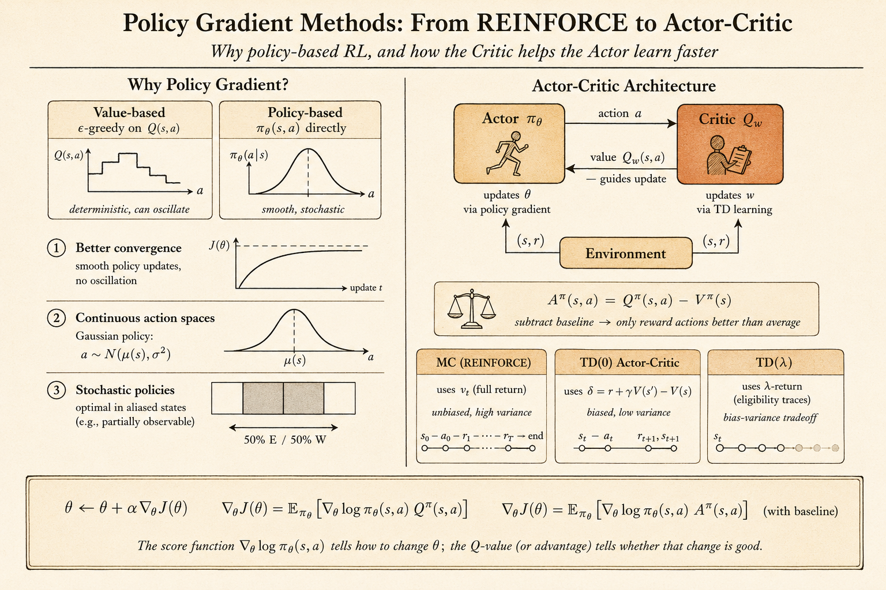

<iframe width="100%" height="500" src="https://www.youtube.com/embed/KHZVXao4qXs?list=PLqYmG7hTraZDM-OYHWgPebj2MfCFzFObQ&amp;index=7" title="David Silver Reinforcement Learning Lecture 7" frameborder="0" allow="accelerometer; autoplay; clipboard-write; encrypted-media; gyroscope; picture-in-picture; web-share" allowfullscreen></iframe>

This lecture moves from learning values to learning the policy directly.

In value-based reinforcement learning, the agent learns a value function first, then derives a policy from it. For example, Q-learning learns $q(s,a)$ and then acts greedily, or $\epsilon$-greedily, with respect to those values.

Policy gradient methods take a different route:

> Parameterize the policy itself, then improve the policy parameters by following the gradient of expected return.

This is useful when the action space is continuous, when the best behavior is stochastic, or when representing a value function is not the most natural way to solve the task.

## Value-Based, Policy-Based, and Actor-Critic

There are three broad styles:

- value-based methods learn a value function and use an implicit policy
- policy-based methods learn a policy directly, often without a value function
- actor-critic methods learn both a policy and a value function

The policy-based approach has several advantages:

- it can work naturally with continuous actions
- it can learn stochastic policies
- it often has better convergence behavior than value-based control
- it avoids the need to compute an argmax over actions

There are also costs:

- policy gradient methods usually converge only to local optima
- naive gradient estimates can have high variance
- evaluating a policy can be sample inefficient

The lecture's aliased gridworld example makes the need for stochastic policies concrete. If two different states produce the same observation, a deterministic rule like "always go east" may be correct in one hidden state and fatal in another. A stochastic policy can mix actions and escape the aliasing trap.

## Policy Objective Functions

Let the policy be parameterized by $\theta$:

$$
\pi_\theta(a \mid s).
$$

Policy search asks for parameters that maximize an objective:

$$
\theta^\star = \arg\max_\theta J(\theta).
$$

Different environments suggest different objectives.

For episodic tasks, we can use the start-state value:

$$
J_1(\theta) = V^{\pi_\theta}(s_1)
= \mathbb{E}_{\pi_\theta}[G_1].
$$

For continuing tasks, we can use average value:

$$
J_{\mathrm{avV}}(\theta)
=
\sum_s d^{\pi_\theta}(s) V^{\pi_\theta}(s).
$$

Or average reward per time step:

$$
J_{\mathrm{avR}}(\theta)
=
\sum_s d^{\pi_\theta}(s)
\sum_a \pi_\theta(a \mid s) R_s^a.
$$

Once the objective is defined, policy optimization can use black-box search methods such as hill climbing, Nelder-Mead, or genetic algorithms.

But if the policy is differentiable, gradient methods are usually more efficient.

## Finite-Difference Policy Gradient

The policy gradient update ascends the objective:

$$
\Delta \theta = \alpha \nabla_\theta J(\theta).
$$

One simple way to estimate the gradient is finite differences. For each parameter dimension $k$, perturb $\theta$ by a small amount $\epsilon$:

$$
\frac{\partial J(\theta)}{\partial \theta_k}
\approx
\frac{J(\theta + \epsilon u_k)-J(\theta)}{\epsilon}.
$$

Here $u_k$ is the unit vector in dimension $k$.

This method is simple and can work even when the policy is not differentiable. But it is noisy and expensive because each dimension needs separate policy evaluations.

The rest of the lecture focuses on gradients that use the structure of a differentiable policy.

## The Score Function

The key identity is the likelihood-ratio trick:

$$
\nabla_\theta \pi_\theta(a \mid s)
=
\pi_\theta(a \mid s)
\nabla_\theta \log \pi_\theta(a \mid s).
$$

The term

$$
\nabla_\theta \log \pi_\theta(a \mid s)
$$

is the score function.

Intuitively, it tells us how to change $\theta$ to make the sampled action more or less likely. Policy gradient methods multiply this score by a measure of how good the action was.

## Softmax Policy

For discrete actions, a common policy is softmax over action preferences.

Let $\phi(s,a)$ be features for action $a$ in state $s$. The policy assigns:

$$
\pi_\theta(a \mid s)
\propto
\exp(\phi(s,a)^T \theta).
$$

The score function becomes:

$$
\nabla_\theta \log \pi_\theta(a \mid s)
=
\phi(s,a)
-
\mathbb{E}_{\pi_\theta}[\phi(s,\cdot)].
$$

This has a clean interpretation:

- increase the features of the action actually taken
- subtract the average features of actions under the current policy

So the update pushes the policy toward actions whose features are better than the policy's own average.

## Gaussian Policy

For continuous actions, a Gaussian policy is natural.

For example:

$$
a \sim \mathcal{N}(\mu(s), \sigma^2),
\qquad
\mu(s)=\phi(s)^T\theta.
$$

The score function is:

$$
\nabla_\theta \log \pi_\theta(a \mid s)
=
\frac{(a-\mu(s))\phi(s)}{\sigma^2}.
$$

If the sampled action is larger than the current mean, the update can push the mean upward. If it is smaller, the update can push the mean downward. The reward signal decides whether that sampled deviation should be reinforced.

## Policy Gradient Theorem

For a one-step MDP, the objective is:

$$
J(\theta)
=
\mathbb{E}_{\pi_\theta}[r]
=
\sum_s d(s)\sum_a \pi_\theta(a \mid s) R_{s,a}.
$$

Using the score-function identity:

$$
\nabla_\theta J(\theta)
=
\mathbb{E}_{\pi_\theta}
\left[
\nabla_\theta \log \pi_\theta(a \mid s) r
\right].
$$

For a multi-step MDP, the immediate reward is replaced by the long-term action value:

$$
\nabla_\theta J(\theta)
=
\mathbb{E}_{\pi_\theta}
\left[
\nabla_\theta \log \pi_\theta(a \mid s)
Q^\pi(s,a)
\right].
$$

This is the central policy gradient theorem.

## REINFORCE

REINFORCE uses the sampled return $G_t$ as an unbiased sample of $Q^{\pi_\theta}(s_t,a_t)$:

$$
\Delta \theta_t
=
\alpha
\nabla_\theta \log \pi_\theta(a_t \mid s_t)
G_t.
$$

The algorithm is conceptually simple:

1. Run an episode using the current policy.
2. For each time step, compute the return from that step.
3. Increase the log-probability of actions that led to high return.

In pseudocode:

```text
initialize theta

for each episode sampled from pi_theta:
    for each time step t:
        theta <- theta
                 + alpha
                 * grad log pi_theta(a_t | s_t)
                 * G_t
```

REINFORCE is unbiased, but it can have high variance because the return depends on everything that happens after the action.

## Actor-Critic Policy Gradient

Actor-critic methods reduce variance by adding a critic.

The actor is the policy:

$$
\pi_\theta(a \mid s).
$$

The critic estimates value, often:

$$
Q_w(s,a) \approx Q^{\pi_\theta}(s,a).
$$

Then the policy update becomes:

$$
\Delta \theta
=
\alpha
\nabla_\theta \log \pi_\theta(a \mid s)
Q_w(s,a).
$$



The benefit is that the actor does not need to wait until the end of an episode. The critic supplies an online estimate of how good the action was.

For example, a one-step actor-critic method can use a TD error:

$$
\delta_t
=
r_{t+1}
+ \gamma V_v(s_{t+1})
- V_v(s_t).
$$

Then the actor update is:

$$
\Delta \theta
=
\alpha
\delta_t
\nabla_\theta \log \pi_\theta(a_t \mid s_t).
$$

This is lower variance than Monte Carlo policy gradient, but it introduces bias through the critic's approximation.

## Baselines and Advantage

A baseline can reduce variance without changing the expected policy gradient.

If $B(s)$ does not depend on the action, then:

$$
\mathbb{E}_{\pi_\theta}
\left[
\nabla_\theta \log \pi_\theta(a \mid s) B(s)
\right]
=0.
$$

So we can subtract a baseline from the action value.

A natural baseline is the state value $V^\pi(s)$. This gives the advantage function:

$$
A^\pi(s,a)
=
Q^\pi(s,a)-V^\pi(s).
$$

The policy gradient becomes:

$$
\nabla_\theta J(\theta)
=
\mathbb{E}_{\pi_\theta}
\left[
\nabla_\theta \log \pi_\theta(a \mid s)
A^\pi(s,a)
\right].
$$

This answers a more precise question:

> Was this action better or worse than what the current policy normally expects in this state?

## Eligibility Traces for Policy Gradient

The same time-scale idea from TD($\lambda$) can be used for policy gradients.

Monte Carlo uses a complete return. TD uses one-step bootstrapping. Eligibility traces interpolate between them.

The forward view uses a $\lambda$-return:

$$
\Delta \theta
=
\alpha
\left(G_t^\lambda - V_v(s_t)\right)
\nabla_\theta \log \pi_\theta(a_t \mid s_t).
$$

The backward view maintains a trace of recent policy-gradient directions:

$$
e_{t+1}
=
\lambda e_t
+
\nabla_\theta \log \pi_\theta(a_t \mid s_t).
$$

Then the policy is updated by the TD error times the trace:

$$
\Delta \theta
=
\alpha \delta_t e_t.
$$

The trace lets current TD errors assign credit to recently taken actions.

## Natural Policy Gradient

The vanilla gradient moves in parameter space. But the same change in parameters can mean very different changes in the policy distribution, depending on how the policy is parameterized.

Natural policy gradient corrects for this by measuring distance in distribution space.

The natural gradient is:

$$
\nabla_\theta^{\mathrm{nat}} J(\theta)
=
G_\theta^{-1}
\nabla_\theta J(\theta),
$$

where $G_\theta$ is the Fisher information matrix:

$$
G_\theta
=
\mathbb{E}_{\pi_\theta}
\left[
\nabla_\theta \log \pi_\theta(a \mid s)
\nabla_\theta \log \pi_\theta(a \mid s)^T
\right].
$$

The idea is to find an update direction that improves the policy while controlling how much the action distribution changes.

With compatible function approximation, the natural actor-critic has a nice simplification: the critic's weights can directly represent the natural gradient direction.

## Main Takeaway

Policy gradient methods optimize behavior directly.

The key ideas are:

- parameterize the policy $\pi_\theta(a \mid s)$
- use the score function $\nabla_\theta \log \pi_\theta(a \mid s)$
- weight the score by return, value, or advantage
- use actor-critic methods to reduce variance and update online
- use baselines and advantages to make the signal cleaner
- use natural gradients to account for the geometry of policy distributions

For me, this lecture connects probability, optimization, and RL very directly: learning means changing the probability of actions in proportion to how useful those actions turned out to be.
