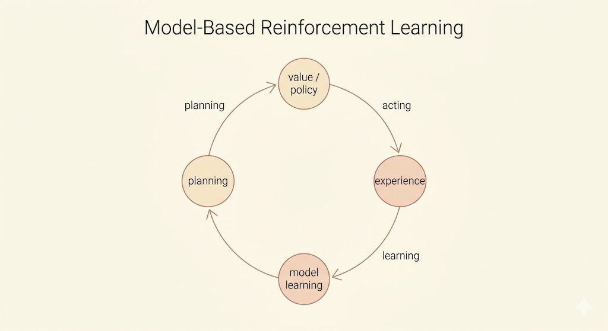
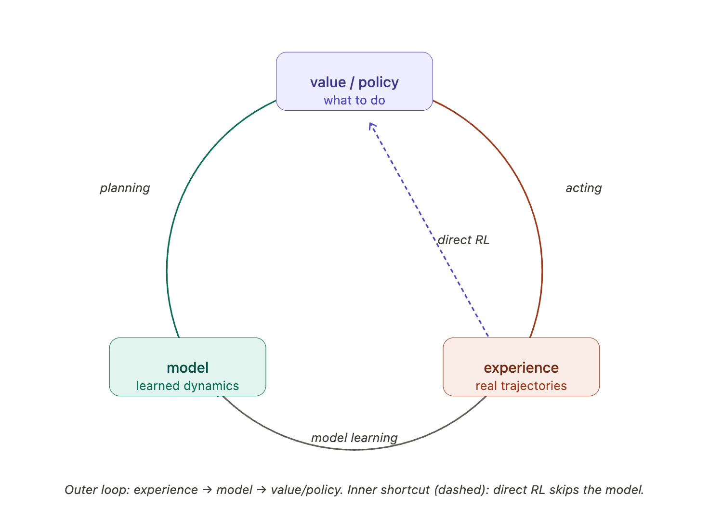
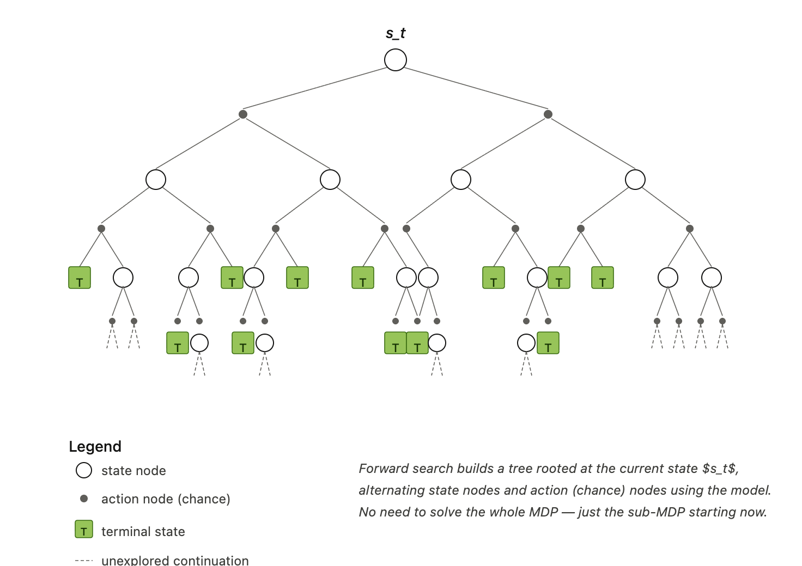
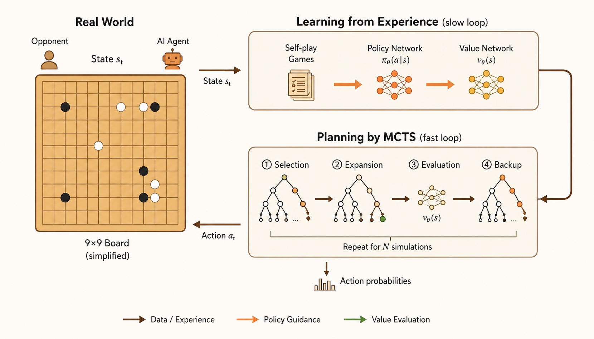

<iframe width="100%" height="500" src="https://www.youtube.com/embed/ItMutbeOHtc?list=PLqYmG7hTraZDM-OYHWgPebj2MfCFzFObQ&amp;index=9" title="David Silver Reinforcement Learning Lecture 8" frameborder="0" allow="accelerometer; autoplay; clipboard-write; encrypted-media; gyroscope; picture-in-picture; web-share" allowfullscreen></iframe>

This lecture connects two ways of solving reinforcement learning problems.

Model-free reinforcement learning learns values or policies directly from experience. Model-based reinforcement learning first learns, or assumes access to, a model of the environment, then uses that model to plan.

The central loop is:

- collect real experience from the environment
- learn a model of transitions and rewards
- use the model to simulate possible futures
- improve a value function or policy from real and simulated experience
- act in the real environment and repeat

## Model-Based Reinforcement Learning

In model-based reinforcement learning, the agent uses experience to build an internal representation of the Markov decision process.

Assume the state space $\mathcal{S}$ and action space $\mathcal{A}$ are known. A model represents the unknown transition and reward dynamics:

$$
\mathcal{M}_\eta =
\langle \mathcal{P}_\eta, \mathcal{R}_\eta \rangle,
$$

where

$$
\mathcal{P}_\eta(s' \mid s,a) \approx \mathcal{P}(s' \mid s,a),
\qquad
\mathcal{R}_\eta(r \mid s,a) \approx \mathcal{R}(r \mid s,a).
$$

The model lets the agent sample imagined transitions:

$$
S_{t+1} \sim \mathcal{P}_\eta(\cdot \mid S_t,A_t),
\qquad
R_{t+1} \sim \mathcal{R}_\eta(\cdot \mid S_t,A_t).
$$

A common simplifying assumption is that the next state and reward are conditionally independent given the current state and action:

$$
\mathbb{P}(S_{t+1},R_{t+1} \mid S_t,A_t)
=
\mathbb{P}(S_{t+1} \mid S_t,A_t)
\mathbb{P}(R_{t+1} \mid S_t,A_t).
$$

The advantage of model-based RL is sample efficiency. Learning a model can often be framed as supervised learning, and once the model is learned, the agent can generate many simulated experiences without additional real-world interaction.

The cost is approximation error. The agent must first learn a model, then use that approximate model to construct a value function or policy. Errors in the model can compound through planning.

## Learning a Model

Model learning estimates the transition and reward functions from experience:

$$
(S_t,A_t) \rightarrow (R_{t+1},S_{t+1}).
$$

Learning rewards is usually a regression problem:

$$
(s,a) \rightarrow r.
$$

Learning state transitions is a density estimation problem:

$$
(s,a) \rightarrow s'.
$$

The loss depends on the representation. Common choices include mean squared error for deterministic or mean predictions, and KL divergence or negative log-likelihood for probabilistic transition models.

Examples of model classes include:

- table lookup models
- linear models
- Gaussian models
- Gaussian processes
- deep neural network models

### Table Lookup Model

For small finite MDPs, a table lookup model can estimate transitions by counting.

Let $N(s,a)$ be the number of visits to state-action pair $(s,a)$. The empirical transition probability is

$$
\hat{P}_{s,s'}^a
=
\frac{1}{N(s,a)}
\sum_{t=1}^{T}
\mathbf{1}(S_t=s,A_t=a,S_{t+1}=s').
$$

The empirical reward estimate is

$$
\hat{R}_s^a
=
\frac{1}{N(s,a)}
\sum_{t=1}^{T}
\mathbf{1}(S_t=s,A_t=a)R_{t+1}.
$$

An alternative is to store the observed tuples

$$
(S_t,A_t,R_{t+1},S_{t+1})
$$

and sample a matching tuple whenever the planning algorithm queries $(s,a)$.

## Planning with a Model

Given a learned model

$$
\mathcal{M}_\eta =
\langle \mathcal{P}_\eta,\mathcal{R}_\eta \rangle,
$$

the agent can solve the estimated MDP:

$$
\langle
\mathcal{S},
\mathcal{A},
\mathcal{P}_\eta,
\mathcal{R}_\eta
\rangle.
$$

If the model is explicit, classical planning algorithms can be applied directly:

- value iteration
- policy iteration
- tree search

Another strategy is sample-based planning. Instead of computing exact expectations under the model, the agent uses the model only to generate samples:

$$
S_{t+1} \sim \mathcal{P}_\eta(\cdot \mid S_t,A_t),
\qquad
R_{t+1} \sim \mathcal{R}_\eta(\cdot \mid S_t,A_t).
$$

Then standard model-free RL algorithms can learn from those simulated transitions:

- Monte Carlo control
- Sarsa
- Q-learning

This is the key bridge in the lecture: model-based RL can create imagined experience, and model-free RL can learn from both real and imagined experience.

If the model is inaccurate, planning may optimize the wrong MDP and produce a poor policy. Two common responses are to fall back on model-free learning, or to reason explicitly about model uncertainty.

## Integrated Architectures

The clean separation between model-free learning and model-based planning is useful conceptually, but practical agents often combine them.

Real experience comes from the environment:

$$
S' \sim P(\cdot \mid S,a),
\qquad
R \sim R(\cdot \mid S,a).
$$

Simulated experience comes from the learned model:

$$
S' \sim P_\eta(\cdot \mid S,a),
\qquad
R \sim R_\eta(\cdot \mid S,a).
$$

The agent can use both streams to update the same value function or policy.

### Dyna

Dyna is the canonical architecture for integrating learning, planning, and acting.

It does three things in one loop:

- learn a model from real experience
- update values or policies from real experience
- use the model to generate simulated experience and update values or policies again

The important idea is that the same model-free update rule can be used for both real and imagined transitions.

### Dyna-Q

Dyna-Q combines Q-learning with a learned model.

For each real interaction:

1. Observe the current state $S$.
2. Choose an action $A$ using an $\epsilon$-greedy policy from $Q$.
3. Execute $A$ and observe reward $R$ and next state $S'$.
4. Apply the Q-learning update:

$$
Q(S,A)
\leftarrow
Q(S,A)
+
\alpha
\left[
R + \gamma \max_a Q(S',a) - Q(S,A)
\right].
$$

5. Store the model entry:

$$
\operatorname{Model}(S,A) \leftarrow (R,S').
$$

Then, for $n$ planning steps, sample a previously observed state-action pair $(S,A)$, query the model,

$$
R,S' \leftarrow \operatorname{Model}(S,A),
$$

and apply the same Q-learning update to this simulated transition:

$$
Q(S,A)
\leftarrow
Q(S,A)
+
\alpha
\left[
R + \gamma \max_a Q(S',a) - Q(S,A)
\right].
$$

The planning steps make each real experience more valuable because one real transition can trigger many simulated updates.

## Simulation-Based Search

Planning can also be focused on the current state. Instead of improving a global value function everywhere, the agent can search forward from where it is now.

### Forward Search

Forward search builds a tree rooted at the current state $s_t$.

At each depth, the model predicts possible next states and rewards. The agent evaluates actions by looking ahead through the tree.

The advantage is focus. The agent does not need to solve the whole MDP, only the part of the future that matters for the current decision.

### Simple Monte Carlo Search

Simple Monte Carlo search uses a model $\mathcal{M}_\nu$ and a simulation policy $\pi$.

For each candidate action $a$ from the current state $s_t$, run $K$ simulated episodes:

$$
\{s_t,a,R_{t+1}^k,S_{t+1}^k,A_{t+1}^k,\ldots,S_T^k\}_{k=1}^K
\sim
\mathcal{M}_\nu,\pi.
$$

Estimate the action value by averaging returns:

$$
Q(s_t,a)
=
\frac{1}{K}
\sum_{k=1}^{K}G_t^k.
$$

Then act greedily with respect to the simulated estimates:

$$
a_t
=
\arg\max_{a \in \mathcal{A}} Q(s_t,a).
$$

This is model-based because the rollouts come from a model, but the value estimate is model-free because it averages sampled returns.

### Monte Carlo Tree Search

Monte Carlo tree search improves on simple Monte Carlo search by reusing the structure discovered during simulations.

Starting from $s_t$, the agent simulates $K$ episodes under a simulation policy $\pi$:

$$
\{s_t,A_t^k,R_{t+1}^k,S_{t+1}^k,\ldots,S_T^k\}_{k=1}^K
\sim
\mathcal{M}_\nu,\pi.
$$

Instead of discarding the trajectories, MCTS builds a search tree. For each visited state-action pair, it tracks visit counts and mean returns:

$$
Q(s,a)
=
\frac{1}{N(s,a)}
\sum_{k=1}^{K}
\sum_{u=t}^{T}
\mathbf{1}(S_u=s,A_u=a)G_u.
$$

After search, the agent chooses the action at the root with the best estimated value:

$$
a_t
=
\arg\max_{a \in \mathcal{A}} Q(s_t,a).
$$

The tree concentrates computation on states that are reachable and relevant from the current position.

### AlphaGo-Style MCTS

AlphaGo's MCTS combines search with learned neural networks.

The loop has four phases:

- selection: traverse the tree using a balance of current value estimates and policy-network prior probabilities
- expansion: add children for a newly reached leaf position
- evaluation: estimate the leaf using a value network and fast rollout policy
- backup: propagate the evaluation back through the visited path

The policy network guides the search toward plausible moves, while the value network reduces the need for exhaustive rollouts. Search, learning, and planning reinforce each other.

### TD Search

TD search also simulates forward from the current state, but it updates values during the simulation instead of waiting until the end of a rollout.

Using a Sarsa-style TD update:

$$
\Delta Q(S,A)
=
\alpha
\left[
R + \gamma Q(S',A') - Q(S,A)
\right].
$$

This bootstrapping allows updates after each simulated step. It can also work with function approximation, which makes it more scalable than a purely tabular tree.

### Dyna-2

Dyna-2 separates two sources of value information.

The first is long-term memory: general domain knowledge learned from real experience with TD learning.

The second is short-term working memory: local knowledge learned from simulated experience during search from the current state.

The final action value combines both:

$$
Q(s,a)
=
Q_{\mathrm{long}}(s,a)
+
Q_{\mathrm{short}}(s,a).
$$

Long-term memory gives broad competence. Short-term memory lets the agent adapt to the immediate situation by thinking ahead before acting.

## Summary

- Model-based RL learns or uses a model of transitions and rewards.
- Model learning turns experience into supervised learning targets.
- Planning solves the estimated MDP or samples imagined experience from it.
- Dyna integrates model learning, direct RL, and planning in one loop.
- Dyna-Q applies the same Q-learning update to both real and simulated transitions.
- Simulation-based search focuses planning on the current state.
- MCTS builds a reusable search tree from simulated trajectories.
- AlphaGo-style MCTS combines policy priors, value estimates, rollouts, and backup.
- Dyna-2 separates long-term learned value from short-term search value.
