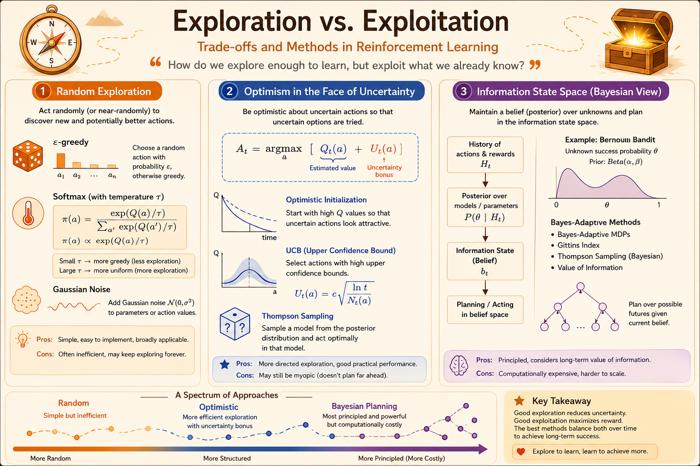
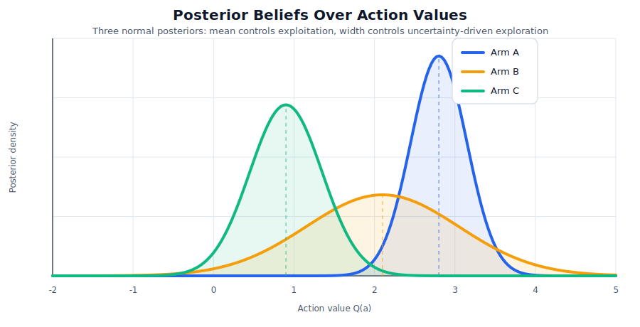

<iframe width="100%" height="500" src="https://www.youtube.com/embed/sGuiWX07sKw?list=PLqYmG7hTraZDM-OYHWgPebj2MfCFzFObQ&amp;index=9" title="David Silver Reinforcement Learning Lecture 9" frameborder="0" allow="accelerometer; autoplay; clipboard-write; encrypted-media; gyroscope; picture-in-picture; web-share" allowfullscreen></iframe>

Exploration is the problem of choosing actions that may not look best now, but may reveal information that improves future decisions. Exploitation is the problem of using what the agent already knows to collect reward now.

The main question is:

$$
\text{when should an agent gather information, and when should it cash in?}
$$

This lecture studies that question first in multi-armed bandits, then extends the same ideas to contextual bandits and full MDPs.

## Exploration

### Three Exploration Families

Most exploration methods fit into three families.

1. **Random exploration:** inject randomness directly into action selection. Examples include $\epsilon$-greedy and softmax action selection.
2. **Optimism in the face of uncertainty:** treat uncertain actions as potentially valuable. Examples include optimistic initialization and upper confidence bounds.
3. **Information-state search:** plan over how actions change the agent's knowledge. Examples include Bayes-adaptive RL and Gittins indices.

Random exploration is simple, but it does not know which actions are uncertain. Optimistic methods are more directed because they explore where uncertainty is high. Information-state methods are the cleanest formulation, but they are usually computationally expensive.

{fig-alt="Overview diagram comparing random exploration, optimism in the face of uncertainty, and information-state search."}

### State-Action vs. Parameter Exploration

**State-action exploration** chooses different actions in particular states. This is the main focus of the lecture.

**Parameter exploration** changes the parameters of a policy, such as $\pi(a \mid s,u)$, and lets the resulting behavior run for a while. It can produce more consistent exploration than step-by-step random actions, but it usually behaves like black-box optimization and does not explicitly track which state-action pairs have been explored.

## Multi-Armed Bandit

A multi-armed bandit is a one-step decision problem:

$$
\langle \mathcal{A}, \mathcal{R} \rangle.
$$

The action set $\mathcal{A}$ is known. Each action $a$ has an unknown reward distribution:

$$
\mathcal{R}^a(r) = P[R = r \mid A = a].
$$

At each step $t$, the agent chooses an action $A_t$ and receives reward

$$
R_t \sim \mathcal{R}^{A_t}.
$$

The objective is to maximize cumulative reward:

$$
\max \sum_{t=1}^{T} R_t.
$$

### Regret

Let

$$
q(a) = \mathbb{E}[R \mid A = a]
$$

be the true value of action $a$. The optimal value is

$$
v_* = \max_{a \in \mathcal{A}} q(a).
$$

The single-step regret from choosing $A_t$ is

$$
l_t = \mathbb{E}[v_* - q(A_t)].
$$

Total regret up to time $t$ is

$$
L_t =
\mathbb{E}
\left[
\sum_{\tau=1}^{t} v_* - q(A_\tau)
\right].
$$

Equivalently, regret can be written by counting how often each action is selected:

$$
L_t =
\sum_{a \in \mathcal{A}}
\mathbb{E}[N_t(a)] \Delta_a,
$$

where

$$
\Delta_a = v_* - q(a).
$$

This form exposes the core challenge. A good algorithm must avoid pulling bad arms too often, but it does not know which arms are bad at the beginning.

### Greedy and Optimistic Initialization

The greedy algorithm estimates each action value with a sample average:

$$
Q_t(a) =
\frac{1}{N_t(a)}
\sum_{\tau=1}^{t}
\mathbb{I}(A_\tau = a) R_\tau.
$$

It then chooses

$$
A_t =
\operatorname*{argmax}_{a \in \mathcal{A}} Q_t(a).
$$

The flaw is lock-in. If early samples make a suboptimal action look good, a greedy agent may never collect enough evidence to correct itself. This can lead to linear regret.

Optimistic initialization tries to force exploration by setting every initial estimate high:

$$
Q(a) = r_{\max},
\qquad \forall a \in \mathcal{A}.
$$

An untried action looks attractive, so a greedy policy is pushed to try it. After the artificial optimism is washed out, however, the method can still behave like plain greedy and suffer from early noise.

### Epsilon-Greedy

Fixed $\epsilon$-greedy chooses the current greedy action with probability $1-\epsilon$ and a random action with probability $\epsilon$.

This guarantees continued exploration, but because $\epsilon$ never vanishes, the agent keeps making random exploratory moves even after it has learned the best arm. Fixed $\epsilon$ therefore gives linear regret.

A decaying schedule can do better. Define the smallest positive gap:

$$
d = \min_{a \mid \Delta_a > 0} \Delta_a.
$$

For $c > 0$, one possible schedule is

$$
\epsilon_t =
\min
\left\{
1,
\frac{c |\mathcal{A}|}{d^2 t}
\right\}.
$$

This can achieve logarithmic regret, but it requires knowing the gap $d$ in advance. In real problems, those gaps are exactly what the agent is trying to learn.

### Lower Bound

The difficulty of a bandit problem depends on how hard it is to distinguish the optimal arm from suboptimal arms.

The Lai-Robbins lower bound states that any consistent algorithm has asymptotic regret at least

$$
\lim_{t \to \infty}
\frac{L_t}{\log t}
\ge
\sum_{a \mid \Delta_a > 0}
\frac{\Delta_a}
{KL(\mathcal{R}^a \parallel \mathcal{R}^{a^*})}.
$$

The gap $\Delta_a$ measures how costly it is to pull arm $a$. The KL divergence measures how statistically different arm $a$ is from the optimal arm. If a suboptimal arm looks very similar to the best arm, the denominator is small, and unavoidable regret is larger.

The key message is that logarithmic regret is the best asymptotic order one can hope for.

### Upper Confidence Bound

Upper Confidence Bound (UCB) implements optimism in the face of uncertainty. Instead of selecting by the mean estimate alone, it selects by

$$
A_t =
\operatorname*{argmax}_{a \in \mathcal{A}}
\left[
Q_t(a) + U_t(a)
\right].
$$

The bonus $U_t(a)$ is large when action $a$ has been sampled rarely, and small when it has been sampled often.

#### Hoeffding's Inequality

Hoeffding's inequality gives a principled way to choose the UCB bonus. For bounded i.i.d. samples,

$$
\mathbb{P}
\left[
\mathbb{E}[X] > \bar{X}_t + u
\right]
\le
e^{-2tu^2}.
$$

For arm $a$, replace $t$ by the number of samples $N_t(a)$:

$$
\mathbb{P}
\left[
q(a) > Q_t(a) + U_t(a)
\right]
\le
e^{-2N_t(a)U_t(a)^2}.
$$

Set the right-hand side to a failure probability $p$:

$$
e^{-2N_t(a)U_t(a)^2} = p.
$$

Solving gives

$$
U_t(a) =
\sqrt{
\frac{-\log p}{2N_t(a)}
}.
$$

UCB1 uses $p=t^{-4}$, giving

$$
U_t(a) =
\sqrt{
\frac{2 \log t}{N_t(a)}
}.
$$

So the UCB1 rule is

$$
A_t =
\operatorname*{argmax}_{a \in \mathcal{A}}
\left[
Q_t(a) +
\sqrt{
\frac{2 \log t}{N_t(a)}
}
\right].
$$

UCB1 achieves logarithmic regret without knowing the reward gaps in advance.

### Bayesian Bandits

Bayesian bandits track uncertainty with a posterior distribution instead of only a point estimate.

Start with a prior over the unknown environment parameter $w$. After observing rewards $R_1,\dots,R_{t-1}$, update to

$$
p(w \mid R_1,\dots,R_{t-1}).
$$

For each action, this induces a posterior over action values:

$$
p(Q(a) \mid R_1,\dots,R_{t-1}).
$$

Bayesian UCB chooses an optimistic posterior estimate:

$$
A_t =
\operatorname*{argmax}_{a \in \mathcal{A}}
\left[
Q_t(a) + c\sigma(a)
\right],
$$

where $\sigma(a)$ is the posterior standard deviation of action $a$.

{fig-alt="Three normal posterior distributions over action values for different bandit arms."}

The important difference from UCB1 is that the uncertainty comes from the posterior model rather than a distribution-free concentration bound.

#### Thompson Sampling

Thompson Sampling uses probability matching. It selects each action according to the posterior probability that the action is optimal:

$$
\pi(a) =
\mathbb{P}
\left[
Q(a) = \max_{a'} Q(a')
\mid \mathcal{H}_{t-1}
\right].
$$

In practice, this is implemented by posterior sampling:

1. Sample one value $\tilde{Q}_t(a)$ from each action's posterior.
2. Choose the action with the largest sampled value:

$$
A_t =
\operatorname*{argmax}_{a \in \mathcal{A}}
\tilde{Q}_t(a).
$$

3. Observe the reward and update the selected action's posterior.

Uncertain arms have wider posteriors, so they sometimes produce high samples and get explored. Arms with consistently low rewards narrow around low values and are selected less often. For Bernoulli bandits, Thompson Sampling can achieve logarithmic regret and match the Lai-Robbins lower bound asymptotically.

### Information-State Search

Information-state search treats exploration as planning over future knowledge.

At time $t$, define an information state $\tilde{s}_t$ as a statistic of the history:

$$
\tilde{s}_t = f(h_t).
$$

Each action produces an observation and moves the agent to a new information state:

$$
\tilde{P}^{a}_{\tilde{s},\tilde{s}'}.
$$

The bandit becomes an augmented MDP:

$$
\tilde{M}
=
\langle
\tilde{S},
\mathcal{A},
\tilde{P},
R,
\gamma
\rangle.
$$

The agent is no longer only asking which action has high immediate reward. It is asking which action has high immediate reward plus valuable information for future decisions.

#### Bernoulli Information States

For Bernoulli bandits,

$$
R^a = \operatorname{Bernoulli}(\mu_a).
$$

Use a Beta posterior for each arm:

$$
\mu_a \sim \operatorname{Beta}(\alpha_a,\beta_a).
$$

A compact information state is

$$
\tilde{s} = \langle \alpha,\beta \rangle,
$$

where $\alpha_a$ and $\beta_a$ store the sufficient statistics for arm $a$.

After selecting arm $a$:

$$
r=0:
\quad
\operatorname{Beta}(\alpha_a + 1,\beta_a),
$$

$$
r=1:
\quad
\operatorname{Beta}(\alpha_a,\beta_a + 1).
$$

Each transition in the information-state MDP is exactly one Bayesian update.

Exact Bayes-adaptive solutions are usually intractable because the information-state space is huge. For Bernoulli bandits, dynamic programming leads to Gittins indices. More generally, simulation-based forward search can approximate the same idea by looking ahead through possible future observations.

## Contextual Bandits

### Definition

A contextual bandit adds a context before each action:

$$
\langle \mathcal{A}, \mathcal{S}, \mathcal{R} \rangle.
$$

At each step:

1. The environment samples a context $s_t \sim \mathcal{S}$.
2. The agent chooses $a_t \in \mathcal{A}$.
3. The environment returns

$$
r_t \sim \mathcal{R}^{a_t}_{s_t}.
$$

The key difference from ordinary bandits is that the best action depends on the context.

### Linear UCB

Linear UCB assumes a feature representation $\phi(s,a)$ and approximates

$$
Q_\theta(s,a)
=
\phi(s,a)^\top \theta.
$$

With least squares,

$$
A_t =
\sum_{\tau=1}^{t}
\phi(s_\tau,a_\tau)
\phi(s_\tau,a_\tau)^\top,
$$

$$
b_t =
\sum_{\tau=1}^{t}
\phi(s_\tau,a_\tau)r_\tau,
\qquad
\theta_t = A_t^{-1}b_t.
$$

The uncertainty of $(s,a)$ is

$$
\sigma_\theta^2(s,a)
=
\phi(s,a)^\top A_t^{-1}\phi(s,a).
$$

Linear UCB chooses

$$
a_t =
\operatorname*{argmax}_{a \in \mathcal{A}}
\left[
Q_\theta(s_t,a)
+
c
\sqrt{
\phi(s_t,a)^\top A_t^{-1}\phi(s_t,a)
}
\right].
$$

It explores actions whose feature vectors are still uncertain and exploits actions with high predicted reward.

## MDPs

### Exploration Principles in MDPs

The same exploration principles extend to full MDPs, but actions now affect both immediate reward and future states.

Optimistic initialization for model-free RL can set

$$
Q(s,a) =
\frac{r_{\max}}{1-\gamma}.
$$

Unknown state-action pairs then look valuable, encouraging the agent to visit them.

In model-based RL, optimism can be placed in the model. Unknown transitions may initially lead to a high-reward absorbing state, and planning is performed in this optimistic MDP. RMax is a classic example of this idea.

UCB-style MDP methods add bonuses to action values:

$$
a_t =
\operatorname*{argmax}_{a \in \mathcal{A}}
\left[
Q(s_t,a) + U(s_t,a)
\right].
$$

The hard part is that uncertainty comes from both policy evaluation and policy improvement. A richer idealized form is

$$
a_t =
\operatorname*{argmax}_{a \in \mathcal{A}}
\left[
Q(s_t,a)
+ U_1(s_t,a)
+ U_2(s_t,a)
\right].
$$

Bayesian model-based RL maintains a posterior over transition and reward models:

$$
p(P,R \mid h_t).
$$

This posterior can support Bayesian UCB or Thompson sampling over MDPs. In Thompson sampling, sample one MDP from the posterior, solve it, and act according to the sampled optimal policy.

### Information-State Search in MDPs

The Bayes-adaptive view augments the environment state with information:

$$
\langle s,\tilde{s} \rangle,
$$

where $\tilde{s}$ summarizes the posterior over $(P,R)$. Conceptually this gives the Bayes-optimal exploration/exploitation tradeoff, but the augmented state space is usually enormous, so practical algorithms rely on approximations.

::: {.callout-note}
Exploration is valuable because information can improve future decisions. Fixed random exploration is simple but inefficient. UCB explores systematically by adding uncertainty bonuses. Bayesian methods represent uncertainty directly with a posterior, and Thompson Sampling explores by sampling from that posterior. Contextual bandits and MDPs extend the same ideas to settings where actions depend on state and affect future states.
:::

Source: David Silver, [Reinforcement Learning Lecture 9: Exploration and Exploitation](https://davidstarsilver.wordpress.com/wp-content/uploads/2025/04/lecture-9-exploration-and-exploitation.pdf)
