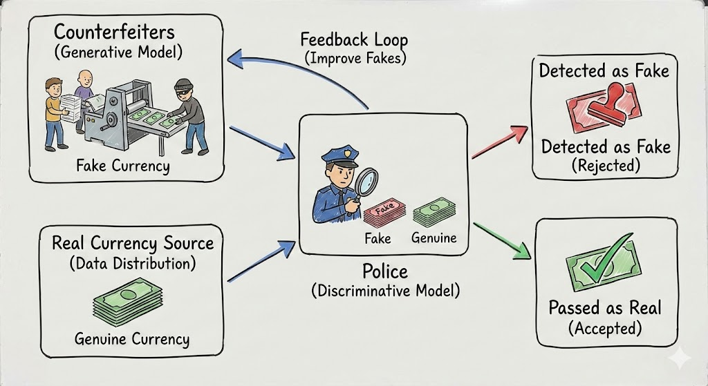
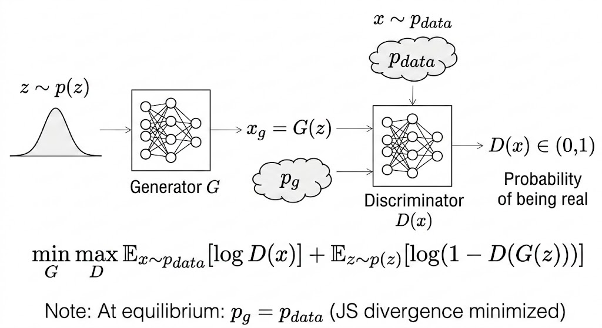

Paper: [Generative Adversarial Nets](https://arxiv.org/abs/1406.2661)

At its core, a GAN is a dynamic minimax game: we train the discriminator $D$ to detect fake samples, and the generator $G$ to deceive $D$. In this adversarial loop, every upgrade in $D$'s scrutiny becomes the training signal that pushes $G$ toward more realistic generation.

# Adversarial Net

## Two Distributions: Real vs. Fake

- $p_{data}(x)$: probability density of sample $x$ from the true data distribution (real).
- $p_g(x)$: probability density of sample $x$ from the generated distribution (fake), induced by $x=G(z), z\sim p_z(z)$.

## Two Players: Discriminator (Police) vs. Generator (Counterfeiters)

- **Discriminator $D$**: tries to distinguish real data from fake data; it should not be fooled by the generator.
- **Generator $G$**: tries to produce fake data realistic enough to fool the discriminator.

# Min-Max Objective

$$
\min_G \max_D V(D,G)
= \mathbb{E}_{x\sim p_{data}}[\log D(x)]
+ \mathbb{E}_{z\sim p_z}[\log(1-D(G(z)))].
$$

## 1. Core variables

- $D(x)$: discriminator confidence that sample $x$ is real, in $[0,1]$.
- $D(G(z))$: discriminator confidence that generated sample $G(z)$ is real, in $[0,1]$.

## 2. Maximize $D$ (discriminator phase)

Given fixed $G$, discriminator updates aim to maximize $V(D,G)$:

- push $D(x)\to 1$ for real samples,
- push $D(G(z))\to 0$ for generated samples.

## 3. Minimize $G$ (generator phase)

Given fixed $D$, generator updates aim to make generated samples look real:

- increase $D(G(z))$ toward $1$,
- make $\log(1-D(G(z)))$ smaller.

This is why the paper writes generator training as a minimization in the minimax objective.

In practice, many implementations use the non-saturating generator loss $-\log D(G(z))$ for stronger gradients early in training.

Training alternates:

1. Update $D$ with real and generated batches.
2. Update $G$ through gradients from $D$.

# Theory

## Global optimality: optimal discriminator for fixed generator

For fixed $G$, the optimal discriminator is

$$
D_G^*(x)=\frac{p_{data}(x)}{p_{data}(x)+p_g(x)}.
$$

Start from

$$
V(D,G)=\int p_{data}(x)\log D(x)\,dx + \int p_g(x)\log(1-D(x))\,dx.
$$

In the original derivation, the second expectation over $z$ is rewritten in $x$-space using the induced model density $p_g(x)$.

For each fixed $x$, maximize

$$
f(y)=a\log y + b\log(1-y), \quad y\in(0,1)
$$

with $a=p_{data}(x), b=p_g(x)$.

$$
f'(y)=\frac{a}{y}-\frac{b}{1-y}=0
\quad\Rightarrow\quad
y^*=\frac{a}{a+b}.
$$

And

$$
f''(y)=-\frac{a}{y^2}-\frac{b}{(1-y)^2}<0,
$$

so this critical point is the maximum. Therefore,

$$
D_G^*(x)=\frac{p_{data}(x)}{p_{data}(x)+p_g(x)}.
$$

Intuition: the optimal discriminator compares relative density proportions.

- If $p_{data}(x)=0.8$ and $p_g(x)=0.8$, then $D_G^*(x)=0.5$.
- If $p_{data}(x)=0.8$ and $p_g(x)=0.2$, then $D_G^*(x)=0.8$.

## $C(G)$ and the global minimum

Define

$$
C(G)=\max_D V(D,G)=V(D_G^*,G).
$$

The GAN paper shows

$$
C(G) = -\log 4 + 2\,\mathrm{JSD}(p_{data}\|p_g),
$$

so the global minimum is reached when

$$
p_g=p_{data},
$$

and then

$$
C(G)=-\log 4,
$$

with optimal discriminator output $D(x)=\tfrac{1}{2}$ everywhere.

In words: when generated and real distributions match exactly, the discriminator cannot do better than random guessing.

The paper's proof perspective is that this objective has a unique minimum at $p_g=p_{data}$, which is the desired target distribution.

# Why This Paper Matters

- It introduced **implicit generative modeling** trained by adversarial feedback.
- It avoided explicit likelihood design for many complex data distributions.
- It established a new line of generative-model research (DCGAN, conditional GANs, Wasserstein GAN, etc.).

---

**Takeaway.** GANs frame generation as a game between a forger and a detector. The detector's improving boundary is exactly the training signal that pushes the generator toward the real data distribution.
