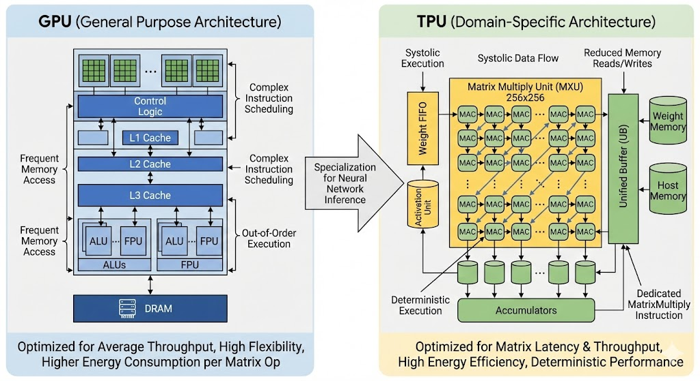
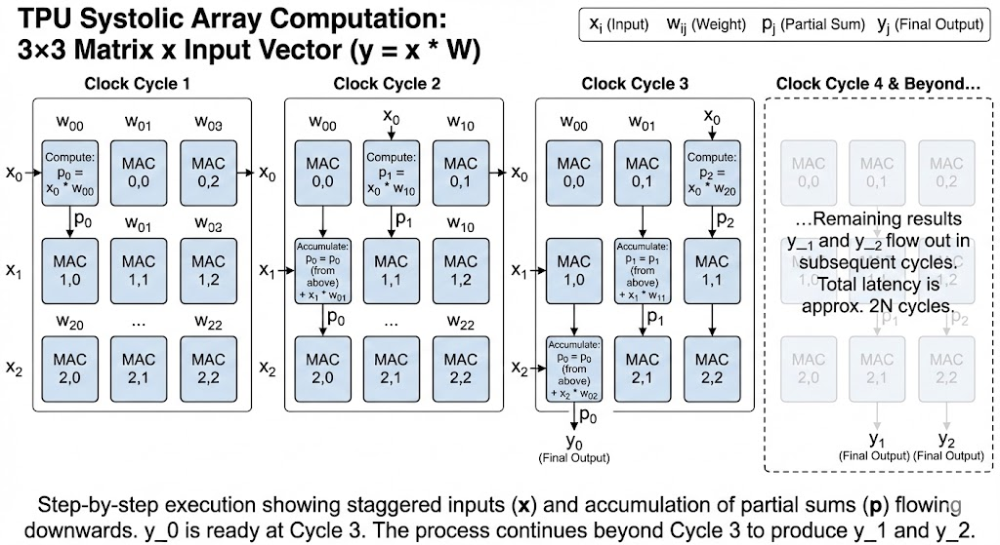

# Source

- Paper: [In-Datacenter Performance Analysis of a Tensor Processing Unit (TPU)](https://arxiv.org/pdf/1704.04760)

# Context

TPU is a domain-specific chip (ASIC), designed for deep learning and matrix computation.

This note is about the **first-generation TPU** (the early TPU era), when mainstream deep learning workloads were mostly CNNs and RNNs, before Transformer and diffusion models became dominant.

I focus only on one part: the **systolic array** in the Matrix Multiply Unit (MMU). This part helps explain why an ASIC can be much faster than a general-purpose processor for a specific workload pattern.

# Neural Networks and GPU

Deep neural networks (DNNs) have driven breakthroughs in NLP, computer vision, speech recognition, and other domains.

GPU became popular for DNN workloads, especially training, for two key reasons:

1. GPU is optimized for floating-point computation more than CPU, and DNN training is heavily floating-point.
2. GPU provides massive parallelism, which naturally fits large-scale matrix operations in neural networks.

# Problem to Resolve

The first-generation TPU outperforms GPUs in inference for two main reasons:

1. **Quantized precision**
- By using **8-bit integer** arithmetic (instead of floating-point), TPU achieves around **6x savings** in both energy and chip area.
- This enables much higher compute density for inference.

2. **Latency-first architecture**
- GPUs usually rely on large batch sizes to reach high throughput.
- Under strict user-facing latency constraints, small batches reduce GPU utilization.
- TPU uses a deterministic execution model (systolic array), which keeps utilization and throughput high even at very low latency.

# TPU Architecture

## MMU

The Matrix Multiply Unit (MMU) is the core of TPU. It is specifically designed to execute MAC operations:

$$
a \times b + c
$$

at very large scale.

The MMU contains **65,536 (256 x 256)** MAC units. Each unit can perform one 8-bit integer MAC operation per clock cycle.

In the feed-forward pass, each neural-network layer performs matrix-vector multiplication: the previous layer output (m elements) multiplies a weight matrix of shape $(m \times n)$ to produce the next output (n elements).

In traditional CPU/GPU execution, these multiplications and additions are handled through multiple instruction stages, with frequent reads/writes of intermediate values.

In contrast, TPU uses a **systolic array** that fuses multiplication and accumulation into continuous dataflow, reducing memory traffic, control overhead, energy, and latency.

## Example

Assume a $3 \times 3$ weight matrix $W$ is preloaded in the systolic array, and the input vector

$$
x = [x_0, x_1, x_2]
$$

flows from the left.

Matrix layout (weights are stationary):

$$
\begin{bmatrix}
w_{00} & w_{01} & w_{02} \\
 w_{10} & w_{11} & w_{12} \\
 w_{20} & w_{21} & w_{22}
\end{bmatrix}
$$

Here $w_{ij}$ is the weight connecting input index $i$ to output index $j$.

Goal:

$$
y = x \cdot W
$$

Step-by-step execution:

Clock cycle 1:
- $x_0$ enters MAC(0,0).
- Compute: partial sum $p_0 = x_0 w_{00} + 0$.
- Flow: $p_0$ moves down; $x_0$ moves right.
- $x_1$ and $x_2$ are staggered and wait outside.

Clock cycle 2:
- $x_0$ moves to MAC(0,1), generating $p_1 = x_0 w_{01} + 0$.
- $x_1$ enters MAC(1,0).
- MAC(1,0) receives $p_0$ from above and updates:

$$
p_0 \leftarrow p_0 + x_1 w_{10}
$$

- Updated $p_0$ moves down; $p_1$ also moves down.

Clock cycle 3:
- $x_0$ moves to MAC(0,2), generating $p_2 = x_0 w_{02} + 0$.
- $x_1$ moves to MAC(1,1), updating:

$$
p_1 \leftarrow p_1 + x_1 w_{11}
$$

- $x_2$ enters MAC(2,0).
- MAC(2,0) receives $p_0$ from above and updates:

$$
p_0 \leftarrow p_0 + x_2 w_{20}
$$

- The first output $y_0$ (final $p_0$) is now ready at the bottom of column 0.

Subsequent cycles:
- Remaining outputs $y_1, y_2$ flow out from the bottoms of columns 1 and 2.

# Key Observations

1. **Staggered input wavefront**
- At each cycle, each $x_i$ meets the right partial sums at the right MAC positions.
- This synchronization is why accumulation can happen without global control complexity.

2. **Latency vs throughput**
- For an $N \times N$ array, total latency to get the last output is about $2N$ cycles (fill + drain).
- Once the pipeline is full, throughput is high and regular.

3. **Efficiency compared with GPU-style execution**
- TPU avoids repeatedly writing/reading intermediate partial sums to/from memory.
- Data moves locally from one MAC to the next, reducing memory bandwidth pressure and energy use.

# Why this matters to me

My main takeaway is not only "TPU is faster," but *why* it is faster:

- General-purpose processors must support broad workloads and complex control paths.
- A domain-specific ASIC can hardwire the dominant pattern (matrix MAC dataflow).
- That specialization removes unnecessary movement/scheduling overhead and can deliver large gains in speed and efficiency for stable workload structures.
