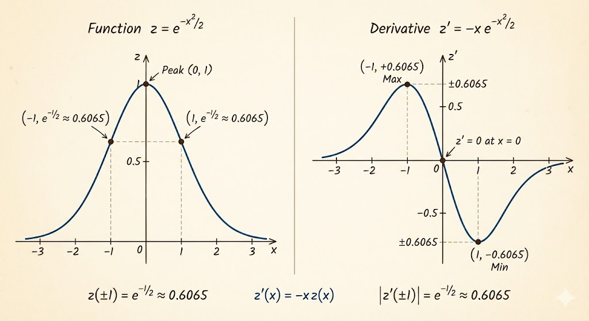
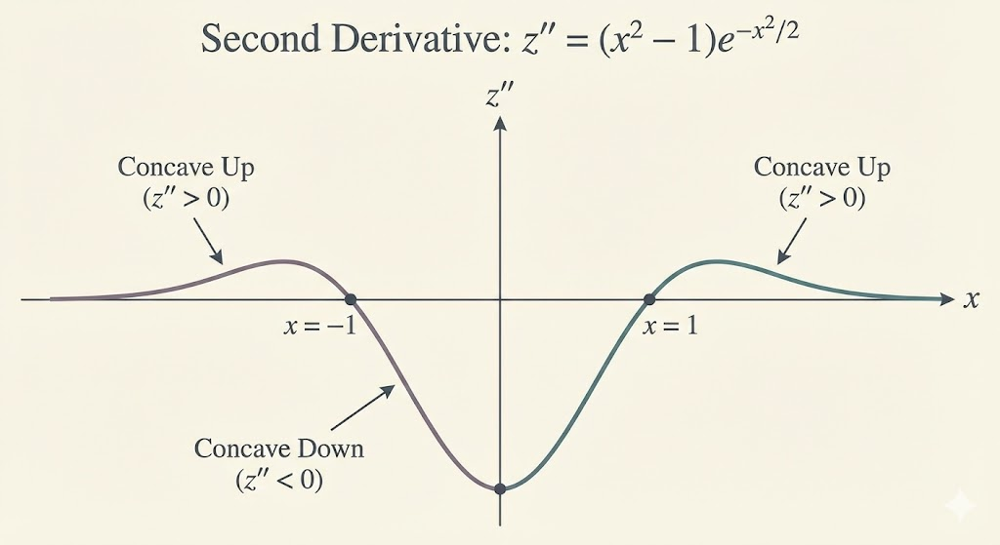



# Chain Function

A chain (composite) function has the form
$$
f(g(x)).
$$

# Chain Rule

If
$$
z=f(y),\quad y=g(x),
$$
then
$$
\frac{dz}{dx}=\frac{dz}{dy}\frac{dy}{dx}.
$$

## Examples

For
$$
f(x)=\sin(3x):
$$

- $z=\sin y$
- $y=3x$

$$
\frac{dz}{dy}=\cos y,\qquad
\frac{dy}{dx}=3,
$$
so
$$
\frac{dz}{dx}=3\cos y=3\cos(3x).
$$

For
$$
f(x)=(x^3)^2:
$$

- $z=y^2$
- $y=x^3$

$$
\frac{dz}{dy}=2y,\qquad
\frac{dy}{dx}=3x^2,
$$
therefore
$$
\frac{dz}{dx}=\frac{dz}{dy}\frac{dy}{dx}=2y\cdot 3x^2=6x^5.
$$

Another example:
$$
f(x)=\frac{1}{\sqrt{1-x^2}}=(1-x^2)^{-1/2}.
$$

- $z=y^{-1/2}$
- $y=1-x^2$

$$
\frac{dz}{dy}=-\frac{1}{2}y^{-3/2},\qquad
\frac{dy}{dx}=-2x,
$$
so
$$
\frac{dz}{dx}=\left(-\frac{1}{2}y^{-3/2}\right)(-2x)=x(1-x^2)^{-3/2}.
$$

# Why the Chain Rule works

Write the overall rate with an intermediate step:
$$
\frac{\Delta z}{\Delta x}=\frac{\Delta z}{\Delta y}\cdot\frac{\Delta y}{\Delta x}.
$$

This is exactly the "break-down" idea: a nested function changes in two stages, and total sensitivity is the product of stage sensitivities.

As $\Delta x\to 0$, these difference quotients become derivatives:
$$
\frac{dz}{dx}=\frac{dz}{dy}\frac{dy}{dx}.
$$

# Chained Exponential Function

Take
$$
f(x)=e^{-x^2/2}.
$$
Set
- $y=-\frac{x^2}{2}$
- $z=e^y$

Then
$$
\frac{dz}{dy}=e^y,\qquad
\frac{dy}{dx}=-x,
$$
so
$$
\frac{dz}{dx}=e^y(-x)=-x e^{-x^2/2}.
$$

As the bell-shaped curve rises to its peak and then decays, the slope moves from positive to zero (at the top) and then negative.

Why are the maximum and minimum of $z'(x)$ at $x=1$ and $x=-1$? Because $z''(x)=0$ at these two points.

Now compute the second derivative:
$$
\frac{dz}{dx}=-x e^{-x^2/2}.
$$
Use product rule with
- $a(x)=-x$
- $b(x)=e^{-x^2/2}$

Then
$$
a'(x)=-1,\qquad b'(x)=-x e^{-x^2/2},
$$
and
$$
\frac{d^2z}{dx^2}=a(x)b'(x)+a'(x)b(x)
= (-x)(-x e^{-x^2/2})+(-1)e^{-x^2/2}
= (x^2-1)e^{-x^2/2}.
$$

The second derivative explains where curvature changes: central concave-down behavior with concave-up behavior in outer regions.

---

**Takeaway.** Chain rule decomposes complicated derivatives into a sequence of simpler derivatives. Combined with product rule, it gives clean first- and second-derivative formulas for important functions like the Gaussian shape $e^{-x^2/2}$.
