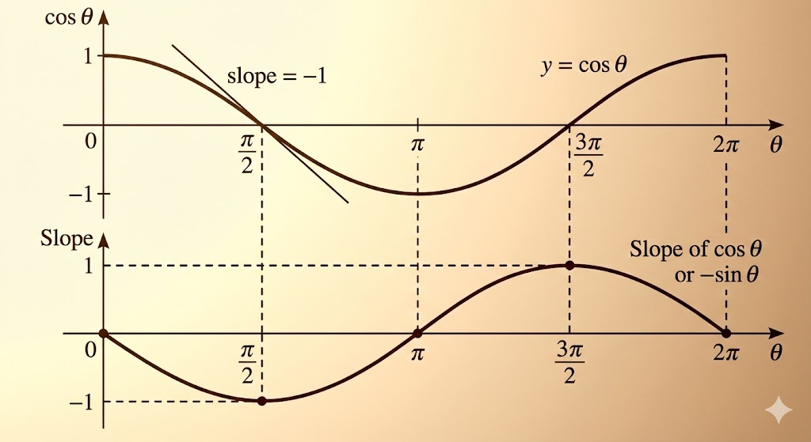
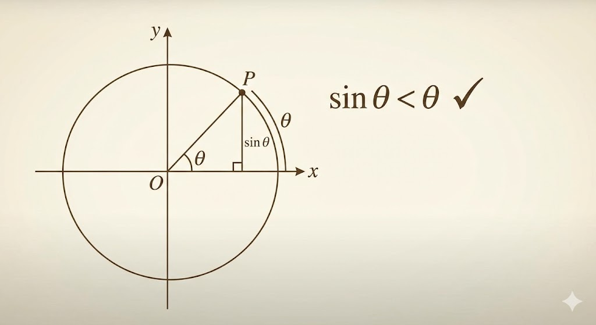
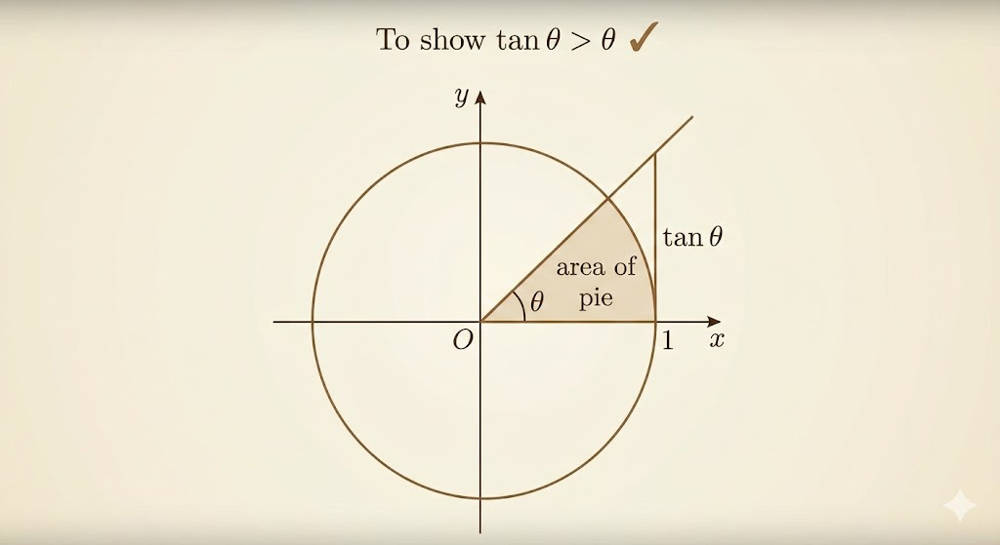

# Goal

We want to prove:

- $\frac{d}{dx}(\sin x)=\cos x$
- $\frac{d}{dx}(\cos x)=-\sin x$

These formulas are true when angles are measured in **radians**.

# Three facts we use

1. Pythagorean identity:
$$
\sin^2\theta+\cos^2\theta=1.
$$

2. Angle addition for sine:
$$
\sin(x+h)=\sin x\cos h+\cos x\sin h.
$$

3. Angle addition for cosine:
$$
\cos(x+h)=\cos x\cos h-\sin x\sin h.
$$

# Circular motion picture

On the unit circle, the point at angle $t$ is
$$
(\cos t,\sin t).
$$
So proving derivatives of $\sin t$ and $\cos t$ is equivalent to understanding velocity components in circular motion.

# Why radians matter

$$
2\pi\ \text{radians}=360^\circ.
$$

Only in radian measure do we get the clean limit
$$
\lim_{h\to 0}\frac{\sin h}{h}=1,
$$
which drives both derivative proofs.

# Geometric inequalities

Two properties we need are:

- $\sin\theta<\theta$ for $\theta>0$
- $\tan\theta>\theta$ for $0<\theta<\frac\pi2$

For $\sin\theta<\theta$: in the unit circle, the chord subtended by angle $\theta$ is shorter than the arc, and that arc length is exactly $\theta$ (in radians). The vertical leg of the inscribed right triangle has length $\sin\theta$, and this leg is shorter than the chord. Therefore
$$
\sin\theta < \text{chord} < \theta.
$$
So $\sin\theta<\theta$.

For $\tan\theta>\theta$: compare areas. The sector area is
$$
A_{\text{sector}}=\frac12\theta
$$
on the unit circle, while the outer right triangle formed by the radius and tangent line has area
$$
A_{\triangle}=\frac12\tan\theta.
$$
Because the sector lies strictly inside that tangent triangle,
$$
\frac12\theta<\frac12\tan\theta
\;\Rightarrow\;\theta<\tan\theta.
$$

From $\theta<\tan\theta=\frac{\sin\theta}{\cos\theta}$, we get
$$
\cos\theta<\frac{\sin\theta}{\theta}<1.
$$
By squeeze theorem,
$$
\lim_{\theta\to 0}\frac{\sin\theta}{\theta}=1.
$$

# The missing limit: (cos h - 1)/h -> 0

Yes, this part should be proved explicitly.

Use
$$
\cos h-1=-2\sin^2\left(\frac h2\right).
$$
Then
$$
\frac{\cos h-1}{h}
=-\sin\left(\frac h2\right)\cdot
\frac{\sin(h/2)}{h/2}.
$$
As $h\to 0$,
$$
\sin\left(\frac h2\right)\to 0,
\qquad
\frac{\sin(h/2)}{h/2}\to 1,
$$
so
$$
\lim_{h\to 0}\frac{\cos h-1}{h}=0.
$$

# Prove d(sin x)/dx = cos x

Using angle addition:
$$
\frac{\sin(x+h)-\sin x}{h}
=\frac{\sin x(\cos h-1)+\cos x\sin h}{h}
=\sin x\frac{\cos h-1}{h}+\cos x\frac{\sin h}{h}.
$$
Take $h\to 0$:
$$
\frac{d}{dx}(\sin x)
=\sin x\cdot 0+\cos x\cdot 1
=\cos x.
$$

# Prove d(cos x)/dx = -sin x

Again from angle addition:
$$
\frac{\cos(x+h)-\cos x}{h}
=\frac{\cos x(\cos h-1)-\sin x\sin h}{h}
=\cos x\frac{\cos h-1}{h}-\sin x\frac{\sin h}{h}.
$$
Take $h\to 0$:
$$
\frac{d}{dx}(\cos x)
=\cos x\cdot 0-\sin x\cdot 1
=-\sin x.
$$

---

**Takeaway.** The two derivative formulas rest on two core limits,
$\lim_{h\to 0}\frac{\sin h}{h}=1$ and $\lim_{h\to 0}\frac{\cos h-1}{h}=0$,
which come from unit-circle geometry and radian measure.
