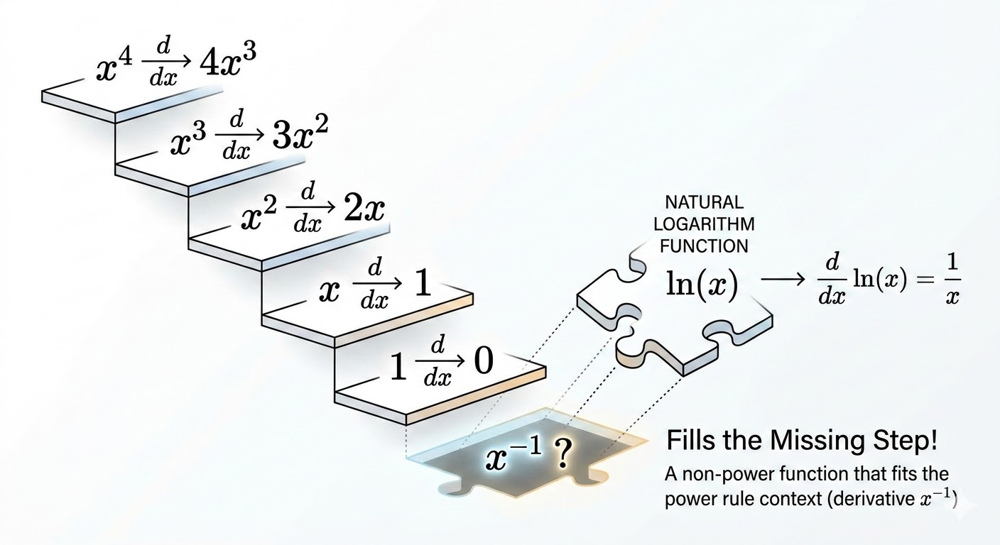



Inverse functions let us turn a known derivative into a new one by reversing the map. This note uses that idea twice: first for the logarithm as the inverse of the exponential, then for arcsine as the inverse of sine.

## Inverse Functions

An inverse function undoes the effect of another function.

If

$$
y = f(x),
$$

then the inverse function sends $y$ back to $x$:

$$
x = f^{-1}(y).
$$

The two identities are

$$
f^{-1}(f(x)) = x, \qquad f(f^{-1}(y)) = y.
$$

### Example: A Linear Function

Start with

$$
f(x) = ax + b.
$$

To find the inverse, solve for $x$ in terms of $y$:

$$
y = ax + b
$$

$$
y - b = ax
$$

$$
x = \frac{y-b}{a}.
$$

So the inverse function is

$$
f^{-1}(y) = \frac{y-b}{a}.
$$

## Derivative of $\ln y$

The logarithm is the inverse of the exponential function. If

$$
y = e^x,
$$

then

$$
x = \ln y.
$$

Differentiate $y=e^x$ with respect to $x$:

$$
\frac{dy}{dx} = e^x = y.
$$

Now invert the derivative:

$$
\frac{dx}{dy} = \frac{1}{dy/dx} = \frac{1}{y}.
$$

Since $x = \ln y$, this gives

$$
\frac{d}{dy}(\ln y) = \frac{1}{y}, \qquad y>0.
$$

## The Missing Power

The power rule says

$$
\frac{d}{dy}(y^n) = ny^{n-1}.
$$

Examples:

- $\frac{d}{dy}(y^3) = 3y^2$
- $\frac{d}{dy}(y^2) = 2y$
- $\frac{d}{dy}(y) = 1$

Each derivative lowers the exponent by one. But when $n=0$, the chain breaks:

$$
\frac{d}{dy}(y^0) = \frac{d}{dy}(1) = 0.
$$

So the derivative never naturally produces the power $y^{-1}$.

That missing derivative is supplied by the logarithm:

$$
\frac{d}{dy}(\ln y) = \frac{1}{y}.
$$

This is one of the beautiful pattern-completion moments in calculus: logarithms fill the gap left by the power rule.

## Derivative of $\arcsin(y)$

Start with the inverse-sine definition:

$$
x = \sin^{-1}(y) = \arcsin(y).
$$

That means

$$
y = \sin x.
$$

Differentiate both sides with respect to $y$:

$$
\frac{d}{dy}(y) = \frac{d}{dy}(\sin x).
$$

The left side is $1$. The right side uses the chain rule:

$$
1 = \cos x \cdot \frac{dx}{dy}.
$$

So

$$
\frac{dx}{dy} = \frac{1}{\cos x}.
$$

We still need to rewrite the answer in terms of $y$ instead of $x$. Since $y = \sin x$, draw a right triangle with

- hypotenuse $=1$
- opposite side $=y$

Then the adjacent side is

$$
\sqrt{1-y^2},
$$

so

$$
\cos x = \frac{\sqrt{1-y^2}}{1} = \sqrt{1-y^2}.
$$

Substitute back:

$$
\frac{dx}{dy} = \frac{1}{\sqrt{1-y^2}}.
$$

Since $x=\arcsin(y)$,

$$
\frac{d}{dy}(\arcsin y) = \frac{1}{\sqrt{1-y^2}}, \qquad |y|<1.
$$

The derivative blows up at $y=\pm 1$, which is why the formula is stated on the open interval $(-1,1)$.

## Takeaways

- Inverse functions let us derive new formulas by reversing known ones.
- The logarithm is the inverse of the exponential, which gives $\frac{d}{dy}(\ln y)=\frac{1}{y}$.
- The logarithm fills the missing $y^{-1}$ slot in the power-rule pattern.
- Arcsine is the inverse of sine, and its derivative comes from chain rule plus the right-triangle identity.

*Source: Gilbert Strang's Calculus lecture on derivatives of $\ln y$ and $\sin^{-1}(y)$.*
