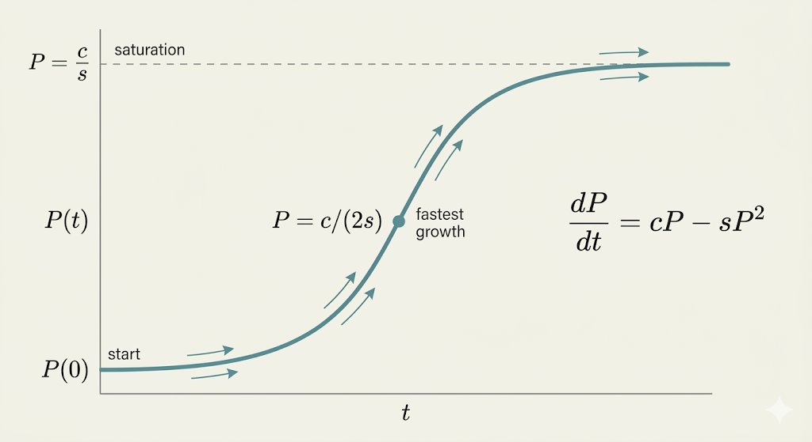

<iframe width="100%" height="480" src="https://www.youtube.com/embed/IDo4uPyqQbQ" title="Differential Equations of Growth" frameborder="0" allowfullscreen></iframe>

This lecture starts from the simplest growth law and then adds more realistic effects:

- pure exponential growth
- constant source terms
- logistic saturation
- predator-prey interaction

## Basic Exponential Growth

The simplest growth model is

$$
\frac{dy}{dt} = cy
$$

The growth rate is proportional to the current amount $y$.

With initial value

$$
y(0) = y_0
$$

the solution is

$$
y(t) = y_0 e^{ct}
$$

because

$$
\frac{d}{dt}(y_0 e^{ct}) = c y_0 e^{ct} = c y(t)
$$

So:

- if $c>0$, the quantity grows exponentially
- if $c<0$, the quantity decays exponentially

## Adding a Constant Source

Now include a source term:

$$
\frac{dy}{dt} = cy + s
$$

This is a linear differential equation. Its solution can be written as

$$
y(t) = y_{\text{particular}}(t) + y_{\text{homogeneous}}(t)
$$

### Particular Solution

Try a constant solution. Then $dy/dt = 0$, so

$$
0 = cy + s
\qquad \Rightarrow \qquad
y = -\frac{s}{c}
$$

So one particular solution is

$$
y_{\text{particular}} = -\frac{s}{c}
$$

### Homogeneous Solution

The associated homogeneous equation is

$$
\frac{dy}{dt} = cy
$$

with solution

$$
Ae^{ct}
$$

Therefore the full solution is

$$
y(t) = -\frac{s}{c} + Ae^{ct}
$$

Using $y(0)=y_0$ gives

$$
A = y_0 + \frac{s}{c}
$$

so

$$
y(t) + \frac{s}{c}
=
\left(y_0 + \frac{s}{c}\right)e^{ct}
$$

## Logistic Population Growth

Pure exponential growth cannot continue forever. A common correction is the logistic equation:

$$
\frac{dP}{dt} = cP - sP^2
$$

where

- $c$ is the net growth rate
- $s$ is the slowdown factor from competition

This can also be written as

$$
\frac{dP}{dt} = P(c-sP)
$$

### Early Stage

When $P$ is small, the term $sP^2$ is negligible, so the model behaves almost like

$$
\frac{dP}{dt} \approx cP
$$

which is exponential growth.

### Carrying Capacity

At equilibrium,

$$
\frac{dP}{dt}=0
$$

so

$$
cP - sP^2 = 0
\qquad \Rightarrow \qquad
P = 0
\quad \text{or} \quad
P = \frac{c}{s}
$$

The positive steady state

$$
P = \frac{c}{s}
$$

is the carrying capacity.

### Inflection Point

The logistic curve grows fastest halfway to the carrying capacity:

$$
P = \frac{c}{2s}
$$

That is where the graph changes from bending upward to bending downward.

## Solving the Logistic Equation by Letting $y = 1/P$

Let

$$
y = \frac{1}{P}
$$

Then by the chain rule,

$$
\frac{dy}{dt}
=
\frac{d}{dt}\left(\frac{1}{P}\right)
=
-\frac{1}{P^2}\frac{dP}{dt}
$$

Substitute the logistic equation:

$$
\frac{dy}{dt}
=
-\frac{1}{P^2}(cP - sP^2)
=
s - c\frac{1}{P}
=
s - cy
$$

So $y$ satisfies the linear equation

$$
\frac{dy}{dt} = s - cy
$$

whose solution is

$$
y(t) - \frac{s}{c}
=
\left(y(0) - \frac{s}{c}\right)e^{-ct}
$$

Since $y=1/P$, this becomes

$$
\frac{1}{P(t)} - \frac{s}{c}
=
\left(\frac{1}{P(0)} - \frac{s}{c}\right)e^{-ct}
$$

This is the logistic solution in reciprocal form.

## Predator-Prey Model

The lecture ends by moving from one population to two interacting populations.

Let

- $u$ = predator population
- $v$ = prey population

One standard model is

$$
\frac{du}{dt} = -cu + kuv
$$

$$
\frac{dv}{dt} = Cv - suv
$$

Interpretation:

- predators die out without prey because of the term $-cu$
- predators grow when predator-prey encounters happen, through $kuv$
- prey grows naturally through $Cv$
- prey decreases through predation, modeled by $-suv$

Unlike the logistic equation, which approaches a steady ceiling, the predator-prey system often produces oscillation:

- prey increases first
- predators then increase because food is abundant
- prey falls as predation rises
- predators then fall because food becomes scarce

and the cycle can repeat.

## Takeaways

- $\frac{dy}{dt}=cy$ gives pure exponential growth or decay.
- Adding a source term still leaves a linear ODE with a particular-plus-homogeneous structure.
- The logistic equation adds self-limiting competition and produces an S-curve.
- The substitution $y=1/P$ turns the logistic equation into a linear equation.
- Coupling two growth equations leads naturally to predator-prey oscillations.
