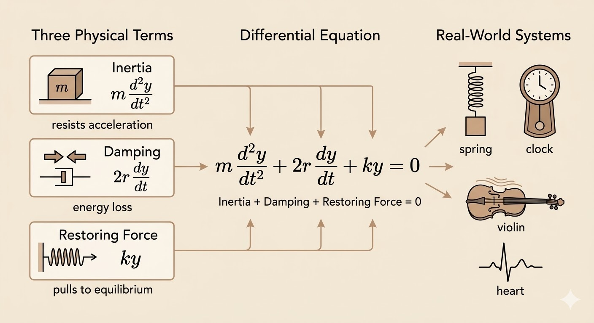

<iframe width="100%" height="480" src="https://www.youtube.com/embed/4PBYm3FuUNQ" title="Differential Equations of Motion" frameborder="0" allowfullscreen></iframe>

The standard differential equation for damped motion is

$$
m\frac{d^2y}{dt^2} + 2r\frac{dy}{dt} + ky = 0
$$

It is a linear second-order ODE with constant coefficients, and each term has a direct physical meaning.

## The Standard Equation

$$
m\frac{d^2y}{dt^2} + 2r\frac{dy}{dt} + ky = 0
$$

1. Inertia term: $m y''$
   - The second derivative is acceleration.
   - This is the mass resisting changes in motion.
2. Damping term: $2r y'$
   - The first derivative is velocity.
   - This is friction or drag removing energy from the system.
3. Restoring term: $k y$
   - The function itself is displacement from equilibrium.
   - This is the spring pulling the mass back toward the center.

| Term | Mathematical Derivative | Physical Component | Key Driver |
|---|---|---|---|
| Inertia | $y''$ (Acceleration) | Mass $m$ | Change in motion |
| Damping | $y'$ (Velocity) | Friction $r$ | Speed of motion |
| Restoring | $y$ (Position) | Spring $k$ | Distance from center |

## Three Simple Starting Points

These special cases make the full equation easier to interpret.

### No mass: $m=0$

The equation becomes

$$
2r y' + ky = 0
$$

so

$$
y' = -\frac{k}{2r}y
$$

and the solution is exponential decay:

$$
y(t) = Ce^{-\frac{k}{2r}t}
$$

This is the pure damping case. Without inertia, the system just relaxes back toward equilibrium.

### No damping: $r=0$

The equation becomes

$$
m y'' + ky = 0
$$

or

$$
y'' + \omega^2 y = 0, \qquad \omega^2 = \frac{k}{m}
$$

This is the undamped oscillation case, with solution

$$
y(t) = C\cos(\omega t) + D\sin(\omega t)
$$

The motion is periodic, so sine and cosine appear naturally.

### No acceleration: $y''=0$

If the second derivative is zero, the function must be linear:

$$
y(t) = C + Dt
$$

## Oscillation

Oscillation appears in many systems:

- springs
- clocks
- music
- heartbeat

The trigonometric solutions in the undamped case are what generate this periodic behavior.

## Characteristic Equation and Exponential Solutions

Start from

$$
m y'' + 2r y' + ky = 0
$$

and try an exponential solution

$$
y = e^{\lambda t}
$$

Then

- $y' = \lambda e^{\lambda t}$
- $y'' = \lambda^2 e^{\lambda t}$

Substituting gives

$$
m\lambda^2 e^{\lambda t} + 2r\lambda e^{\lambda t} + k e^{\lambda t} = 0
$$

Since $e^{\lambda t}\neq 0$, this reduces to the characteristic equation

$$
m\lambda^2 + 2r\lambda + k = 0
$$

with roots

$$
\lambda = \frac{-r \pm \sqrt{r^2-km}}{m}
$$

So the entire behavior of the motion is controlled by the discriminant $r^2-km$.

## Three Root Cases

### Overdamped: two distinct real roots

If

$$
r^2-km > 0
$$

then the two roots are real and distinct, and the solution is

$$
y(t) = C e^{\lambda_1 t} + D e^{\lambda_2 t}
$$

#### Example 1

$$
y'' + 6y' + 8y = 0
$$

Here

- $m=1$
- $r=3$
- $k=8$

so the roots are

$$
\lambda = -2,\,-4
$$

and the solution is

$$
y(t) = C e^{-2t} + D e^{-4t}
$$

### Underdamped: complex roots

If

$$
r^2-km < 0
$$

then the roots are complex:

$$
\lambda = \alpha \pm i\beta
$$

and the real solution can be written as

$$
y(t) = e^{\alpha t}(A\cos \beta t + B\sin \beta t)
$$

This is the case where oscillation appears together with exponential decay.

#### Example 2

$$
y'' + 6y' + 10y = 0
$$

Here

- $m=1$
- $r=3$
- $k=10$

so

$$
\lambda = -3 \pm i
$$

and the solution is

$$
y(t) = e^{-3t}(A\cos t + B\sin t)
$$

The sine and cosine terms create oscillation, while the factor $e^{-3t}$ makes the amplitude shrink over time.

### Critical damping: repeated root

If

$$
r^2-km = 0
$$

then there is a repeated root

$$
\lambda = -\frac{r}{m}
$$

and the second independent solution needs an extra factor of $t$:

$$
y(t) = (C + Dt)e^{\lambda t}
$$

#### Example 3

$$
y'' + 6y' + 9y = 0
$$

The repeated root is

$$
\lambda = -3
$$

so the solution is

$$
y(t) = (C + Dt)e^{-3t}
$$

This is the critical damping case: the system returns to equilibrium as fast as possible without oscillating.

## Takeaways

- $m y'' + 2r y' + ky = 0$ is the standard model for damped motion.
- The three terms correspond to inertia, damping, and restoring force.
- Exponential trial solutions reduce the ODE to a quadratic characteristic equation.
- The sign of $r^2-km$ separates the motion into overdamped, underdamped, and critically damped behavior.
