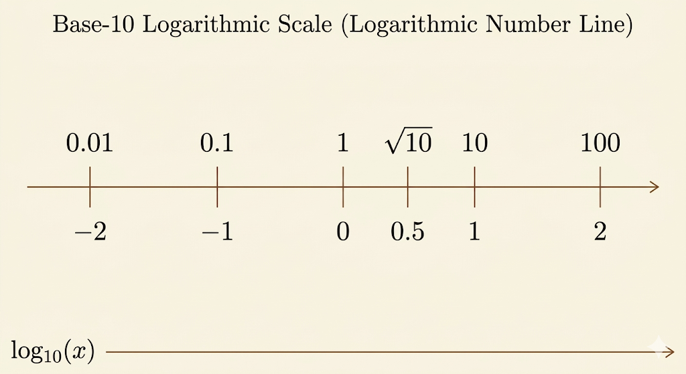
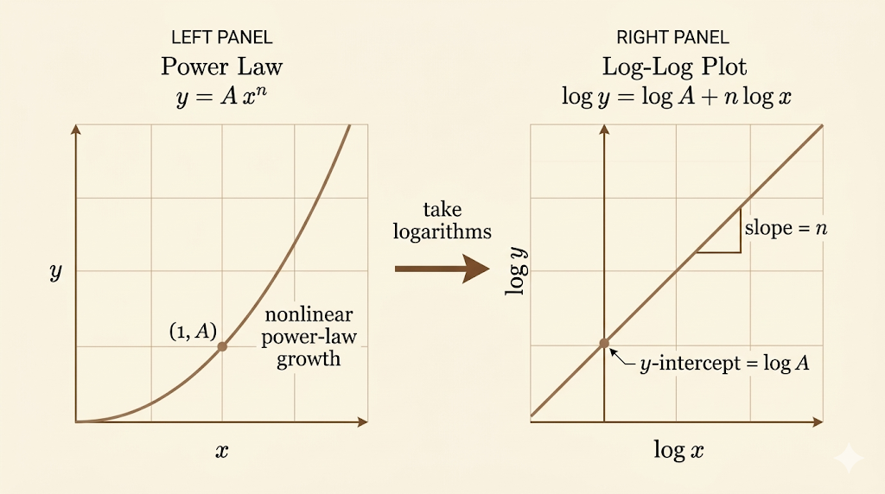

<iframe width="100%" height="500" src="https://www.youtube.com/embed/WU1m2QQrlho" title="Gilbert Strang's Calculus: Growth Rates and Log Graphs" frameborder="0" allow="accelerometer; autoplay; clipboard-write; encrypted-media; gyroscope; picture-in-picture; web-share" allowfullscreen></iframe>

This lecture is about how to compare functions that grow at radically different speeds. Ordinary plots quickly become misleading because the fastest functions dominate the scale. Logarithms fix that by compressing huge ranges into something we can actually read.

## Growth Hierarchy

Professor Strang compares several common growth families:

- linear: $cn$
- polynomial: $n^2$, $n^3$
- exponential: $2^n$, $e^n$
- factorial: $n!$, and even faster expressions like $n^n$

The long-run hierarchy is

$$
\log n \ll n \ll n^2 \ll 2^n \ll n! \ll n^n.
$$

As $n$ becomes large, the gap between these families becomes enormous.

## A Natural Scale

Using the same input value makes the contrast concrete. At $n=10$:

- $10 = 10$
- $10^2 = 100$
- $10^3 = 1000$
- $2^{10} = 1024$
- $10! = 3,\!628,\!800$

Even at this small scale, factorial growth has already separated itself from the rest.

## Comparing Values at n = 1000

At $n=1000$, direct comparison becomes hard because the numbers live on completely different scales. Taking base-10 logarithms makes the comparison readable.

| Function | Value at $n=1000$ | $\log_{10}(\text{value})$ |
| --- | --- | --- |
| $n$ | $1000$ | $3$ |
| $n^2$ | $1,\!000,\!000$ | $6$ |
| $2^n$ | $\approx 10^{300}$ | $\approx 300$ |
| $n!$ | $\approx 10^{2566}$ | $\approx 2566$ |
| $n^n$ | $\approx 10^{3000}$ | $\approx 3000$ |

This is the practical point of logarithms: they compress multiplicative gaps into additive ones.

## Decay Rates

The same comparison idea works for functions that go to zero:

$$
\frac{1}{x},\quad \frac{1}{x^2},\quad \frac{1}{x^3},\quad \frac{1}{10^x},\dots
$$

All of them approach zero, but not equally fast. Exponential decay beats polynomial decay:

$$
\frac{1}{10^x} \ll \frac{1}{x^3} \ll \frac{1}{x^2} \ll \frac{1}{x}.
$$

## Log Scale

On a logarithmic axis, equal distances represent multiplication by a constant factor rather than equal addition. On a base-10 log scale,

$$
1,\ 10,\ 100,\ 1000,\ 10000
$$

are equally spaced. Numbers below $1$ have negative logarithms:

$$
\log_{10}(0.1)=-1,\quad \log_{10}(0.01)=-2,\quad \log_{10}(0.001)=-3.
$$

This is why log plots are so useful for visualizing phenomena that span many orders of magnitude.

Multiplying a number by $10$ moves one unit to the right on the axis, while dividing by $10$ moves one unit to the left.

## Log-Log Scale and Power Laws

A power law has the form

$$
y = A x^n.
$$

On an ordinary graph this is curved, and when the values change quickly the graph becomes hard to read. A log-log scale helps because it turns multiplicative growth into a linear pattern. Taking logarithms linearizes the power law:

$$
\log y = \log A + n \log x.
$$

That means a log-log plot turns a power law into a straight line:

- slope = $n$
- intercept = $\log A$

This is one of the main reasons log-log plots appear so often in science and numerical analysis.

## Estimating Derivative Errors with Log-Log Graphs

Numerical differentiation introduces error because we approximate an instantaneous slope with a finite step size $\Delta x$.

$$
E = \left| \frac{df}{dx} - \frac{\Delta f}{\Delta x} \right| \approx A(\Delta x)^n.
$$

The exponent $n$ is the order of accuracy.

Two standard examples:

- Forward difference:
  $$
  \frac{f(x+\Delta x)-f(x)}{\Delta x}
  $$
  has $n=1$.
- Centered difference:
  $$
  \frac{f(x+\Delta x)-f(x-\Delta x)}{2\Delta x}
  $$
  has $n=2$.

So if $\Delta x$ shrinks by a factor of $10$:

- first-order error shrinks by $10$
- second-order error shrinks by $100$

Taking logs reveals the exponent directly:

$$
\log E \approx \log A + n \log(\Delta x).
$$

So a log-log plot of error versus step size has:

- x-axis: $\log(\Delta x)$
- y-axis: $\log(E)$
- slope: $n$
- intercept: $\log A$

That is the core idea: logarithms turn invisible small-scale behavior into a straight-line diagnostic.

*Source: Gilbert Strang's Calculus lectures.*
