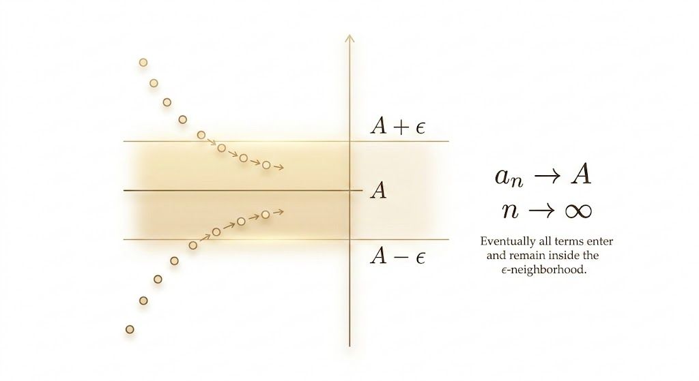
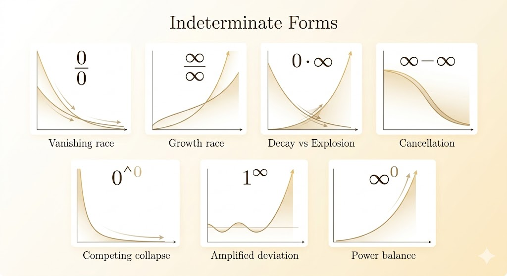
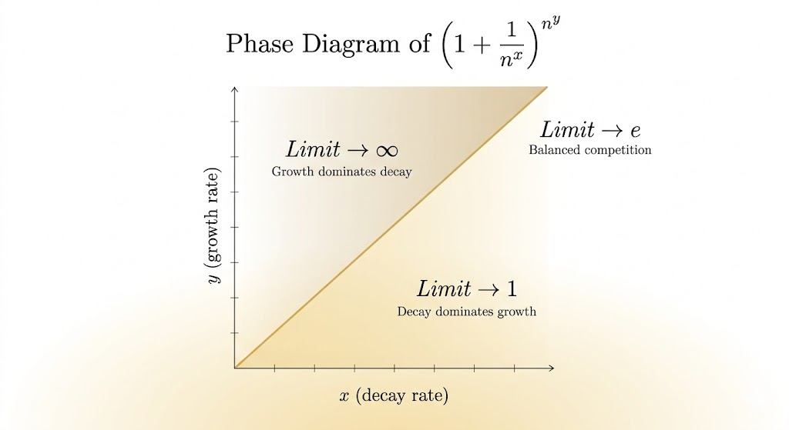
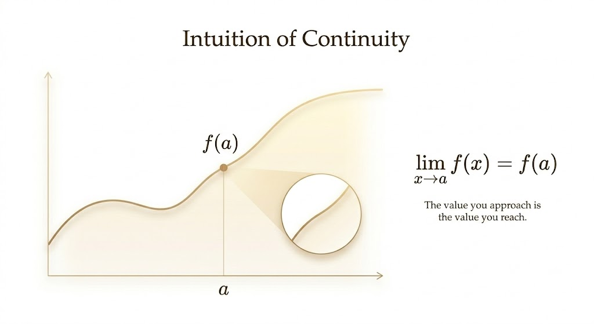
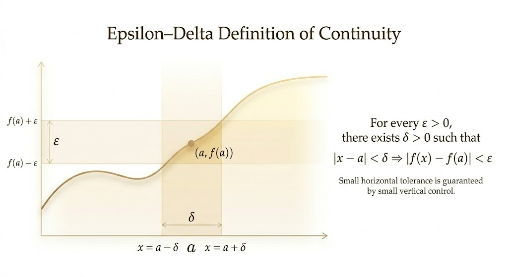
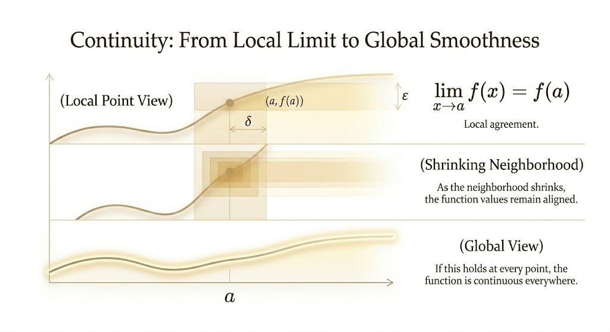



# Limit Definition

Limits are intuitive ("approach a value"), but calculus needs a strict definition.

For a sequence $a_n$, write
$$
\lim_{n\to\infty} a_n = A
$$
if for every $\epsilon>0$, there exists an integer $N$ such that for all $n>N$,
$$
|a_n-A|<\epsilon.
$$

This is the $\epsilon$-$N$ definition: eventually, all terms stay within any target tolerance around $A$.

# Properties of Limit

If $\lim_{n\to\infty} a_n=A$ and $\lim_{n\to\infty} b_n=B$, then:

- $a_n \pm b_n \to A \pm B$
- $a_n b_n \to AB$
- $a_n / b_n \to A/B$ when $B\neq 0$
- $(a_n)^{b_n} \to A^B$ in regular cases

## Dangerous!

For these properties, special endpoint cases become indeterminate forms:

- In subtraction, if both limits are $\infty$, then $\infty-\infty$ is indeterminate.
- In multiplication, if limits are $0$ and $\infty$, then $0\cdot\infty$ is indeterminate.
- In division:
  - if both limits are $0$, then $0/0$ is indeterminate.
  - if both limits are $\infty$, then $\infty/\infty$ is indeterminate.
- In powers:
  - if base and exponent limits are both $0$, then $0^0$ is indeterminate.
  - if base tends to $1$ and exponent tends to $\infty$, then $1^\infty$ is indeterminate.
  - if base tends to $\infty$ and exponent tends to $0$, then $\infty^0$ is indeterminate.

Here are the 7 indeterminate forms (grouped as in your note):

- **Quotients (Fractions)**
  - $0/0$ (Numerator pulls to 0; Denominator pulls to $\infty$)
  - $\infty/\infty$ (Numerator pulls to $\infty$; Denominator pulls to 0)
- **Products (Multiplication)**
  - $0\cdot\infty$ (One factor pulls to 0; the other pulls to $\infty$)
- **Differences (Subtraction)**
  - $\infty-\infty$ (Both terms pull the result in opposite directions)
- **Exponents (Powers)**
  - $0^0$ (Base pulls to 0; Exponent pulls to 1)
  - $1^\infty$ (Base pulls to 1; Exponent pulls to $\infty$ or 0)
  - $\infty^0$ (Base pulls to $\infty$; Exponent pulls to 1)

Different function pairs can produce different limits for the same symbolic form.

Correction note: in standard limit notation, $0/0$ means numerator and denominator both tend to $0$, and $\infty/\infty$ means both tend to $\infty$.

## Indeterminate Form Example: $1^\infty$

Let
$$
f_n = 1+\frac{1}{n^x}, \qquad g_n=n^y
$$
with positive integers $x,y$. Then
$$
\lim_{n\to\infty}\left(1+\frac{1}{n^x}\right)^{n^y}
$$
has type $1^\infty$.

Use logs:
$$
\log L_n=n^y\log(1+n^{-x})\sim n^y\cdot n^{-x}=n^{y-x}.
$$

So the result depends on $x,y$:

- $x=y \Rightarrow L_n\to e$
- $x>y \Rightarrow L_n\to 1$
- $x<y \Rightarrow L_n\to\infty$

# $0/0$ and L'Hospital's Rule

If $f(x)\to 0$ and $g(x)\to 0$ as $x\to a$, the quotient is indeterminate.  
L'Hospital's rule compares rates of change:
$$
\lim_{x\to a}\frac{f(x)}{g(x)}
=
\lim_{x\to a}\frac{f'(x)}{g'(x)},
$$
when the rule's conditions are satisfied.

This turns a static "zero divided by zero" into a dynamic comparison of speeds.

Example:
$$
f(x)=\frac{1}{x},\quad g(x)=\frac{1}{x^2},\quad x\to\infty.
$$
Then
$$
f'(x)=-\frac{1}{x^2},\quad g'(x)=-\frac{2}{x^3},
$$
and
$$
\frac{f'(x)}{g'(x)}=\frac{x}{2}\to\infty.
$$
Hence
$$
\lim_{x\to\infty}\frac{(1/x)}{(1/x^2)}=\infty.
$$

# Continuous Function

A function $f$ is continuous at $x=a$ if
$$
\lim_{x\to a}f(x)=f(a).
$$

Formal $\epsilon$-$\delta$ definition:  
for every $\epsilon>0$, there exists $\delta>0$ such that
$$
|x-a|<\delta \Longrightarrow |f(x)-f(a)|<\epsilon.
$$

## A Famous Non-Continuous Function

$$
f(x)=\sin\left(\frac{1}{x}\right)
$$
is not continuous at $x=0$ because it oscillates infinitely between $-1$ and $1$ as $x\to 0$, so the limit does not exist.

# Connection Between Limit and Continuity

Continuity means: as we shrink the neighborhood around $a$, the limit agrees with the actual value at $a$.  
When this local condition holds at every point in a domain, the function is continuous on that domain.

---

**Takeaway.** Limits describe approach, and continuity requires that approach value to match function value.
