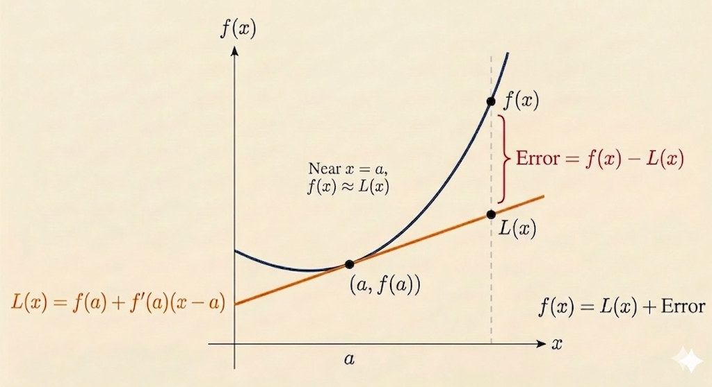

<iframe width="100%" height="500" src="https://www.youtube.com/embed/U0xlKuFqCuI" title="Gilbert Strang's Calculus: Linear Approximation and Newton's Method" frameborder="0" allow="accelerometer; autoplay; clipboard-write; encrypted-media; gyroscope; picture-in-picture; web-share" allowfullscreen></iframe>

This lecture shows how the derivative gives the best local linear model of a function. That same tangent-line idea becomes Newton's method when the goal is not to approximate a function value, but to find a root.

## Linear Approximation

Start from the derivative at a point $a$:

$$
f'(a) = \lim_{x \to a}\frac{f(x)-f(a)}{x-a}.
$$

When $x$ is close to $a$, we treat the difference quotient as approximately equal to the derivative:

$$
f'(a) \approx \frac{f(x)-f(a)}{x-a}.
$$

Rearranging gives the linear approximation formula

$$
f(x) \approx f(a) + f'(a)(x-a).
$$

So near $x=a$, the function is approximated by its tangent line.

## Newton's Method

Now suppose we want to solve

$$
F(x)=0.
$$

Linearize $F$ near a current guess $a$:

$$
F(x) \approx F(a) + F'(a)(x-a).
$$

At a root, the left-hand side should be $0$, so set the approximation equal to zero:

$$
0 \approx F(a) + F'(a)(x-a).
$$

Solve for the improved estimate:

$$
x \approx a - \frac{F(a)}{F'(a)}.
$$

This becomes the Newton iteration

$$
x_{n+1} = x_n - \frac{F(x_n)}{F'(x_n)}.
$$

Newton's method is therefore just tangent-line approximation applied repeatedly to the equation $F(x)=0$.

## Example 1: Approximating $\sqrt{9.06}$

Take

$$
f(x) = \sqrt{x}.
$$

Choose the nearby point $a=9$, where

$$
f(9)=3, \qquad f'(x)=\frac{1}{2\sqrt{x}}, \qquad f'(9)=\frac{1}{6}.
$$

Then

$$
\sqrt{9.06} \approx 3 + \frac{1}{6}(9.06-9) = 3 + \frac{0.06}{6} = 3.01.
$$

The local linear model already gives a very accurate approximation.

### Newton Version of the Same Problem

To compute $\sqrt{9.06}$ with Newton's method, define

$$
F(x)=x^2-9.06.
$$

We want the root of $F(x)=0$. Start with the guess $a=3$. Then

$$
F(3)=9-9.06=-0.06, \qquad F'(x)=2x, \qquad F'(3)=6.
$$

Newton's update gives

$$
x_1 = 3 - \frac{-0.06}{6} = 3.01.
$$

This matches the linear-approximation answer.

### Error After One Step

The approximation $3.01$ is already close:

$$
3.01^2 = 9.0601.
$$

So the residual error in the squared value is

$$
9.0601 - 9.06 = 0.0001.
$$

## Example 2: Approximating $e^{0.01}$

Take

$$
f(x)=e^x.
$$

Use the nearby point $a=0$:

$$
f(0)=1, \qquad f'(0)=1.
$$

The linear approximation becomes

$$
e^x \approx 1 + x.
$$

So at $x=0.01$,

$$
e^{0.01} \approx 1.01.
$$

This is a clean example of what linear approximation really keeps: the constant term and the first-order slope.

## Newton's Method: Second Iteration and Error Reduction

Continue the square-root example with the improved guess

$$
a=3.01.
$$

Then

$$
F(a)=3.01^2-9.06=0.0001,
$$

and

$$
F'(a)=2(3.01)=6.02.
$$

Apply Newton's formula again:

$$
x_2 = 3.01 - \frac{0.0001}{6.02} \approx 3.0099834.
$$

Now the residual is dramatically smaller:

$$
F(x_2) \approx 2.76 \times 10^{-10}.
$$

That is the striking feature of Newton's method near a good starting point: the error can drop extremely fast, often with roughly quadratic convergence.

## Takeaways

- Linear approximation says a smooth function looks like its tangent line locally.
- Newton's method uses that same tangent line to jump toward a root.
- For $\sqrt{9.06}$, both approaches produce the first estimate $3.01$.
- Repeating Newton's update gives much faster error reduction than a single linear approximation.

*Source: Gilbert Strang's Calculus lecture on linear approximation and Newton's method.*
