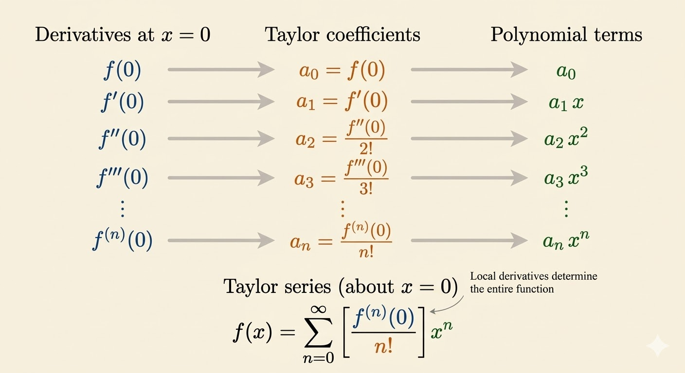
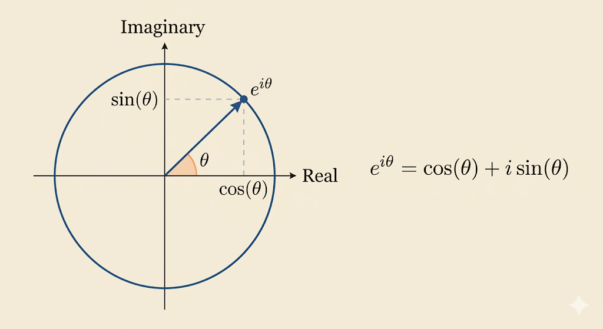
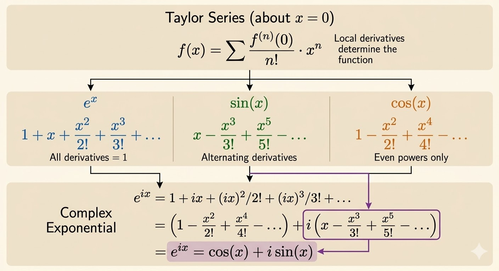

<iframe width="100%" height="500" src="https://www.youtube.com/embed/N4ceWhmXxcs" title="Gilbert Strang's Calculus: Power Series and Euler's Great Formula" frameborder="0" allow="accelerometer; autoplay; clipboard-write; encrypted-media; gyroscope; picture-in-picture; web-share" allowfullscreen></iframe>

This lecture shows how derivatives at a single point can generate an entire function locally. Power series turn differentiation patterns into explicit formulas, and Euler's formula appears when the exponential series is evaluated at an imaginary input.

## Power Series from Derivatives

Start with a power series centered at $x=0$:

$$
f(x)=a_0+a_1x+a_2x^2+a_3x^3+\cdots.
$$

Successive derivatives reveal the coefficients:

- $f(0)=a_0$
- $f'(0)=a_1$
- $f''(0)=2!a_2$
- $f^{(3)}(0)=3!a_3$

In general,

$$
a_n=\frac{f^{(n)}(0)}{n!}.
$$

So the Taylor series at $x=0$ is

$$
f(x)=\sum_{n=0}^{\infty}\frac{f^{(n)}(0)}{n!}x^n.
$$

## Exponential

For $f(x)=e^x$, every derivative is still $e^x$. At $x=0$,

$$
f(0)=f'(0)=f''(0)=\cdots=1.
$$

Therefore

$$
e^x=1+x+\frac{x^2}{2!}+\frac{x^3}{3!}+\frac{x^4}{4!}+\cdots
=\sum_{n=0}^{\infty}\frac{x^n}{n!}.
$$

This is the cleanest example of a power series because the derivative pattern never changes.

## Sine and Cosine

For $\sin x$, the derivatives cycle:

$$
\sin x,\quad \cos x,\quad -\sin x,\quad -\cos x,\quad \sin x,\dots
$$

Evaluating at $x=0$ gives

$$
\sin 0=0,\qquad \cos 0=1.
$$

So the coefficients alternate and the even powers vanish:

$$
\sin x=x-\frac{x^3}{3!}+\frac{x^5}{5!}-\frac{x^7}{7!}+\cdots.
$$

For $\cos x$, the derivative cycle is

$$
\cos x,\quad -\sin x,\quad -\cos x,\quad \sin x,\quad \cos x,\dots
$$

Again at $x=0$,

$$
\cos 0=1,\qquad \sin 0=0.
$$

So the odd powers vanish and the even powers alternate:

$$
\cos x=1-\frac{x^2}{2!}+\frac{x^4}{4!}-\frac{x^6}{6!}+\frac{x^8}{8!}-\cdots.
$$

## Euler's Great Formula

Now substitute $ix$ into the exponential series, where $i^2=-1$:

$$
e^{ix}=1+ix+\frac{(ix)^2}{2!}+\frac{(ix)^3}{3!}+\frac{(ix)^4}{4!}+\cdots.
$$

Separate the even and odd powers:

$$
e^{ix}=
\left(1-\frac{x^2}{2!}+\frac{x^4}{4!}-\cdots\right)
+i\left(x-\frac{x^3}{3!}+\frac{x^5}{5!}-\cdots\right).
$$

Those two series are exactly $\cos x$ and $\sin x$, so

$$
e^{ix}=\cos x+i\sin x.
$$

More generally,

$$
e^{i\theta}=\cos \theta+i\sin \theta.
$$

This is Euler's great formula: the exponential function, trigonometric functions, and complex numbers all meet in one identity.

## Geometric and Logarithmic Series

Two other important series in this lecture are

$$
\frac{1}{1-x}=1+x+x^2+x^3+\cdots
$$

and

$$
-\ln(1-x)=x+\frac{x^2}{2}+\frac{x^3}{3}+\cdots.
$$

The geometric series can be derived directly, and the logarithmic series follows by integrating term by term:

$$
\int \frac{1}{1-x}\,dx = \int (1+x+x^2+x^3+\cdots)\,dx.
$$

This gives

$$
-\ln(1-x)=x+\frac{x^2}{2}+\frac{x^3}{3}+\frac{x^4}{4}+\cdots.
$$

These two series come with an important restriction:

$$
|x|<1.
$$

The reason is structural. Both functions have a singularity at $x=1$, so a series centered at $x=0$ cannot keep converging past that distance.

## Takeaways

- Derivatives at one point determine the Taylor-series coefficients.
- The derivative cycles of $\sin x$ and $\cos x$ explain their alternating odd/even series.
- Substituting an imaginary input into $e^x$ produces Euler's formula.
- Geometric and logarithmic series show that power-series manipulations also reveal convergence limits.

*Source: Gilbert Strang's Calculus lecture on power series and Euler's great formula.*
