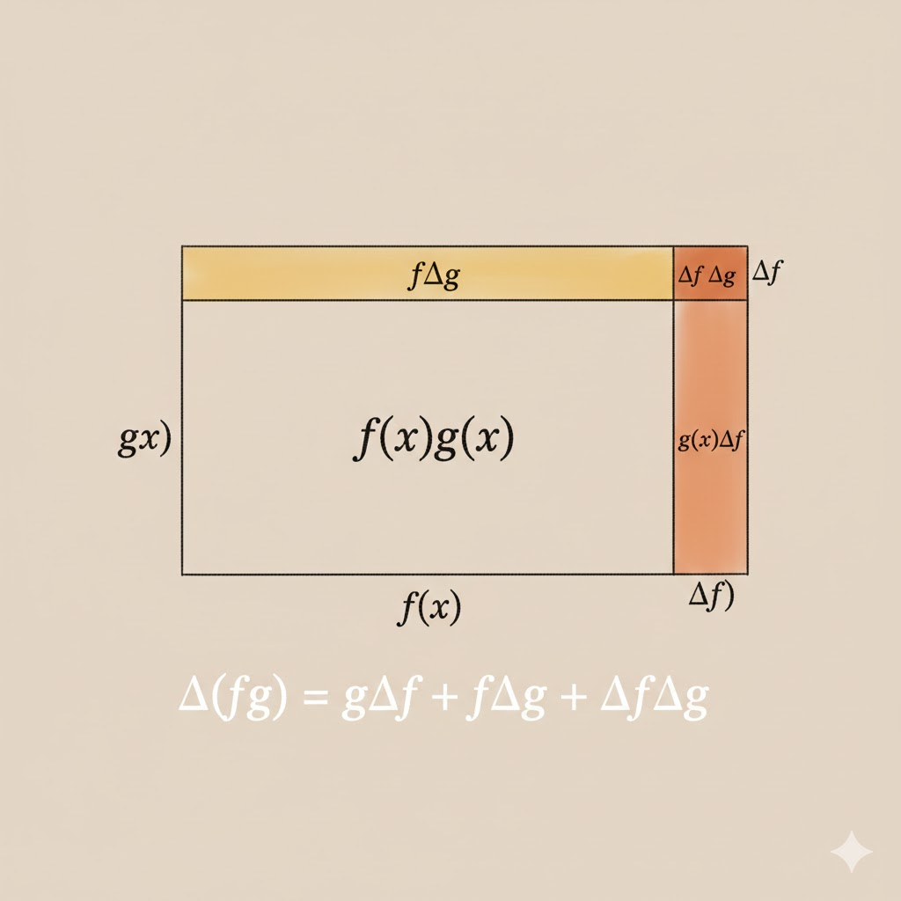



# Product

Let
$$
p(x)=f(x)g(x).
$$
Then
$$
\frac{dp}{dx}=f(x)\frac{dg}{dx}+g(x)\frac{df}{dx}.
$$

## Examples

- $f(x)=x^2,\ g(x)=x$  
  Product rule gives
  $$
  \frac{d}{dx}(x^3)=x^2+x\cdot 2x=3x^2.
  $$
- $f(x)=x^3,\ g(x)=x$  
  Product rule gives
  $$
  \frac{d}{dx}(x^4)=x^3+x\cdot 3x^2=4x^3.
  $$

These examples match the power-rule pattern
$$
\frac{d}{dx}(x^n)=nx^{n-1}.
$$

## Derivative of $\frac{d}{dx}(f(x))^n$

For $n=2$:
$$
\frac{d}{dx}(f(x))^2=f(x)\frac{df}{dx}+f(x)\frac{df}{dx}=2f(x)\frac{df}{dx}.
$$

For $n=3$, write $f(x)^3=f(x)^2f(x)$:
$$
\frac{d}{dx}(f(x)^3)=f(x)\,\frac{d}{dx}(f(x)^2)+f(x)^2\frac{df}{dx}
=3f(x)^2\frac{df}{dx}.
$$

So the pattern is
$$
\frac{d}{dx}(f(x)^n)=n f(x)^{n-1}\frac{df}{dx}.
$$

### Derivative of square root

Let $f(x)=\sqrt{x}$. Since $(\sqrt{x})^2=x$:
$$
\frac{d}{dx}(\sqrt{x})^2=2\sqrt{x}\,\frac{d}{dx}(\sqrt{x})=1.
$$
Hence
$$
\frac{d}{dx}(\sqrt{x})=\frac{1}{2\sqrt{x}}=\frac{1}{2}x^{-1/2},
$$
which also matches the power rule with $n=\frac12$.

## Explanation (geometric intuition)

View $p(x)=f(x)g(x)$ as the area of a rectangle.
When $x$ increases by $\Delta x$:

- $\Delta f=f(x+\Delta x)-f(x)$
- $\Delta g=g(x+\Delta x)-g(x)$

The area increase has three parts:

- $g\,\Delta f$
- $f\,\Delta g$
- $\Delta f\,\Delta g$

So
$$
\Delta p=f\,\Delta g+g\,\Delta f+\Delta f\,\Delta g.
$$
Divide by $\Delta x$:
$$
\frac{\Delta p}{\Delta x}=f\frac{\Delta g}{\Delta x}+g\frac{\Delta f}{\Delta x}+\Delta g\left(\frac{\Delta f}{\Delta x}\right).
$$
As $\Delta x\to 0$, we have $\Delta g\to 0$, so the last term vanishes. Therefore:
$$
\frac{dp}{dx}=f(x)g'(x)+g(x)f'(x).
$$

# Quotient

Let
$$
q(x)=\frac{f(x)}{g(x)}\quad (g(x)\neq 0).
$$
To get $q'(x)$, start from
$$
f(x)=g(x)q(x).
$$
Differentiate:
$$
\frac{df}{dx}=g(x)\frac{dq}{dx}+q(x)\frac{dg}{dx}
= g(x)\frac{dq}{dx}+\frac{f(x)}{g(x)}\frac{dg}{dx}.
$$
Multiply by $g(x)$:
$$
g(x)\frac{df}{dx}-f(x)\frac{dg}{dx}=g(x)^2\frac{dq}{dx}.
$$
So
$$
\frac{dq}{dx}=\frac{g(x)f'(x)-f(x)g'(x)}{(g(x))^2}.
$$

## Example

Take

- $f(x)=1$
- $g(x)=x^n$
- $q(x)=\frac{1}{x^n}=x^{-n}$

Known derivatives:

- $f'(x)=0$
- $g'(x)=n x^{n-1}$

Apply quotient rule:
$$
q'(x)=\frac{x^n\cdot 0-1\cdot n x^{n-1}}{x^{2n}}
=-n x^{-n-1}.
$$
This matches differentiating $x^{-n}$ directly by the power rule.

---

**Takeaway.** Product and quotient rules are not isolated formulas. They are consistent with power-rule patterns and have a clean geometric interpretation through small area changes.
