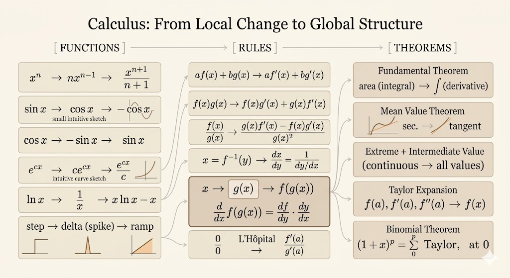

<iframe width="100%" height="500" src="https://www.youtube.com/embed/LgWFurXHX8U" title="Gilbert Strang Calculus" frameborder="0" allowfullscreen></iframe>

This lecture compresses a large part of first-year calculus into three lists: six basic functions, six differentiation rules, and six central theorems. It works as a compact map of the subject.

## Six Functions

### 1. Power Function

$$
f(x) = x^n
$$

- derivative:
  $$
  \frac{d}{dx}(x^n) = n x^{n-1}
  $$
- integral, for $n \ne -1$:
  $$
  \int x^n\,dx = \frac{x^{n+1}}{n+1} + C
  $$

### 2. Sine

$$
f(x) = \sin x
$$

- derivative:
  $$
  \frac{d}{dx}(\sin x) = \cos x
  $$
- integral:
  $$
  \int \sin x\,dx = -\cos x + C
  $$

### 3. Cosine

$$
f(x) = \cos x
$$

- derivative:
  $$
  \frac{d}{dx}(\cos x) = -\sin x
  $$
- integral:
  $$
  \int \cos x\,dx = \sin x + C
  $$

### 4. Exponential

$$
f(x) = e^{cx}
$$

- derivative:
  $$
  \frac{d}{dx}(e^{cx}) = c e^{cx}
  $$
- integral:
  $$
  \int e^{cx}\,dx = \frac{1}{c}e^{cx} + C \qquad (c \ne 0)
  $$

### 5. Logarithm

$$
f(x) = \ln x
$$

- derivative:
  $$
  \frac{d}{dx}(\ln x) = \frac{1}{x}
  $$
- integral:
  $$
  \int \ln x\,dx = x\ln x - x + C
  $$

### 6. Step Function

The step function jumps from one value to another.

- derivative: a delta spike in the generalized-function sense
- integral: a ramp function

This is the only item on the list that is not an ordinary smooth function, but it is important in applications and signal processing.

## Six Rules

### 1. Sum Rule

$$
af(x) + bg(x) \longrightarrow a f'(x) + b g'(x)
$$

### 2. Product Rule

$$
\frac{d}{dx}[f(x)g(x)] = f(x)g'(x) + g(x)f'(x)
$$

### 3. Quotient Rule

$$
\frac{d}{dx}\left(\frac{f(x)}{g(x)}\right) = \frac{g(x)f'(x) - f(x)g'(x)}{g(x)^2}
$$

### 4. Inverse Rule

If $x = f^{-1}(y)$, then

$$
\frac{dx}{dy} = \frac{1}{dy/dx}
$$

provided the denominator is nonzero.

### 5. Chain Rule

For a composition $f(g(x))$,

$$
\frac{d}{dx}f(g(x)) = \frac{df}{dy}\frac{dy}{dx}
$$

with $y=g(x)$.

### 6. L'Hopital's Rule

For indeterminate forms such as $0/0$ or $\infty/\infty$,

$$
\lim_{x\to a} \frac{f(x)}{g(x)} = \lim_{x\to a} \frac{f'(x)}{g'(x)}
$$

when the hypotheses of the rule are satisfied.

## Six Theorems

### 1. Fundamental Theorem of Calculus

If

$$
f(x) = \int_a^x s(t)\,dt,
$$

then

$$
f'(x) = s(x).
$$

Intuition: once we know the accumulated area from $a$ to $x$, a tiny change $dx$ at the right endpoint only adds a thin strip of area. That new area is approximately the current height times the width, so

$$
df \approx s(x)\,dx,
$$

which explains why the rate of change of accumulated area is exactly the current height:

$$
\frac{df}{dx} = s(x).
$$

The reverse direction is equally important: if $f'(x)=s(x)$, then

$$
\int_a^b s(x)\,dx = f(b)-f(a).
$$

### 2. Extreme Value and Intermediate Value Theorems

This is the "all values" theorem picture of continuity.

For a continuous function on a closed interval $[a,b]$:

- it reaches a maximum and a minimum
- it takes every intermediate value between them

Intuition: if you draw an unbroken curve without lifting your pen, it must hit a highest point and a lowest point, and it cannot teleport between them. So it is forced to pass through every height in between.

### 3. Mean Value Theorem

There exists some $c \in (a,b)$ such that

$$
f'(c) = \frac{f(b)-f(a)}{b-a}.
$$

Geometrically, at some point the tangent slope matches the average slope over the whole interval.

### 4. Taylor's Theorem

A smooth function can be expanded around a point $a$:

$$
f(x)=f(a)+f'(a)(x-a)+\frac{1}{2!}f''(a)(x-a)^2+\cdots
$$

This turns local derivative information into a polynomial approximation of the curve.

### 5. Binomial Theorem

The binomial expansion is a special Taylor expansion of $(1+x)^p$ around $x=0$:

$$
(1+x)^p = 1 + px + \frac{p(p-1)}{2}x^2 + \cdots
$$

This works not only for positive integers, but more generally wherever the series converges.

### 6. Error / Remainder Idea

Taylor approximation is powerful because it comes with control of the leftover part.

In practice, we truncate after a few terms and keep a remainder term to quantify the error. That is what turns Taylor series from a formal expansion into a reliable approximation tool.

## Takeaways

- the six functions give the main families whose derivatives and integrals should feel automatic
- the six rules are the basic grammar for differentiating complicated expressions
- the six theorems explain why calculus works structurally, not just computationally
- the lecture is valuable because it compresses many separate techniques into one conceptual map
