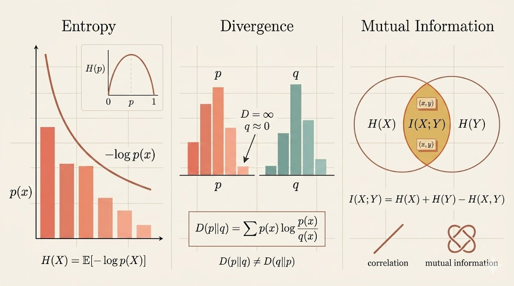

<iframe width="100%" height="500" src="https://www.youtube.com/embed/ScX2aBFyrVU?start=1627" title="Oxford Information Theory Lecture 1" frameborder="0" allowfullscreen></iframe>

## Probability Language

Information theory starts from probability. For a discrete random variable $X$, the probability mass function is

$$
p(x) = \mathbb{P}(X=x),
\qquad
0 \le p(x) \le 1,
\qquad
\sum_x p(x)=1.
$$

For comparison, a cumulative distribution function is

$$
F_X(y)=\mathbb{P}(X \le y).
$$

The point is that information-theoretic quantities are all built from the probabilities assigned to outcomes.

## Surprise and Entropy

Suppose we want a function $s(A)$ that measures how surprising an event $A$ is. The lecture imposes three natural axioms:

- $s(A)$ depends continuously on $\mathbb{P}(A)$
- rarer events are more surprising, so $s(A)$ decreases as $\mathbb{P}(A)$ increases
- for independent events, surprise adds:

$$
s(A \cap B)=s(A)+s(B).
$$

The only function with these properties is, up to a constant factor,

$$
s(A) = -\log \mathbb{P}(A).
$$

So information is naturally logarithmic: independent probabilities multiply, but their surprises add.

### Entropy

For a discrete random variable $X$, the entropy in base $b$ is

$$
H_b(X) = -\sum_x p(x)\log_b p(x).
$$

By convention, information theory usually takes $b=2$, so entropy is measured in bits:

$$
H(X)= -\sum_x p(x)\log_2 p(x).
$$

Equivalently,

$$
H(X)=\mathbb{E}[-\log_2 p(X)].
$$

This says entropy is the expected surprise of the observed outcome.

## Joint Entropy and Independence

For two discrete random variables,

$$
H(X_1,X_2) = -\sum_{x_1,x_2} p(x_1,x_2)\log p(x_1,x_2).
$$

If $X_1$ and $X_2$ are independent, then

$$
p(x_1,x_2)=p_{X_1}(x_1)p_{X_2}(x_2),
$$

so

$$
\log p(x_1,x_2)=\log p_{X_1}(x_1)+\log p_{X_2}(x_2).
$$

Substituting into the joint entropy gives

$$
H(X_1,X_2)=H(X_1)+H(X_2).
$$

So independence means total uncertainty adds cleanly across coordinates.

## KL Divergence

Let $p$ and $q$ be two probability mass functions on the same sample space. Their Kullback-Leibler divergence is

$$
D(p\|q)=\sum_x p(x)\log \frac{p(x)}{q(x)}.
$$

If there exists an $x$ with $p(x)>0$ but $q(x)=0$, then

$$
D(p\|q)=\infty,
$$

because $q$ assigns zero probability to something that actually occurs under $p$.

KL divergence can be rewritten as

$$
D(p\|q)
= \mathbb{E}_{x\sim p}\!\left[\log \frac{p(x)}{q(x)}\right]
= -H(p) - \mathbb{E}_{x\sim p}[\log q(x)].
$$

So it measures the extra coding or modeling cost of using $q$ when the true distribution is $p$.

### Asymmetry

KL divergence is not symmetric.

Consider:

- $p=$ fair coin, so $p(H)=p(T)=1/2$
- $q=$ deterministic coin, so $q(T)=1$ and $q(H)=0$

Then

$$
D(p\|q)=\infty,
$$

because $q(H)=0$ while $p(H)=1/2$.

But

$$
D(q\|p)=\log \frac{1}{1/2} = 1
$$

bit.

So exchanging the order changes the meaning completely.

If $q$ is uniform on a finite set $\mathcal{X}$, then

$$
D(p\|q)=\log |\mathcal{X}| - H(X).
$$

This connects entropy to “distance from uniformity.”

## Mutual Information

For discrete random variables $X$ and $Y$, the mutual information is

$$
I(X;Y)
= \sum_{x,y} p(x,y)\log \frac{p(x,y)}{p(x)p(y)}.
$$

Equivalently,

$$
I(X;Y)=D\bigl(p_{XY}\,\|\,p_Xp_Y\bigr).
$$

That is an important interpretation:

- $p_{XY}$ is the true joint law
- $p_Xp_Y$ is the distribution we would have if $X$ and $Y$ were independent

So mutual information measures how far the actual joint distribution is from the independence hypothesis.

Unlike correlation, which only captures linear dependence, mutual information detects any statistical dependence.

It also has the entropy form

$$
I(X;Y)=H(X)+H(Y)-H(X,Y).
$$

So shared information is the overlap between separate uncertainty and joint uncertainty.

## Conditional Entropy

The entropy of $Y$ given $X$ is

$$
H(Y\mid X)
= -\sum_{x,y} p(x,y)\log p(y\mid x).
$$

This can be read as an average over the values of $X$:

$$
H(Y\mid X)=\sum_x p(x)\,H(Y\mid X=x).
$$

Using

$$
p(y\mid x)=\frac{p(x,y)}{p(x)},
$$

we get

$$
H(Y\mid X)=H(X,Y)-H(X).
$$

That is the chain-rule form for conditional entropy. Symmetrically,

$$
H(X\mid Y)=H(X,Y)-H(Y).
$$

So conditioning removes exactly the uncertainty already explained by the known variable.

## Interpretation

- entropy measures average surprise
- KL divergence measures mismatch between distributions
- mutual information measures dependence
- conditional entropy measures uncertainty left after observing another variable

The lecture’s central idea is that these are not separate formulas. They are one family of quantities built from the same logarithmic view of probability: probability tells us what happens, and information theory tells us how surprising, uncertain, or informative those probabilities are.
