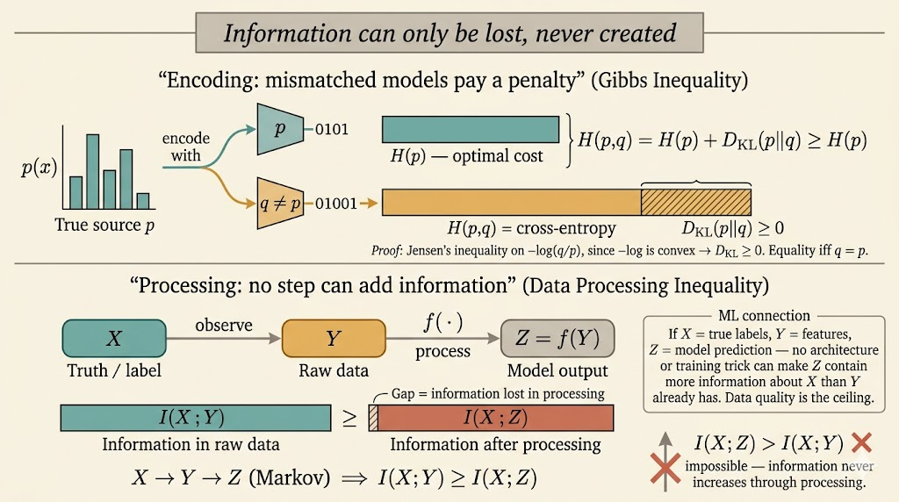

This lecture is about the structural properties behind the main information-theoretic quantities. The goal is not to define entropy or divergence again, but to understand the inequalities and decomposition rules that make them useful.

## Conditional Divergence

Suppose $p_{Y\mid X}$ and $q_{Y\mid X}$ are two conditional distributions, and $p_X$ is the reference distribution over $X$. The conditional KL divergence is

$$
D\!\left(p_{Y\mid X}\|q_{Y\mid X}\mid p_X\right)
=
\sum_x p_X(x)\,
D\!\left(p_{Y\mid X}(\cdot\mid x)\|q_{Y\mid X}(\cdot\mid x)\right).
$$

Equivalently,

$$
D\!\left(p_{Y\mid X}\|q_{Y\mid X}\mid p_X\right)
=
\mathbb{E}_{X\sim p_X}
\left[
D\!\left(p_{Y\mid X}(\cdot\mid X)\|q_{Y\mid X}(\cdot\mid X)\right)
\right].
$$

So conditional divergence is just the average mismatch between the two conditional models, weighted by how often each value of $X$ occurs under the true marginal.

## Conditional Mutual Information

For discrete random variables $X,Y,Z$, the conditional mutual information is

$$
I(X;Y\mid Z)=H(X\mid Z)-H(X\mid Y,Z).
$$

Symmetrically,

$$
I(X;Y\mid Z)=H(Y\mid Z)-H(Y\mid X,Z).
$$

This measures how much uncertainty about $X$ is removed by observing $Y$, once $Z$ is already known.

## Jensen's Inequality

For a convex function $\phi$,

$$
\mathbb{E}[\phi(X)] \ge \phi(\mathbb{E}[X]).
$$

This inequality is one of the main engines behind information theory. In particular, many non-negativity results come from applying Jensen to the convex function $-\log x$.

## Log-Sum Inequality

Let $a_1,\dots,a_n$ and $b_1,\dots,b_n$ be nonnegative numbers. Then

$$
\sum_{i=1}^n a_i \log \frac{a_i}{b_i}
\ge
\left(\sum_{i=1}^n a_i\right)
\log
\frac{\sum_{i=1}^n a_i}{\sum_{i=1}^n b_i}.
$$

This is the discrete inequality underlying many KL-divergence facts, especially convexity and Gibbs inequality.

## Gibbs Inequality

Let $p$ and $q$ be pmfs on the same alphabet. Then

$$
D(p\|q)=\sum_x p(x)\log \frac{p(x)}{q(x)} \ge 0,
$$

with equality if and only if $p=q$.

This can be rewritten as

$$
-\sum_x p(x)\log q(x)\ge -\sum_x p(x)\log p(x).
$$

The left-hand side is the cross-entropy $H(p,q)$, so Gibbs inequality says

$$
H(p,q)\ge H(p).
$$

Interpretation: encoding data generated from $p$ with a mismatched model $q$ always costs at least as much as using the true distribution itself.

### Jensen Proof Sketch

If $X\sim p$, then

$$
D(p\|q)
=
\mathbb{E}\left[-\log \frac{q(X)}{p(X)}\right].
$$

Since $-\log x$ is convex, Jensen gives

$$
\mathbb{E}\left[-\log \frac{q(X)}{p(X)}\right]
\ge
-\log \mathbb{E}\left[\frac{q(X)}{p(X)}\right]
=
-\log \sum_x p(x)\frac{q(x)}{p(x)}
=
-\log 1
=0.
$$

## Divergence Properties

Let $(X,Y)$ follow the true joint distribution $P_{XY}$, and let $(\hat X,\hat Y)$ denote a model joint distribution $P_{\hat X\hat Y}$ on the same space.

### 1. Information Inequality

For any two pmfs,

$$
D(P_X\|P_{\hat X})\ge 0.
$$

This is just Gibbs inequality applied to the marginals.

### 2. Chain Rule for Divergence

The divergence between joint distributions decomposes as

$$
D(P_{XY}\|P_{\hat X\hat Y})
=
D(P_X\|P_{\hat X})
+
D(P_{Y\mid X}\|P_{\hat Y\mid \hat X}\mid P_X).
$$

This is one of the most useful structural formulas in information theory: mismatch in the joint law equals mismatch in the marginal plus mismatch in the conditional.

### 3. Monotonicity Under Marginalization

Because conditional divergence is nonnegative,

$$
D(P_{XY}\|P_{\hat X\hat Y})\ge D(P_X\|P_{\hat X}).
$$

Looking at the full joint distribution can only reveal more mismatch than looking at the marginal alone.

### 4. Equivalent Form of Conditional Divergence

Conditional divergence can be rewritten as an ordinary KL divergence:

$$
D(P_{Y\mid X}\|P_{\hat Y\mid \hat X}\mid P_X)
=
D(P_XP_{Y\mid X}\|P_XP_{\hat Y\mid \hat X}).
$$

This says: if both models use the same true marginal over $X$, then the remaining divergence is exactly the cost of getting the conditional distribution of $Y$ wrong.

### 5. Joint Convexity

For $\lambda\in[0,1]$,

$$
D(\lambda p_1+(1-\lambda)p_2\|\lambda q_1+(1-\lambda)q_2)
\le
\lambda D(p_1\|q_1)+(1-\lambda)D(p_2\|q_2).
$$

So KL divergence is jointly convex in both arguments. Mixtures do not increase divergence beyond the corresponding weighted average.

## Mutual Information Properties

### 1. Nonnegativity

$$
I(X;Y)\ge 0,
$$

with equality if and only if $X$ and $Y$ are independent.

Since

$$
I(X;Y)=D(P_{XY}\|P_XP_Y),
$$

this is another direct consequence of KL nonnegativity.

### 2. Symmetry and Entropy Reduction

$$
I(X;Y)=I(Y;X)=H(X)-H(X\mid Y)=H(Y)-H(Y\mid X).
$$

So mutual information is exactly the reduction in uncertainty produced by observation of the other variable.

### 3. Chain Rule for Mutual Information

For a sequence $X_1,\dots,X_n$,

$$
I(X_1,\dots,X_n;Y)
=
\sum_{i=1}^n I(X_i;Y\mid X_1,\dots,X_{i-1}).
$$

This expresses total information as a step-by-step accumulation of new information revealed by each variable.

### 4. Data Processing Inequality

If $X\to Y\to Z$ forms a Markov chain, meaning $X\perp Z\mid Y$, then

$$
I(X;Y)\ge I(X;Z).
$$

Post-processing cannot create new information about the original source.

### 5. Deterministic Processing

If $Z=f(Y)$ for a deterministic function $f$, then

$$
I(X;Y)\ge I(X;f(Y)).
$$

This is a special case of the data processing inequality.

## Entropy Properties

### 1. Bounds on Entropy

If $X$ takes values in a finite alphabet $\mathcal X$, then

$$
0\le H(X)\le \log |\mathcal X|.
$$

The lower bound is achieved when $X$ is deterministic; the upper bound is achieved when $X$ is uniform.

### 2. Conditioning Reduces Entropy

$$
0\le H(X\mid Y)\le H(X).
$$

Equality cases:

- $H(X\mid Y)=H(X)$ iff $X$ and $Y$ are independent
- $H(X\mid Y)=0$ iff $X$ is a deterministic function of $Y$

### 3. Chain Rule and Subadditivity

$$
H(X_1,\dots,X_n)
=
\sum_{i=1}^n H(X_i\mid X_1,\dots,X_{i-1})
\le
\sum_{i=1}^n H(X_i).
$$

The inequality becomes equality exactly when the variables are independent.

### 4. Entropy of a Function

For any deterministic function $f$,

$$
H(f(X))\le H(X),
$$

with equality if $f$ is injective on the support of $X$.

A function can merge outcomes and lose information, but it cannot create extra uncertainty beyond what was already present in $X$.

### 5. i.i.d. Sequences

If $X_1,\dots,X_n$ are i.i.d., then

$$
H(X_1,\dots,X_n)=nH(X_1).
$$

There is no overlap to subtract because independence makes the joint entropy additive.

## Machine Learning Connection

Two points matter immediately for machine learning:

- data processing says post-processing features cannot magically create information about the target that was not already present
- KL-based objectives and entropy inequalities explain why likelihood, cross-entropy, compression, and distribution matching are all tightly connected

This lecture is useful because it turns information theory from a list of formulas into a small set of structural laws: nonnegativity, chain rules, convexity, and monotonicity under processing.
