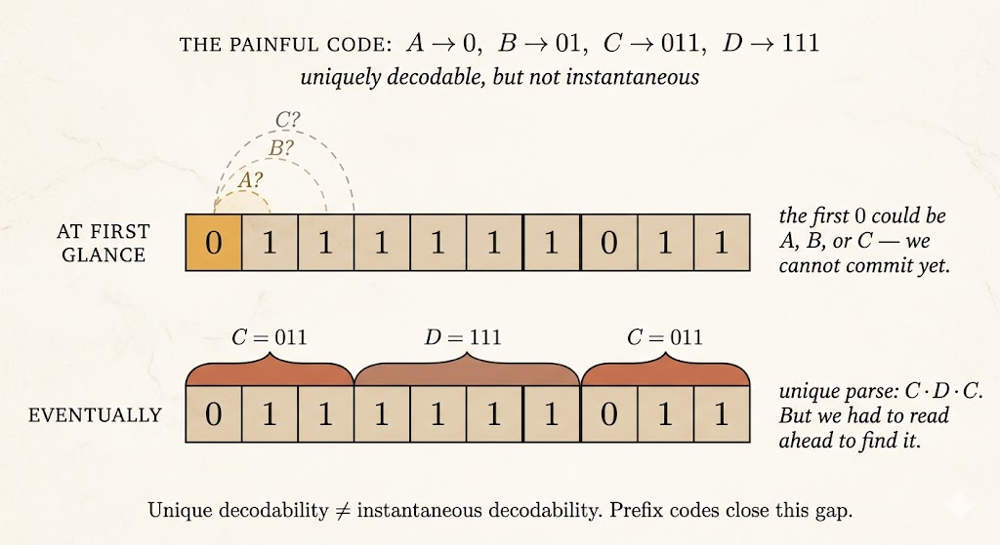

This lecture connects two sides of information theory.

The first side is about entropy as uncertainty: lower and upper bounds, chain rules, invariance, concavity, and Fano's inequality. The second side is about coding: how symbols are mapped into strings, and what conditions make decoding possible.

The key transition is:

> Entropy tells us the theoretical amount of information. Codes tell us how to represent that information.

## Entropy Bounds

For a discrete random variable $X$ with alphabet $\mathcal{X}$,

$$
H(X) = -\sum_x p(x)\log p(x).
$$

Entropy is always nonnegative:

$$
H(X)\ge 0.
$$

It equals zero if and only if the outcome is deterministic. That is, there exists one outcome $x_i$ such that

$$
p(x_i)=1,
$$

and all other outcomes have probability zero.

The upper bound is

$$
H(X)\le \log |\mathcal{X}|.
$$

Equality holds for the uniform distribution:

$$
q(x)=\frac{1}{|\mathcal{X}|}.
$$

This is the maximum-uncertainty case. If all outcomes are equally likely, there is no structure that lets us predict one outcome better than another.

## Mutual Information and Conditioning

Mutual information is nonnegative:

$$
0 \le I(X;Y)=H(X)-H(X\mid Y).
$$

Equivalently, observing $Y$ cannot increase the uncertainty of $X$ on average:

$$
H(X\mid Y)\le H(X).
$$

For conditional entropy,

$$
H(Y\mid X)
=
\sum_x p(x)H(Y\mid X=x)
=
-\sum_x p(x)\sum_y p(y\mid x)\log p(y\mid x).
$$

If $H(Y\mid X)=0$, then for every relevant $x$, the conditional distribution $p(y\mid x)$ is deterministic. Given $X=x$, the value of $Y$ is known.

## Chain Rule for Entropy

The entropy chain rule is

$$
H(X_1,X_2,\dots,X_n)
=
\sum_{i=1}^n H(X_i\mid X_{i-1},\dots,X_1).
$$

This says that the uncertainty of a sequence is the sum of the new uncertainty contributed by each variable after the previous variables are known.

Since conditioning reduces entropy,

$$
H(X_i\mid X_{i-1},\dots,X_1)\le H(X_i),
$$

so

$$
H(X_1,X_2,\dots,X_n)
\le
\sum_{i=1}^n H(X_i).
$$

The inequality becomes equality when the variables are independent. When variables are correlated, joint entropy is smaller than the sum of individual entropies. This gap is what makes compression possible.

## Invariance Under Bijection

If $f$ is a bijection, then $f(X)$ contains exactly the same information as $X$.

Using the chain rule:

$$
H(X,f(X))
=
H(X)+H(f(X)\mid X)
=
H(X),
$$

because $f(X)$ is determined once $X$ is known.

Also,

$$
H(X,f(X))
=
H(f(X))+H(X\mid f(X)).
$$

If $f$ is bijective, then $X$ is determined by $f(X)$, so

$$
H(X\mid f(X))=0,
$$

and therefore

$$
H(f(X))=H(X).
$$

Relabeling outcomes does not change entropy.

## Jensen and Concavity

The function

$$
g(x)=-x\log x
$$

is concave on $[0,1]$. Since entropy is a sum of this function over probabilities, entropy is concave in the probability distribution.

Concavity matches the intuition that mixing distributions increases uncertainty. A more spread-out probability distribution has higher entropy than a more concentrated one.

One useful Jensen-style identity is

$$
2^{-H(X)}
=
2^{\mathbb{E}[\log p(X)]}
\le
\mathbb{E}[2^{\log p(X)}]
=
\mathbb{E}[p(X)]
=
\sum_x p(x)^2.
$$

This relates entropy to the collision probability $\sum_x p(x)^2$.

## Fano's Inequality

Fano's inequality connects uncertainty with prediction error.

Suppose we observe $Y$ and use it to estimate hidden $X$. Then

$$
H(X\mid Y)
\le
H(\mathbf{1}_{X\ne Y})
+
\mathbb{P}(X\ne Y)\log(|\mathcal{X}|-1).
$$

The simplified corollary is

$$
H(X\mid Y)
\le
1+\mathbb{P}(X\ne Y)\log|\mathcal{X}|.
$$

### Proof Idea

Define the error indicator

$$
Z=\mathbf{1}_{X\ne Y}.
$$

If both $X$ and $Y$ are known, then $Z$ is known:

$$
H(Z\mid X,Y)=0.
$$

Apply the chain rule to $H(X,Z\mid Y)$ in two ways:

$$
H(X,Z\mid Y)
=
H(X\mid Y)+H(Z\mid X,Y)
=
H(X\mid Y),
$$

and

$$
H(X,Z\mid Y)
=
H(Z\mid Y)+H(X\mid Y,Z).
$$

Therefore,

$$
H(X\mid Y)
=
H(Z\mid Y)+H(X\mid Y,Z).
$$

Since conditioning reduces entropy,

$$
H(Z\mid Y)\le H(Z).
$$

Now split by whether an error occurred:

$$
H(X\mid Y,Z)
=
\mathbb{P}(Z=0)H(X\mid Y,Z=0)
+
\mathbb{P}(Z=1)H(X\mid Y,Z=1).
$$

If $Z=0$, then $X=Y$, so the first entropy is zero. If $Z=1$, then given $Y$, there are at most $|\mathcal{X}|-1$ possible values for $X$. Thus

$$
H(X\mid Y,Z=1)
\le
\log(|\mathcal{X}|-1).
$$

Putting the pieces together gives Fano's inequality.

## Codes

In information theory, a symbol code maps source symbols to strings over a code alphabet.

Let $\mathcal{X}$ be the source alphabet and $\mathcal{Y}$ be the code alphabet. A code is a function

$$
c:\mathcal{X}\to\mathcal{Y}^*,
$$

where $\mathcal{Y}^*$ is the set of finite-length strings over $\mathcal{Y}$.

For binary coding, $\mathcal{Y}=\{0,1\}$.

## Three Levels of Decodability

### Unambiguous Codes

A code is unambiguous if each source symbol has a distinct codeword. In other words, the mapping $c$ is injective.

This prevents two symbols from sharing the same codeword. But it is only a single-symbol condition. It does not guarantee that a concatenated message can be decoded uniquely.

### Uniquely Decodable Codes

A code is uniquely decodable if every concatenation of codewords can be parsed in only one way.

This is stronger than being unambiguous. It says that full messages, not just individual symbols, can be recovered uniquely.

The cost is that decoding might require lookahead. We may need to read far into the sequence before knowing where one codeword ends and the next begins.

### Prefix Codes

A prefix code is a code where no codeword is the prefix of another codeword.

This is also called an instantaneous code. As soon as a valid codeword is read, it can be decoded immediately. No future bits are needed to decide whether the current codeword is complete.

Prefix codes are the most practical class because they support streaming decoding.

## Example: Unique but Not Prefix

Consider:

| Symbol | Codeword |
|---|---:|
| A | $0$ |
| B | $01$ |
| C | $011$ |
| D | $111$ |

This code is unambiguous because all four codewords are distinct.

It can also be uniquely decodable, but it is not a prefix code:

- $0$ is a prefix of $01$
- $0$ is a prefix of $011$
- $01$ is a prefix of $011$

So if we read a stream starting with `0`, we cannot decode immediately. The first symbol might be A, or the `0` might be the start of B or C. This is the lookahead problem.

Prefix codes avoid this issue by making codeword boundaries recognizable as soon as they appear.

## Kraft-McMillan Theorem

For a binary uniquely decodable code with codeword lengths $\ell_x$, the Kraft-McMillan inequality says

$$
\sum_{x\in\mathcal{X}}2^{-\ell_x}\le 1.
$$

This gives a length budget. Short codewords are expensive:

$$
2^{-1}=\frac{1}{2},
$$

so using too many short words leaves no room for the remaining symbols.

The theorem has two directions:

- **McMillan direction:** every uniquely decodable code must satisfy the Kraft inequality.
- **Kraft direction:** if a set of lengths satisfies the inequality, then there exists a prefix code with those lengths.

The important consequence is that prefix codes are not less efficient than uniquely decodable codes in terms of achievable lengths.

So in practice, we can focus on prefix codes: they avoid lookahead while preserving the same length possibilities.

## Takeaways

- Entropy is bounded between $0$ and $\log|\mathcal{X}|$.
- Chain rules decompose joint uncertainty into sequential conditional uncertainty.
- Fano's inequality links conditional entropy to estimation error.
- Codes translate symbols into strings for storage, transmission, or compression.
- Prefix codes are instantly decodable and avoid lookahead.
- Kraft-McMillan explains which codeword lengths are possible.
