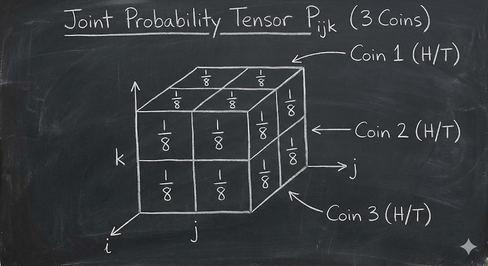
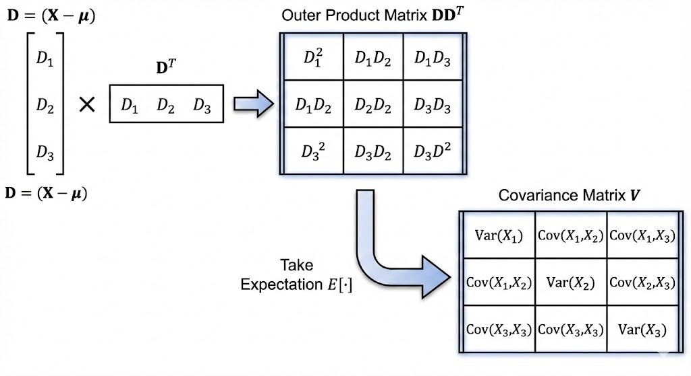

# Variance identity

Variance can be written in a compact and useful form:
$$
\mathrm{Var}(X)=E[(X-m)^2]=E[X^2]-m^2,\quad m=E[X].
$$

For a discrete variable with values $x_i$ and probabilities $p_i$:
$$
\sum_{i=1}^n p_i(x_i-m)^2
=\sum_{i=1}^n p_i x_i^2 -2m\sum_{i=1}^n p_i x_i + m^2\sum_{i=1}^n p_i.
$$
Using
$$
\sum_{i=1}^n p_i x_i = m,\qquad \sum_{i=1}^n p_i=1,
$$
we get
$$
\mathrm{Var}(X)=E[X^2]-m^2=E[X^2]-(E[X])^2.
$$

# Markov's inequality

If $X\ge 0$ and $a>0$, then
$$
\Pr(X\ge a)\le \frac{E[X]}{a}.
$$

## Example

Suppose $E[X]=1$ and $a=3$ for a nonnegative discrete variable taking values in $\{1,2,3,4,5\}$.
Write
$$
1=\sum_{i=1}^5 i\,p_i
=1p_1+2p_2+3(p_3+p_4+p_5)+(p_4+2p_5).
$$
Since all probabilities are nonnegative, the last two terms are $\ge 0$, so
$$
3(p_3+p_4+p_5)\le 1
\;\Rightarrow\;
p_3+p_4+p_5\le \frac13.
$$
Therefore,
$$
\Pr(X\ge 3)\le \frac13,
$$
which matches Markov:
$$
\Pr(X\ge 3)\le \frac{E[X]}{3}=\frac13.
$$

# Chebyshev's inequality

Chebyshev follows directly by applying Markov to
$$
Y=(X-m)^2\ge 0.
$$
Then
$$
E[Y]=E[(X-m)^2]=\sigma^2,\qquad
\{|X-m|\ge a\}=\{(X-m)^2\ge a^2\}.
$$
So
$$
\Pr(|X-m|\ge a)=\Pr((X-m)^2\ge a^2)\le \frac{\sigma^2}{a^2}.
$$

# Joint probability

For two independent fair coins $(C_1,C_2)$, the joint table is
$$
\begin{array}{c|cc}
 & C_2=H & C_2=T\\ \hline
C_1=H & 0.25 & 0.25\\
C_1=T & 0.25 & 0.25
\end{array}
$$

If the two coins are "glued" (always same face), the joint table becomes
$$
\begin{array}{c|cc}
 & C_2=H & C_2=T\\ \hline
C_1=H & 0.5 & 0\\
C_1=T & 0 & 0.5
\end{array}
$$

For three random variables, the joint distribution is a third-order tensor:
$$
P_{ijk}=\Pr(X_1=i,X_2=j,X_3=k).
$$

Marginals come from summing over axes. For example:
$$
P_j=\sum_i P_{ij}.
$$

# Covariance matrix

Let
$$
X=\begin{bmatrix}X_1\\X_2\\ \vdots \\X_n\end{bmatrix},\qquad
\mu=E[X].
$$
The covariance matrix is
$$
V=E[(X-\mu)(X-\mu)^\top]
=\sum_k p_k (x_k-\mu)(x_k-\mu)^\top.
$$
Element-wise:
$$
V_{ij}=\mathrm{Cov}(X_i,X_j)=E[(X_i-\mu_i)(X_j-\mu_j)].
$$

For two variables:
$$
V=
\begin{bmatrix}
\sigma_1^2 & \mathrm{Cov}(X_1,X_2)\\
\mathrm{Cov}(X_1,X_2) & \sigma_2^2
\end{bmatrix}.
$$

If $X_1$ and $X_2$ are independent, then $\mathrm{Cov}(X_1,X_2)=0$.
If they are perfectly coupled, covariance has large magnitude.

---

**Takeaway.** Variance and covariance summarize spread and dependence, while Markov and Chebyshev provide distribution-free probability bounds from only moments.
