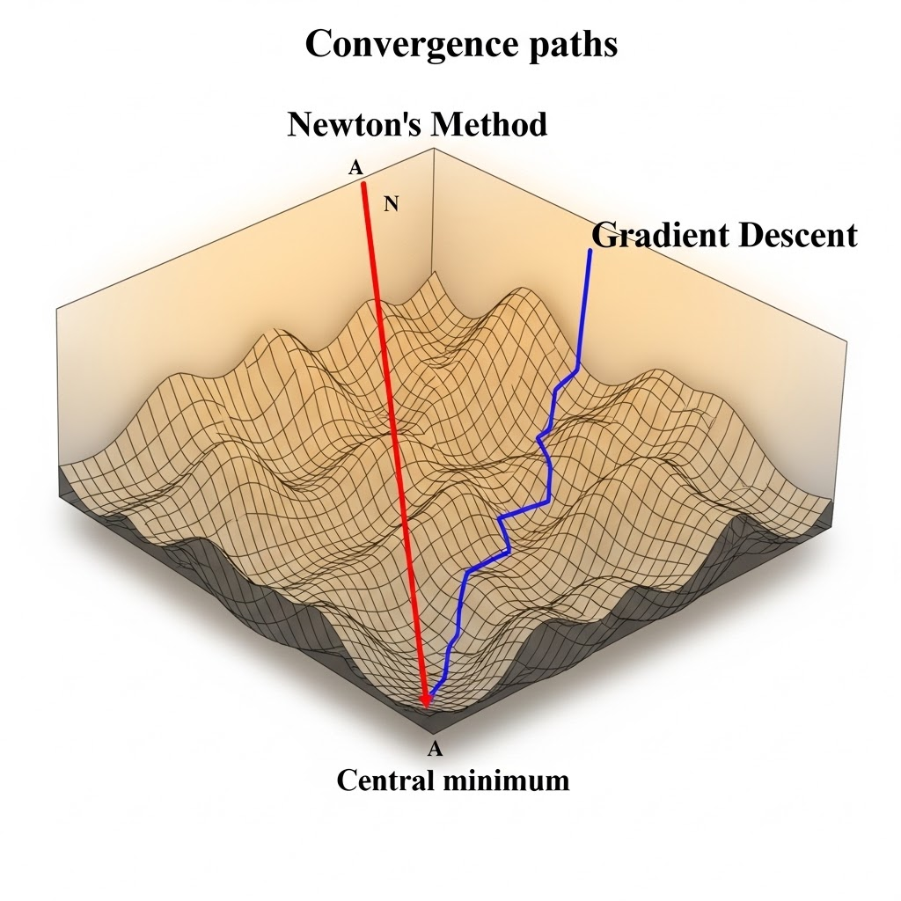
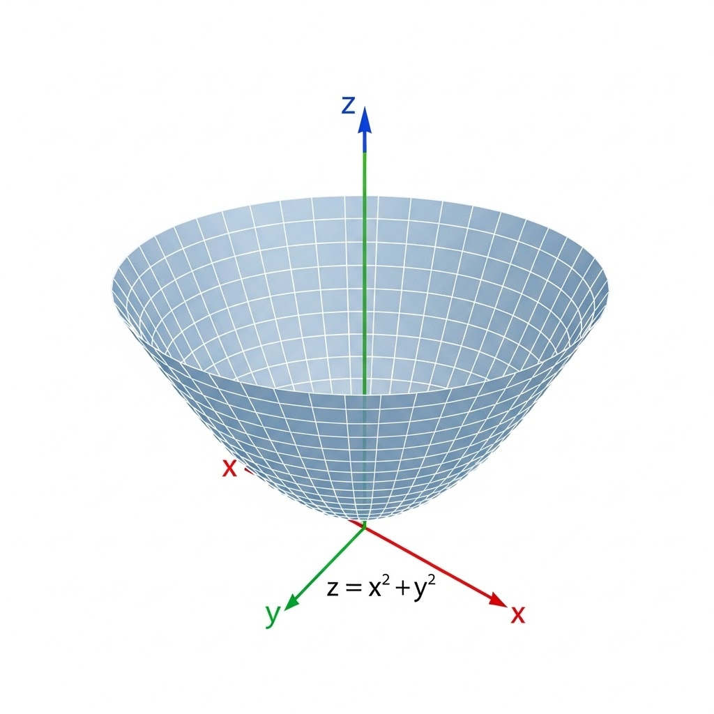



# Hessian Matrix

Taylor expansion (three terms) in 1D:
$$
F(x+\Delta x) \approx F(x)+\Delta x\frac{dF}{dx}+\frac{1}{2}(\Delta x)^2\frac{d^2F}{dx^2}.
$$

Multivariable form:
$$
F(x+\Delta x) \approx F(x)+(\Delta x)^\top \nabla_x F+\frac{1}{2}(\Delta x)^\top H\,\Delta x.
$$

- $H$: Hessian matrix (symmetric under standard smoothness assumptions)
- Entries:
$$
H_{ij}=\frac{\partial^2 F}{\partial x_i\partial x_j}.
$$

# Jacobian Matrix

The Jacobian matrix $J$ is the first-order derivative matrix for a vector-valued function $f$.

If $f:\mathbb{R}^n\to\mathbb{R}^m$, then
$$
J_{jk}=\frac{\partial f_j}{\partial x_k},\qquad J\in\mathbb{R}^{m\times n}.
$$

It plays the same role for vector functions that the gradient plays for scalar functions. It is also the first-order term in Taylor linearization:
$$
f(x+\Delta x)\approx f(x)+J\Delta x.
$$

This linearization is the core engine of Newton's method: solve $f(x)=0$ by repeatedly solving a linearized system.

> The Jacobian can be $m\times n$ in general. In this lecture, we focus on the square $n\times n$ case so Newton updates can be written with $J^{-1}$.

# Newton's Method

Set $f=\nabla F$. To find a stationary point, solve
$$
f(x)=0\quad\Longleftrightarrow\quad f_1(x)=\cdots=f_n(x)=0.
$$

At iteration $k$, linearize around $x_k$:
$$
f(x_k)+J(x_k)\Delta x=0.
$$

Use $\Delta x=x_{k+1}-x_k$:
$$
J(x_k)(x_{k+1}-x_k)=-f(x_k),
$$
so
$$
x_{k+1}=x_k-J(x_k)^{-1}f(x_k).
$$

Given $f=\nabla F$, the Jacobian $J(x_k)$ (first derivative of a first derivative) is exactly the Hessian $H(x_k)$ of $F$ (second-order derivative).

## Example

Suppose
$$
f(x)=x^2-9,
$$
so $f(x)=0$ gives roots $x=\pm 3$.

Newton update:
$$
x_{k+1}=x_k-\frac{f(x_k)}{f'(x_k)}
= x_k-\frac{x_k^2-9}{2x_k}.
$$

As expected, the method converges quickly near $3$ and $-3$.

### Quadratic Convergence

Newton's method has **quadratic convergence** near a nondegenerate solution:
$$
e_{k+1}\approx C e_k^2.
$$

This is much faster than linear convergence from steepest descent. The reason is second-order curvature information (via the Hessian/Jacobian), so once the iterate enters the attraction region, correct digits can roughly double each step.

## Why don't we use full Newton's method in deep learning?

Although Newton's method is theoretically fast, it has severe computation/storage bottlenecks for modern models because it depends on second-order derivatives.

For a model with only $10^6$ parameters:

- First-order gradient is a vector of size $10^6$ (manageable).
- Hessian is a $10^6\times 10^6$ matrix with $10^{12}$ entries (storage explosion).
- Newton step requires solving/inverting Hessian systems; naive inversion scales as $O(N^3)$ and is infeasible at this size.

So in practice, deep learning uses first-order methods (SGD/Adam) or approximate second-order variants.

# Minimizing F

## Steepest Descent

$$
x_{k+1}=x_k-s_k\nabla F(x_k),
$$
where $s_k$ is step size (learning rate).

Steepest descent follows the negative gradient direction. Step size is critical: too large overshoots; too small converges slowly.

## Newton's Method

$$
x_{k+1}=x_k-H(x_k)^{-1}\nabla F(x_k).
$$

Compared with steepest descent, Newton uses local curvature to adapt direction and scale.

# Convexity

## Convex set

A set $C$ is convex if
$$
x,y\in C,\ \forall\theta\in[0,1]\Longrightarrow\theta x+(1-\theta)y\in C.
$$

## Convex function

A function $f$ is convex if
$$
f(\theta x+(1-\theta)y)\le \theta f(x)+(1-\theta)f(y),\quad x,y\in\mathrm{dom}(f),\ \theta\in[0,1].
$$

From calculus, in 1D, $f''(x)\ge 0$ implies convexity. In optimization, convexity gives the key guarantee: every local minimum is also a global minimum.

---

**Takeaway.** Hessian and Jacobian connect multivariable calculus to practical optimization: gradient methods use first-order information, Newton uses second-order curvature, and convexity tells us when local optimization gives globally correct answers.
