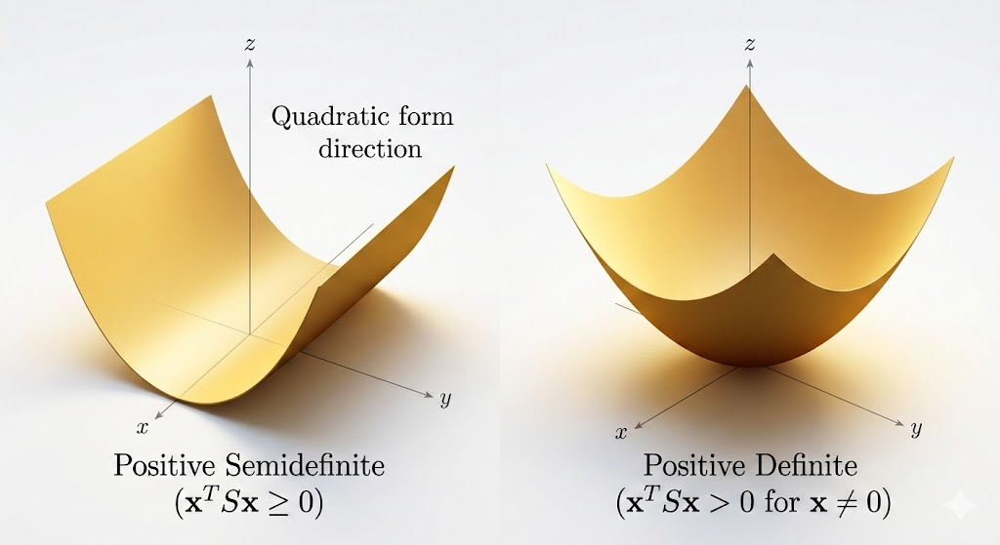
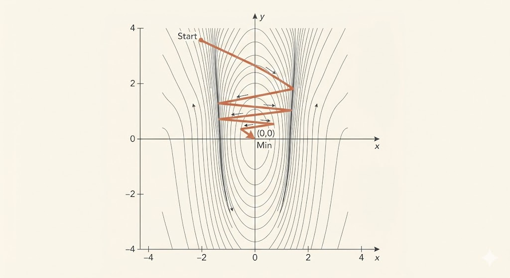



**Gradient descent is a fundamental algorithm for minimizing a function, but its behavior is controlled by curvature, step size, and condition number.**

# A Quadratic Matrix

$$
f(v)=\frac{1}{2}v^\top S v=\frac{1}{2}(x^2+b y^2),
\qquad
S=\begin{bmatrix}1&0\\0&b\end{bmatrix},
\qquad
v=\begin{bmatrix}x\\y\end{bmatrix}.
$$

This is the standard bowl model for analyzing gradient methods.

# Gradient

For a linear function
$$
f(x,y)=2x+5y,
$$
its gradient is
$$
\nabla f=\begin{bmatrix}2\\5\end{bmatrix},
$$
and the Hessian is zero:
$$
H=\nabla^2 f=\begin{bmatrix}0&0\\0&0\end{bmatrix}.
$$

So linear functions have constant slope and no curvature.

# Hessian and Convexity

## Definitions

- Convex: Hessian is positive semidefinite (PSD).
- Strictly convex: Hessian is positive definite (PD).

In eigenvalue language:

- PSD means $\lambda_i\ge 0$ for all $i$ (flat directions are allowed).
- PD means $\lambda_i>0$ for all $i$ (curvature in every direction).

Consequences:

- PSD convex objective: global minima exist, but may not be unique.
- PD objective: global minimum is unique.

## Example

$$
f(x)=\frac{1}{2}x^\top Sx-a^\top x-b.
$$

Then

- $\nabla f = Sx-a$
- $H=\nabla^2 f=S$

The minimizer solves
$$
Sx-a=0
\quad\Rightarrow\quad
x^*=S^{-1}a,
$$
assuming $S$ is invertible.

# A Remarkable Convex Function

$$
f(X)=-\log\det(X),\qquad X\in\mathbb{S}_{++}^n.
$$

A key identity from matrix calculus is
$$
\frac{\partial \log\det X}{\partial X_{ij}}=(X^{-1})_{ji},
$$
so
$$
\nabla_X\big(-\log\det X\big)=-X^{-\top}.
$$

This function appears throughout optimization (barrier methods, covariance estimation, SDP-type models).

# Gradient Descent

$$
x_{k+1}=x_k-s_k\nabla f(x_k),
$$
where $s_k$ is the step size (learning rate).

# Line Search Strategies

## Exact Line Search

Choose
$$
s_k=\arg\min_{s>0} f\big(x_k-s\nabla f(x_k)\big),
$$
so each step is optimal along the current descent line.

## Backtracking Line Search

Start from a candidate step (often large), then shrink it until sufficient decrease is satisfied.

This is usually cheaper and more practical than exact line search.

# Condition Number and Reduction

For quadratic objectives, convergence speed is governed by the condition number
$$
\kappa=\frac{M}{m},
$$
where $M$ and $m$ are largest/smallest Hessian eigenvalues.

- Well-conditioned ($\kappa\approx 1$): level sets are close to circles, gradients point toward the minimizer, and convergence is fast.
- Ill-conditioned ($\kappa\gg 1$): level sets are elongated, iterates zigzag across valleys, and convergence is slow.

A classical reduction factor with exact line search behaves like
$$
\rho\approx\frac{\kappa-1}{\kappa+1},
$$
so larger $\kappa$ means slower progress per step.

---

**Takeaway.** Gradient descent performance is not just about choosing a learning rate. The geometry of the objective (through Hessian eigenvalues and condition number) is the central factor determining whether optimization is smooth or painfully slow.
