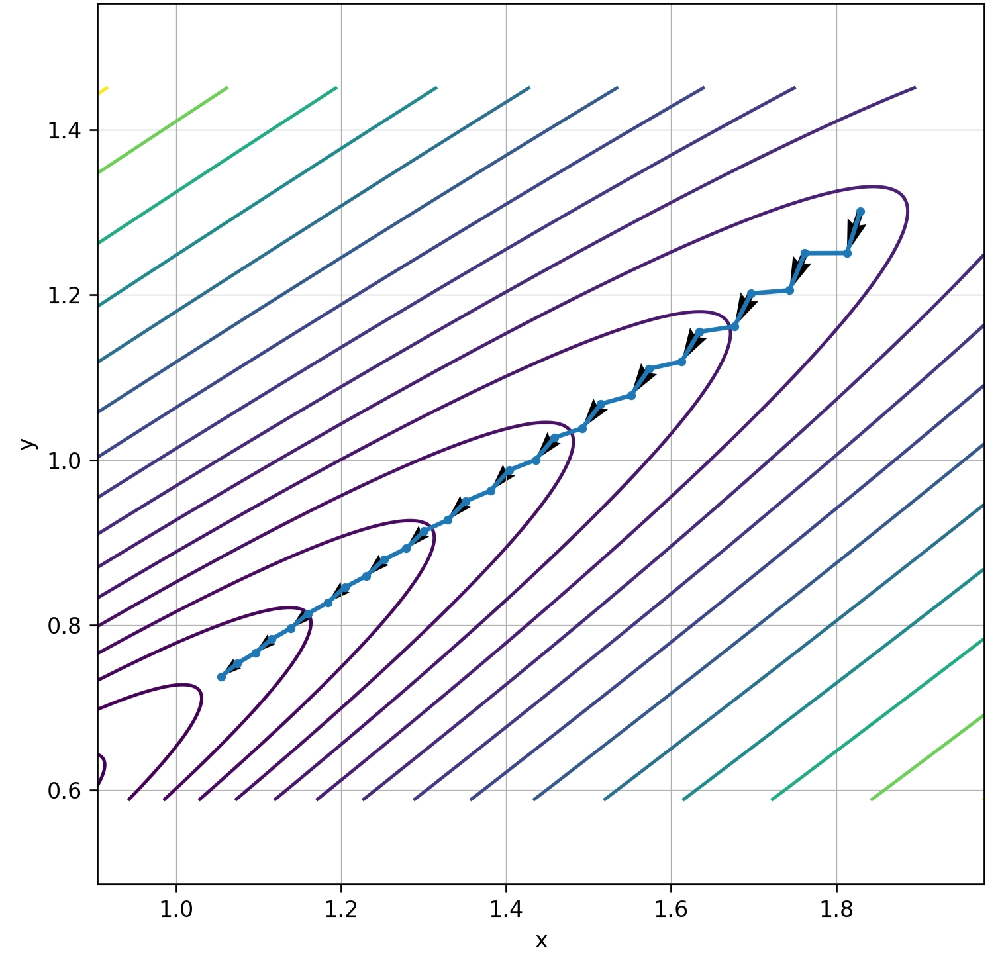
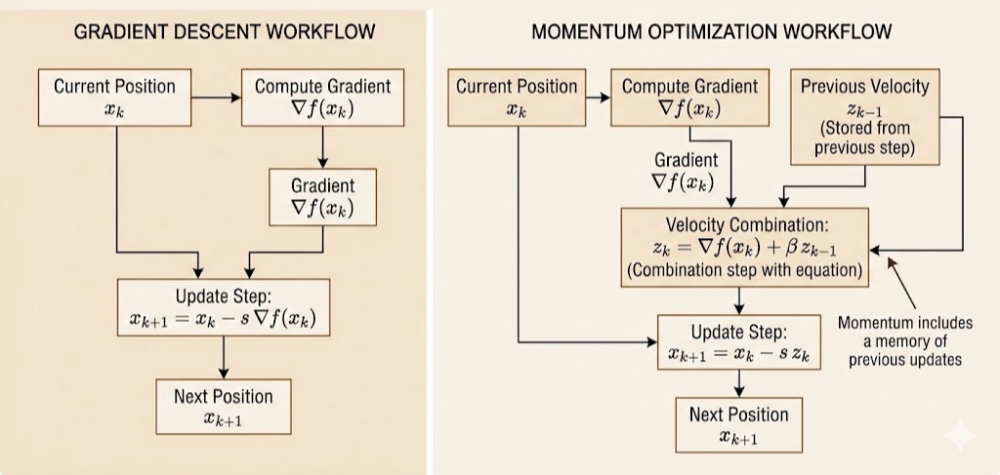
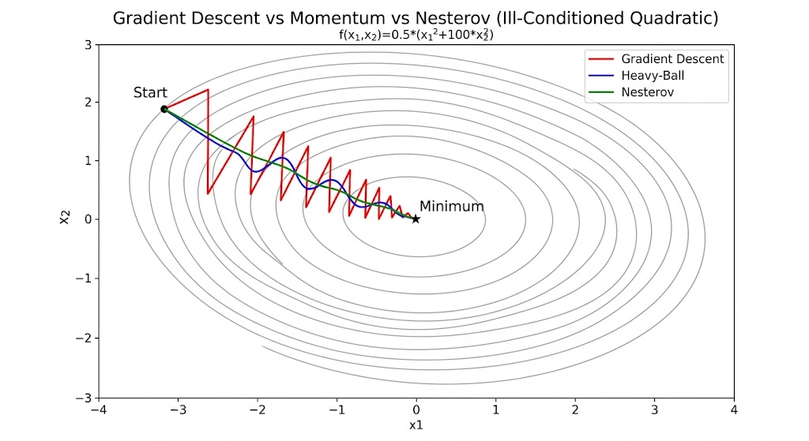

In deep learning, stochastic gradient descent updates parameters using gradients from mini-batches rather than the full dataset.

# Ill-Conditioned

An optimization problem is **ill-conditioned** when curvature differs dramatically across directions.

Consider
$$
f(x)=\frac{1}{2}x^\top Sx,\qquad
S=\begin{bmatrix}1&0\\0&b\end{bmatrix},\quad 0<b\ll 1.
$$

Then
$$
\nabla f(x)=Sx,\qquad
\nabla^2 f(x)=S.
$$

The eigenvalues are
$$
\lambda_1=1,\qquad \lambda_2=b,
$$
so the condition number is
$$
\kappa(S)=\frac{\lambda_{\max}}{\lambda_{\min}}=\frac{1}{b}.
$$

When $b\ll 1$, $\kappa$ is large and level sets become elongated ellipses.  
Gradient descent then zigzags: overshooting across the steep direction while making slow progress along the flat direction.

# Momentum

## Why Momentum Reduces Zigzag

In ill-conditioned valleys:

- Steep direction: large gradient components can cause oscillation.
- Flat direction: small gradients make progress slow.

Momentum adds memory:
$$
z_k=\nabla f(x_k)+\beta z_{k-1},\qquad
x_{k+1}=x_k-sz_k,\qquad 0\le\beta<1.
$$

Equivalent heavy-ball form:
$$
x_{k+1}=x_k-s\nabla f(x_k)+\beta(x_k-x_{k-1}).
$$

Effects:

1. **Damping across-valley oscillation**: alternating components are partially canceled.
2. **Accumulating along-valley velocity**: aligned components reinforce over iterations.

This smooths the path and accelerates convergence.

## Example: Momentum on a Quadratic Gives a \(\sqrt{\kappa}\) Rate

Analyze
$$
f(x)=\frac{1}{2}x^\top Sx,\qquad \nabla f(x)=Sx,
$$
with symmetric positive definite
$$
S=Q\Lambda Q^\top,\qquad
\Lambda=\mathrm{diag}(\lambda_1,\dots,\lambda_n),\qquad
0<\mu:=\lambda_{\min}\le \lambda_i\le \lambda_{\max}:=L,
$$
and
$$
\kappa=\frac{L}{\mu}.
$$

### 1) Heavy-ball update

$$
x_{k+1}=x_k-sSx_k+\beta(x_k-x_{k-1}).
$$

### 2) Decouple along eigenvectors

Let $y_k=Q^\top x_k$, then
$$
y_{k+1}=(I-s\Lambda)y_k+\beta(y_k-y_{k-1}),
$$
and each coordinate satisfies
$$
y_{k+1}^{(i)}=(1-s\lambda_i+\beta)\,y_k^{(i)}-\beta\,y_{k-1}^{(i)}.
$$

### 3) Characteristic polynomial

For fixed \(\lambda\), assume \(y_k=r^k\). Then
$$
r^2-(1-s\lambda+\beta)r+\beta=0.
$$
Convergence is governed by the spectral radius (largest \(|r|\)).

### 4) Optimal parameters

Classical optimal heavy-ball parameters on quadratics:
$$
\beta^\star=\left(\frac{\sqrt{\kappa}-1}{\sqrt{\kappa}+1}\right)^2,\qquad
s^\star=\frac{4}{(\sqrt{L}+\sqrt{\mu})^2}.
$$
Worst-case contraction factor:
$$
\rho^\star=\frac{\sqrt{\kappa}-1}{\sqrt{\kappa}+1}.
$$
So
$$
\|x_k-x^\star\|\lesssim (\rho^\star)^k\|x_0-x^\star\|.
$$

### 5) Interpretation

- Gradient descent (optimized step) depends on \(\kappa\): roughly \(1-\Theta(1/\kappa)\).
- Momentum improves dependence to \(\sqrt{\kappa}\): roughly \(1-\Theta(1/\sqrt{\kappa})\).

This explains why momentum dramatically improves ill-conditioned optimization.

Near an optimum, smooth objectives are locally quadratic via Hessian approximation, so this eigen-direction analysis remains highly informative in practice.

# Nesterov Accelerated Gradient (NAG)

Nesterov momentum evaluates the gradient at a **look-ahead point**:
$$
y_k=x_k+\beta(x_k-x_{k-1}),\qquad
x_{k+1}=y_k-s\nabla f(y_k).
$$

Heavy-ball uses \(\nabla f(x_k)\), while Nesterov uses \(\nabla f(y_k)\).  
That means Nesterov anticipates the momentum step and corrects earlier, reducing overshoot.

## Intuition

Heavy-ball:

- move by velocity
- react using current-point gradient

Nesterov:

- predict where velocity will move you
- compute gradient there
- correct before overshooting

## Convergence Rate

For smooth strongly convex problems:

- Gradient descent: about \(1-\Theta(1/\kappa)\)
- Heavy-ball/Nesterov-type acceleration: about \(1-\Theta(1/\sqrt{\kappa})\)

For general smooth convex problems (not strongly convex), Nesterov achieves
$$
f(x_k)-f(x^\star)=O(1/k^2).
$$

## Why It Matters in Deep Learning

Nesterov-style acceleration appears in practical training stacks:

- SGD with Nesterov momentum (`nesterov=True`)
- Classical CNN training pipelines
- Foundation for variants like Nadam

---

**Takeaway.** Momentum and Nesterov acceleration improve optimization by combining gradient information with velocity memory and look-ahead correction, replacing \(\kappa\)-limited behavior with \(\sqrt{\kappa}\)-scaled dynamics in ill-conditioned landscapes.
