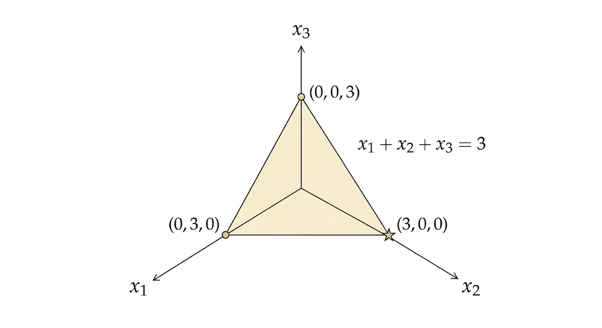
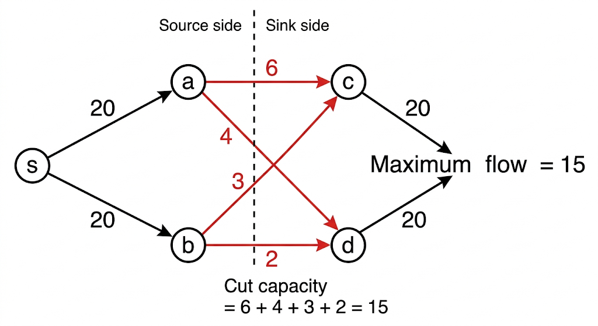
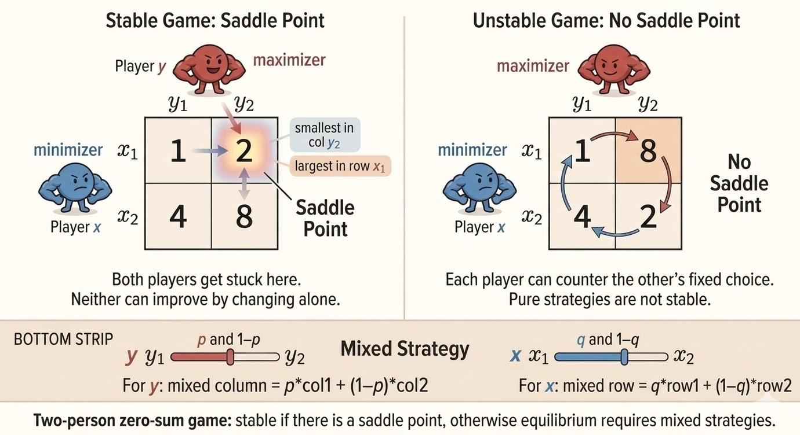



Linear programming is a clean example of constrained optimization where geometry, combinatorics, and duality all meet. This lecture connects three views of the same structure: feasible polytopes and vertices, primal-dual optimization, and minimax games.

## Linear Programming

A standard-form linear program is

$$
\begin{aligned}
\text{minimize} &\quad c^\top x \\
\text{subject to} &\quad Ax=b \\
&\quad x \ge 0.
\end{aligned}
$$

Here:

- $A \in \mathbb{R}^{m\times n}$
- $x \in \mathbb{R}^n$
- typically $m < n$, so the equality constraints leave degrees of freedom

The key geometric fact is that the feasible set is a polytope cut out by linear equalities and inequalities.

## Example: A Triangle in R^3

Consider

$$
\begin{aligned}
\text{minimize} &\quad x_1+2x_2+5x_3 \\
\text{subject to} &\quad x_1+x_2+x_3=3 \\
&\quad x \ge 0.
\end{aligned}
$$

The equation $x_1+x_2+x_3=3$ defines a plane. The nonnegativity constraint restricts us to the first octant. Their intersection is a triangle with vertices

$$
(3,0,0),\qquad (0,3,0),\qquad (0,0,3).
$$

Evaluating the objective at the vertices gives costs

$$
3,\qquad 6,\qquad 15,
$$

so the minimum occurs at $(3,0,0)$.

## Why the Simplex Method Works

The simplex method moves from one vertex of the feasible polytope to a neighboring vertex with lower cost.

Why can we search only vertices? Because the objective is linear. Its level sets are parallel hyperplanes, and when we slide them in the direction of decreasing cost, the first contact with the feasible region occurs at a vertex.

So linear programming reduces a continuous optimization problem to a combinatorial search over corner points.

### Complexity

Each vertex corresponds to a basic feasible solution: choose $m$ basic variables from $n$ total variables, solve the $m$ equations, and set the other $n-m$ variables to zero.

The number of such choices is at most

$$
\binom{n}{m}.
$$

This grows combinatorially. For example,

$$
\binom{100}{50} \approx 10^{29}.
$$

So brute-force vertex enumeration is impossible. The simplex method is much smarter than enumeration, but in the worst case it can still take exponentially many steps.

## Karmarkar and Interior-Point Methods

Karmarkar's key idea was to stop walking along edges and instead move through the interior of the feasible set.

Basic pattern:

1. Start from an interior point.
2. Compute a descent direction.
3. Move while staying strictly feasible.
4. Repeat.

This leads to interior-point methods, which solve linear programs in polynomial time and opened a new algorithmic era beyond simplex.

## The Dual of a Linear Program

Start from the primal problem

$$
\begin{aligned}
\text{minimize} &\quad c^\top x \\
\text{subject to} &\quad Ax=b \\
&\quad x \ge 0.
\end{aligned}
$$

Introduce a dual variable $y$ for the equality constraint $Ax=b$. The Lagrangian is

$$
L(x,y)=c^\top x + y^\top(b-Ax).
$$

Rearrange it as

$$
L(x,y)=b^\top y + x^\top(c-A^\top y).
$$

The dual function is

$$
g(y)=\inf_{x\ge 0} L(x,y).
$$

For this infimum to stay finite, we must have

$$
c-A^\top y \ge 0,
$$

otherwise some component of $x$ can push the value to $-\infty$.

So

$$
g(y)=
\begin{cases}
b^\top y, & A^\top y \le c \\
-\infty, & \text{otherwise}.
\end{cases}
$$

Maximizing the dual function gives the dual LP:

$$
\begin{aligned}
\text{maximize} &\quad b^\top y \\
\text{subject to} &\quad A^\top y \le c.
\end{aligned}
$$

This is the central duality pattern of LP: a minimization over $x$ becomes a maximization over $y$, and equality constraints in the primal become inequality constraints in the dual.

For feasible linear programs with finite optimum, strong duality holds:

$$
\text{primal optimum} = \text{dual optimum}.
$$

## Max Flow = Min Cut

The max-flow min-cut theorem is one of the most concrete examples of LP duality.

- The **primal** problem is max flow: send as much flow as possible through the network subject to capacity and conservation constraints.
- The **dual** problem is min cut: find the smallest bottleneck separating source from sink.

Weak duality says every feasible flow is bounded above by every cut capacity. Strong duality says that at optimum these two values match exactly:

$$
\text{max flow} = \text{min cut}.
$$

This is duality made visual: one problem pushes flow forward, the other identifies the tightest obstruction.

## Two-Person Zero-Sum Games

A two-person zero-sum game is a minimax problem.

- The row player chooses a row and wants the payoff to be small.
- The column player chooses a column and wants the payoff to be large.
- The matrix entry is the payoff from the row player to the column player.

If a saddle point exists, pure strategies are enough. Otherwise both players randomize and use mixed strategies.

For payoff matrix $A$, the game value is governed by the minimax identity

$$
\max_q \min_p\; p^\top A q
\;=
\;\min_p \max_q\; p^\top A q,
$$

where $p$ and $q$ are probability vectors over rows and columns.

The mixed-strategy constraints are

$$
p_i \ge 0,\quad \sum_i p_i = 1,
\qquad
q_j \ge 0,\quad \sum_j q_j = 1.
$$

This can be written as a pair of dual linear programs.

- Row player (minimizer): choose $p$ and value $v$ so that every column payoff is at most $v$.
- Column player (maximizer): choose $q$ and value $w$ so that every row payoff is at least $w$.

So the minimax theorem for zero-sum games is another face of LP duality.

### Intuition

Each player protects against the opponent's best response.

- The minimizer wants to make the worst possible column as harmless as possible.
- The maximizer wants to make the weakest row as profitable as possible.

At equilibrium, both players randomize in a way that makes the opponent indifferent among their active choices.

## Why This Feels Related to GANs

GANs are also posed as a min-max game:

$$
\min_G \max_D \; \mathbb{E}_{x\sim p_{\text{data}}}[\log D(x)] + \mathbb{E}_{z\sim p(z)}[\log(1-D(G(z)))].
$$

The generator tries to reduce the objective, while the discriminator tries to increase it. Conceptually this is close to a two-person zero-sum game: two players, opposing objectives, equilibrium behavior.

The difference is structural:

- classical zero-sum games use finite payoff matrices and clean LP geometry
- GANs use continuous neural-network parameters and nonconvex optimization

So the adversarial idea is shared, but the optimization landscape is much harder in GAN training.

## Takeaways

- Linear programs optimize linear objectives over polyhedral feasible sets.
- Vertices matter because linear objectives achieve optima at corners.
- Simplex exploits vertex structure; interior-point methods exploit interior geometry.
- The dual LP comes directly from the Lagrangian and the finiteness condition on the dual function.
- Max-flow=min-cut and minimax games are both concrete realizations of LP duality.

*Source: MIT 18.065 Matrix Methods in Data Analysis, Signal Processing, and Machine Learning, Lecture 24.*
