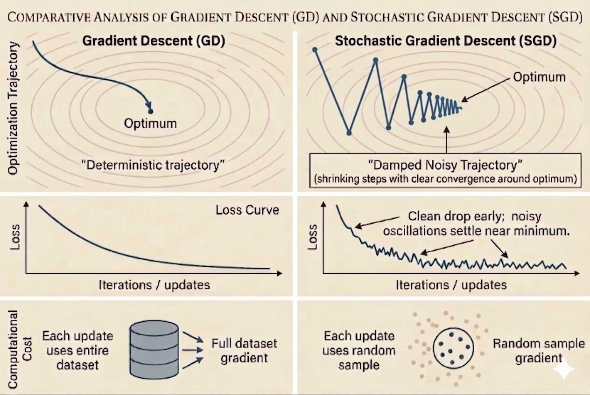
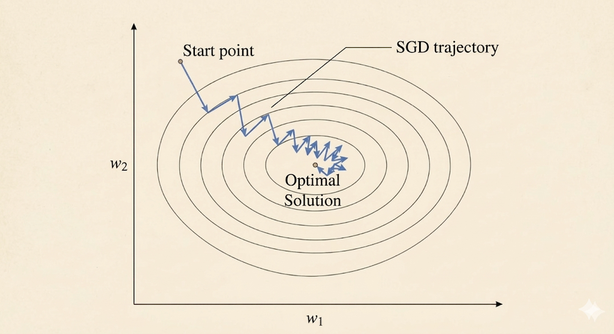
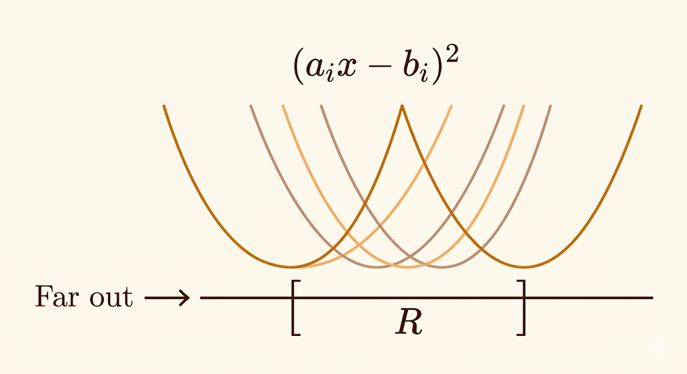

<iframe width="100%" height="500" src="https://www.youtube.com/embed/k3AiUhwHQ28" title="MIT 18.065 Lecture 25: Stochastic Gradient Descent" frameborder="0" allow="accelerometer; autoplay; clipboard-write; encrypted-media; gyroscope; picture-in-picture; web-share" allowfullscreen></iframe>

Many optimization problems in machine learning have the same structure: the objective is an average of per-sample losses. This lecture explains why that structure leads naturally to stochastic gradient descent, and why the noise in SGD is both its strength and its limitation.

## Finite-Sum Problems

A large class of models can be written as

$$
f(x)=\frac{1}{n}\sum_{i=1}^n f_i(x).
$$

Examples:

### Least Squares

$$
\frac{1}{n}\|Ax-b\|^2
=
\frac{1}{n}\sum_{i=1}^n (a_i^\top x-b_i)^2
=
\frac{1}{n}\sum_{i=1}^n f_i(x).
$$

### Lasso

$$
\frac{1}{n}\|Ax-b\|^2+\lambda \|x\|_1
=
\frac{1}{n}\sum_{i=1}^n (a_i^\top x-b_i)^2 + \lambda \sum_j |x_j|.
$$

### Support Vector Machine

$$
\frac{1}{2}\|x\|_2^2 + \frac{C}{n}\sum_{i=1}^n \max\bigl(0,1-y_i(x^\top a_i+b)\bigr).
$$

### Deep Neural Networks

$$
\frac{1}{n}\sum_{i=1}^n \text{loss}\bigl(y_i,\mathcal{DNN}(x;a_i)\bigr)
=
\frac{1}{n}\sum_{i=1}^n f_i(x).
$$

This finite-sum form is the reason SGD exists as a specialized optimization method.

## Why SGD?

Full gradient descent uses

$$
x_{k+1}=x_k-\eta_k \nabla f(x_k)
=
x_k-\eta_k \frac{1}{n}\sum_{i=1}^n \nabla f_i(x_k).
$$

The drawback is cost: when $n$ is huge, computing the whole gradient every step is too expensive.

SGD replaces the full average with one randomly selected sample index $i(k)$:

$$
x_{k+1}=x_k-\eta_k \nabla f_{i(k)}(x_k).
$$

Each update is roughly $n$ times cheaper, which is why SGD scales to massive datasets.

## Why SGD Fluctuates

A common empirical pattern is:

- early iterations drop the loss quickly
- near the optimum, the iterates fluctuate instead of settling smoothly

This is not a bug. It is the direct consequence of using noisy per-sample gradients.

## Geometric Intuition

Consider a 1D least-squares objective where each sample contributes

$$
f_i(x)=(a_i x-b_i)^2.
$$

Each $f_i$ is its own parabola with its own minimizer

$$
x_i^*=\frac{b_i}{a_i}.
$$

Let

$$
R=[\min_i x_i^*,\max_i x_i^*].
$$

Then the global optimum of the whole dataset lies somewhere inside this region.

Two phases explain the SGD dynamics:

1. Far outside $R$, all sample gradients roughly point in the same direction, so SGD moves consistently toward the solution region.
2. Inside $R$, different samples pull in different directions, creating a tug-of-war that makes the iterates bounce around.

This is why SGD needs either a decaying learning rate or averaging if we want the fluctuations to shrink.

## The Key Idea: Unbiased Gradient Estimates

SGD works because its noisy gradient is unbiased:

$$
\mathbb{E}[g(x)] = \nabla f(x).
$$

Here:

- $\nabla f(x)$ is the true full-dataset gradient
- $g(x)$ is the stochastic gradient from one random sample

A single stochastic step may point in a bad direction, but on average these steps line up with the true descent direction.

That is the central tradeoff:

- exact gradient: expensive and stable
- stochastic gradient: cheap and noisy

## Two Sampling Variants

### With Replacement

At each step, pick an index uniformly from $\{1,\dots,n\}$ independently of previous picks.

- easiest to analyze mathematically
- standard form in convergence proofs
- can revisit some samples many times before seeing others

### Without Replacement

Shuffle the dataset once per epoch and then visit each sample exactly once.

- standard in practical machine learning code
- usually converges faster in practice
- harder to analyze theoretically

This is the difference between textbook SGD and the reshuffling used in most libraries.

## Mini-Batch SGD

Mini-batch SGD averages a small subset $J_k$ of samples:

$$
x_{k+1}
=
x_k-\frac{\eta_k}{|J_k|}\sum_{j\in J_k}\nabla f_j(x_k).
$$

It sits between:

- batch gradient descent: use all samples
- SGD: use one sample

Why mini-batches matter:

- GPUs are efficient on matrix-matrix operations, so processing 32 or 64 samples together is often almost as cheap as processing one
- distributed training reduces communication overhead by synchronizing less often
- a little noise can help optimization and generalization

Very large mini-batches are not always favorable for deep learning, because they reduce gradient noise and can hurt the final generalization behavior.

## Takeaways

- Many ML objectives are finite sums, which makes SGD a natural algorithmic match.
- SGD is cheap because it replaces the full gradient by one sample or a small batch.
- Near the optimum, sample gradients conflict, so fluctuations are expected.
- The reason SGD still works is unbiasedness: the noisy gradient points in the correct direction on average.
- In practice, shuffled passes and mini-batches are the default compromise between theory and hardware efficiency.

*Source: MIT 18.065 Matrix Methods in Data Analysis, Signal Processing, and Machine Learning, Lecture 25.*
