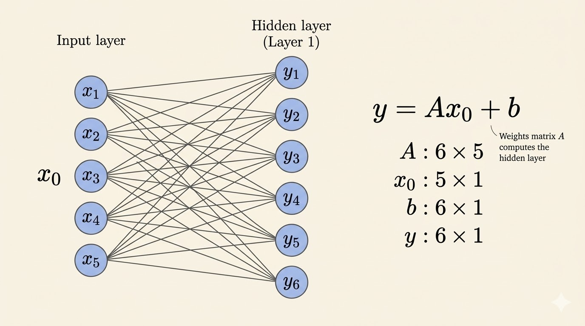
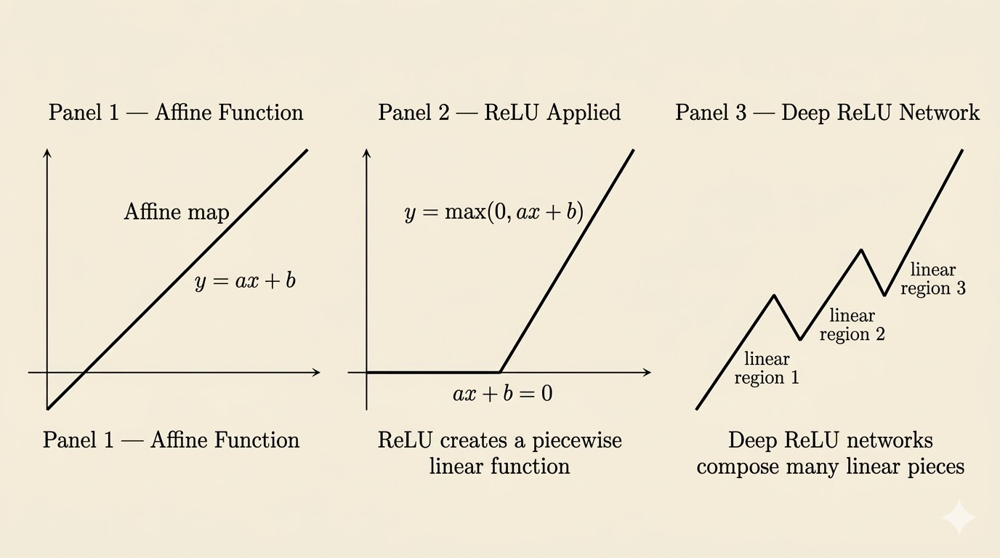

<iframe width="100%" height="500" src="https://www.youtube.com/embed/sx00s7nYmRM" title="MIT 18.065 Lecture 26: Structure of Neural Nets for Deep Learning" frameborder="0" allow="accelerometer; autoplay; clipboard-write; encrypted-media; gyroscope; picture-in-picture; web-share" allowfullscreen></iframe>

This lecture shifts from optimization to the structure of neural networks themselves. The main message is geometric: a deep ReLU network is a composition of affine maps and nonlinear activations, and that composition produces a continuous piecewise linear function.

## Terms

### Training Data

Suppose the training set contains feature vectors

$$
x^{(1)}, x^{(2)}, \dots, x^{(N)} \in \mathbb{R}^m.
$$

Each sample is an $m$-dimensional vector:

$$
x =
\begin{bmatrix}
x_1 \\
\vdots \\
x_m
\end{bmatrix}.
$$

### Classification

For binary classification, the sign of the output determines the predicted class:

- if the label is $+1$, we want $F(x) > 0$
- if the label is $-1$, we want $F(x) < 0$

### Activation Function

The standard ReLU activation is

$$
\operatorname{ReLU}(x) = \max(0,x).
$$

ReLU is nonlinear, and that nonlinearity is what allows the network to represent nonlinear behavior.

### Hidden Layer

A hidden layer is an intermediate layer between the input and the output.

- it receives the output of the previous layer
- it applies a new affine map plus activation
- it is called "hidden" because it is not directly the input data or the final prediction

### Weights

The weights are the entries of the matrix $A_\ell$ in layer $\ell$.

They determine how strongly each coordinate from the previous layer influences each neuron in the next layer.

### Bias

The bias vector $b_\ell$ shifts the affine map before activation.

Without bias, every affine map would be forced to pass through the origin, which would make the network less flexible.

### Output Layer

The output layer is the final layer that produces the prediction:

- for binary classification, it may output one score whose sign determines the class
- for multi-class classification, it may output several scores, one for each class
- depending on the task, the final activation may be identity, sigmoid, or softmax

### Epochs

An epoch is one full pass through the training data.

With mini-batch SGD:

1. each step processes one mini-batch and updates the parameters once
2. one epoch is completed when the processed mini-batches together cover the full training set
3. before the next epoch, the data are usually shuffled and visited again

## Structure of a Network

To keep the notation simple, start with the smallest nontrivial example: one input layer, one hidden layer, and one output layer.

Assume:

- the input layer has dimension $n$
- the hidden layer has dimension $m$
- the output layer comes after that hidden layer

Then the map from input to hidden layer uses:

- the weight matrix is $A_1 \in \mathbb{R}^{m \times n}$
- the bias vector is $b_1 \in \mathbb{R}^m$

The first affine map is

$$
y_1 = A_1 x_0 + b_1,
$$

where $x_0$ is the input vector.

After the activation, the hidden representation becomes

$$
x_1 = \sigma(y_1).
$$

This is only a very simple example meant to show the dimensions and notation. A deep network just repeats the same pattern across many hidden layers.

So each layer does two things:

1. an affine transformation $Ax+b$
2. an elementwise nonlinear activation

### Weight, Bias, and Activation

- $A_\ell$: mixes coordinates from the previous layer
- $b_\ell$: shifts the affine map
- $\sigma$: bends the geometry by applying a nonlinear rule coordinate-wise

This pattern repeats layer by layer.

## Composition of Functions

A deep network is a composition of functions:

$$
F(x) = F_3(F_2(F_1(x))).
$$

For example:

- $F_1(x) = \operatorname{ReLU}(A_1x+b_1)$
- $F_2(x) = \operatorname{ReLU}(A_2x+b_2)$
- $F_3(x) = \operatorname{sigmoid}(A_3x+b_3)$

So deep learning is literally deep function composition.

## Continuous Piecewise Linear Functions

A continuous piecewise linear function is built from multiple linear pieces that join continuously.

- **piecewise linear**: the input space is divided into regions, and within each region the function is affine
- **continuous**: neighboring regions meet without gaps or jumps

For networks built from affine maps and ReLU activations, this is exactly what happens: the network is globally nonlinear, but locally affine on each region.

## ReLU as a Folding Operation

ReLU networks can be viewed geometrically as repeatedly folding space.

Each layer first applies an affine transformation, then ReLU introduces a boundary where the slope changes. In higher dimensions, that boundary is a hyperplane. Each new hyperplane can split existing regions into smaller affine pieces.

To count the maximum number of regions cut by $N$ hyperplanes in $\mathbb{R}^m$, let

$$
R(N,m)
$$

denote that maximum. Then the standard recursion is

$$
R(N,m) = R(N-1,m) + R(N-1,m-1).
$$

Interpretation:

- $R(N-1,m)$: the regions that already existed
- $R(N-1,m-1)$: the new regions created when the new hyperplane cuts across old ones

Expanding the recursion gives the closed form

$$
R(N,m) = \sum_{k=0}^{m} \binom{N}{k}.
$$

This is the maximum number of regions formed by $N$ hyperplanes in $m$ dimensions.

### Example: Two-Dimensional Case

For $m=2$,

$$
R(N,2) = \binom{N}{0} + \binom{N}{1} + \binom{N}{2}.
$$

With $N=3$,

$$
R(3,2) = 1 + 3 + 3 = 7.
$$

So three folds in the plane can create at most seven regions.

For neural networks, the exact region count across many layers is more complicated than a single hyperplane arrangement, but the intuition is the same: more neurons and more layers create more affine pieces, which increases expressive power.

## Takeaways

- A neural network layer applies an affine map followed by a nonlinear activation.
- ReLU is the key nonlinearity in this lecture, and it preserves continuity while creating piecewise linear structure.
- Deep networks are compositions of simpler functions.
- ReLU networks are globally nonlinear but locally affine on each region.
- Geometrically, deeper networks can be understood as repeatedly folding space into many linear pieces.

*Source: MIT 18.065 Matrix Methods in Data Analysis, Signal Processing, and Machine Learning, Lecture 26.*
