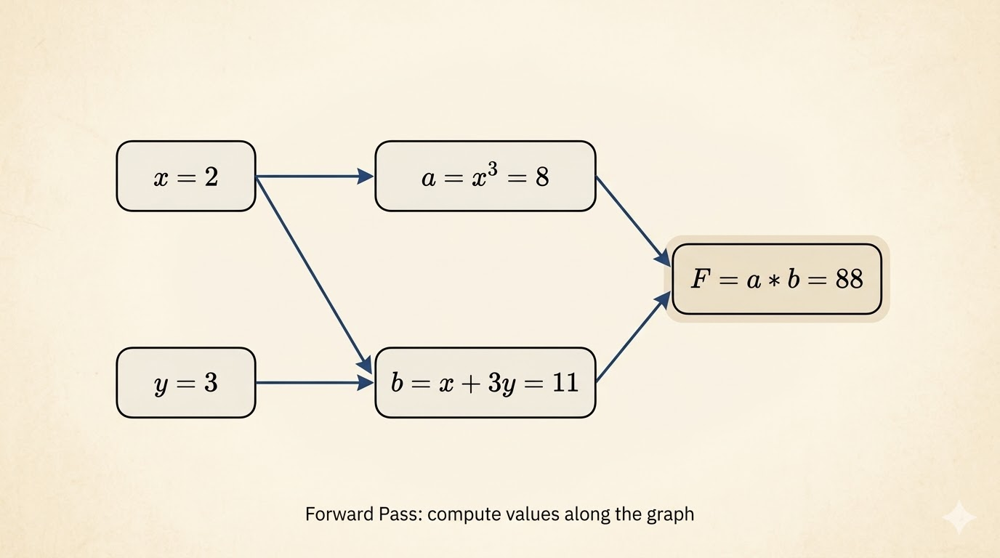
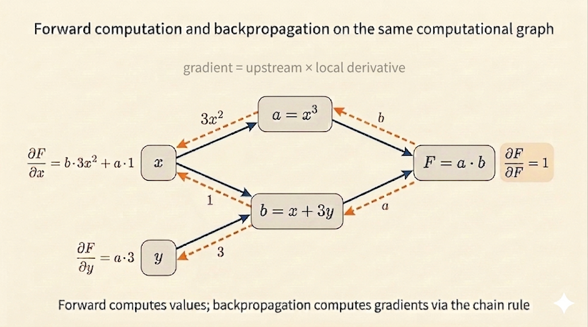

<iframe width="100%" height="500" src="https://www.youtube.com/embed/lZrIPRnoGQQ" title="Lecture 27: Back Propagation and Partial Gradients" frameborder="0" allow="accelerometer; autoplay; clipboard-write; encrypted-media; gyroscope; picture-in-picture; web-share" allowfullscreen></iframe>

This lecture explains backpropagation as the chain rule applied efficiently to a nested function. The point is not just how to differentiate a deep network, but why the backward order is computationally the right one.

## Structure of Deep Learning

A deep network is a composition of functions:

$$
F(x)=F_3(F_2(F_1(x))).
$$

Every layer takes the output of the previous layer and applies another transformation. Backpropagation computes how the final output changes with respect to each earlier variable or parameter.

### Example Function

Use

$$
F(x,y)=x^3(x+3y).
$$

Introduce intermediate variables:

$$
C=x^3,\qquad S=x+3y,\qquad F=C\cdot S.
$$

This turns one expression into a short computational graph.

## Forward Propagation

Take the concrete point

$$
x=2,\qquad y=3.
$$

Then the forward pass is

$$
C=x^3=8,\qquad S=x+3y=11,\qquad F=C\cdot S=88.
$$

The forward sweep computes values once and stores them for later reuse.

## Local Derivatives

Backpropagation needs only local derivatives at each node:

$$
\frac{\partial C}{\partial x}=3x^2,\qquad
\frac{\partial S}{\partial x}=1,\qquad
\frac{\partial S}{\partial y}=3.
$$

At $x=2$,

$$
\frac{\partial C}{\partial x}=3(2)^2=12.
$$

For the product node,

$$
\frac{\partial F}{\partial S}=C,\qquad
\frac{\partial F}{\partial C}=S.
$$

At the forward-pass values,

$$
\frac{\partial F}{\partial S}=8,\qquad
\frac{\partial F}{\partial C}=11.
$$

## Back Propagation

Now sweep backward from the output:

$$
\frac{\partial F}{\partial F}=1.
$$

Then propagate through the graph:

$$
\frac{\partial F}{\partial S}=C=8,\qquad
\frac{\partial F}{\partial C}=S=11.
$$

Finally combine these with the earlier local derivatives:

$$
\frac{\partial F}{\partial x}
=
\frac{\partial F}{\partial S}\frac{\partial S}{\partial x}
+
\frac{\partial F}{\partial C}\frac{\partial C}{\partial x}
=8\cdot 1+11\cdot 12=140,
$$

and

$$
\frac{\partial F}{\partial y}
=
\frac{\partial F}{\partial S}\frac{\partial S}{\partial y}
=8\cdot 3=24.
$$

This is the core logic of backpropagation: the gradient at one node is the downstream gradient multiplied by the local derivative.

## Famous Derivatives and Automatic Differentiation

Backpropagation reuses a small library of basic derivatives:

- $x^n \mapsto nx^{n-1}$
- $\sin x \mapsto \cos x$
- $\cos x \mapsto -\sin x$
- $e^x \mapsto e^x$
- $\log x \mapsto \frac{1}{x}$

Automatic differentiation systems assemble these local rules into a full reverse sweep over the computational graph.

## Chain Rule Through a Network

For a deep network, the gradient of the loss with respect to an earlier parameter is a chain of derivatives:

$$
\frac{\partial \text{Loss}}{\partial w_i}
=
\frac{\partial \text{Loss}}{\partial \text{layer}_n}
\cdot
\frac{\partial \text{layer}_n}{\partial \text{layer}_{n-1}}
\cdots
\frac{\partial \text{layer}_{i+1}}{\partial w_i}.
$$

So each parameter's influence is filtered through every layer that comes after it.

This explains two practical facts:

- earlier layers depend on feedback from downstream layers
- if those downstream derivatives are tiny, the gradient signal can shrink, producing vanishing gradients

## Why Reverse-Mode Differentiation Is Efficient

The mathematics behind backpropagation is the associativity of matrix multiplication:

$$
A(BC)=(AB)C.
$$

The final answer is the same either way, but the cost can be radically different.

Suppose

$$
A:1\times 100,\qquad B:100\times 100,\qquad C:100\times 1000.
$$

Then:

- left-to-right style computes
  $$
  BC:\ 100\cdot100\cdot1000=10,\!000,\!000
  $$
  operations first, producing a large intermediate matrix
- right-to-left style computes
  $$
  AB:\ 1\cdot100\cdot100=10,\!000
  $$
  operations first, producing only a row vector

The second step costs the same in both cases:

$$
1\cdot100\cdot1000=100,\!000.
$$

So the totals are:

| Order | Total Multiplications |
| --- | ---: |
| $A(BC)$ | $10,\!100,\!000$ |
| $(AB)C$ | $110,\!000$ |

This is the key computational insight:

- forward-mode can force large matrix-matrix intermediates
- reverse-mode starts from the scalar loss and keeps intermediate objects small
- backpropagation therefore gets all partial gradients at much lower cost

## Takeaways

- A deep network is a chain of functions, so its gradients come from repeated chain-rule application.
- Forward propagation computes and stores intermediate values.
- Backpropagation reuses those intermediates and multiplies local derivatives backward.
- The reverse order is not just mathematically correct; it is computationally much cheaper.

*Source: MIT 18.065 Lecture 27 on back propagation and partial gradients.*
