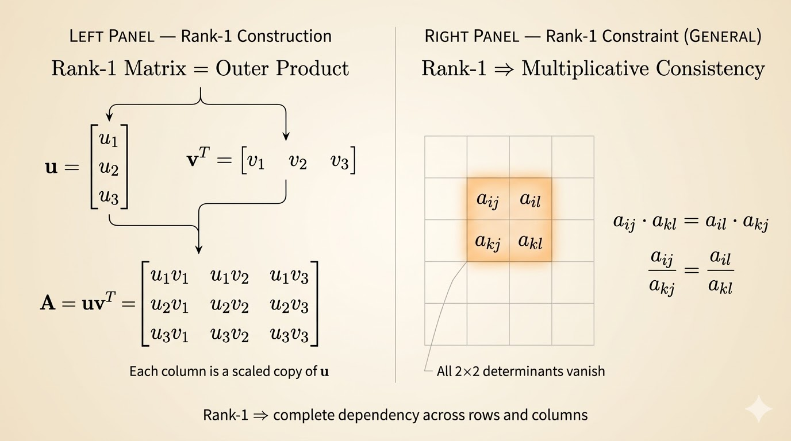
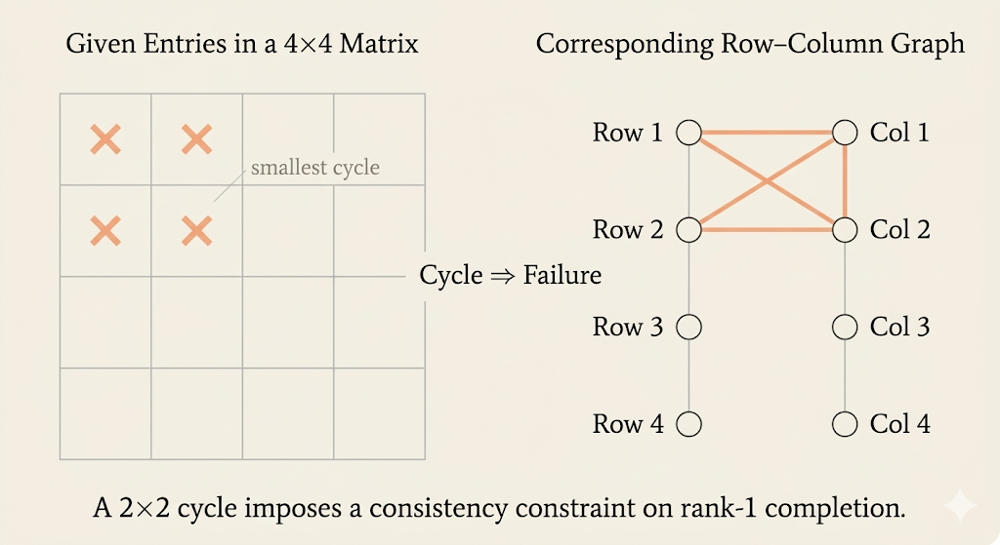
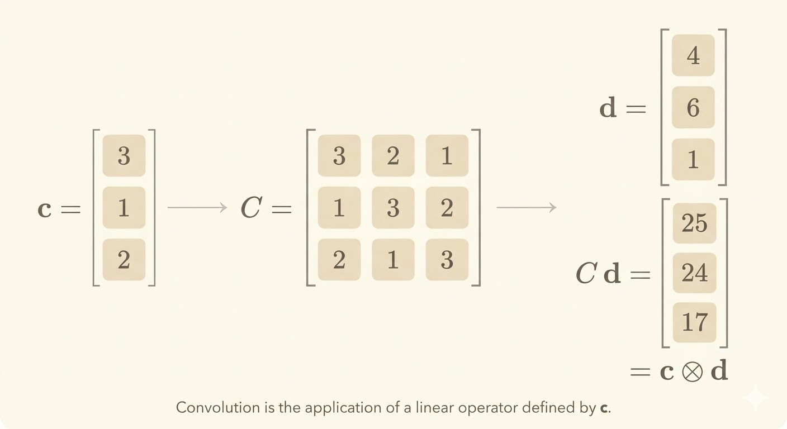
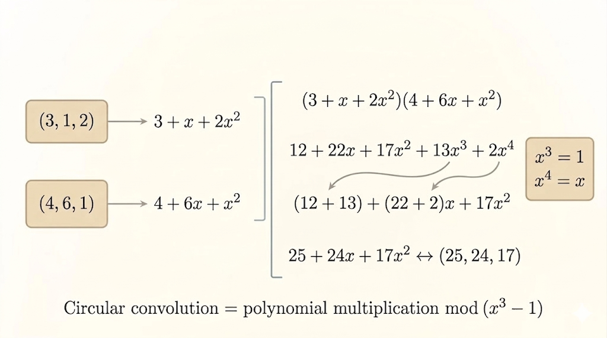

<iframe width="100%" height="480" src="https://www.youtube.com/embed/p-bXJIa7QVI" title="Lecture 30: Completing a Rank-1 Matrix, Circulants" frameborder="0" allowfullscreen></iframe>

This lecture combines two ideas that look separate at first:

- how to complete a rank-1 matrix from a small number of entries
- why circulant matrices are really convolution operators in disguise

## Completing a Rank-1 Matrix

A rank-1 matrix has the form

$$
A = uv^\top
$$

where both $u$ and $v$ are column vectors. Entrywise,

$$
a_{ij} = u_i v_j
$$

So once the row factors and column factors are fixed, the whole matrix is determined.

For an $m \times n$ rank-1 matrix, we need only

$$
m+n-1
$$

entries to determine the rest, provided those entries are placed in the right pattern and are nonzero.

For example, a $3 \times 3$ rank-1 matrix needs only

$$
3+3-1 = 5
$$

entries.

## Why Some Choices Fail

The count $m+n-1$ is necessary, but it is not sufficient by itself. The positions of the known entries matter.

### Algebraic View: Every $2 \times 2$ Minor Must Vanish

In a rank-1 matrix, every $2 \times 2$ submatrix must have determinant zero. So if we prescribe four arbitrary nonzero values in a full $2 \times 2$ block, they usually violate

$$
a_{11}a_{22} = a_{12}a_{21}
$$

and completion fails immediately.

### Graph View: Cycles Mean Failure

Professor Strang turns the same condition into a bipartite graph:

- left nodes are rows
- right nodes are columns
- each known entry is an edge between a row and a column

The rule is:

> Cycle = failure.

If the known entries form a cycle, then they impose one redundant constraint too many, which usually creates a contradiction. The successful pattern is a spanning tree on the row-column bipartite graph.

## Long Cycles Also Fail

The obstruction is not only a $2 \times 2$ block. A longer cycle also causes failure.

For example, a length-6 cycle inside a local $3 \times 3$ region prescribes too many entries for a rank-1 structure. A $3 \times 3$ rank-1 block only needs

$$
3+3-1 = 5
$$

entries, so six arbitrary nonzero entries typically overconstrain it.

The graph interpretation is the clean summary:

- no cycle: completion is possible
- any cycle: completion fails

## Circulant Matrices

A circulant matrix is a square matrix where each row is a cyclic shift of the previous row. For example,

$$
\begin{bmatrix}
2 & 1 & 0 & 5 \\
5 & 2 & 1 & 0 \\
0 & 5 & 2 & 1 \\
1 & 0 & 5 & 2
\end{bmatrix}
$$

can be built from the cyclic permutation matrix

$$
P =
\begin{bmatrix}
0 & 1 & 0 & 0 \\
0 & 0 & 1 & 0 \\
0 & 0 & 0 & 1 \\
1 & 0 & 0 & 0
\end{bmatrix}
$$

together with the identity matrix

$$
I =
\begin{bmatrix}
1 & 0 & 0 & 0 \\
0 & 1 & 0 & 0 \\
0 & 0 & 1 & 0 \\
0 & 0 & 0 & 1
\end{bmatrix}
$$

and its powers $P^2, P^3$.

For instance,

$$
P^2
\begin{bmatrix}
x_0 \\
x_1 \\
x_2 \\
x_3
\end{bmatrix}
=
\begin{bmatrix}
x_2 \\
x_3 \\
x_0 \\
x_1
\end{bmatrix}
$$

So powers of $P$ just rotate the entries.

## Every Circulant Matrix Is a Polynomial in $P$

Any $n \times n$ circulant matrix can be written as

$$
C = c_0 I + c_1 P + c_2 P^2 + \cdots + c_{n-1}P^{n-1}
$$

and similarly

$$
D = d_0 I + d_1 P + d_2 P^2 + \cdots + d_{n-1}P^{n-1}
$$

Since

$$
P^n = I,
$$

multiplying two such polynomials and reducing powers modulo $n$ gives another circulant matrix. So:

- circulants are closed under multiplication
- matrix multiplication becomes polynomial multiplication modulo $P^n=I$

## Matrix Multiplication = Circular Convolution

If

$$
C = \sum_i c_i P^i,
\qquad
D = \sum_j d_j P^j
$$

then

$$
CD = \sum_k e_k P^k
$$

where

$$
e_k = \sum_i c_i d_{k-i \;(\mathrm{mod}\; n)}
$$

This is exactly circular convolution.

## A Small Convolution Example

Take the vectors

$$
(3,1,2)
\qquad \text{and} \qquad
(4,6,1)
$$

Interpret them as polynomials

$$
3 + x + 2x^2
\qquad \text{and} \qquad
4 + 6x + x^2
$$

Their product is

$$
(3 + x + 2x^2)(4 + 6x + x^2)
= 12 + 22x + 17x^2 + 8x^3 + 2x^4
$$

For length $n=3$, circular convolution means working modulo

$$
x^3 - 1
$$

so

$$
x^3 = 1,
\qquad
x^4 = x
$$

and therefore

$$
12 + 22x + 17x^2 + 8x^3 + 2x^4
\equiv
20 + 24x + 17x^2
$$

Hence

$$
(3,1,2)\otimes(4,6,1) = (20,24,17)
$$

## Eigenvalues, Eigenvectors, and Fourier Modes

Because every circulant matrix is a polynomial in $P$, circulant matrices share the eigenvectors of $P$.

So we first solve

$$
Pv = \lambda v
$$

with the condition

$$
P^n = I
$$

which implies

$$
\lambda^n = 1
$$

Therefore the eigenvalues are the $n$th roots of unity:

$$
\lambda_k = \omega^k,
\qquad
\omega = e^{2\pi i/n},
\qquad
k=0,\dots,n-1
$$

The corresponding eigenvectors are

$$
v_k =
\begin{bmatrix}
1 \\
\omega^k \\
\omega^{2k} \\
\vdots \\
\omega^{(n-1)k}
\end{bmatrix}
$$

These are exactly the Fourier modes. That is why Fourier analysis diagonalizes circulant matrices.

## Takeaways

- A rank-1 matrix is determined by $m+n-1$ well-placed nonzero entries.
- The correct graph condition is tree vs cycle: any cycle creates failure.
- A circulant matrix is a polynomial in the shift matrix $P$.
- Multiplying circulant matrices is the same as circular convolution.
- The eigenvectors of circulants are Fourier modes, coming from the roots of unity.
