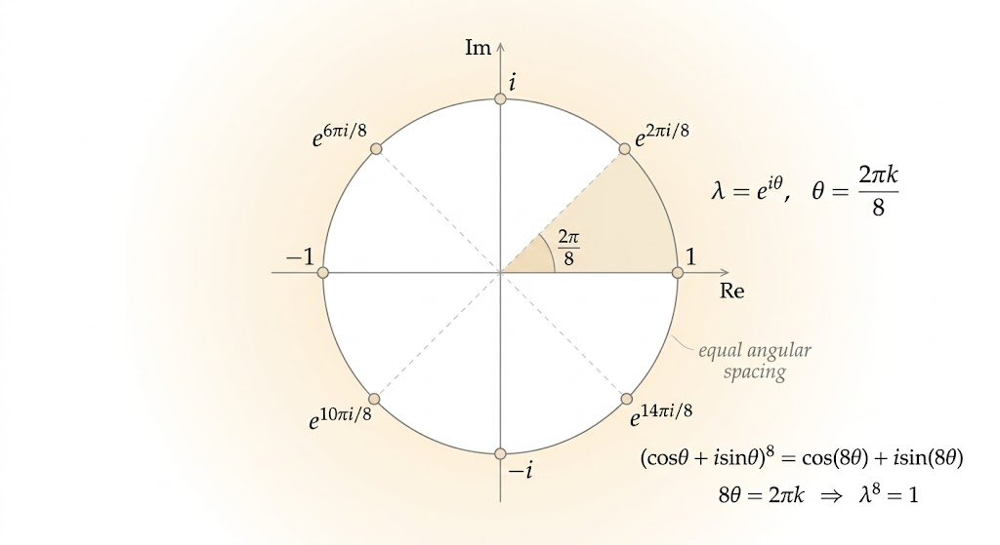
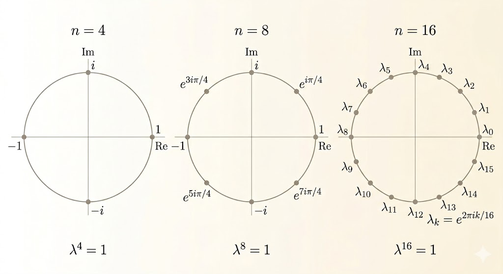

<iframe width="100%" height="500" src="https://www.youtube.com/embed/1pFv7e9xtHo" title="MIT 18.065 Lecture 31" frameborder="0" allowfullscreen></iframe>

A circulant matrix is built by shifting the first row cyclically:

$$
C =
\begin{bmatrix}
c_0 & c_1 & c_2 & \cdots & c_{N-1} \\
c_{N-1} & c_0 & c_1 & \cdots & c_{N-2} \\
c_{N-2} & c_{N-1} & c_0 & \cdots & c_{N-3} \\
\vdots & \vdots & \vdots & \ddots & \vdots \\
c_1 & c_2 & c_3 & \cdots & c_0
\end{bmatrix}.
$$

The key idea of the lecture is that circulant matrices are governed by the cyclic shift matrix, and that shift matrix is diagonalized by Fourier vectors.

## The Shift Matrix P

Let

$$
P =
\begin{bmatrix}
0 & 1 & 0 & 0 \\
0 & 0 & 1 & 0 \\
0 & 0 & 0 & 1 \\
1 & 0 & 0 & 0
\end{bmatrix}.
$$

Multiplying by $P$ shifts the entries of a vector upward by one position and wraps the first component to the bottom.

Every circulant matrix can be written as a polynomial in $P$:

$$
C = c_0 I + c_1 P + c_2 P^2 + \cdots + c_{N-1} P^{N-1}.
$$

So once the eigenvalues and eigenvectors of $P$ are known, the same structure extends to every circulant matrix.

## Eigenvalues of P

To find the eigenvalues, solve

$$
Px = \lambda x.
$$

For the $4 \times 4$ shift matrix, this is equivalent to solving

$$
\det(\lambda I - P) = 0.
$$

The characteristic equation is

$$
\lambda^4 - 1 = 0,
$$

so the eigenvalues are the fourth roots of unity:

- $1$
- $i$
- $-1$
- $-i$

Written in Euler form, these four values are

$$
e^{\pi i/2}=\cos(\pi/2)+i\sin(\pi/2)=i
$$

$$
e^{\pi i}=\cos(\pi)+i\sin(\pi)=-1
$$

$$
e^{3\pi i/2}=\cos(3\pi/2)+i\sin(3\pi/2)=-i
$$

$$
e^{2\pi i}=\cos(2\pi)+i\sin(2\pi)=1.
$$

For the $8 \times 8$ shift matrix, the characteristic equation becomes

$$
\lambda^8 = 1,
$$

so the eigenvalues are the eight roots of unity:

- $1$
- $e^{\pi i/4}$
- $i$
- $e^{3\pi i/4}$
- $-1$
- $e^{5\pi i/4}$
- $-i$
- $e^{7\pi i/4}$

For an $N \times N$ shift matrix, the same argument gives

$$
\lambda^N = 1,
$$

so the eigenvalues are the $N$th roots of unity:

$$
1,\; \omega,\; \omega^2,\; \dots,\; \omega^{N-1},
\qquad
\omega = e^{2\pi i / N}.
$$

This is the general solution: every eigenvalue of the shift matrix is a root of unity.

### Why These Numbers Work

The proof is short:

$$
e^{2\pi i} = \cos(2\pi) + i\sin(2\pi) = 1.
$$

So for any integer $k$,

$$
\left(e^{2\pi i k / N}\right)^N = e^{2\pi i k} = 1.
$$

That is exactly the condition $\lambda^N = 1$.

These points lie evenly on the unit circle in the complex plane.

## Eigenvectors of P

Now solve the vector equation itself. For the $4 \times 4$ shift matrix,

$$
Px = \lambda x
$$

gives the chain

$$
x_2 = \lambda x_1, \qquad
x_3 = \lambda x_2, \qquad
x_4 = \lambda x_3, \qquad
x_1 = \lambda x_4.
$$

If we choose $x_1 = 1$, then the eigenvector must be

$$
x =
\begin{bmatrix}
1 \\
\lambda \\
\lambda^2 \\
\lambda^3
\end{bmatrix}.
$$

Substituting the four eigenvalues gives four eigenvectors:

$$
\begin{bmatrix}1\\1\\1\\1\end{bmatrix},
\quad
\begin{bmatrix}1\\i\\-1\\-i\end{bmatrix},
\quad
\begin{bmatrix}1\\-1\\1\\-1\end{bmatrix},
\quad
\begin{bmatrix}1\\-i\\-1\\i\end{bmatrix}.
$$

In general, for $\lambda = \omega^k$, the eigenvector is

$$
v_k =
\begin{bmatrix}
1 \\
\omega^k \\
\omega^{2k} \\
\vdots \\
\omega^{(N-1)k}
\end{bmatrix}.
$$

## The Fourier Matrix

Placing these eigenvectors side by side gives the Fourier matrix:

$$
F_N =
\begin{bmatrix}
1 & 1 & 1 & \cdots & 1 \\
1 & \omega & \omega^2 & \cdots & \omega^{N-1} \\
1 & \omega^2 & \omega^4 & \cdots & \omega^{2(N-1)} \\
\vdots & \vdots & \vdots & \ddots & \vdots \\
1 & \omega^{N-1} & \omega^{2(N-1)} & \cdots & \omega^{(N-1)^2}
\end{bmatrix}.
$$

For example, when $N=8$,

$$
F_8 =
\begin{bmatrix}
1 & 1 & 1 & 1 & 1 & 1 & 1 & 1 \\
1 & W & W^2 & W^3 & W^4 & W^5 & W^6 & W^7 \\
1 & W^2 & W^4 & W^6 & W^8 & W^{10} & W^{12} & W^{14} \\
1 & W^3 & W^6 & W^9 & W^{12} & W^{15} & W^{18} & W^{21} \\
1 & W^4 & W^8 & W^{12} & W^{16} & W^{20} & W^{24} & W^{28} \\
1 & W^5 & W^{10} & W^{15} & W^{20} & W^{25} & W^{30} & W^{35} \\
1 & W^6 & W^{12} & W^{18} & W^{24} & W^{30} & W^{36} & W^{42} \\
1 & W^7 & W^{14} & W^{21} & W^{28} & W^{35} & W^{42} & W^{49}
\end{bmatrix},
$$

where $W = e^{2\pi i/8}$.

## Why Fourier Vectors Are Orthogonal

Two different Fourier vectors are orthogonal because their inner product becomes a geometric series:

$$
1 + \omega^m + \omega^{2m} + \cdots + \omega^{(N-1)m} = 0
\qquad (m \not\equiv 0 \mod N).
$$

Geometrically, these terms are equally spaced points on the unit circle, so they cancel out.

After normalization by $1/\sqrt{N}$, the Fourier matrix becomes unitary:

$$
U_N = \frac{1}{\sqrt{N}} F_N,
\qquad
U_N^* U_N = I.
$$

So the Fourier basis is the orthonormal eigenbasis of the shift matrix.

## Orthogonal, Unitary, and Normal Structure

This lecture also sits inside a bigger linear-algebra picture:

- symmetric matrices have real eigenvalues and orthogonal eigenvectors
- diagonal matrices already use the standard basis as eigenvectors
- orthogonal matrices satisfy $Q^\top Q = I$, so their eigenvalues lie on the unit circle
- skew-symmetric matrices push real vectors into perpendicular directions, which is why their eigenvalues are typically imaginary
- normal matrices are exactly the matrices that can be diagonalized by an orthonormal basis

The Fourier matrix belongs to this picture after normalization: it is unitary, so its columns are orthonormal complex eigenvectors.

## Circulant Matrices and Fourier Diagonalization

Since every circulant matrix is a polynomial in $P$, and $P$ is diagonalized by the Fourier matrix, every circulant matrix is diagonalized by the same basis:

$$
C = F \Lambda F^{-1}.
$$

The eigenvalues of $C$ are obtained by evaluating the circulant polynomial at the roots of unity.

This is the main structural fact behind fast convolution algorithms.

## Connection to Cyclic Convolution

Multiplying a circulant matrix by a vector is the same as cyclic convolution:

$$
Cv = c \circledast v.
$$

Because circulant matrices are diagonalized by the Fourier matrix, cyclic convolution can be computed in the Fourier domain:

$$
Cv = F \Lambda F^{-1} v.
$$

That is the linear algebra reason the FFT makes convolution fast: convolution becomes diagonal multiplication after moving into the Fourier basis.

## Takeaways

- the cyclic shift matrix has eigenvalues equal to the roots of unity
- its eigenvectors are Fourier vectors built from powers of those roots
- the Fourier matrix is the eigenvector matrix of the shift matrix
- every circulant matrix is diagonalized by the same Fourier basis
- cyclic convolution becomes simple multiplication in the Fourier domain
