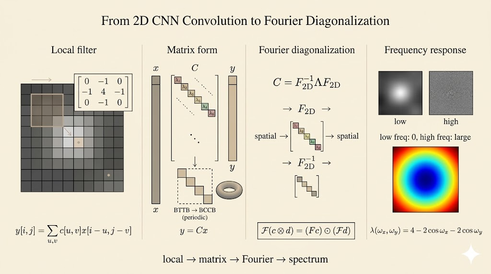

<iframe width="100%" height="500" src="https://www.youtube.com/embed/hwDRfkPSXng" title="MIT 18.065 Lecture 32" frameborder="0" allowfullscreen></iframe>

## Polynomial Model (Linear Algebra View)

### Discrete Form

From the linear algebra view, polynomial multiplication is the cleanest model for convolution.

If

$$
c(x) = c_0 + c_1x + c_2x^2 + \cdots, \qquad d(x) = d_0 + d_1x + d_2x^2 + \cdots,
$$

then the coefficient of $x^k$ in the product comes from all pairs whose exponents add to $k$:

$$
(c * d)_k = \sum_{i+j=k} c_i d_j = \sum_{i=0}^k c_i d_{k-i}.
$$

For example, the $x^2$ term is

$$
c_2d_0 + c_1d_1 + c_0d_2.
$$

That is exactly the convolution rule: fix the output index $k$, then multiply-and-sum every pair whose indices add to $k$.

### Continuous Form

There are two equivalent notational views:

- temporal view: $t$ is fixed, $x$ is the integration variable
- spatial view: $x$ is fixed, $t$ is the integration variable

$$
(f * g)(t) = \int_{-\infty}^{\infty} f(x) g(t-x)\,dx
$$

and equivalently

$$
(f * g)(x) = \int_{-\infty}^{\infty} f(t) g(x-t)\,dt.
$$

## Cyclic Convolution

In cyclic convolution, the shifts wrap around modulo $N$. This is the discrete version that matches circulant matrices and the Fourier basis.

Let

$$
w = e^{2\pi i/N}, \qquad w^N = 1.
$$

Then cyclic convolution is

$$
(c \circledast d)_k = \sum_{i=0}^{N-1} c_i d_{(k-i) \bmod N}.
$$

The key difference from ordinary convolution is the output size:

- ordinary convolution of lengths $p$ and $q$ has $p+q-1$ terms
- cyclic convolution on length $N$ always has exactly $N$ terms

### Eigenvalues of a Circulant Matrix

For a $4 \times 4$ circulant matrix,

$$
C = c_0 I + c_1 P + c_2 P^2 + c_3 P^3,
$$

where $P$ is the cyclic shift matrix.

Its eigenvalues are obtained by evaluating the associated polynomial at powers of $w$:

$$
\lambda_k = c_0 + c_1 w^k + c_2 (w^k)^2 + c_3 (w^k)^3.
$$

If $F$ is the Fourier matrix, then

$$
FC = \Lambda F
$$

and therefore

$$
C = F^{-1} \Lambda F.
$$

This is the diagonalization that turns cyclic convolution into component-wise multiplication.

## Convolution Theorem

Convolve first and then transform, or transform separately and multiply component-wise: they give the same result.

$$
F(c \circledast d) = (Fc) .* (Fd).
$$

This is the main computational reason Fourier analysis matters:

- direct convolution costs about $N^2$
- FFT computes the transform in about $N \log N$

So FFT-based convolution can be dramatically faster for large problems.

## 2D Convolution and the Laplacian

### Second Derivative in 1D

The first discrete derivative is

$$
u_i - u_{i-1},
$$

so the second discrete derivative is the change of that difference:

$$
(u_{i+1} - u_i) - (u_i - u_{i-1}) = u_{i+1} - 2u_i + u_{i-1}.
$$

This leads to the tridiagonal matrix

$$
A = \begin{bmatrix}
2 & -1 & 0 \\
-1 & 2 & -1 \\
0 & -1 & 2
\end{bmatrix}
\approx -\frac{d^2u}{dx^2}.
$$

The same stencil appears in the $y$-direction:

$$
B = \begin{bmatrix}
2 & -1 & 0 \\
-1 & 2 & -1 \\
0 & -1 & 2
\end{bmatrix}
\approx -\frac{d^2u}{dy^2}.
$$

### 2D Laplacian Kernel

In two dimensions, the Laplacian stencil becomes

$$
K = \begin{bmatrix}
0 & -1 & 0 \\
-1 & 4 & -1 \\
0 & -1 & 0
\end{bmatrix}
\approx -\frac{d^2u}{dx^2} - \frac{d^2u}{dy^2}.
$$

This kernel is the classical edge detector: flat regions mostly disappear, while rapid local changes become large.

## Connections

### 1. The Physical Action: 2D Filters and Convolution

In a CNN, a small kernel slides over a large image. At each location it performs an element-wise multiply-and-sum, producing one output number.

Mathematically, the same operation has two views:

- algebraically, it matches bivariate polynomial multiplication, where $x$ and $y$ represent spatial shifts
- in linear algebra, it can be written as a huge sparse matrix acting on a flattened image vector

### 2. The Boundary Problem and the Cyclic Assumption

Ordinary image boundaries break perfect shift symmetry.

A common mathematical simplification is to impose periodic boundary conditions: the image wraps around, like Pac-Man leaving one side and re-entering from the other. With that assumption, the convolution matrix becomes circulant in 1D and doubly block circulant in 2D.

That is the structure Fourier diagonalizes.

### 3. The Fourier View

The eigenvectors of circulant matrices are the Fourier basis vectors. So cyclic convolution becomes diagonal in the Fourier domain.

That is the structural content of the convolution theorem:

$$
F(c \circledast d) = (Fc) .* (Fd).
$$

Instead of one globally coupled convolution, the Fourier transform breaks the problem into many independent scalar multiplications.

### 4. Why It Matters

Even when practical CNN implementations use direct matrix-multiply kernels instead of FFT, the Fourier view is still the cleanest way to analyze what a filter is doing.

For example, the Laplacian suppresses low frequencies and amplifies high frequencies. That is why it highlights edges.

## Takeaways

- polynomial multiplication is the simplest discrete model of convolution
- cyclic convolution is the version naturally tied to circulant matrices and Fourier diagonalization
- the convolution theorem explains why FFT accelerates large convolutions
- in 2D, convolution kernels like the Laplacian connect differential operators, image filtering, and Fourier analysis
