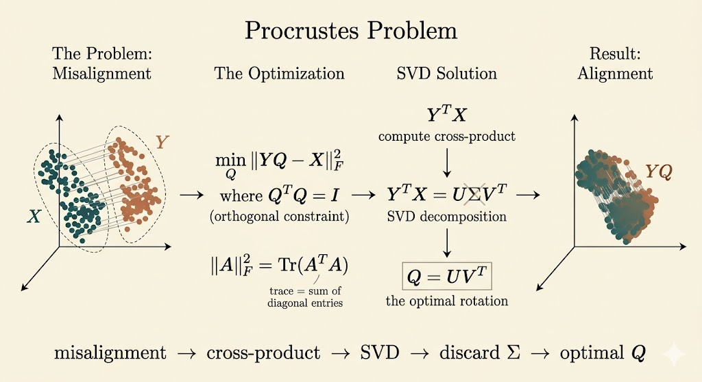

<iframe width="100%" height="500" src="https://www.youtube.com/embed/0Qws8BuK3RQ" title="MIT 18.065 Lecture 34" frameborder="0" allowfullscreen></iframe>

## From Distances to Geometry

Suppose we know only pairwise distances between points and want to decide whether those points can actually live in Euclidean space.

Let

$$
D_{ij} = \|x_i - x_j\|^2
$$

be the squared distance matrix. The key idea is that distances are not arbitrary: they must come from an inner-product matrix

$$
G = X^\top X,
$$

where $X = [x_1,\dots,x_n]$ contains the point coordinates. Since every Gram matrix has the form $X^\top X$, it must be positive semidefinite.

That gives a clean test:

- start from squared distances
- recover the Gram matrix
- check whether that Gram matrix is PSD

If it is not PSD, then the distances cannot come from real Euclidean points.

## Triangle Inequality Example

Suppose three points are claimed to satisfy

$$
\|x_1-x_2\|^2 = 1, \qquad
\|x_2-x_3\|^2 = 1, \qquad
\|x_1-x_3\|^2 = 6.
$$

The actual distances are therefore

$$
d_{12}=1, \qquad d_{23}=1, \qquad d_{13}=\sqrt{6}.
$$

But the triangle inequality would require

$$
d_{13} \le d_{12} + d_{23} = 2,
$$

and $\sqrt{6} > 2$. So these three points cannot exist in Euclidean space.

This is the geometric check. The matrix check reaches the same conclusion.

## Distance Matrix and Gram Matrix

For any points $x_i$ and $x_j$,

$$
\|x_i-x_j\|^2
= x_i^\top x_i + x_j^\top x_j - 2x_i^\top x_j.
$$

If $G = (g_{ij}) = X^\top X$, then

$$
D_{ij} = g_{ii} + g_{jj} - 2g_{ij}.
$$

So $D$ is determined by the Gram matrix. The reverse direction is also possible after centering.

Let

$$
J = I - \frac{1}{n}\mathbf{1}\mathbf{1}^\top.
$$

This subtracts the mean, so multiplying by $J$ centers the point cloud. For centered data, the Gram matrix is recovered by the double-centering formula

$$
G = -\frac{1}{2}JDJ.
$$

This formula is the bridge from distances back to inner products.

## PSD Test for the Example

For the example above,

$$
D =
\begin{bmatrix}
0 & 1 & 6 \\
1 & 0 & 1 \\
6 & 1 & 0
\end{bmatrix}.
$$

Applying double-centering gives

$$
G = -\frac{1}{2}JDJ
=
\begin{bmatrix}
\frac{13}{9} & \frac{1}{9} & -\frac{14}{9} \\
\frac{1}{9} & -\frac{2}{9} & \frac{1}{9} \\
-\frac{14}{9} & \frac{1}{9} & \frac{13}{9}
\end{bmatrix}.
$$

Its eigenvalues are

$$
3,\quad 0,\quad -\frac{1}{3}.
$$

The negative eigenvalue means $G$ is not positive semidefinite, so the squared distances do not come from any Euclidean configuration. This matches the triangle-inequality failure.

The broader lesson is:

- a valid Euclidean squared distance matrix produces a PSD Gram matrix after double-centering
- if the recovered Gram matrix has a negative eigenvalue, the geometry is impossible

## Procrustes Problem

The second topic in the lecture asks a different question: if two point clouds already exist, how do we align one to the other as well as possible?

Given a target matrix $X$ and a current configuration $Y$, the orthogonal Procrustes problem is

$$
\min_{Q^\top Q = I} \|YQ - X\|_F^2.
$$

Here $Q$ is constrained to be orthogonal, so it can rotate or reflect the data but cannot scale or shear it.

## Why the Frobenius Norm Becomes a Trace Problem

The Frobenius norm satisfies

$$
\|A\|_F^2 = \operatorname{trace}(A^\top A).
$$

So

$$
\|YQ - X\|_F^2
= \operatorname{trace}((YQ-X)^\top (YQ-X)).
$$

Expand:

$$
\|YQ - X\|_F^2
= \operatorname{trace}(Q^\top Y^\top YQ)
- 2\operatorname{trace}(Q^\top Y^\top X)
+ \operatorname{trace}(X^\top X).
$$

Since $Q^\top Q = I$,

$$
\operatorname{trace}(Q^\top Y^\top YQ)
= \operatorname{trace}(Y^\top Y),
$$

which is constant with respect to $Q$. Therefore minimizing the Frobenius norm is equivalent to maximizing

$$
\operatorname{trace}(Q^\top Y^\top X).
$$

## SVD Solution

Take the singular value decomposition of the cross-matrix:

$$
Y^\top X = U\Sigma V^\top.
$$

Then

$$
\operatorname{trace}(Q^\top Y^\top X)
= \operatorname{trace}(Q^\top U\Sigma V^\top).
$$

Using cyclic invariance of trace, define

$$
Z = U^\top Q V.
$$

Because $Q$, $U$, and $V$ are orthogonal, $Z$ is also orthogonal. Then

$$
\operatorname{trace}(Q^\top Y^\top X)
= \operatorname{trace}(Z^\top \Sigma)
= \sum_i \sigma_i z_{ii}.
$$

For an orthogonal matrix, each diagonal entry satisfies $|z_{ii}| \le 1$, so

$$
\operatorname{trace}(Z^\top \Sigma) \le \sum_i \sigma_i.
$$

The maximum is achieved when $Z = I$, which means

$$
Q = UV^\top.
$$

So the orthogonal Procrustes problem has the elegant closed-form answer

$$
Q_{\star} = UV^\top,
\qquad \text{where } Y^\top X = U\Sigma V^\top.
$$

This is a beautiful pattern: the singular values measure how well the two point clouds match, and the orthogonal part $UV^\top$ gives the best rigid alignment.

## Interpretation

- the distance-matrix part of the lecture asks whether geometry is feasible at all
- the Procrustes part assumes geometry exists and asks for the best orthogonal alignment
- both topics reduce geometry to matrix structure: PSD for feasibility, SVD for alignment

If we also impose $\det(Q)=1$, then reflections are forbidden and the problem becomes the rotation-only version often used in shape matching and point-cloud alignment.

## Takeaways

- squared Euclidean distances determine a centered Gram matrix through $G = -\frac{1}{2}JDJ$
- valid Euclidean distance data must produce a positive semidefinite Gram matrix
- triangle inequality failure and a negative Gram-matrix eigenvalue are two views of the same inconsistency
- the orthogonal Procrustes problem reduces to maximizing a trace
- the best orthogonal alignment is obtained from the SVD of $Y^\top X$ via $Q_\star = UV^\top$
