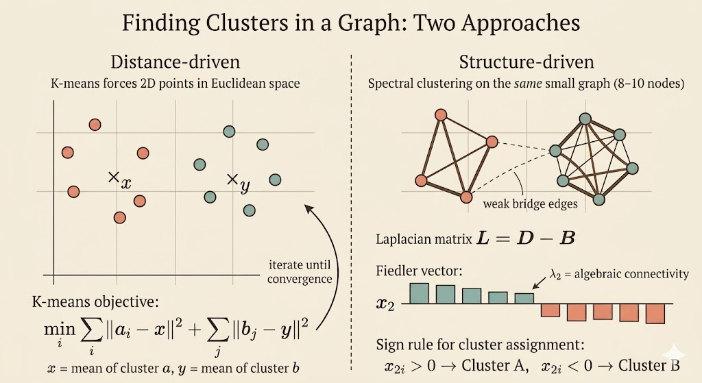

<iframe width="100%" height="500" src="https://www.youtube.com/embed/cxTmmasBiC8" title="MIT 18.065 Lecture 35" frameborder="0" allowfullscreen></iframe>

## Clustering as an Optimization Problem

Suppose a set of points is split into two groups,

$$
a = \{a_1,\dots,a_r\},
\qquad
b = \{b_1,\dots,b_s\},
\qquad
a \cup b = g,
\qquad
a \cap b = \emptyset,
$$

and we want the best centers $x$ and $y$ for those two groups. The objective is

$$
\min_{x,y}\;
\sum_{i=1}^r \|a_i-x\|^2
\;+\;
\sum_{j=1}^s \|b_j-y\|^2.
$$

For fixed assignments, this separates into two independent least-squares problems. For example,

$$
f(x) = \sum_{i=1}^r \|a_i-x\|^2.
$$

Differentiate with respect to $x$:

$$
\nabla f(x)
= 2\sum_{i=1}^r (x-a_i)
= 2rx - 2\sum_{i=1}^r a_i.
$$

Setting the gradient to zero gives

$$
x_\star = \frac{1}{r}\sum_{i=1}^r a_i.
$$

So the best center of a cluster is its centroid. The same argument gives

$$
y_\star = \frac{1}{s}\sum_{j=1}^s b_j.
$$

This is the basic K-means update: once memberships are fixed, each center moves to the mean of its assigned points.

## K-means Alternates Two Steps

For two clusters, K-means repeats:

1. start with centers $x$ and $y$
2. assign each point to the closer center
3. recompute each center as the centroid of its assigned cluster
4. repeat until the assignments stop changing

This is simple and effective, but it is still a nonconvex problem: different starting points can lead to different local minima.

## From Point Clouds to Graphs

When the data is naturally a graph, the question changes slightly. We no longer begin with coordinates in Euclidean space. Instead, we know which nodes are connected, and we want to separate the graph into groups that are strongly connected internally and weakly connected to each other.

That is where spectral clustering enters: it turns the combinatorial partition problem into an eigenvalue problem.

## Incidence, Degree, and Adjacency Matrices

Consider the graph from the lecture with 4 nodes and 5 edges:

```{mermaid}
graph TD
    1((Node 1)) -->|Edge 1| 2((Node 2))
    1 -->|Edge 2| 3((Node 3))
    1 -->|Edge 3| 4((Node 4))
    2 -->|Edge 4| 3
    2 -->|Edge 5| 4
```

Choose an orientation for each edge and form the incidence matrix $M$. Since there are 5 edges and 4 nodes, $M$ is a $5\times 4$ matrix:

$$
M =
\begin{bmatrix}
-1 & 1 & 0 & 0 \\
-1 & 0 & 1 & 0 \\
-1 & 0 & 0 & 1 \\
0 & -1 & 1 & 0 \\
0 & -1 & 0 & 1
\end{bmatrix}.
$$

The degree matrix records how many edges touch each node:

$$
D =
\begin{bmatrix}
3 & 0 & 0 & 0 \\
0 & 3 & 0 & 0 \\
0 & 0 & 2 & 0 \\
0 & 0 & 0 & 2
\end{bmatrix}.
$$

The adjacency matrix records whether two nodes are connected:

$$
B =
\begin{bmatrix}
0 & 1 & 1 & 1 \\
1 & 0 & 1 & 1 \\
1 & 1 & 0 & 0 \\
1 & 1 & 0 & 0
\end{bmatrix}.
$$

## The Graph Laplacian

The graph Laplacian is

$$
L = D - B.
$$

For an incidence matrix with edges as rows and nodes as columns, the same matrix is also

$$
L = M^\top M.
$$

That shape matters: here $M$ is $5\times 4$, so $M^\top M$ is $4\times 4$, matching the node-by-node Laplacian. This is the correct identity for the matrices in the lecture.

For the example above,

$$
L =
\begin{bmatrix}
3 & -1 & -1 & -1 \\
-1 & 3 & -1 & -1 \\
-1 & -1 & 2 & 0 \\
-1 & -1 & 0 & 2
\end{bmatrix}.
$$

Each row sums to zero, so

$$
L\mathbf{1} = 0,
\qquad
\mathbf{1} =
\begin{bmatrix}
1 \\ 1 \\ 1 \\ 1
\end{bmatrix}.
$$

Therefore $\lambda_1=0$ and the all-ones vector is an eigenvector.

There is a deeper reason $L$ is well behaved:

$$
x^\top Lx = x^\top M^\top Mx = \|Mx\|^2 \ge 0.
$$

So the Laplacian is always positive semidefinite.

## Why the Second Eigenvector Finds the Split

The first eigenvector is uninformative for clustering because it is constant on every node. To find the first nontrivial variation across the graph, we solve

$$
\min_{x \perp \mathbf{1},\;\|x\|=1} x^\top Lx.
$$

By the Rayleigh quotient, the minimizer is the eigenvector associated with the second-smallest eigenvalue $\lambda_2$. This eigenvector is called the Fiedler vector.

Its entries tell us how the graph wants to separate:

- nodes with similar values in the Fiedler vector tend to stay together
- a sign change often indicates the weakest connection across the graph
- splitting by positive versus negative entries gives a natural two-way partition

The eigenvalue $\lambda_2$ is the algebraic connectivity. If $\lambda_2$ is small, the graph is close to falling into two pieces. If $\lambda_2=0$, the graph is already disconnected.

## Visual Intuition

The picture below shows the usual spectral-clustering story: dense connections inside each group, but only a weak bridge between them. The Fiedler vector tends to keep one sign on the left cluster and the opposite sign on the right cluster.



## Interpretation

- K-means says: if the memberships are known, the best center is the centroid
- spectral clustering says: if the data is a graph, use the Laplacian eigenvectors to discover the memberships
- the bridge between them is linear algebra: both methods turn clustering into matrix structure and optimization

The main lesson of the lecture is that graph partitioning is not solved by guessing cuts directly. It is relaxed into an eigenvalue problem, and the second eigenvector carries the first meaningful clustering signal.
