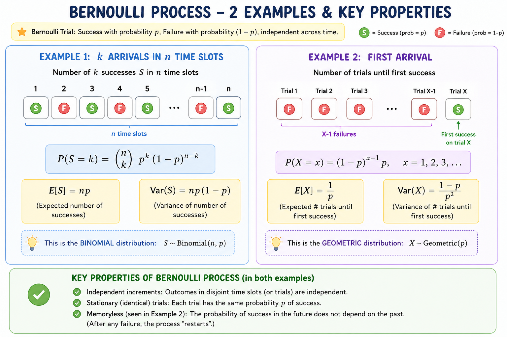
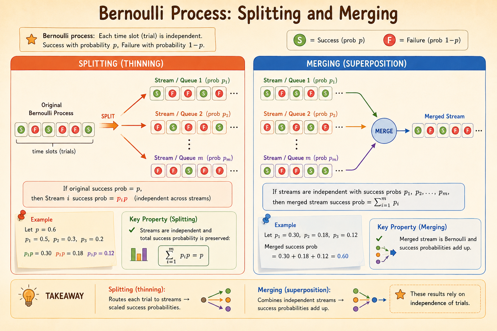

<iframe width="100%" height="500" src="https://www.youtube.com/embed/gMTiAeE0NCw" title="MIT 6.041 Probability: Bernoulli Process" frameborder="0" allowfullscreen></iframe>

A **Bernoulli process** is the simplest discrete-time arrival model: at every time slot, the same independent experiment is repeated.

Each trial has

$$
P(X_i = 1) = p,
\qquad
P(X_i = 0) = 1-p.
$$

Here $X_i=1$ means success or arrival in slot $i$, while $X_i=0$ means failure or no arrival.

# Definition

A Bernoulli process is a sequence

$$
X_1, X_2, X_3, \ldots
$$

where the random variables are independent and identically distributed Bernoulli random variables with parameter $p$.

Examples:

- lottery win/loss outcomes across repeated plays
- daily up/down movements of a stock index
- arrivals in discrete time slots, where $1$ means someone arrives and $0$ means no one arrives

# Basic Properties

For a Bernoulli random variable $X$ with parameter $p$,

$$
\mathbb{E}[X]
=
1\cdot p + 0\cdot(1-p)
=
p.
$$

Because $X^2=X$ for $X\in\{0,1\}$,

$$
\mathbb{E}[X^2] = p.
$$

Therefore,

$$
\operatorname{Var}(X)
=
\mathbb{E}[X^2] - \left(\mathbb{E}[X]\right)^2
=
p-p^2
=
p(1-p).
$$

The Bernoulli process is **memoryless in discrete time**: knowing previous outcomes does not change the distribution of future outcomes. Even after a long streak of failures, the next trial still has success probability $p$.

This is the discrete-time analogue of the Poisson process, which is memoryless in continuous time.

# Number of Successes in Fixed Time

Let

$$
S_n = X_1 + X_2 + \cdots + X_n
$$

be the number of successes in the first $n$ slots. Then $S_n$ follows a binomial distribution:

$$
P(S_n=k)
=
\binom{n}{k}p^k(1-p)^{n-k}.
$$

Its expectation and variance are

$$
\mathbb{E}[S_n] = np,
\qquad
\operatorname{Var}(S_n) = np(1-p).
$$

The intuition is direct: $S_n$ adds $n$ independent Bernoulli indicators.

# First Arrival Time

Let $T_1$ be the number of trials until the first success. To have the first success at time $t$, the first $t-1$ trials must fail and trial $t$ must succeed:

$$
P(T_1=t)
=
(1-p)^{t-1}p,
\qquad t=1,2,\ldots
$$

So $T_1$ follows a geometric distribution with

$$
\mathbb{E}[T_1] = \frac{1}{p},
\qquad
\operatorname{Var}(T_1) = \frac{1-p}{p^2}.
$$

# Time of the $k^{\text{th}}$ Success

Let $Y_k$ be the time of the $k^{\text{th}}$ success. For the $k^{\text{th}}$ success to happen exactly at time $t$:

1. there must be exactly $k-1$ successes in the first $t-1$ trials
2. trial $t$ must be a success

Thus,

$$
P(Y_k=t)
=
\binom{t-1}{k-1}p^k(1-p)^{t-k},
\qquad t\ge k.
$$

This is the negative binomial waiting-time distribution.

We can also view $Y_k$ as the sum of $k$ independent geometric waiting times:

$$
Y_k = T_1 + T_2 + \cdots + T_k.
$$

Therefore,

$$
\mathbb{E}[Y_k]
=
\frac{k}{p},
\qquad
\operatorname{Var}(Y_k)
=
\frac{k(1-p)}{p^2}.
$$

For example, if one arrival takes $10$ minutes on average, then three arrivals take $30$ minutes on average.

# Splitting

Suppose arrivals follow a Bernoulli process with arrival probability $p$ in each time slot. Each arrival is then independently routed to Server 1 with probability $q$ and to Server 2 with probability $1-q$.

For Server 1 to see an arrival in a slot:

1. an arrival must occur in the original process, probability $p$
2. the arrival must be routed to Server 1, probability $q$

So Server 1 sees a Bernoulli process with probability

$$
pq.
$$

Similarly, Server 2 sees a Bernoulli process with probability

$$
p(1-q).
$$

Each split stream is Bernoulli across time, because the original arrivals and routing decisions are independent across slots.

# Merging

Now suppose there are two independent Bernoulli arrival streams:

- Stream 1 has arrival probability $p$
- Stream 2 has arrival probability $q$

The merged process records $1$ if at least one stream has an arrival in the slot, and $0$ otherwise.

It is easier to compute the probability of no arrival:

$$
P(\text{no arrival})
=
(1-p)(1-q).
$$

Therefore, the merged arrival probability is

$$
1-(1-p)(1-q)
=
p+q-pq.
$$

So the merged stream is also a Bernoulli process, with parameter $p+q-pq$.

# Takeaways

- A Bernoulli process is an independent sequence of success/failure trials.
- Counts in a fixed number of slots follow a binomial distribution.
- Waiting time until the first success follows a geometric distribution.
- Waiting time until the $k^{\text{th}}$ success follows a negative binomial distribution.
- Splitting and merging preserve the Bernoulli-process structure, but change the success probability.

*Source: MIT 6.041 Probabilistic Systems Analysis and Applied Probability, Bernoulli Process.*
