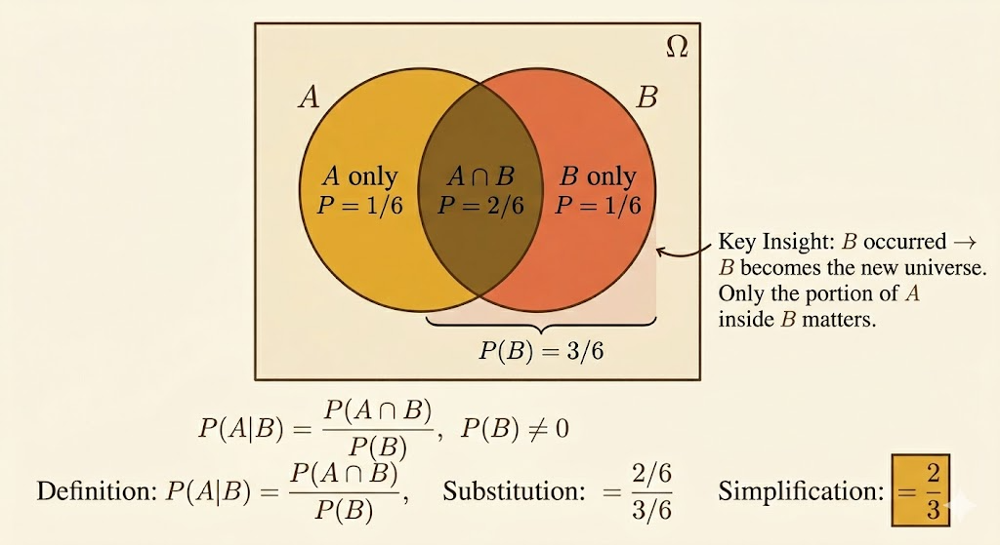
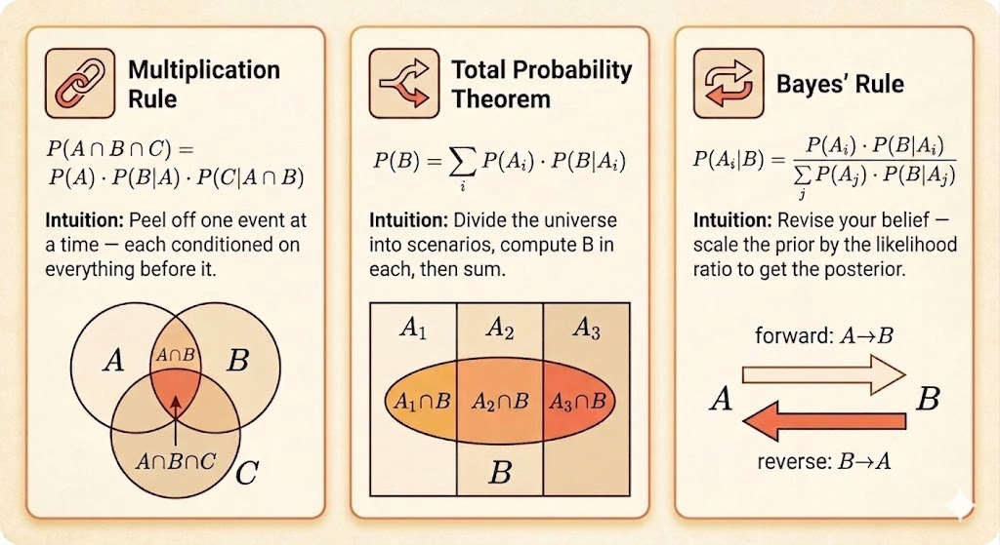

<iframe width="100%" height="500" src="https://www.youtube.com/embed/TluTv5V0RmE" title="MIT 6.041 Probability: Conditioning and Bayes' Rule" frameborder="0" allowfullscreen></iframe>

## Conditioning

Conditional probability answers the question:

> after learning that event $B$ happened, how should we revise the probability of $A$?

The definition is

$$
P(A \mid B) = \frac{P(A \cap B)}{P(B)},
\qquad P(B) > 0.
$$

So conditioning does not invent a new probability law. It rescales the old one onto the smaller world where $B$ is known to have occurred.

Two immediate consequences are:

$$
P(A \cap B) = P(B)\,P(A \mid B)
$$

and, symmetrically,

$$
P(A \cap B) = P(A)\,P(B \mid A).
$$

Whenever new information arrives, conditional probability is the mathematical way to update our beliefs.



## Conditional Additivity

If $A$ and $C$ are disjoint, then conditioning preserves additivity:

$$
P(A \cup C \mid B) = P(A \mid B) + P(C \mid B).
$$

The reason is simple: inside the conditioned world $B$, the events $A \cap B$ and $C \cap B$ are still disjoint.

## Example: Two Rolls of a 4-Sided Die

Roll a 4-sided die twice and write the outcome as $(X,Y)$.

Let

$$
B = \{\min(X,Y)=2\}.
$$

The outcomes in $B$ are:

$$
(2,2), (2,3), (2,4), (3,2), (4,2).
$$

So

$$
P(B)=\frac{5}{16}.
$$

Now let

$$
M = \max(X,Y).
$$

Then:

- $P(M=1 \mid B)=0$, because $\min(X,Y)=2$ already forces both rolls to be at least 2
- $P(M=2 \mid B)=\frac{1}{5}$, because only $(2,2)$ works

You can also compute the second one from the definition:

$$
P(M=2 \mid B)
= \frac{P(M=2 \cap B)}{P(B)}
= \frac{1/16}{5/16}
= \frac{1}{5}.
$$

This is a good example of what conditioning does: once we know $\min(X,Y)=2$, the original uniform $16$-point sample space collapses to just $5$ admissible outcomes.

## Multiplication Rule

For three events,

$$
P(A \cap B \cap C)
= P(A)\,P(B \mid A)\,P(C \mid A \cap B).
$$

This comes from applying the two-event multiplication rule twice:

$$
P(A \cap B \cap C)
= P((A \cap B)\cap C)
= P(A \cap B)\,P(C \mid A \cap B)
= P(A)\,P(B \mid A)\,P(C \mid A \cap B).
$$

The general pattern is:

$$
P(A_1 \cap A_2 \cap \cdots \cap A_n)
= P(A_1)P(A_2 \mid A_1)\cdots P(A_n \mid A_1 \cap \cdots \cap A_{n-1}).
$$

## Total Probability

Suppose $A_1,\dots,A_n$ form a partition of the sample space:

- they are disjoint
- their union is the whole sample space

Then any event $B$ can be decomposed as

$$
B = (B \cap A_1)\cup \cdots \cup (B \cap A_n),
$$

with disjoint pieces. Therefore

$$
P(B)=\sum_{i=1}^n P(B \cap A_i)
= \sum_{i=1}^n P(A_i)\,P(B \mid A_i).
$$

This is the total probability formula.

```{mermaid}
graph LR
    Start(( )) --> A1[A1]
    Start --> A2[A2]
    Start --> A3[A3]

    A1 --> BA1["B ∩ A1"]
    A1 --> BcA1["B^c ∩ A1"]

    A2 --> BA2["B ∩ A2"]
    A2 --> BcA2["B^c ∩ A2"]

    A3 --> BA3["B ∩ A3"]
    A3 --> BcA3["B^c ∩ A3"]
```

Conceptually, this says:

- first choose which case $A_i$ happened
- then ask how likely $B$ is inside that case

## Bayes' Rule

Now reverse the conditioning direction.

If $A_1,\dots,A_n$ form a partition and $P(B)>0$, then

$$
P(A_i \mid B)
= \frac{P(A_i \cap B)}{P(B)}
= \frac{P(A_i)\,P(B \mid A_i)}{\sum_j P(A_j)\,P(B \mid A_j)}.
$$

This is Bayes' rule.

It has a clean interpretation:

- $P(A_i)$ is the prior belief
- $P(B \mid A_i)$ is the likelihood
- $P(A_i \mid B)$ is the posterior belief after seeing evidence $B$

So Bayes' rule is fundamentally a rule for belief revision.



## Radar Example

Let:

- $A$ = "a plane is present"
- $B$ = "the radar reports a signal"

Suppose:

$$
P(A)=0.05, \qquad P(A^c)=0.95,
$$

$$
P(B \mid A)=0.99, \qquad P(B \mid A^c)=0.10.
$$

### Step 1: Joint Probability

$$
P(A \cap B)=P(A)\,P(B \mid A)=0.05 \cdot 0.99 = 0.0495.
$$

### Step 2: Total Probability of a Signal

Using total probability,

$$
P(B)=P(A)P(B \mid A)+P(A^c)P(B \mid A^c)
$$

so

$$
P(B)=0.05\cdot 0.99 + 0.95\cdot 0.10 = 0.1445.
$$

### Step 3: Posterior Probability of a Plane

Now apply Bayes' rule:

$$
P(A \mid B)=\frac{P(A \cap B)}{P(B)}
= \frac{0.0495}{0.1445}
\approx 0.343.
$$

So even after a positive radar signal, the probability that a plane is actually present is only about $34.3\%$.

This is the classic lesson:

- the radar is very sensitive
- but false alarms are not rare
- and planes are rare to begin with

Rare priors can dominate strong-looking evidence.

## Takeaways

- conditioning means revising probabilities after learning new information
- the multiplication rule converts conditional probabilities into joint probabilities
- the total probability formula sums over a partition of mutually exclusive cases
- Bayes' rule reverses conditioning and turns priors into posteriors
- in applications, the base rate matters as much as the sensor accuracy
