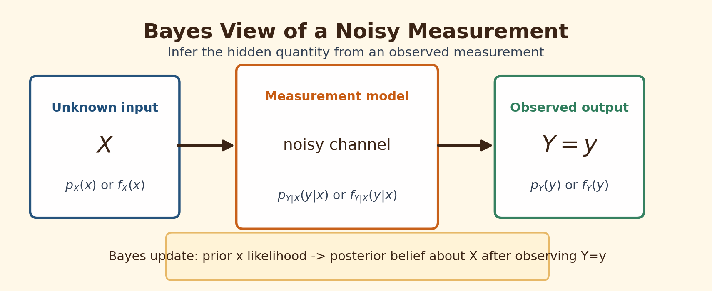
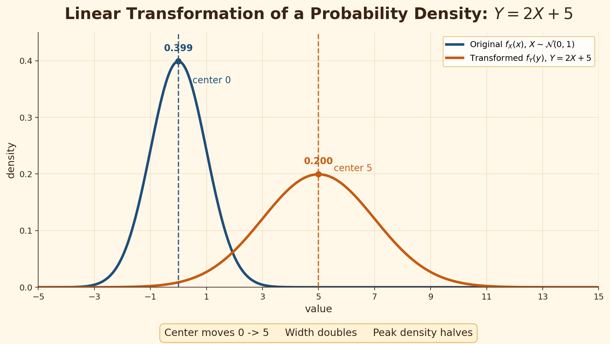

<iframe width="100%" height="500" src="https://www.youtube.com/embed/H_k1w3cfny8" title="MIT 6.041 Probability: Continuous Bayes' Rule and Derived Distributions" frameborder="0" allowfullscreen></iframe>

This lecture connects two recurring probability themes:

- how Bayes' rule works when densities replace probabilities
- how to derive the distribution of a new random variable from an old one

The main shift is conceptual. In continuous models, point probabilities are zero, so inference and transformation are expressed through PDFs, CDFs, and integrals.

## The Bayes Variation

The Bayes setup can be viewed as a noisy measurement process.

There is an unknown quantity $X$, a device or channel that produces an observation, and an observed output $Y$.

### Input: $X$

$X$ is the true underlying signal or quantity we want to infer. Examples include the actual temperature, a transmitted signal, or the location of an aircraft.

- $p_X(x)$: prior PMF for $X$ when $X$ is discrete.
- $f_X(x)$: prior PDF for $X$ when $X$ is continuous.

### Measurement Model

The measurement model describes the randomness or noise in the observation process. It tells us how likely each output is for a given input.

- $p_{Y|X}(y|x)$: conditional PMF in the discrete case.
- $f_{Y|X}(y|x)$: conditional PDF in the continuous case.

### Output: $Y$

$Y$ is the actual measurement or observation. Once we observe $Y=y$, Bayes' rule updates our belief about the hidden input $X$.

## Examples

### Discrete Example: Radar

The radar example is a discrete Bayes model.

- $X=1$: an airplane is present.
- $X=0$: no airplane is present.
- $Y=1$: something registers on the radar screen.
- $Y=0$: nothing registers on the radar screen.

The conditional PMF $p_{Y|X}(y|x)$ captures false alarms and missed detections:

- $p_{Y|X}(1|0)$: false alarm probability.
- $p_{Y|X}(0|1)$: missed detection probability.

After observing $Y=y$, the posterior $p_{X|Y}(x|y)$ tells us how likely it is that an airplane is actually present.

### Continuous Example: Signal plus Noise

The signal example is a continuous Bayes model.

- $X$: the true underlying signal.
- $f_X(x)$: prior density over possible signal values.
- $Y$: the noisy version of $X$ that we observe.
- $f_{Y|X}(y|x)$: the noise model.

After observing $Y=y$, continuous Bayes' rule gives $f_{X|Y}(x|y)$, the posterior density over the true signal.

## Bayes' Rule

For discrete random variables:

$$
p_{X|Y}(x|y)
=
\frac{p_X(x)p_{Y|X}(y|x)}{p_Y(y)}
$$

where

$$
p_Y(y)
=
\sum_x p_X(x)p_{Y|X}(y|x).
$$

For continuous random variables:

$$
f_{X|Y}(x|y)
=
\frac{f_X(x)f_{Y|X}(y|x)}{f_Y(y)}
$$

where

$$
f_Y(y)
=
\int_{-\infty}^{\infty}
f_X(x)f_{Y|X}(y|x)\,dx.
$$

The structure is the same:

$$
\text{posterior}
=
\frac{\text{prior}\times \text{likelihood}}{\text{evidence}}.
$$

The denominator normalizes the posterior so it integrates or sums to 1.

## Mixed Cases in Bayesian Inference

Bayes' rule can mix discrete and continuous random variables. The main rule is to match the type of the variable being inferred.

- If $X$ is discrete, the posterior over $X$ is a PMF.
- If $X$ is continuous, the posterior over $X$ is a PDF.
- The denominator is always the marginal distribution of the observation $Y$.

### Discrete $X$, Continuous $Y$

Here $X$ takes discrete values, but the observation $Y$ is continuous.

The posterior over $X$ is a PMF:

$$
p_{X|Y}(x|y)
=
\frac{p_X(x)f_{Y|X}(y|x)}{f_Y(y)}.
$$

The marginal density of $Y$ is

$$
f_Y(y)
=
\sum_x p_X(x)f_{Y|X}(y|x).
$$

Example: a discrete signal is sent through a continuous noisy channel. After observing $Y=y$, the posterior $p_{X|Y}(x|y)$ tells us which discrete signal value was most likely sent.

### Continuous $X$, Discrete $Y$

Here $X$ is continuous, but the observation $Y$ is discrete.

The posterior over $X$ is a PDF:

$$
f_{X|Y}(x|y)
=
\frac{f_X(x)p_{Y|X}(y|x)}{p_Y(y)}.
$$

The marginal PMF of $Y$ is

$$
p_Y(y)
=
\int_{-\infty}^{\infty}
f_X(x)p_{Y|X}(y|x)\,dx.
$$

Example: a continuous physical quantity affects a discrete measurement or decision. After observing $Y=y$, the posterior $f_{X|Y}(x|y)$ gives a density over possible values of the continuous signal.

## Derived Distributions

A derived distribution is the distribution of a new random variable defined as a function of one or more existing random variables.

If $Y=g(X)$ and the distribution of $X$ is known, the distribution of $Y$ is derived from the distribution of $X$.

### Discrete Case

For a discrete random variable $X$, collect all input values that map to the same output value $y$:

$$
p_Y(y)
=
P(g(X)=y)
=
\sum_{x:g(x)=y} p_X(x).
$$

### Continuous Case

For a continuous random variable $X$, it is often easiest to start from the CDF:

$$
F_Y(y)
=
P(Y\le y)
=
P(g(X)\le y).
$$

Then translate the event back into the $X$ domain and integrate the known density $f_X(x)$ over the corresponding region.

Once $F_Y(y)$ is known, differentiate:

$$
f_Y(y)
=
\frac{d}{dy}F_Y(y).
$$

## Example: Derived Distribution of Travel Time

Suppose the distance is fixed, but the speed is random.

- Distance: $D=200$ miles.
- Speed: $V\sim \operatorname{Uniform}(30,60)$ mph.
- Time: $T=200/V$ hours.

The PDF of the speed is

$$
f_V(v)
=
\frac{1}{30},
\qquad
30\le v\le 60.
$$

The goal is to find $f_T(t)$.

### Step 1: Determine the Range of $T$

The fastest speed gives the shortest time:

$$
t_{\min}
=
\frac{200}{60}
=
\frac{10}{3}.
$$

The slowest speed gives the longest time:

$$
t_{\max}
=
\frac{200}{30}
=
\frac{20}{3}.
$$

So

$$
\frac{10}{3}
\le
T
\le
\frac{20}{3}.
$$

### Step 2: Find the CDF

Start from the definition:

$$
F_T(t)
=
P(T\le t).
$$

Substitute $T=200/V$:

$$
F_T(t)
=
P\left(\frac{200}{V}\le t\right).
$$

Since $V>0$ and $t>0$:

$$
F_T(t)
=
P\left(V\ge \frac{200}{t}\right).
$$

For $\frac{10}{3}\le t\le \frac{20}{3}$:

$$
F_T(t)
=
\int_{200/t}^{60}
\frac{1}{30}\,dv
=
\frac{1}{30}
\left(60-\frac{200}{t}\right)
=
2-\frac{20}{3t}.
$$

Including the full support:

$$
F_T(t)
=
\begin{cases}
0, & t<\frac{10}{3}, \\
2-\frac{20}{3t}, & \frac{10}{3}\le t\le \frac{20}{3}, \\
1, & t>\frac{20}{3}.
\end{cases}
$$

### Step 3: Differentiate to Get the PDF

For $\frac{10}{3}\le t\le \frac{20}{3}$:

$$
f_T(t)
=
\frac{d}{dt}
\left(2-\frac{20}{3t}\right)
=
\frac{20}{3t^2}.
$$

Therefore,

$$
f_T(t)
=
\begin{cases}
\frac{20}{3t^2}, & \frac{10}{3}\le t\le \frac{20}{3}, \\
0, & \text{otherwise}.
\end{cases}
$$

The density is larger near smaller times because small travel times correspond to higher speeds. The transformation $T=200/V$ reverses order: larger $V$ means smaller $T$.

## PDF of $Y=aX+b$

A linear transformation rescales and shifts a continuous random variable.

Let

$$
Y=aX+b,
\qquad
a\ne 0.
$$

The inverse transformation is

$$
X
=
\frac{Y-b}{a}.
$$

The PDF of $Y$ is

$$
f_Y(y)
=
\frac{1}{|a|}
f_X\left(\frac{y-b}{a}\right).
$$

Interpretation:

- $\frac{y-b}{a}$ maps the value $y$ back to the corresponding value of $X$.
- $\frac{1}{|a|}$ rescales the height so the total area under the PDF remains 1.
- The absolute value is needed because densities are nonnegative even when the transformation reverses direction.

### Geometric Intuition

A linear transformation has two effects.

1. Multiplying by $a$ stretches or compresses the horizontal axis. The PDF height changes by the reciprocal factor $1/|a|$.
2. Adding $b$ shifts the distribution left or right without changing its shape.

For example, if $Y=2X+5$:

$$
f_Y(y)
=
\frac{1}{2}
f_X\left(\frac{y-5}{2}\right).
$$

The center moves from 0 to 5, the width doubles, and the peak density is halved.

### Deriving the CDF for $a>0$

For positive $a$:

$$
F_Y(y)
=
P(Y\le y)
=
P(aX+b\le y).
$$

Because $a>0$, dividing by $a$ does not flip the inequality:

$$
P(aX+b\le y)
=
P\left(X\le \frac{y-b}{a}\right).
$$

Therefore,

$$
F_Y(y)
=
F_X\left(\frac{y-b}{a}\right).
$$

Differentiate with respect to $y$:

$$
f_Y(y)
=
\frac{d}{dy}
F_X\left(\frac{y-b}{a}\right)
=
\frac{1}{a}
f_X\left(\frac{y-b}{a}\right).
$$

For negative $a$, the inequality reverses in the CDF step, but the final density is handled by the absolute value:

$$
f_Y(y)
=
\frac{1}{|a|}
f_X\left(\frac{y-b}{a}\right).
$$

### Normal Distribution Takeaway

If

$$
X\sim \mathcal{N}(\mu,\sigma^2),
$$

then

$$
Y=aX+b
\sim
\mathcal{N}(a\mu+b,\ a^2\sigma^2).
$$

A linear transformation changes the mean and variance, but it preserves the normal shape.
