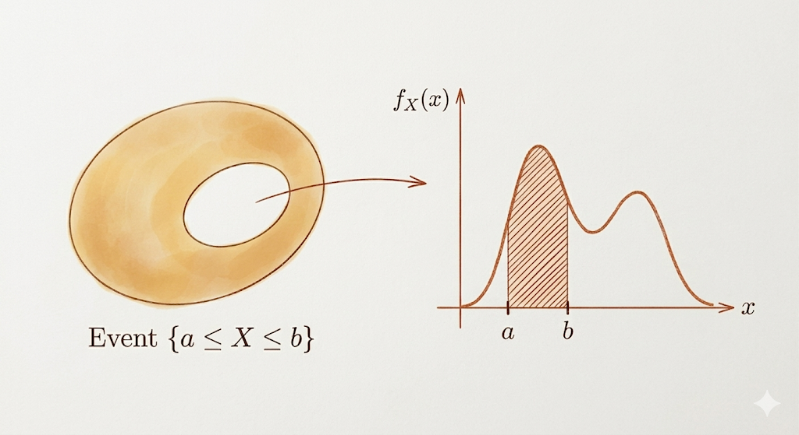
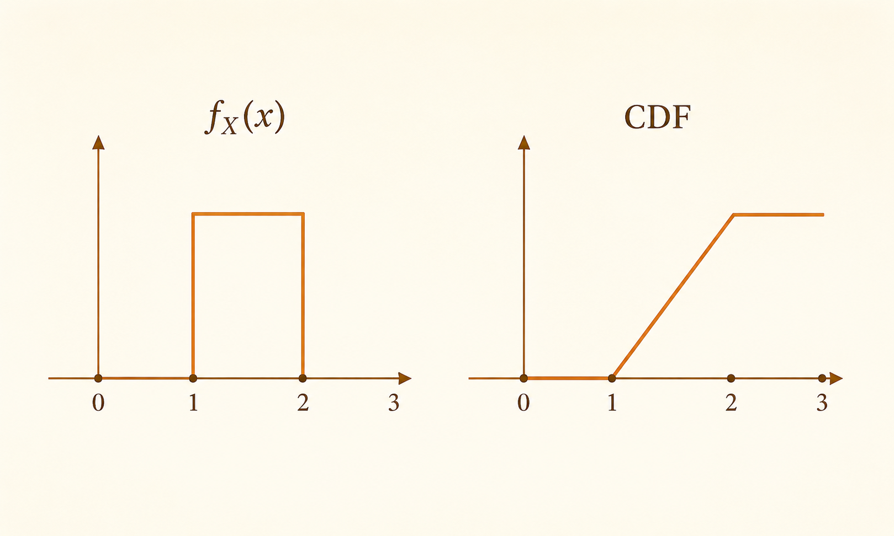
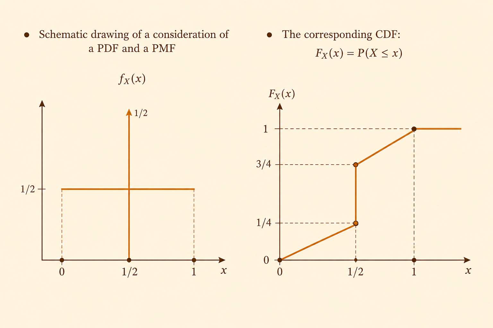
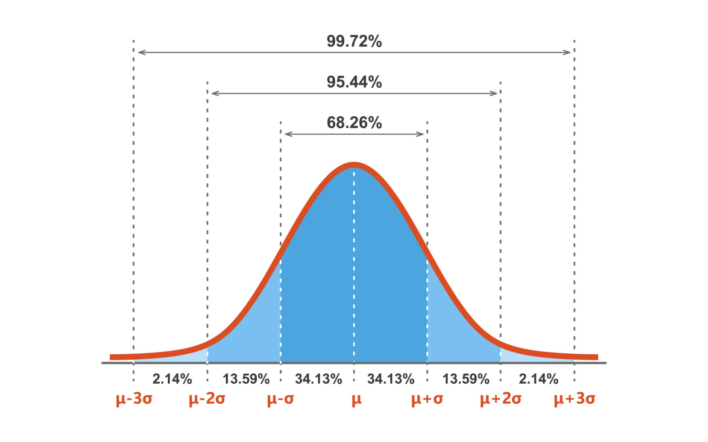
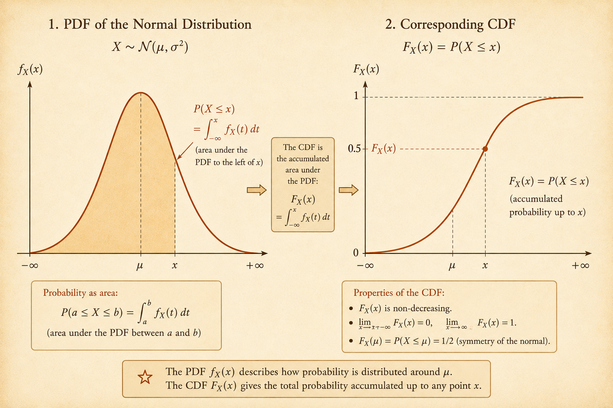

<iframe width="100%" height="500" src="https://www.youtube.com/embed/mHfn_7ym6to" title="MIT 6.041 Probability: Continuous Random Variables" frameborder="0" allowfullscreen></iframe>

Continuous random variables require a different language from discrete random variables.

For a discrete random variable, probability is assigned directly to points. For a continuous random variable, individual points have probability zero. Probability is measured by area under a density curve.

The main objects are:

- the probability density function, or PDF
- the cumulative distribution function, or CDF
- expectation and variance defined by integrals
- mixed distributions that combine continuous density and point masses
- Gaussian random variables and standardization

## Continuous Random Variables and PDFs

A continuous random variable $X$ is described by a probability density function $f_X$.

For an interval $[a,b]$:

$$
P(a\le X\le b)
=
\int_a^b f_X(x)\,dx.
$$

The probability of the event is the area under the density curve over that interval.

This is the central shift from discrete random variables: density is not probability at a point. Density becomes probability only after integrating over a set.

### Properties of PDFs

A valid PDF must be nonnegative:

$$
f_X(x)\ge 0
$$

for every $x$.

The total area must be 1:

$$
\int_{-\infty}^{\infty} f_X(x)\,dx=1.
$$

Any individual point has probability zero:

$$
P(X=a)=0.
$$

So for continuous random variables, endpoint choices do not matter:

$$
P(a<X<b)
=
P(a\le X\le b)
=
P(a<X\le b).
$$

For a small interval of length $\delta$, if the density is locally almost constant:

$$
P(x\le X\le x+\delta)
=
\int_x^{x+\delta} f_X(t)\,dt
\approx
f_X(x)\delta.
$$

More generally, for a set $B$:

$$
P(X\in B)
=
\int_B f_X(x)\,dx.
$$

For example, if:

$$
B=[1,2]\cup[4,5],
$$

then:

$$
P(X\in B)
=
\int_1^2 f_X(x)\,dx
+
\int_4^5 f_X(x)\,dx.
$$

## Means and Variances

The expected value of a continuous random variable is:

$$
E[X]
=
\int_{-\infty}^{\infty} x f_X(x)\,dx.
$$

This is the continuous analog of a weighted average. The value $x$ is weighted by the density at $x$, then integrated over all possible values.

For a function $g(X)$:

$$
E[g(X)]
=
\int_{-\infty}^{\infty} g(x)f_X(x)\,dx.
$$

The variance is:

$$
\operatorname{Var}(X)
=
\sigma^2
=
\int_{-\infty}^{\infty}
(x-E[X])^2 f_X(x)\,dx.
$$

It measures the average squared distance from the mean, weighted by the density.

An equivalent and often useful identity is:

$$
\operatorname{Var}(X)
=
E[X^2]-(E[X])^2.
$$

## Cumulative Distribution Functions

The cumulative distribution function is:

$$
F_X(x)
=
P(X\le x)
=
\int_{-\infty}^{x} f_X(t)\,dt.
$$

The CDF is a running total of probability. It accumulates all area under the PDF from $-\infty$ up to $x$.

For a continuous random variable:

$$
P(a<X\le b)
=
F_X(b)-F_X(a).
$$

The CDF is nondecreasing, starts at 0 in the far left tail, and approaches 1 in the far right tail:

$$
\lim_{x\to-\infty}F_X(x)=0,
\qquad
\lim_{x\to\infty}F_X(x)=1.
$$

### Rate of Accumulation

The PDF is the rate at which the CDF accumulates probability.

When $F_X$ is differentiable:

$$
f_X(x)
=
\frac{dF_X}{dx}(x).
$$

This explains the relationship between density and accumulated probability:

- $F_X(x)$ tells how much probability has accumulated up to $x$
- $f_X(x)$ tells how quickly that accumulated probability is increasing near $x$

### CDFs of Discrete Random Variables

For a discrete random variable, the CDF uses a sum instead of an integral:

$$
F_X(x)
=
P(X\le x)
=
\sum_{k\le x}p_X(k).
$$

The CDF is still a running total, but it increases through jumps at points with positive probability mass.

## Mixed Distributions

A mixed distribution has both:

- continuous probability spread over intervals
- discrete probability concentrated at exact points

The total probability across both parts must still sum to 1.

In the schematic example:

- a continuous rectangle on $[0,1]$ has height $1/2$
- an impulse at $x=1/2$ has probability mass $1/2$

The continuous part contributes total probability:

$$
\int_0^1 \frac{1}{2}\,dx
=
\frac{1}{2}.
$$

The point mass contributes the remaining probability:

$$
P(X=1/2)=\frac{1}{2}.
$$

The CDF therefore has both slopes and jumps:

- from $0$ to $1/2$, it increases linearly as continuous area accumulates
- at $x=1/2$, it jumps by $1/2$
- from $1/2$ to $1$, it continues increasing linearly
- after $x=1$, it stays at 1

This is why not every distribution can be described only by a PDF. A PDF describes the continuous part, but point masses appear as jumps in the CDF.

## Gaussian Random Variables

The Gaussian, or normal, distribution is the most important continuous distribution.

It is symmetric and bell-shaped.

A Gaussian random variable is determined by two parameters:

- the mean $\mu$, which controls the center
- the variance $\sigma^2$, which controls the spread

We write:

$$
X\sim \mathcal{N}(\mu,\sigma^2).
$$

The standard normal distribution is:

$$
Z\sim \mathcal{N}(0,1).
$$

### Gaussian PDF

The PDF of a Gaussian random variable is:

$$
f_X(x)
=
\frac{1}{\sigma\sqrt{2\pi}}
e^{-(x-\mu)^2/(2\sigma^2)}.
$$

The exponential term creates the bell shape and the tails:

$$
e^{-(x-\mu)^2/(2\sigma^2)}.
$$

The leading constant:

$$
\frac{1}{\sigma\sqrt{2\pi}}
$$

normalizes the curve so that the total area is 1.

### Linear Transformations

If:

$$
X\sim \mathcal{N}(\mu,\sigma^2)
$$

and:

$$
Y=aX+b,
$$

then $Y$ is also Gaussian:

$$
Y\sim \mathcal{N}(a\mu+b,\ a^2\sigma^2).
$$

The mean and variance transform as:

$$
E[Y]=a\mu+b,
\qquad
\operatorname{Var}(Y)=a^2\sigma^2.
$$

The variance uses $a^2$ because variance measures squared distance from the mean.

### Standardization and Z-Scores

Normal probabilities are usually computed through the standard normal.

Given:

$$
X\sim \mathcal{N}(\mu,\sigma^2),
$$

the standardized variable is:

$$
Z
=
\frac{X-\mu}{\sigma}.
$$

Then:

$$
Z\sim \mathcal{N}(0,1).
$$

The value of $Z$ is the number of standard deviations by which $X$ is above or below its mean.

For example, suppose:

$$
X\sim \mathcal{N}(2,16).
$$

Then $\sigma=4$. To compute $P(X<3)$:

$$
P(X<3)
=
P\left(\frac{X-2}{4}<\frac{3-2}{4}\right)
=
P(Z<0.25).
$$

Now the probability can be read from the standard normal table:

$$
P(Z<0.25)\approx 0.598.
$$

## Summary

Continuous random variables replace point probabilities with density and area.

The PDF tells how probability is distributed locally, while the CDF records how probability accumulates globally. Expectations and variances are computed by integrals. Mixed distributions remind us that some random variables combine continuous density with discrete jumps. Gaussian random variables give the central continuous model, and standardization reduces any normal calculation to the standard normal.
