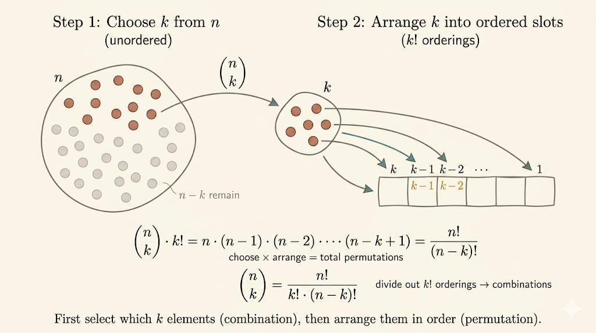

<iframe width="100%" height="500" src="https://www.youtube.com/embed/6oV3pKLgW2I" title="MIT 6.041 Probability Counting" frameborder="0" allowfullscreen></iframe>

This lecture turns counting into probability. Once all sample points are equally likely, probabilities become ratios of set sizes, so combinatorics becomes a direct tool for solving probabilistic questions.

## Counting Principle

If the sample space $\Omega$ is finite and all sample points are equally likely, then for any event $A$,

$$
P(A)=\frac{|A|}{|\Omega|}.
$$

This is the basic bridge from combinatorics to probability: count the favorable outcomes, count the total outcomes, and take the ratio.

## Basic Counting Objects

### Permutations

The number of ways to order $n$ distinct objects is

$$
n!.
$$

### Subsets

A set with $n$ elements has

$$
2^n
$$

subsets, because each element is either included or excluded.

### Binomial Coefficients

The number of ways to choose $k$ elements from an $n$-element set is

$$
\binom{n}{k}.
$$

Choosing and then ordering those $k$ elements gives

$$
\binom{n}{k}k!
=
n(n-1)\cdots(n-k+1)
=
\frac{n!}{(n-k)!}.
$$

So

$$
\binom{n}{k}
=
\frac{n!}{k!(n-k)!}.
$$

Useful boundary cases:

$$
\binom{n}{n}=1,
\qquad
\binom{n}{0}=1.
$$

And summing over all subset sizes gives

$$
\sum_{k=0}^n \binom{n}{k}=2^n.
$$

This identity is just saying: if you count all subsets by size, you get the total number of subsets.

## Binomial Probabilities

Suppose we toss a coin independently $n$ times, with

$$
P(H)=p,
\qquad
P(T)=1-p.
$$

For a particular sequence, multiply the probabilities along the sequence. For example,

$$
P(\text{HTTHHH})
=
p(1-p)(1-p)ppp
=
p^4(1-p)^2.
$$

Any sequence with exactly $k$ heads and $n-k$ tails has the same probability:

$$
p^k(1-p)^{n-k}.
$$

There are

$$
\binom{n}{k}
$$

such sequences, so

$$
P(\text{exactly }k\text{ heads})
=
\binom{n}{k}p^k(1-p)^{n-k}.
$$

Summing over all possible numbers of heads gives

$$
\sum_{k=0}^n \binom{n}{k}p^k(1-p)^{n-k}=1,
$$

because these cases exhaust all possible outcomes. This is the binomial theorem in probability form.

## Conditional Counting Example

Suppose a coin is flipped $10$ times and we know that exactly $3$ of the tosses were heads. What is the probability that the first two tosses were both heads?

Let

- $B$: exactly $3$ heads appear in $10$ tosses
- $A$: the first two tosses are heads

The event $B$ contains

$$
\binom{10}{3}
$$

possible placements of the three heads.

For $A\cap B$, the first two head positions are fixed, so the remaining $1$ head must be chosen from the last $8$ tosses:

$$
|A\cap B|=\binom{8}{1}.
$$

Therefore

$$
P(A\mid B)
=
\frac{P(A\cap B)}{P(B)}
=
\frac{\binom{8}{1}}{\binom{10}{3}}.
$$

This is a nice example of conditional probability reducing to conditional counting.

## Partition Example: Dealing Cards

A deck of $52$ cards is dealt to $4$ players, $13$ cards each. What is the probability that each player gets exactly one ace?

### Counting the Whole Sample Space

One way to count all possible deals is sequential partitioning:

$$
\binom{52}{13}\binom{39}{13}\binom{26}{13}\binom{13}{13}.
$$

### Counting Favorable Deals

To force each player to receive one ace:

- assign the $4$ aces to the $4$ players in

$$
4!
$$

ways

- then fill the remaining $12$ cards for each player from the $48$ non-aces:

$$
\binom{48}{12}\binom{36}{12}\binom{24}{12}\binom{12}{12}.
$$

So the desired probability is

$$
\frac{
4!\binom{48}{12}\binom{36}{12}\binom{24}{12}\binom{12}{12}
}{
\binom{52}{13}\binom{39}{13}\binom{26}{13}\binom{13}{13}
}.
$$

The main idea is not the final expression itself, but the method: count the full partition space, count the restricted partition space, and divide.

## Summary

- when sample points are equally likely, probabilities reduce to ratios of counts
- permutations count orderings, subsets count inclusion choices, and binomial coefficients count selections
- binomial coefficients connect directly to probabilities of repeated Bernoulli trials
- conditional probability problems can often be solved by conditional counting
- partition arguments are useful when outcomes are distributed across several groups
