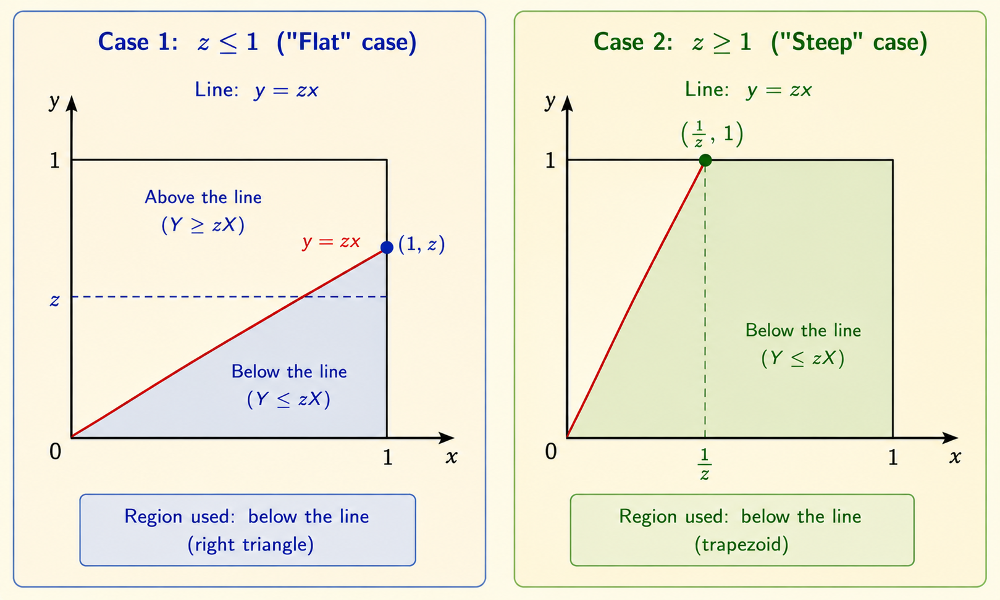
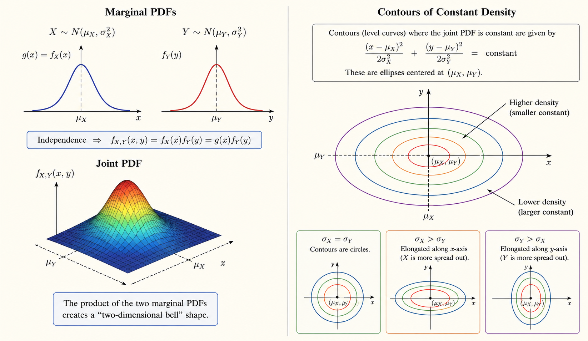

<iframe width="100%" height="500" src="https://www.youtube.com/embed/l4NoMKEHQwM" title="MIT 6.041 Probability: Derived Distributions and Covariance" frameborder="0" allowfullscreen></iframe>

This lecture continues derived distributions and then introduces covariance as a way to describe how two random variables move together.

# Ratio of Two Uniform Random Variables

Let $X$ and $Y$ be independent uniform random variables on $[0,1]$:

$$
X, Y \sim \operatorname{Uniform}(0,1)
$$

Define

$$
Z = \frac{Y}{X}
$$

We want the PDF of $Z$.

The CDF is

$$
F_Z(z)
=
P\left(\frac{Y}{X} \le z\right)
=
P(Y \le zX)
$$

Since $(X,Y)$ is uniform on the unit square, this probability is the area of the region below the line $Y=zX$ inside the square.

## Case 1: $0 \le z \le 1$

The line $Y=zX$ hits the right edge of the square at height $z$. The region below the line is a triangle with base $1$ and height $z$:

$$
F_Z(z)
=
\frac{1}{2}\cdot 1 \cdot z
=
\frac{z}{2}
$$

Differentiate:

$$
f_Z(z)
=
\frac{d}{dz}F_Z(z)
=
\frac{1}{2}
$$

## Case 2: $z > 1$

The line $Y=zX$ is steep and hits the top edge of the square at

$$
X = \frac{1}{z}
$$

It is easier to compute the complement. The small triangle above the line has base $1/z$ and height $1$:

$$
\text{Complement area}
=
\frac{1}{2}\cdot \frac{1}{z}\cdot 1
=
\frac{1}{2z}
$$

Therefore,

$$
F_Z(z)
=
1 - \frac{1}{2z}
$$

Differentiate:

$$
f_Z(z)
=
\frac{d}{dz}\left(1 - \frac{1}{2z}\right)
=
\frac{1}{2z^2}
$$

So the PDF is

$$
f_Z(z)
=
\begin{cases}
0, & z < 0 \\
\frac{1}{2}, & 0 \le z \le 1 \\
\frac{1}{2z^2}, & z > 1
\end{cases}
$$

# Expectation of the Ratio

Using the PDF:

$$
E[Z]
=
\int_0^1 z\left(\frac{1}{2}\right)\,dz
+
\int_1^\infty z\left(\frac{1}{2z^2}\right)\,dz
$$

The first part is finite:

$$
\int_0^1 \frac{z}{2}\,dz
=
\left[\frac{z^2}{4}\right]_0^1
=
\frac{1}{4}
$$

The second part diverges:

$$
\int_1^\infty \frac{1}{2z}\,dz
=
\frac{1}{2}
\left[\ln z\right]_1^\infty
=
\infty
$$

Therefore,

$$
E[Z] = \infty
$$

The ratio has a heavy enough tail that its expectation does not exist as a finite number.

# General Transformation Formula

Suppose

$$
Y = g(X)
$$

where $g$ is strictly monotonic. The key idea is conservation of probability: probability mass is preserved when we map a small interval of $X$ into a small interval of $Y$.

If $y=g(x)$, then approximately:

$$
f_X(x)\,dx
=
f_Y(y)\,dy
$$

Since

$$
dy
=
\left|g'(x)\right|dx
$$

we get

$$
f_Y(y)
=
\frac{f_X(x)}{|g'(x)|}
$$

where $x = g^{-1}(y)$. Equivalently:

$$
f_Y(y)
=
f_X(g^{-1}(y))
\left|
\frac{d}{dy}g^{-1}(y)
\right|
$$

This avoids recomputing the CDF when the transformation is one-to-one.

# Convolution Formula

Let

$$
W = X + Y
$$

## Discrete Case

If $X$ and $Y$ are independent discrete random variables, then

$$
P(W=w)
=
\sum_x P(X=x)P(Y=w-x)
$$

The sum runs over all values of $x$ that make $y=w-x$ possible.

## Continuous Case

If $X$ and $Y$ are independent continuous random variables, then the PDF of their sum is the convolution:

$$
f_W(w)
=
\int_{-\infty}^{\infty}
f_X(x)f_Y(w-x)\,dx
$$

The convolution adds up all ways to split the total value $w$ into one contribution from $X$ and one from $Y$.

# Two Independent Normal Variables

If $X$ and $Y$ are independent, their joint PDF factors:

$$
f_{X,Y}(x,y)
=
f_X(x)f_Y(y)
$$

For independent normal variables, the joint density has elliptical contours:

$$
\frac{(x-\mu_X)^2}{2\sigma_X^2}
+
\frac{(y-\mu_Y)^2}{2\sigma_Y^2}
=
\text{constant}
$$

The ellipses are centered at $(\mu_X,\mu_Y)$. If $\sigma_X=\sigma_Y$, the contours are circles. If one variance is larger, the contours stretch along that axis.

## Sum of Independent Normals

If

$$
X \sim N(0,\sigma_X^2),
\qquad
Y \sim N(0,\sigma_Y^2)
$$

and $X$ and $Y$ are independent, then

$$
W = X + Y
$$

is also normal:

$$
W \sim N(0,\sigma_X^2+\sigma_Y^2)
$$

More generally, means add and variances add for independent normal random variables.

# Covariance

Covariance measures how two random variables vary together:

$$
\operatorname{cov}(X,Y)
=
E[(X-E[X])(Y-E[Y])]
$$

The useful shortcut is

$$
\operatorname{cov}(X,Y)
=
E[XY] - E[X]E[Y]
$$

If both variables have zero mean, then

$$
\operatorname{cov}(X,Y)
=
E[XY]
$$

Interpretation:

- Positive covariance: large values of $X$ tend to come with large values of $Y$.
- Negative covariance: large values of $X$ tend to come with small values of $Y$.
- Zero covariance: no linear association, but not necessarily independence.

## Variance of a Sum

For random variables $X_1,\dots,X_n$:

$$
\operatorname{var}\left(\sum_{i=1}^n X_i\right)
=
\sum_{i=1}^n \operatorname{var}(X_i)
+
\sum_{(i,j):i\ne j}
\operatorname{cov}(X_i,X_j)
$$

If the variables are independent, all covariance terms are zero, so:

$$
\operatorname{var}\left(\sum_{i=1}^n X_i\right)
=
\sum_{i=1}^n \operatorname{var}(X_i)
$$

# Correlation Coefficient

The correlation coefficient standardizes covariance:

$$
\rho
=
\frac{\operatorname{cov}(X,Y)}
{\sigma_X\sigma_Y}
$$

Key properties:

- $-1 \le \rho \le 1$.
- If $|\rho|=1$, the variables have a perfect linear relationship.
- If $X$ and $Y$ are independent, then $\rho=0$.
- But $\rho=0$ does not imply independence; it only means there is no linear association.

Covariance gives the direction and scale of joint variation. Correlation gives a unitless measure of the strength of linear association.

*Source: MIT 6.041 Probabilistic Systems Analysis and Applied Probability, Lecture 11: Derived Distributions (continued); Covariance.*
