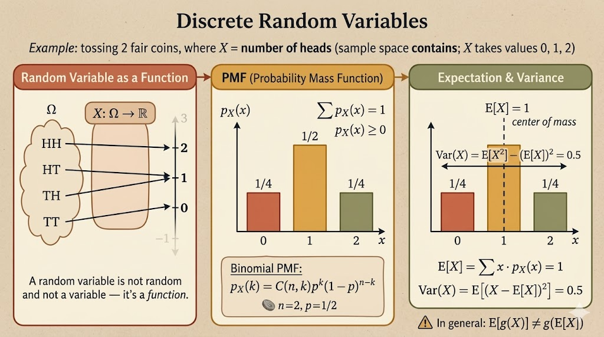

<iframe width="100%" height="500" src="https://www.youtube.com/embed/3MOahpLxj6A?start=4" title="MIT 6.041 Probability: Discrete Random Variables I" frameborder="0" allowfullscreen></iframe>

## Random Variables

A random variable is an assignment of a numerical value to every possible outcome of an experiment.

Mathematically, if the sample space is $\Omega$, then a random variable is a function

$$
X:\Omega \to \mathbb{R}.
$$

This definition is worth taking literally:

- it is not random
- it is not a variable in the algebraic sense
- it is a function from outcomes to numbers
- its possible values can be discrete or continuous

The randomness comes from the outcome $\omega \in \Omega$. Once $\omega$ is known, $X(\omega)$ is just a number.

## Probability Mass Function

For a discrete random variable, the probability mass function (PMF) is

$$
p_X(x) = P(X=x).
$$

Equivalently,

$$
p_X(x)
=
P(\{\omega \in \Omega : X(\omega)=x\}).
$$

The PMF must satisfy two basic properties:

$$
p_X(x) \ge 0
$$

and

$$
\sum_x p_X(x) = 1.
$$

So the PMF transfers probability from the original sample space onto the numerical values that $X$ can take.

## Example: First Head

Flip a biased coin repeatedly until the first head appears. Suppose

$$
P(H)=p,\qquad P(T)=1-p.
$$

Let $X$ be the number of tosses until the first head.

Then:

- $X=1$ for outcome $H$
- $X=2$ for outcome $TH$
- $X=k$ for outcome $\underbrace{TT\cdots T}_{k-1}H$

Therefore the PMF is

$$
p_X(k)
=
P(X=k)
=
(1-p)^{k-1}p,
\qquad k=1,2,\dots.
$$

This is the geometric distribution. The value $k$ records how long we waited before the first success.

## Example: Two Four-Sided Dice

Roll two independent fair four-sided dice. Let $F$ be the first roll and $S$ be the second roll, so

$$
\Omega = \{(F,S): F,S \in \{1,2,3,4\}\}.
$$

There are $16$ equally likely outcomes.

Define

$$
X = \min(F,S).
$$

For example, $X=2$ when the smaller of the two rolls is exactly $2$. The outcomes are:

$$
(2,2), (2,3), (2,4), (3,2), (4,2).
$$

So

$$
p_X(2) = \frac{5}{16}.
$$

One way to see the full PMF is to count the outcomes where the minimum is each possible value:

| $x$ | outcomes with $\min(F,S)=x$ | $p_X(x)$ |
|---:|---:|---:|
| 1 | 7 | $7/16$ |
| 2 | 5 | $5/16$ |
| 3 | 3 | $3/16$ |
| 4 | 1 | $1/16$ |

The probabilities add to one:

$$
\frac{7+5+3+1}{16}=1.
$$

## Example: Number of Heads

Flip a coin $n$ times, and let $X$ be the number of heads.

For $n=4$, the probability of exactly two heads is

$$
\begin{aligned}
p_X(2)
&= P(HHTT) + P(HTHT) + P(HTTH) \\
&\quad + P(THHT) + P(THTH) + P(TTHH) \\
&= 6p^2(1-p)^2 \\
&= \binom{4}{2}p^2(1-p)^2.
\end{aligned}
$$

In general,

$$
p_X(k)
=
\binom{n}{k}p^k(1-p)^{n-k},
\qquad k=0,1,\dots,n.
$$

This is the binomial distribution. The binomial coefficient counts which $k$ tosses are heads, while $p^k(1-p)^{n-k}$ gives the probability of any one such sequence.

## Expectation

The expected value of a discrete random variable is its probability-weighted average:

$$
E[X] = \sum_x x\,p_X(x).
$$

For example, suppose a payoff $X$ has PMF

$$
P(X=1)=\frac{1}{6},\qquad
P(X=2)=\frac{1}{2},\qquad
P(X=4)=\frac{1}{3}.
$$

Then

$$
\begin{aligned}
E[X]
&= 1\cdot \frac{1}{6}
+ 2\cdot \frac{1}{2}
+ 4\cdot \frac{1}{3} \\
&= \frac{1}{6}+1+\frac{4}{3} \\
&= 2.5.
\end{aligned}
$$

The expectation is not necessarily a value that the random variable can actually take. In this example, $2.5$ is the long-run average payoff, not one possible payoff.

## Functions of Random Variables

Suppose

$$
Y = g(X).
$$

One way to find $E[Y]$ is to first derive the PMF of $Y$ and then compute

$$
E[Y] = \sum_y y\,p_Y(y).
$$

But there is an easier shortcut:

$$
E[g(X)] = \sum_x g(x)\,p_X(x).
$$

This says we can average the transformed values $g(x)$ using the original PMF of $X$.

In general,

$$
E[g(X)] \ne g(E[X]).
$$

For example, usually

$$
E[X^2] \ne (E[X])^2.
$$

## Linearity Properties

For constants $\alpha$ and $\beta$,

$$
E[\alpha] = \alpha,
$$

$$
E[\alpha X] = \alpha E[X],
$$

and

$$
E[\alpha X + \beta] = \alpha E[X] + \beta.
$$

These properties are often the fastest way to compute expectations without expanding every outcome.

## Variance

Expectation gives the center of a distribution. Variance measures spread around that center.

The second moment is

$$
E[X^2] = \sum_x x^2 p_X(x).
$$

The variance is

$$
\operatorname{var}(X)
=
E[(X-E[X])^2].
$$

Expanding this expression gives the useful computational formula:

$$
\begin{aligned}
\operatorname{var}(X)
&= \sum_x (x-E[X])^2p_X(x) \\
&= E[X^2] - (E[X])^2.
\end{aligned}
$$

Two basic properties are:

$$
\operatorname{var}(X) \ge 0
$$

and

$$
\operatorname{var}(\alpha X+\beta)
=
\alpha^2 \operatorname{var}(X).
$$

Adding a constant shifts the distribution but does not change its spread. Multiplying by $\alpha$ scales deviations by $\alpha$, so variance scales by $\alpha^2$.

## Summary

- A random variable is a function from outcomes to real numbers.
- A PMF assigns probability to the possible values of a discrete random variable.
- Common discrete distributions include the geometric distribution and binomial distribution.
- Expectation is a probability-weighted average.
- For functions of a random variable, $E[g(X)]$ can be computed directly from the PMF of $X$.
- Variance measures spread and satisfies $\operatorname{var}(X)=E[X^2]-(E[X])^2$.
