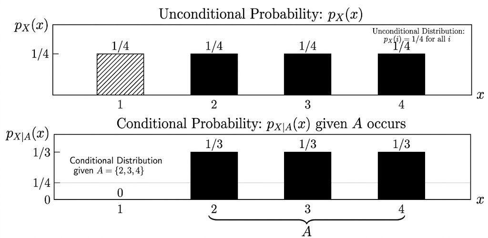
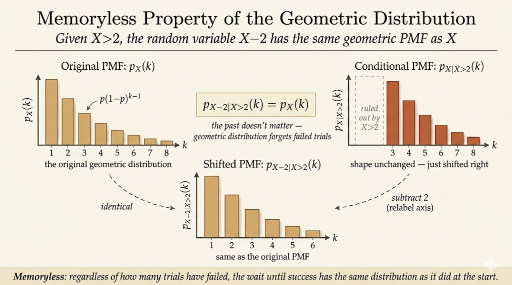
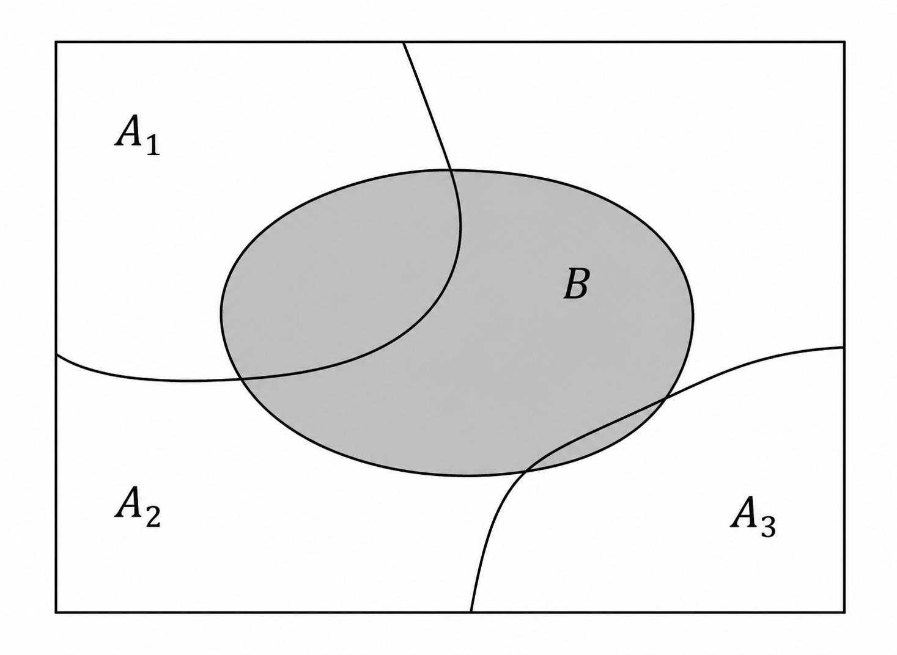

<iframe width="100%" height="500" src="https://www.youtube.com/embed/-qCEoqpwjf4" title="MIT 6.041 Probability: Discrete Random Variables II" frameborder="0" allowfullscreen></iframe>

## Conditional PMF

A conditional PMF is the distribution of a random variable after we learn that an event occurred.

If $A$ is an event with $P(A)>0$, then

$$
p_{X|A}(x)
=
P(X=x \mid A).
$$

This is still a valid PMF over the possible values of $X$:

$$
p_{X|A}(x) \ge 0,
\qquad
\sum_x p_{X|A}(x)=1.
$$

The only difference is that probability is now normalized inside the world where $A$ has happened.

## Conditional Expectation

Once we have a conditional PMF, we can compute a conditional expectation:

$$
E[X \mid A]
=
\sum_x x\,p_{X|A}(x).
$$

So conditional expectation is the average value of $X$ after restricting attention to outcomes in $A$.

For example, suppose $X$ takes values $1,2,3,4$ and we condition on

$$
A=\{X \ge 2\}.
$$

If the conditional PMF is

$$
p_{X|A}(x)=\frac{1}{3},
\qquad x=2,3,4,
$$

then

$$
E[X \mid A]
=
\frac{1}{3}\cdot 2
+ \frac{1}{3}\cdot 3
+ \frac{1}{3}\cdot 4
=3.
$$

The point is that conditioning changes the distribution first. Expectation is then computed with respect to that new distribution.

## Geometric PMF

Let $X$ be the number of independent coin tosses required until the first head appears.

If

$$
P(H)=p,
\qquad
P(T)=1-p,
$$

then

$$
p_X(k)
=
P(X=k)
=
(1-p)^{k-1}p,
\qquad
k=1,2,3,\dots.
$$

This is the geometric distribution. The event $X=k$ means:

- the first $k-1$ tosses are tails
- the $k$th toss is the first head

The expectation is

$$
E[X]
=
\sum_{k=1}^{\infty} k(1-p)^{k-1}p.
$$

The final result is

$$
E[X]=\frac{1}{p}.
$$

So if a head has probability $p=1/3$, the expected waiting time until the first head is $3$ tosses.

## Memoryless Property

The geometric distribution has a special property: after failures, the future looks like a fresh start.

For example, suppose we know the first two tosses were tails. This is the event

$$
X>2.
$$

The distribution of the additional waiting time is the same as the original distribution:

$$
P(X-2=k \mid X>2)
=
P(X=k).
$$

More generally,

$$
P(X-n=k \mid X>n)
=
P(X=k),
\qquad
k=1,2,\dots.
$$

Equivalently,

$$
P(X>n+k \mid X>n)
=
P(X>k).
$$

This is why the geometric distribution is called memoryless. The coin does not remember previous tails. If the first $8$ tosses were tails, the expected number of additional tosses is still $E[X]$.

Therefore the total expected number of tosses, given that the first $8$ tosses failed, is

$$
8 + E[X].
$$

## Total Expectation

The total probability theorem decomposes an event by cases:

$$
P(B)
=
P(A_1)P(B \mid A_1)
+ \cdots
+ P(A_n)P(B \mid A_n),
$$

where $A_1,\dots,A_n$ form a partition of the sample space.

The same idea applies to PMFs:

$$
p_X(x)
=
P(A_1)p_{X|A_1}(x)
+ \cdots
+ P(A_n)p_{X|A_n}(x).
$$

Taking the weighted average over $x$ gives the total expectation theorem:

$$
E[X]
=
P(A_1)E[X \mid A_1]
+ \cdots
+ P(A_n)E[X \mid A_n].
$$

The theorem says that we can compute an expectation by splitting the world into cases, computing the conditional average in each case, and weighting by the probability of each case.

## Geometric Expectation by Conditioning

The geometric distribution gives a clean example of total expectation.

Let $X$ be the first time we see a head. Split the sample space into two cases:

$$
A_1=\{X=1\},
\qquad
A_2=\{X>1\}.
$$

Then

$$
E[X]
=
P(X=1)E[X \mid X=1]
+ P(X>1)E[X \mid X>1].
$$

The pieces are:

$$
P(X=1)=p,
\qquad
E[X \mid X=1]=1,
$$

and

$$
P(X>1)=1-p.
$$

If the first toss is a tail, then one toss has already happened, and by memorylessness the expected additional waiting time is still $E[X]$:

$$
E[X \mid X>1]
=
1+E[X].
$$

Therefore

$$
E[X]
=
p\cdot 1
+ (1-p)(1+E[X]).
$$

Solving,

$$
\begin{aligned}
E[X]
&=p+(1-p)+(1-p)E[X] \\
&=1+(1-p)E[X],
\end{aligned}
$$

so

$$
pE[X]=1,
\qquad
E[X]=\frac{1}{p}.
$$

This derivation shows why the result is natural: each failed toss resets the probabilistic situation, but it still adds one unit of time already spent.

## Joint PMFs

For two discrete random variables $X$ and $Y$, the joint PMF is

$$
p_{X,Y}(x,y)
=
P(X=x,\;Y=y).
$$

It describes the probability of every pair of values.

A joint PMF must satisfy

$$
p_{X,Y}(x,y)\ge 0
$$

and

$$
\sum_x \sum_y p_{X,Y}(x,y)=1.
$$

For example:

| $Y\backslash X$ | $x=1$ | $x=2$ | $x=3$ | $x=4$ |
|---:|---:|---:|---:|---:|
| $y=4$ | $1/20$ | $2/20$ | $2/20$ | $0$ |
| $y=3$ | $2/20$ | $4/20$ | $1/20$ | $2/20$ |
| $y=2$ | $0$ | $1/20$ | $3/20$ | $1/20$ |
| $y=1$ | $0$ | $1/20$ | $0$ | $0$ |

From the joint PMF, we can recover the marginal PMFs by summing out the other variable:

$$
p_X(x)
=
\sum_y p_{X,Y}(x,y),
$$

and

$$
p_Y(y)
=
\sum_x p_{X,Y}(x,y).
$$

We can also form conditional PMFs:

$$
p_{X|Y}(x \mid y)
=
P(X=x \mid Y=y)
=
\frac{p_{X,Y}(x,y)}{p_Y(y)},
$$

as long as $p_Y(y)>0$.

For each fixed $y$,

$$
\sum_x p_{X|Y}(x \mid y)=1.
$$

## Takeaways

- Conditional PMFs are ordinary PMFs after restricting to an event.
- Conditional expectation is expectation computed under that conditional PMF.
- The geometric distribution is memoryless: after failures, the future waiting time has the same distribution as at the start.
- Total expectation decomposes an average into case-by-case conditional averages.
- A joint PMF describes two random variables together; marginal and conditional PMFs come from summing or normalizing it.

Source: MIT 6.041 Probabilistic Systems Analysis and Applied Probability, Lecture 6.
