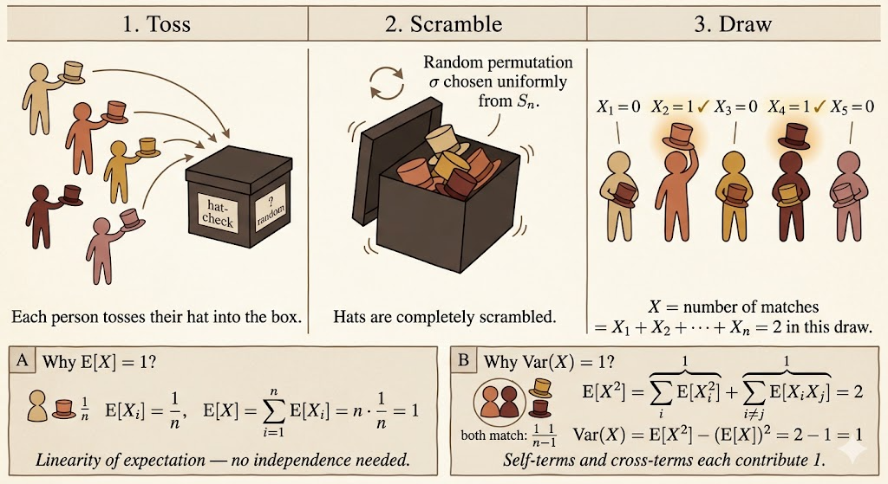

<iframe width="100%" height="500" src="https://www.youtube.com/embed/EObHWIEKGjA" title="MIT 6.041 Probability: Discrete Random Variables III" frameborder="0" allowfullscreen></iframe>

This lecture extends discrete random variables from one or two variables to several variables.

The main ideas are:

- joint PMFs can be marginalized to get individual PMFs
- multiplication rules factor joint probabilities into conditional probabilities
- expectation is linear even without independence
- variance adds only when covariance terms vanish, such as under independence
- indicator variables make many counting expectations much easier

## Three Random Variables

For three discrete random variables $X,Y,Z$, the joint PMF is

$$
p_{X,Y,Z}(x,y,z)
=
P(X=x,Y=y,Z=z).
$$

We can recover the marginal PMF of $X$ by summing over the other variables:

$$
p_X(x)
=
\sum_y \sum_z p_{X,Y,Z}(x,y,z).
$$

The same idea works for any subset of variables. Marginalization means summing out the variables we no longer want to track.

## Multiplication Rule

For three events $A,B,C$, the multiplication rule is

$$
P(A \cap B \cap C)
=
P(A)P(B \mid A)P(C \mid A \cap B).
$$

For random variables, this becomes

$$
p_{X,Y,Z}(x,y,z)
=
p_X(x)
p_{Y\mid X}(y\mid x)
p_{Z\mid X,Y}(z\mid x,y).
$$

This is useful because a complicated joint probability can be built as a sequence of conditional probabilities.

If $X,Y,Z$ are independent, the factorization simplifies to

$$
p_{X,Y,Z}(x,y,z)
=
p_X(x)p_Y(y)p_Z(z).
$$

Independence means that learning one variable does not change the distribution of the others. For example, if $X$ and $Y$ are independent, then

$$
p_{X\mid Y}(x\mid y)
=
p_X(x).
$$

If $X,Y,Z$ are mutually independent, then

$$
p_{X\mid Y,Z}(x\mid y,z)
=
p_X(x).
$$

Knowing both $Y$ and $Z$ still gives no information about $X$.

## Expectations of Functions

For two discrete random variables, the expectation of a function $g(X,Y)$ is computed by summing over all pairs:

$$
E[g(X,Y)]
=
\sum_x \sum_y g(x,y)p_{X,Y}(x,y).
$$

In general,

$$
E[g(X,Y)]
\ne
g(E[X],E[Y]).
$$

Expectation applies to the function values over all outcomes, not just to the function evaluated at the average inputs.

## Linearity of Expectation

The most important expectation rule is linearity:

$$
E[X+Y+Z]
=
E[X]+E[Y]+E[Z].
$$

This is true whether or not the random variables are independent.

Independence is not needed because the joint PMF marginalizes correctly when summing:

$$
E[X+Y]
=
\sum_x\sum_y (x+y)p_{X,Y}(x,y)
=
E[X]+E[Y].
$$

## Product of Independent Variables

If $X$ and $Y$ are independent, then

$$
E[XY]
=
E[X]E[Y].
$$

More generally, if $X$ and $Y$ are independent, then any functions of them are also independent:

$$
E[g(X)h(Y)]
=
E[g(X)]E[h(Y)].
$$

This product rule does require independence. Linearity of expectation does not.

## Variance of Sums

Variance is different from expectation. It is not always additive.

In general,

$$
\operatorname{Var}(X+Y)
=
\operatorname{Var}(X)
+
\operatorname{Var}(Y)
+
2\operatorname{Cov}(X,Y).
$$

If $X$ and $Y$ are independent, then $\operatorname{Cov}(X,Y)=0$, so

$$
\operatorname{Var}(X+Y)
=
\operatorname{Var}(X)
+
\operatorname{Var}(Y).
$$

For example, if $X$ and $Y$ are independent, then

$$
\operatorname{Var}(X-3Y)
=
\operatorname{Var}(X)
+
9\operatorname{Var}(Y).
$$

The coefficient is squared because variance measures squared deviation.

## Binomial Expectation and Variance

Let

$$
X \sim \operatorname{Binomial}(n,p).
$$

The PMF is

$$
p_X(k)
=
\binom{n}{k}p^k(1-p)^{n-k},
\qquad
k=0,1,\dots,n.
$$

Directly computing the expectation from

$$
E[X]
=
\sum_{k=0}^{n}
k\binom{n}{k}p^k(1-p)^{n-k}
$$

is possible, but there is a much cleaner method.

Write $X$ as a sum of indicator variables:

$$
X=X_1+\cdots+X_n,
$$

where

$$
X_i =
\begin{cases}
1, & \text{trial } i \text{ succeeds},\\
0, & \text{trial } i \text{ fails}.
\end{cases}
$$

Each $X_i$ is a Bernoulli random variable with

$$
E[X_i]=p.
$$

By linearity of expectation,

$$
E[X]
=
\sum_{i=1}^n E[X_i]
=
np.
$$

For one Bernoulli trial,

$$
\operatorname{Var}(X_i)
=
p(1-p).
$$

Because the trials are independent, the variances add:

$$
\operatorname{Var}(X)
=
\sum_{i=1}^n \operatorname{Var}(X_i)
=
np(1-p).
$$

The indicator-variable viewpoint avoids tedious algebra and reveals the structure of the binomial distribution.

## The Hat Problem

Suppose $n$ people check their hats at a party. The attendant randomly permutes the hats before returning them.

Let $X$ be the number of people who get their own hat back.

### Expected Number of Matches

Define the indicator variable

$$
X_i =
\begin{cases}
1, & \text{person } i \text{ gets their own hat},\\
0, & \text{otherwise}.
\end{cases}
$$

Then

$$
X=X_1+\cdots+X_n.
$$

For any person $i$,

$$
P(X_i=1)=\frac{1}{n},
$$

so

$$
E[X_i]=\frac{1}{n}.
$$

By linearity of expectation,

$$
E[X]
=
\sum_{i=1}^n E[X_i]
=
n\cdot \frac{1}{n}
=
1.
$$

So no matter how many people attend, the expected number of people who get their own hat back is $1$.

### Variance of the Number of Matches

For $n \ge 2$,

$$
\operatorname{Var}(X)
=
E[X^2]-(E[X])^2
=
E[X^2]-1.
$$

Expand $X^2$:

$$
X^2
=
\left(\sum_{i=1}^n X_i\right)^2
=
\sum_{i=1}^n X_i^2
+
\sum_{i\ne j}X_iX_j.
$$

Since $X_i$ is an indicator variable,

$$
X_i^2=X_i.
$$

Therefore

$$
\sum_{i=1}^n E[X_i^2]
=
\sum_{i=1}^n E[X_i]
=
1.
$$

For the cross terms, $X_iX_j=1$ only if both person $i$ and person $j$ get their own hats. For $i\ne j$,

$$
E[X_iX_j]
=
P(X_i=1,X_j=1)
=
\frac{1}{n}\cdot\frac{1}{n-1}.
$$

There are $n(n-1)$ ordered cross terms, so

$$
\sum_{i\ne j}E[X_iX_j]
=
n(n-1)\cdot \frac{1}{n(n-1)}
=
1.
$$

Thus

$$
E[X^2]=1+1=2,
$$

and

$$
\operatorname{Var}(X)
=
2-1^2
=
1.
$$

The important lesson is that the indicators are not independent, but linearity of expectation still gives the mean immediately. For variance, we must handle the cross terms.

## Summary

- Joint PMFs for multiple random variables can be marginalized by summing out variables.
- The multiplication rule factors joint probabilities into conditional probabilities.
- Linearity of expectation does not require independence.
- Products of expectations usually require independence.
- Variance of a sum includes covariance terms unless the variables are independent.
- Indicator variables make binomial and matching problems much easier.
