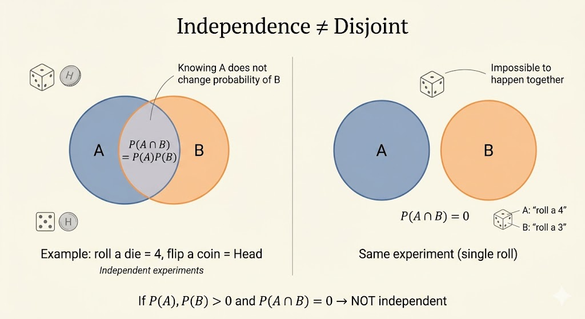

<iframe width="100%" height="500" src="https://www.youtube.com/embed/19Ql_Q3l0GA" title="MIT 6.041 Probability: Independence" frameborder="0" allowfullscreen></iframe>

## Independence Means Information Changes Nothing

The clean idea behind independence is:

> learning that event $A$ happened does not change the probability of event $B$.

If $P(A) > 0$, this is written as

$$
P(B \mid A) = P(B).
$$

Using the multiplication rule, this is equivalent to

$$
P(A \cap B) = P(A)P(B).
$$

So independence can be read in two ways:

- conditional view: knowing $A$ tells us nothing about $B$
- product view: the probability of both is the product of the marginals

For example, if we roll a die and flip a coin, then

$$
P(\text{die}=4 \text{ and head}) = \frac16 \cdot \frac12.
$$

The die outcome does not affect the coin outcome, so the events are independent.

## Three Tosses of an Unfair Coin

Suppose each toss gives:

- Head with probability $p$
- Tail with probability $1-p$

The probability of a specific sequence is the product of the step probabilities. For example,

$$
P(HTH) = p(1-p)p = p^2(1-p).
$$

The probability of getting exactly one head in three tosses is

$$
P(\text{exactly one head})
= 3p(1-p)^2,
$$

because the one head can appear in three positions:

$$
HTT,\qquad THT,\qquad TTH.
$$

Now condition on the event “exactly one head.” If the first toss is head, then the only compatible outcome is $HTT$. Therefore

$$
P(\text{first toss is H} \mid \text{exactly one head})
=
\frac{p(1-p)^2}{3p(1-p)^2}
= \frac13.
$$

This is a useful reminder: conditioning changes the sample space first, and only then do we compute probabilities inside the reduced world.

```{mermaid}
graph LR
    Root((Start)) -->|p| H1(H)
    Root -->|1-p| T1(T)

    H1 -->|p| H2_H(H)
    H1 -->|1-p| T2_H(T)

    T1 -->|p| H2_T(H)
    T1 -->|1-p| T2_T(T)

    H2_H -->|p| HHH[HHH]
    H2_H -->|1-p| HHT[HHT]

    T2_H -->|p| HTH[HTH]
    T2_H -->|1-p| HTT[HTT]

    H2_T -->|p| THH[THH]
    H2_T -->|1-p| THT[THT]

    T2_T -->|p| TTH[TTH]
    T2_T -->|1-p| TTT[TTT]
```

## Independent Is Not the Same as Disjoint

These ideas are almost opposites.

- **Independent** means one event gives no information about the other.
- **Disjoint** means if one happens, the other is impossible.

So if $P(A)>0$ and $P(B)>0$ and the events are disjoint, then

$$
P(A \cap B)=0 \ne P(A)P(B),
$$

which means they are not independent.

For instance, if $P(A)=1/3$ and $P(B)=1/3$ but $A \cap B = \emptyset$, then knowing $A$ occurred immediately tells us $B$ did not occur. That is strong dependence, not independence.

## Conditional Independence

Two events can become independent once we condition on a third event.

The definition is

$$
P(A \cap B \mid C) = P(A \mid C)P(B \mid C),
$$

provided $P(C)>0$.

This matters when there is a hidden cause behind both events.

### Example: A Hidden Coin Choice

Suppose we first choose one of two coins with equal probability:

- Coin A: $P(H)=0.9$
- Coin B: $P(H)=0.1$

Then we flip the chosen coin repeatedly.

Let $C$ be the event “Coin A was chosen.” Given $C$, tosses are independent because they come from a fixed coin:

$$
P(X_1=H, X_2=H \mid C)=0.9^2
= P(X_1=H \mid C)P(X_2=H \mid C).
$$

The same is true given $C^c$.

But unconditionally, the tosses are **not** independent, because early outcomes tell us which coin is more likely.

Indeed,

$$
P(X_1=H)=\frac12(0.9)+\frac12(0.1)=0.5
$$

and the same for $X_2$. If the tosses were independent, we would have

$$
P(X_1=H, X_2=H)=0.25.
$$

Instead,

$$
P(X_1=H, X_2=H)
= \frac12(0.9^2)+\frac12(0.1^2)
= 0.41.
$$

So the two tosses are dependent before conditioning on the hidden coin identity.

This is the key lesson:

- **given the hidden cause**: independent
- **after marginalizing out the hidden cause**: dependent

## Independence of Many Events

For events $A_1,\dots,A_n$, independence means more than pairwise independence.

The full definition is:

$$
P\!\left(\bigcap_{i \in S} A_i\right)
=
\prod_{i \in S} P(A_i)
$$

for every subset $S \subseteq \{1,\dots,n\}$.

So we must check not only pairs, but also triples, quadruples, and every smaller family.

Examples of conditions that must all hold include:

- $P(A_1 \cap A_2)=P(A_1)P(A_2)$
- $P(A_2 \cap A_3)=P(A_2)P(A_3)$
- $P(A_3 \cap A_4 \cap A_5)=P(A_3)P(A_4)P(A_5)$

## Pairwise Independent but Not Mutually Independent

Flip two fair coins with outcomes

$$
HH,\ HT,\ TH,\ TT,
$$

each having probability $1/4$.

Define events:

- $A$ = first toss is heads
- $B$ = second toss is heads
- $C$ = both tosses are the same

Then

$$
P(A)=P(B)=P(C)=\frac12.
$$

Also,

$$
P(A \cap B)=P(HH)=\frac14
= \frac12 \cdot \frac12,
$$

$$
P(A \cap C)=P(HH)=\frac14
= \frac12 \cdot \frac12,
$$

$$
P(B \cap C)=P(HH)=\frac14
= \frac12 \cdot \frac12.
$$

So every pair is independent.

But for all three together,

$$
P(A \cap B \cap C)=P(HH)=\frac14,
$$

while

$$
P(A)P(B)P(C)=\frac12 \cdot \frac12 \cdot \frac12 = \frac18.
$$

These are not equal, so the three events are **not** mutually independent.

This example is important because it shows:

- pairwise independence is weaker
- mutual independence is a stronger global requirement



## Interpretation

- independence means information about one event does not change probabilities of the others
- conditional independence often appears when a hidden variable explains the dependence
- pairwise independence does not guarantee mutual independence

The lecture’s core message is that independence is not just a formula. It is a statement about information flow: what we learn, and what that learning does or does not change.
