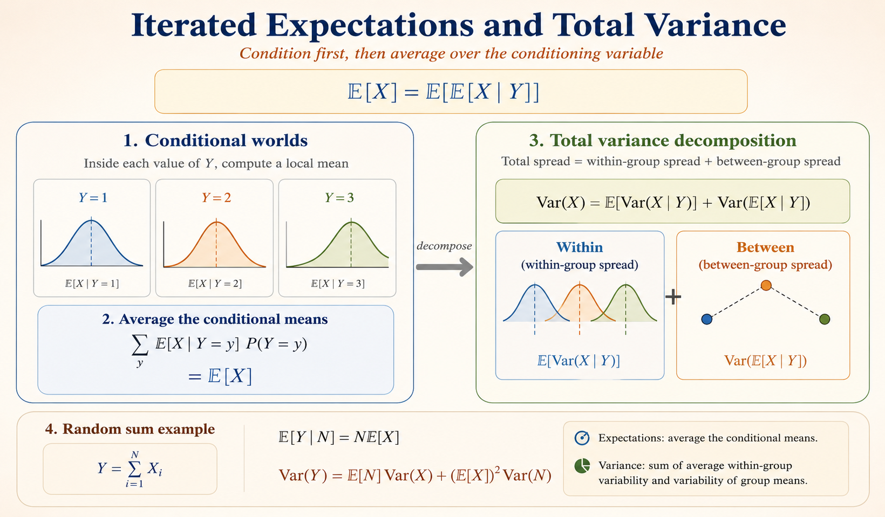

<iframe width="100%" height="500" src="https://www.youtube.com/embed/P7a4bjE6Crk" title="MIT 6.041 Probability: Iterated Expectations" frameborder="0" allowfullscreen></iframe>

This lecture introduces one of the most useful habits in probability: condition first, solve the easier conditional problem, then average over the conditioning variable.

The same idea appears twice:

- for expectations, through the **Law of Iterated Expectations**
- for variances, through the **Law of Total Variance**

# Law of Iterated Expectations

The **Law of Iterated Expectations**, also called the Law of Total Expectation, says that the unconditional expectation of $X$ equals the expectation of the conditional expectation of $X$ given $Y$:

$$
\mathbb{E}[X]
=
\mathbb{E}\left[\mathbb{E}[X \mid Y]\right].
$$

The key idea is that we can first compute the average of $X$ inside each conditional world $Y=y$, then average those conditional means according to how likely each value of $Y$ is.

## Conditional Expectation as a Random Variable

The conditional expectation $\mathbb{E}[X \mid Y]$ is itself a random variable because it is a function of $Y$. We can write

$$
\mathbb{E}[X \mid Y] = g(Y).
$$

If we are given a specific value $Y=y$, the conditional expectation becomes a number:

$$
\mathbb{E}[X \mid Y=y] = g(y).
$$

So $\mathbb{E}[X \mid Y]$ changes with the random value of $Y$, while $\mathbb{E}[X \mid Y=y]$ is the fixed conditional mean for one group.

## Summation Form

For a discrete random variable $Y$,

$$
\mathbb{E}[g(Y)]
=
\sum_y g(y)P_Y(y).
$$

Substituting $g(y)=\mathbb{E}[X \mid Y=y]$ gives

$$
\mathbb{E}[X]
=
\sum_y
\mathbb{E}[X \mid Y=y]P_Y(y).
$$

This is often the easiest way to compute an expectation: split the sample space into cases, compute the conditional mean in each case, then weight by the probability of the case.

# Law of Total Variance

The **Law of Total Variance** decomposes the total variance of $X$ into two components:

$$
\operatorname{Var}(X)
=
\mathbb{E}\left[\operatorname{Var}(X \mid Y)\right]
+
\operatorname{Var}\left(\mathbb{E}[X \mid Y]\right).
$$

The two terms have different meanings:

- $\mathbb{E}[\operatorname{Var}(X \mid Y)]$ is the average variability within each conditional group.
- $\operatorname{Var}(\mathbb{E}[X \mid Y])$ is the variability of the conditional means across groups.

So total variance is

$$
\text{total spread}
=
\text{average within-group spread}
+
\text{between-group spread}.
$$

## Proof

Start from the conditional variance identity:

$$
\operatorname{Var}(X \mid Y)
=
\mathbb{E}[X^2 \mid Y]
-
\left(\mathbb{E}[X \mid Y]\right)^2.
$$

Taking expectation on both sides gives

$$
\mathbb{E}\left[\operatorname{Var}(X \mid Y)\right]
=
\mathbb{E}\left[\mathbb{E}[X^2 \mid Y]\right]
-
\mathbb{E}\left[\left(\mathbb{E}[X \mid Y]\right)^2\right].
$$

By iterated expectations,

$$
\mathbb{E}\left[\mathbb{E}[X^2 \mid Y]\right]
=
\mathbb{E}[X^2],
$$

so

$$
\mathbb{E}\left[\operatorname{Var}(X \mid Y)\right]
=
\mathbb{E}[X^2]
-
\mathbb{E}\left[\left(\mathbb{E}[X \mid Y]\right)^2\right].
\tag{1}
$$

Next, apply the variance identity to the random variable $\mathbb{E}[X \mid Y]$:

$$
\operatorname{Var}\left(\mathbb{E}[X \mid Y]\right)
=
\mathbb{E}\left[\left(\mathbb{E}[X \mid Y]\right)^2\right]
-
\left(\mathbb{E}\left[\mathbb{E}[X \mid Y]\right]\right)^2.
$$

Again by iterated expectations,

$$
\mathbb{E}\left[\mathbb{E}[X \mid Y]\right]
=
\mathbb{E}[X],
$$

therefore

$$
\operatorname{Var}\left(\mathbb{E}[X \mid Y]\right)
=
\mathbb{E}\left[\left(\mathbb{E}[X \mid Y]\right)^2\right]
-
\left(\mathbb{E}[X]\right)^2.
\tag{2}
$$

Adding (1) and (2), the middle terms cancel:

$$
\mathbb{E}\left[\operatorname{Var}(X \mid Y)\right]
+
\operatorname{Var}\left(\mathbb{E}[X \mid Y]\right)
=
\mathbb{E}[X^2]
-
\left(\mathbb{E}[X]\right)^2.
$$

The right-hand side is $\operatorname{Var}(X)$, so

$$
\operatorname{Var}(X)
=
\mathbb{E}\left[\operatorname{Var}(X \mid Y)\right]
+
\operatorname{Var}\left(\mathbb{E}[X \mid Y]\right).
$$

# Example: Section Means and Variance

Suppose a class is divided into two sections. Pick a student at random.

- $X$: the student's quiz score.
- $Y$: the section number.

Assume:

- Section 1 has 10 students, average score 90, and variance 10.
- Section 2 has 20 students, average score 60, and variance 20.

The global average score is

$$
\mathbb{E}[X]
=
\frac{90\cdot 10 + 60\cdot 20}{30}
=
70.
$$

The conditional means are

$$
\mathbb{E}[X \mid Y=1] = 90,
\qquad
\mathbb{E}[X \mid Y=2] = 60.
$$

The between-group component is

$$
\operatorname{Var}\left(\mathbb{E}[X \mid Y]\right)
=
\frac{1}{3}(90-70)^2
+
\frac{2}{3}(60-70)^2
=
200.
$$

The within-group component is

$$
\mathbb{E}\left[\operatorname{Var}(X \mid Y)\right]
=
\frac{1}{3}\cdot 10
+
\frac{2}{3}\cdot 20
=
\frac{50}{3}
\approx
16.67.
$$

Therefore,

$$
\operatorname{Var}(X)
=
\frac{50}{3}
+
200.
$$

The total variance is large mainly because the two section averages are far apart.

# Example: Sum of a Random Number of Variables

Let

$$
Y
=
\sum_{i=1}^{N} X_i,
$$

where:

- $N$ is a non-negative integer random variable.
- $X_i$ is the amount spent in store $i$.
- The $X_i$ are i.i.d.
- The $X_i$ are independent of $N$.

Conditioning on $N=n$ turns the random sum into a fixed-length sum:

$$
\mathbb{E}[Y \mid N=n]
=
\mathbb{E}\left[\sum_{i=1}^{n}X_i\right]
=
\sum_{i=1}^{n}\mathbb{E}[X_i]
=
n\mathbb{E}[X].
$$

Therefore,

$$
\mathbb{E}[Y \mid N]
=
N\mathbb{E}[X].
$$

Taking expectation again gives

$$
\mathbb{E}[Y]
=
\mathbb{E}[N]\mathbb{E}[X].
$$

For the variance, use total variance:

$$
\operatorname{Var}(Y)
=
\mathbb{E}\left[\operatorname{Var}(Y \mid N)\right]
+
\operatorname{Var}\left(\mathbb{E}[Y \mid N]\right).
$$

If $N=n$, then $Y$ is the sum of $n$ independent copies of $X$, so

$$
\operatorname{Var}(Y \mid N=n)
=
n\operatorname{Var}(X).
$$

Thus

$$
\mathbb{E}\left[\operatorname{Var}(Y \mid N)\right]
=
\mathbb{E}[N]\operatorname{Var}(X).
$$

Also,

$$
\operatorname{Var}\left(\mathbb{E}[Y \mid N]\right)
=
\operatorname{Var}\left(N\mathbb{E}[X]\right)
=
\left(\mathbb{E}[X]\right)^2\operatorname{Var}(N).
$$

Putting the two pieces together:

$$
\operatorname{Var}(Y)
=
\mathbb{E}[N]\operatorname{Var}(X)
+
\left(\mathbb{E}[X]\right)^2\operatorname{Var}(N).
$$

The first term is the expected within-sum variability. The second term is the extra variability from not knowing how many terms will appear in the sum.
