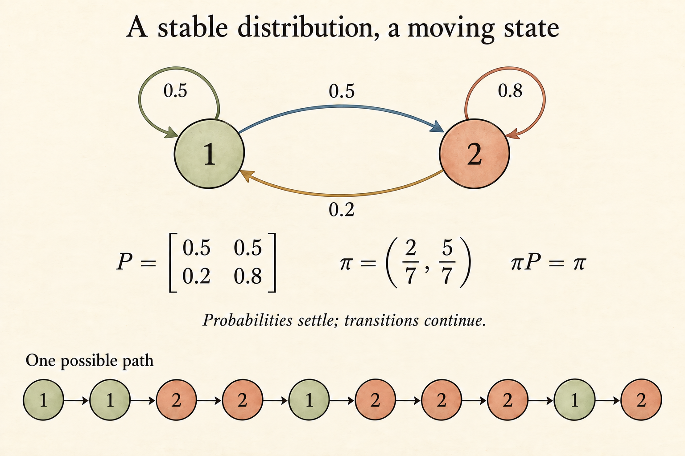

Notes on **MIT 6.041, Lecture 16: Markov Chains I**, taught by John Tsitsiklis.

<iframe style="width:100%;aspect-ratio:16/9;border:0" src="https://www.youtube.com/embed/IkbkEtOOC1Y" title="MIT 6.041 Lecture 16: Markov Chains I — John Tsitsiklis" loading="lazy" allow="accelerometer; clipboard-write; encrypted-media; gyroscope; picture-in-picture; web-share" allowfullscreen></iframe>

A queue can remain busy even when its probability distribution has settled. That distinction—between a changing sample path and a stable distribution—is the main connection in this lecture. To reach it, we first need a state that contains enough information, then a transition rule, and finally a way to add up all the paths through time.

I reviewed the complete available transcript and all three pages of the official slide PDF. The explicit recurrence solution and simplified closed-class example below extend the lecture's calculations; they are identified as worked examples.

## Choosing a state is part of the model

A ball's current position is not enough to predict where it will be next: its velocity matters too. With position alone, past observations remain useful because they reveal velocity.

The same issue appears in a queue. Let $X_n$ be the number of customers in the system, including anyone being served, at time $n$. If service times are geometric, the probability of finishing service in the next slot does not depend on how long the current customer has already been served. Queue size can therefore be enough.

With a different service-time distribution, the elapsed service time may matter. Then the state needs to include that information as well.

**The Markov property is a claim about the chosen state representation.** It does not say that consecutive states are independent.

## A checkout counter as a Markov chain

The lecture uses discrete time and a capacity of ten customers:

- An arrival is attempted in each slot with probability $p$.
- When the system is nonempty, service finishes with probability $q$.
- Arrival and service coin flips are independent across slots and from each other.
- The state space is $\{0,1,\ldots,10\}$.

For an interior state $1\le i\le9$, four combinations produce three possible next states:

$$
\begin{aligned}
P(X_{n+1}=i+1\mid X_n=i)&=p(1-q),\\
P(X_{n+1}=i-1\mid X_n=i)&=(1-p)q,\\
P(X_{n+1}=i\mid X_n=i)&=pq+(1-p)(1-q).
\end{aligned}
$$

The queue stays the same size either because nothing happens or because an arrival and a departure occur together. The three probabilities sum to one.

The boundaries need their own rules. Following the lecture's convention, an empty system cannot complete service during that slot, and an arrival is rejected if the system is full at the start of the slot:

$$
p_{00}=1-p,\quad p_{01}=p,
\qquad
p_{10,9}=q,\quad p_{10,10}=1-q.
$$

Specifying this timing convention matters. Allowing a new arrival to use a space freed during the same slot would give a different full-capacity transition rule.

## The Markov property and transition matrix

For a time-homogeneous chain, define

$$
p_{ij}=P(X_{n+1}=j\mid X_n=i).
$$

The Markov assumption is

$$
P(X_{n+1}=j\mid X_n=i,X_{n-1},\ldots,X_0)=p_{ij}
$$

for histories with positive probability. Time homogeneity means these transition probabilities do not change with $n$.

Collect them in a matrix $P$, with rows representing the current state and columns the next state. Every entry is nonnegative and every row sums to one. Together with the initial state or its distribution, this specifies the model.

A transition diagram draws an arrow from $i$ to $j$ whenever $p_{ij}>0$. A self-loop is a valid transition: time advances even when the state stays the same.

## Matrix multiplication adds up possible paths

Let

$$
r_{ij}(n)=P(X_n=j\mid X_0=i).
$$

At time zero, $r_{ij}(0)$ is one when $i=j$ and zero otherwise. After one step, $r_{ij}(1)=p_{ij}$.

For more steps, condition on the state immediately before the final transition:

$$
\begin{aligned}
r_{ij}(n)
&=\sum_k P(X_{n-1}=k\mid X_0=i)\\
&\qquad\cdot P(X_n=j\mid X_{n-1}=k,X_0=i)\\
&=\sum_k r_{ik}(n-1)p_{kj}.
\end{aligned}
$$

The Markov property justifies the final factor: once the chain is at $k$, the path used to reach it no longer matters for the next transition.

Conditioning just after the first transition gives another valid recursion:

$$
r_{ij}(n)=\sum_k p_{ik}r_{kj}(n-1).
$$

In matrix form, both lead to $R(n)=P^n$, where $P^n$ is a matrix power. If the initial distribution is a row vector $\mu_0$, then

$$
\mu_n=\mu_0P^n.
$$

Matrix multiplication is collecting the probabilities of all possible intermediate states.

## A two-state chain: convergence without stopping

The lecture's example has transition matrix

$$
P=
\begin{pmatrix}
0.5&0.5\\
0.2&0.8
\end{pmatrix}.
$$

Starting from state 1, the probability of being back at state 1 after two steps is

$$
r_{11}(2)=0.5\cdot0.5+0.5\cdot0.2=0.35.
$$

These terms correspond to the two paths $1\to1\to1$ and $1\to2\to1$.

Let $a_n=P(X_n=1)$ for any initial distribution. Since the probability of state 2 is $1-a_n$,

$$
a_n=0.5a_{n-1}+0.2(1-a_{n-1})
=0.2+0.3a_{n-1}.
$$

A fixed point satisfies $a=0.2+0.3a$, giving $a=2/7$. Subtracting this fixed point gives

$$
a_n-\frac27=0.3\left(a_{n-1}-\frac27\right),
$$

so

$$
a_n=\frac27+\left(a_0-\frac27\right)(0.3)^n.
$$

This explicit solution is a worked extension of the lecture's recurrence. Since $|0.3|<1$, the initial discrepancy shrinks by a factor of 0.3 on each step. Both initial states therefore lead to the limiting distribution $\pi=(2/7,5/7)$.

We can also check stationarity directly: $\pi P=\pi$. The probability flow from state 1 to state 2 is $(2/7)(0.5)=1/7$, exactly balanced by the reverse flow $(5/7)(0.2)=1/7$. State 2 holds more probability because its chance of leaving is smaller. This flow calculation applies to this two-state example; it is not a claim that all Markov chains satisfy pairwise detailed balance.

The **distribution** settles; the sample path keeps moving. A steady distribution does not mean the chain stops changing state.

## Two separate questions about the long run

The example behaved nicely, but two different properties need checking.

### Do the probabilities converge?

In the lecture's three-state example, state 2 moves to state 1 or 3 with equal probability, and either outer state returns to state 2 with probability one. Starting from 2,

$$
r_{22}(n)=
\begin{cases}
1,&n\text{ even},\\
0,&n\text{ odd}.
\end{cases}
$$

The chain keeps alternating between two groups of states. Randomness is present, but these probabilities never settle. This is the lecture's introduction to periodicity.

### Does the limiting behavior forget the initial state?

A chain may have separate regions that cannot be left. Starting in one region prevents the chain from ever reaching another.

The following simplified example makes that structure explicit.

Define three states $T,A,B$. From $T$, stay with probability 0.4 or move to $A$ or $B$ with probability 0.3 each. Both $A$ and $B$ are absorbing. This simplifies the lecture's diagram, which has one absorbing state and a separate multi-state closed class.

Starting from $T$, the probability of remaining there after $n$ steps is $0.4^n$. Symmetry gives

$$
P(X_n=A\mid X_0=T)
=P(X_n=B\mid X_0=T)
=\frac{1-0.4^n}{2}.
$$

Both approach $1/2$. But starting from $A$ leaves the chain at $A$ forever, while starting from $B$ makes the probability of reaching $A$ zero. Limits exist, yet they depend on the initial state.

## Recurrent and transient states

For the **finite-state chains** in this lecture, state $i$ is recurrent when every state reachable from $i$ has a path back to $i$. Otherwise, $i$ is transient: there is a possible escape to somewhere from which return is impossible.

A closed communicating class is a group of mutually reachable states with no outgoing transition to the rest of the graph. In a finite chain, these are the recurrent classes. An absorbing state is a one-state example.

Starting from transient states, a finite chain eventually enters a recurrent class with probability one. Each transient state is visited only finitely many times almost surely, and its occupancy probability tends to zero.

This graph-based criterion relies on the finite state space. It should not be carried unchanged into infinite-state chains.

The two long-run failures have different causes. Closed classes preserve information about where the chain started; periodicity preserves information about the phase of time. A steady-state calculation is useful only after checking the graph structure that makes it relevant.

For example, solving $\pi P=\pi$ alone cannot rule out oscillation. The three-state periodic chain above has stationary distribution $(1/4,1/2,1/4)$, yet a chain started at state 2 still alternates between even and odd times. Stationarity describes an invariant initial distribution; convergence asks whether other initial distributions approach it.

## Sources

- [Lecture recording](https://www.youtube.com/watch?v=IkbkEtOOC1Y): full transcript reviewed.
- [MIT OCW lecture page](https://ocw.mit.edu/courses/6-041-probabilistic-systems-analysis-and-applied-probability-fall-2010/resources/lecture-16-markov-chains-i/).
- [Official lecture PDF](https://ocw.mit.edu/courses/6-041-probabilistic-systems-analysis-and-applied-probability-fall-2010/a4ea1a83fdba566f4014a3b476361455_MIT6_041F10_L16.pdf): all three pages visually inspected. The closed-class example is a simplified explanatory model; the explicit two-state recurrence solution is worked out here from the lecture's transition probabilities.
