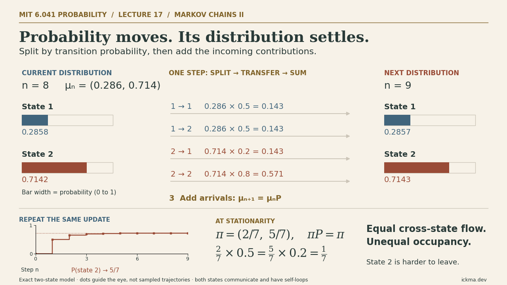
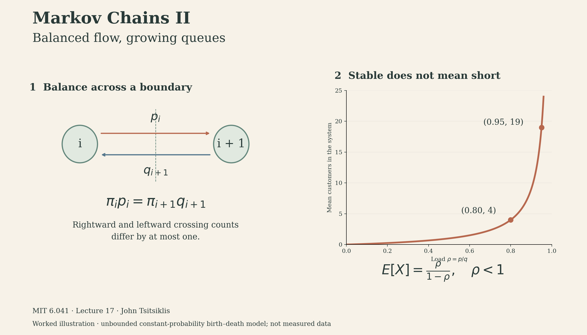

Notes on **MIT 6.041, Lecture 17: Markov Chains II**, taught by John Tsitsiklis.

<figure>

<button type="button" id="markov-head-toggle" aria-controls="markov-head-animation">Play animation</button>
<figcaption>Exact probability updates for the lecture’s two-state chain. Moving dots indicate the calculation sequence, not sampled trajectories. <a href="markov-ii-animated-head.png">Static image</a>.</figcaption>
</figure>

Static lecture overview: convergence, balance, and queues

<iframe style="width:100%;aspect-ratio:16/9;border:0" src="https://www.youtube.com/embed/ZulMqrvP-Pk" title="MIT 6.041 Lecture 17: Markov Chains II — John Tsitsiklis" loading="lazy" allow="accelerometer; clipboard-write; encrypted-media; gyroscope; picture-in-picture; web-share" allowfullscreen></iframe>

A queue can be stable and still be uncomfortably long. In the lecture's simple birth–death model, raising the load factor from 0.80 to 0.95 increases the steady-state mean number of customers from 4 to 19. Understanding that jump requires two ideas: first establish when probabilities settle, then calculate the balance of probability flow.

[Markov Chains I](markov-chains-i.qmd) introduced states, transition probabilities, and the difference between a moving trajectory and a stable distribution. This lecture turns those ideas into a method: inspect the graph, solve the balance equations, and exploit special structure when available.

## From paths to long-run probabilities

Let $X_n$ be a finite-state, discrete-time, time-homogeneous Markov chain. Write $p_{ij}=P(X_{n+1}=j\mid X_n=i)$ and $r_{ij}(n)=P(X_n=j\mid X_0=i)$. The transition matrix $P$ is row-stochastic: its entries are nonnegative and each row sums to one.

For one specified path, multiply the probabilities of its successive transitions. The lecture's warm-up gives

$$
P(X_1=2,X_2=6,X_3=7\mid X_0=1)=p_{12}p_{26}p_{67}.
$$

For an endpoint, add the probabilities of all paths reaching it. In the lecture's graph, the four-step paths from 2 to 7 are $2\to6\to7\to6\to7$, $2\to6\to6\to6\to7$, and $2\to1\to2\to6\to7$. Thus

$$
r_{27}(4)=p_{26}p_{67}p_{76}p_{67}+p_{26}p_{66}^{2}p_{67}+p_{21}p_{12}p_{26}p_{67}.
$$

Explicit enumeration quickly becomes impractical. Conditioning on the penultimate state organizes the same calculation recursively:

$$
r_{ij}(n)=\sum_k r_{ik}(n-1)p_{kj},\qquad R(n)=P^n.
$$

For a fixed state-space size, repeatedly applying this recursion grows linearly with the horizon instead of listing an exponentially growing collection of paths. The long-run question is whether $r_{ij}(n)$ approaches a limit that is independent of $i$.

## Check the graph before solving equations

A **recurrent class** is a closed collection of mutually reachable states. Once inside, the chain cannot leave. In a finite chain, transient states are eventually left behind and the chain enters some recurrent class with probability one.

Two distinct obstructions can prevent a common limiting distribution:

- **Multiple recurrent classes:** the chain can become trapped in different regions. Which region is reached depends on the initial state and early transitions.
- **Periodicity:** even within one recurrent class, transitions may cycle through groups in a fixed order. The phase of time remains visible in the state probabilities.

For example, the deterministic chain $A\to B\to A$ has one recurrent class but period two. Starting at $A$, its probability of being at $A$ alternates between one and zero.

Periodicity can hide in a complicated drawing. The lecture shows that regrouping states reveals a forced alternation between two sets. An equivalent test is the greatest common divisor of possible return times; this is a useful mathematical extension of the lecture's graphical explanation. A self-loop at a state in a communicating recurrent class guarantees that **that class** is aperiodic. A self-loop in an unrelated transient state does not establish this.

The finite-state convergence theorem says: **if there is exactly one recurrent class and it is aperiodic, then**

$$
\lim_{n\to\infty}r_{ij}(n)=\pi_j
$$

for every initial state $i$. Transient states have $\pi_j=0$; recurrent states have positive stationary probabilities.

The lecture motivates this with two copies of a chain started in different places. Once they meet, their future laws agree; one can couple their subsequent transitions to be identical. This provides intuition for forgetting the initial state, rather than a full proof of convergence.

## Balance equations conserve probability

Assuming the convergence conditions hold, take the limit in the finite sum of the transition recursion:

$$
\pi_j=\sum_k\pi_kp_{kj}.
$$

In row-vector notation, the system is

$$
\pi P=\pi,\qquad \sum_j\pi_j=1,\qquad \pi_j\ge0.
$$

The balance equations alone are homogeneous and dependent: the zero vector also solves them. Normalization selects a probability distribution. For a finite chain with one recurrent class, the stationary distribution is unique; aperiodicity is additionally needed for convergence from every starting state.

This distinction matters. The alternating chain has the unique stationary distribution $(1/2,1/2)$, despite its oscillation when started from a fixed state. Starting it with this distribution keeps the distribution unchanged forever. **Stationarity describes an invariant distribution; convergence describes what happens from other initial distributions.**

### Occupancy and transition frequencies

In the long run, $\pi_k$ is the fraction of time spent at state $k$, and $\pi_kp_{kj}$ is the fraction of steps that make the transition $k\to j$. Summing those incoming transition frequencies gives the fraction of visits to $j$:

$$
\underbrace{\pi_j}_{\text{occupancy of }j}
=\underbrace{\sum_k\pi_kp_{kj}}_{\text{all transitions arriving at }j}.
$$

Self-transitions count too: they advance time and contribute $\pi_jp_{jj}$. As a useful clarification beyond the lecture's convergence statement, finite irreducible chains have these long-run visit frequencies even when periodic. Time averages can settle while fixed-time probabilities oscillate.

### Revisiting the two-state example

For the lecture's matrix

$$
P=\begin{pmatrix}0.5&0.5\\0.2&0.8\end{pmatrix},
$$

balance gives $\pi_1=0.5\pi_1+0.2\pi_2$, or $0.5\pi_1=0.2\pi_2$. Together with $\pi_1+\pi_2=1$,

$$
\pi_1=\frac27,\qquad \pi_2=\frac57.
$$

Both cross-state flows equal $1/7$ per step. State 2 holds more probability because its chance of leaving is smaller. The chain continues jumping; only its distribution settles.

## Birth–death chains: balance across a boundary

A birth–death chain has states $0,1,\ldots,m$ and moves only to a neighboring state or stays put. Set

$$
p_i=P(X_{n+1}=i+1\mid X_n=i),\qquad
q_i=P(X_{n+1}=i-1\mid X_n=i).
$$

For interior states, the self-transition probability is $1-p_i-q_i$. At the boundaries, $q_0=0$ and $p_m=0$. Assume positive probabilities along each neighboring link so the finite chain communicates.

Now draw a boundary between $i$ and $i+1$. Every crossing to the right must be followed by a crossing to the left before another rightward crossing can occur. Over any trajectory, the two crossing counts differ by at most one. Dividing by elapsed time makes that discrepancy disappear, yielding

$$
\pi_i p_i=\pi_{i+1}q_{i+1}.
$$

This local balance gives a recursion:

$$
\pi_{i+1}=\pi_i\frac{p_i}{q_{i+1}},\qquad
\pi_i=\pi_0\prod_{k=0}^{i-1}\frac{p_k}{q_{k+1}}.
$$

Normalize the resulting weights to find $\pi_0$. The product formula makes explicit the recursive method described in the lecture.

The shortcut works because only one pair of edges crosses each boundary. General Markov chains satisfy global balance, but need not balance every pair of opposite edges: probability can circulate around a cycle.

## Constant probabilities produce geometric weights

Suppose all allowed upward transitions have probability $p>0$ and all allowed downward transitions have probability $q>0$, with $p+q\le1$. Here $p$ and $q$ are **net one-step movement probabilities**. They are not automatically the independent arrival and service coin probabilities used in Lecture I, where simultaneous events can cancel.

Define the load factor $\rho=p/q$. The recursion becomes $\pi_{i+1}=\rho\pi_i$, so

$$
\pi_i=\frac{\rho^i}{\sum_{k=0}^{m}\rho^k}
=\begin{cases}
\displaystyle\frac{(1-\rho)\rho^i}{1-\rho^{m+1}},&\rho\ne1,\\[6pt]
\displaystyle\frac1{m+1},&\rho=1.
\end{cases}
$$

For a finite capacity, this distribution exists whether $\rho$ is below, equal to, or above one. A larger load shifts probability toward the upper boundary. At $\rho=1$, the distribution is uniform. The finite chain does not lose its stationary distribution merely because upward movement is more likely.

### A small worked check

Take $m=4$, $p=0.2$, and $q=0.4$. Then $\rho=1/2$ and the weights are $1,1/2,1/4,1/8,1/16$. Normalizing gives

$$
\pi=\frac1{31}(16,8,4,2,1).
$$

Across the boundary between 1 and 2,

$$
\pi_1p=\frac8{31}(0.2)=\frac4{31}(0.4)=\pi_2q.
$$

The finite-capacity mean is $26/31\approx0.839$, smaller than the infinite-capacity mean of one at the same load. This numerical example is constructed here to check the lecture's method.

## Why a stable queue can still become large

For the corresponding unbounded chain, the geometric weights normalize only when $\rho<1$. Taking the capacity to infinity gives

$$
\pi_i=(1-\rho)\rho^i,\quad i=0,1,\ldots.
$$

This is a geometric distribution beginning at zero. Its mean follows by differentiating the geometric series:

$$
\sum_{i=0}^{\infty}\rho^i=\frac1{1-\rho}
\quad\Longrightarrow\quad
\sum_{i=0}^{\infty}i\rho^i=\frac{\rho}{(1-\rho)^2},
$$

and therefore

$$
E[X]=(1-\rho)\sum_{i=0}^{\infty}i\rho^i
=\frac{\rho}{1-\rho}.
$$

The load comparison is a worked illustration of the lecture's formula, not measured queue data:

| Load $\rho$ | Empty probability $1-\rho$ | Mean customers $\rho/(1-\rho)$ |
|---|---|---|
| 0.50 | 0.50 | 1 |
| 0.80 | 0.20 | 4 |
| 0.95 | 0.05 | 19 |
| 0.99 | 0.01 | 99 |

For example, keeping $q=0.5$ and choosing $p=0.4$ or $p=0.475$ realizes the two highlighted loads with valid discrete-time probabilities. The upward drift remains weaker than the downward drift, yet the margin is much smaller in the second case.

These numbers describe customers **in the system**, not waiting time. Translating occupancy into delay requires additional queueing assumptions. For a finite buffer, the exact normalized finite formula should be used when the boundary matters; the infinite approximation becomes poor when $\rho^{m+1}$ is not small.

For the unbounded constant-probability model at $\rho\ge1$, the geometric weights cannot be normalized into a stationary probability distribution. This does not contradict the finite-capacity result: removing the upper boundary changes the problem.

The practical connection is that stability and comfortable performance are different requirements. Balance equations tell us where probability accumulates; the graph and boundary assumptions determine whether that calculation answers the long-run question we actually asked.

## Sources and coverage

- [MIT lecture recording: 17. Markov Chains II](https://www.youtube.com/watch?v=ZulMqrvP-Pk), John Tsitsiklis. The video page was inspected in Chrome; the full official transcript was read, rather than claiming uninterrupted video viewing.
- [Official transcript](https://ocw.mit.edu/courses/6-041sc-probabilistic-systems-analysis-and-applied-probability-fall-2013/ZulMqrvP-Pk_transcript.pdf): all 11 pages reviewed.
- [Official slides](https://ocw.mit.edu/courses/6-041sc-probabilistic-systems-analysis-and-applied-probability-fall-2013/0c0f13321d15596341420d11ce07fcc7_MIT6_041SCF13_L17.pdf): all three PDF pages visually reviewed, including the credits page. These resources are hosted in MIT's 6.041SC materials; the recording is linked as MIT 6.041.
- The slides assign textbook Section 7.3; that chapter and the associated problem sets were not separately reviewed. The note covers the lecture, with explicitly identified derivations and numerical extensions.

Lecture material: MIT OpenCourseWare, [CC BY-NC-SA](https://creativecommons.org/licenses/by-nc-sa/4.0/). Explanations and the programmatic diagram are adapted study material; numerical checks and the finite worked example were added for this note.
